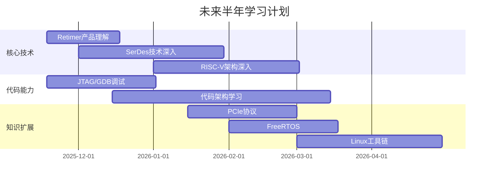

---
tags:
  - "#type/plan"
  - "#grain/learning"
  - "#domain/career"
status: 进行中
complexity: 规划
notetype: 学习计划
resource: 个人规划
related:
  - "[[00_C_MOC]]"
  - "[[00_Python_MOC]]"
  - "[[00_Embeded_System_MOC]]"
created: 2025-11-11 17:26:00
modified: 2025-11-18 22:00:00
---
# 📋 未来半年能力提升计划

> [!abstract] 摘要
> 本笔记记录了未来半年(2025年11月-2026年5月)的技术能力提升计划,包括核心技术深度、代码调试能力、知识广度扩展三个维度的具体目标和学习资源。

## 🎯 总体目标

通过未来半年的学习和实践,在以下三个维度实现能力提升:
1. **核心技术深度** - 深入理解Retimer产品和底层技术
2. **代码和调试能力** - 提升问题定位和代码质量
3. **知识广度扩展** - 扩展嵌入式系统和工具链知识

## 📊 能力提升路线图



## 1️⃣ 核心技术深度

### 1.1 Retimer产品理解

**目标:** 从客户视角理解Retimer产品,让应用场景、技术指标能对应到开发过程中

**学习内容:**
- [ ] Retimer产品的市场定位和应用场景
- [ ] 技术指标与性能参数理解
- [ ] 产品开发流程与测试验证
- [ ] 客户需求分析与技术实现映射

**时间:** 2025-11-18 ~ 2025-12-18 (1个月)

**相关笔记:**
- [[SerDes基础 - 并行与串行数据传输]]
- [[SerDes架构 - 芯片架构与工作原理]]

---

### 1.2 基础技术深入

**均衡技术 (Equalization)**

**目标:** 理解均衡技术在高速信号传输中的作用

- [ ] CTLE (Continuous Time Linear Equalization)
- [ ] FFE (Feed-Forward Equalization)
- [ ] DFE (Decision Feedback Equalization)
- [ ] 自适应均衡算法

**时间:** 2025-12-01 ~ 2026-01-31 (2个月)

**相关笔记:**
- [[SerDes技术 - 均衡器与信号完整性]]

**时钟数据恢复 (CDR - Clock Data Recovery)**

**目标:** 掌握CDR技术原理

- [ ] CDR基本原理
- [ ] PLL (Phase-Locked Loop) 技术
- [ ] 时钟抖动分析
- [ ] 眼图分析

**相关笔记:**
- [[SerDes架构 - 芯片架构与工作原理]]

---

### 1.3 RISC-V架构深入

**目标:** 深入理解RISC-V架构的核心机制

**学习内容:**

#### 中断和异常处理
- [ ] RISC-V特权级别 (Machine/Supervisor/User)
- [ ] 中断向量表配置
- [ ] 异常处理流程
- [ ] 上下文切换机制

#### 内存管理
- [ ] 虚拟内存机制
- [ ] TLB (Translation Lookaside Buffer)
- [ ] 页表结构
- [ ] 内存保护

#### 启动流程
- [ ] 从reset到main的完整流程
- [ ] Boot ROM工作原理
- [ ] Flash启动流程
- [ ] CRC校验机制
- [ ] **实践**: 尝试动手写一个bootloader

**时间:** 2026-01-01 ~ 2026-03-01 (2个月)

**参考资源:**
- RISC-V Instruction Set Manual
- RISC-V Privileged Architecture

---

## 2️⃣ 代码和调试能力

### 2.1 调试工具掌握

**JTAG调试原理**

- [ ] JTAG接口标准 (IEEE 1149.1)
- [ ] TAP状态机
- [ ] 边界扫描技术
- [ ] JTAG调试器配置

**GDB使用**

- [ ] GDB基本命令
- [ ] 断点设置与条件断点
- [ ] 变量查看与修改
- [ ] 堆栈回溯
- [ ] 远程调试 (GDB Server)

**逻辑分析仪使用**

- [ ] 信号捕获与触发设置
- [ ] 协议解码 (I2C/SPI/UART)
- [ ] 时序分析
- [ ] 与示波器配合使用

**时间:** 2025-11-18 ~ 2026-01-01 (1.5个月)

---

### 2.2 问题定位能力

**目标:** 锻炼从现象能定位到原因的能力

**方法论:**
1. **现象观察** - 详细记录错误现象
2. **假设提出** - 基于现象提出可能原因
3. **验证测试** - 设计实验验证假设
4. **根因分析** - 找到问题的根本原因
5. **经验总结** - 形成问题模式库

**实践:**
- [ ] 建立常见问题troubleshooting文档
- [ ] 每周总结一次调试案例
- [ ] 学习前辈的问题定位思路

---

### 2.3 代码架构学习

**目标:** 多学习dragon库中不同模块的代码、架构设计

**学习重点:**

#### 状态机设计
- [ ] 状态机基本概念
- [ ] 状态转换表设计
- [ ] 事件驱动架构
- [ ] 状态机实现模式

**相关笔记:**
- [[C语言进阶 - 状态机设计]]

#### 模块化设计
- [ ] 模块划分原则
- [ ] 接口设计方法
- [ ] 模块间通信机制
- [ ] 代码复用策略

#### 任务优先级
- [ ] 优先级调度算法
- [ ] 实时性保证
- [ ] 任务间同步

#### 接口抽象
- [ ] 硬件抽象层 (HAL)
- [ ] 驱动接口设计
- [ ] API设计原则

#### 依赖管理
- [ ] 依赖注入
- [ ] 模块解耦
- [ ] 构建系统

**时间:** 2025-12-15 ~ 2026-03-15 (3个月)

**实践:**
- [ ] 每周分析一个模块的代码
- [ ] 编写额外的小程序锻炼代码能力
- [ ] 参与代码评审

---

## 3️⃣ 知识广度扩展

### 3.1 个人知识库积累

**目标:** 积累日常的个人知识库

**方法:**
- ✅ 使用Obsidian建立知识管理系统
- [ ] 每日学习笔记整理
- [ ] 每周知识回顾与总结
- [ ] 建立知识关联网络

**笔记分类:**
- 技术笔记 (Technical Notes)
- 项目笔记 (Project Notes)
- 问题笔记 (Troubleshooting)
- 读书笔记 (Reading Notes)

---

### 3.2 协议学习

#### PCIe协议
- [ ] PCIe总线架构
- [ ] Transaction Layer
- [ ] Data Link Layer
- [ ] Physical Layer
- [ ] PCIe配置空间
- [ ] MSI/MSI-X中断机制

**参考资料:**
- PCI Express Base Specification
- [[PCIe学习笔记]]

#### I2C协议
- [ ] I2C总线时序
- [ ] 主从模式
- [ ] 多主机仲裁
- [ ] I2C扩展协议 (SMBus, PMBus)

#### SPI协议
- [ ] SPI通信模式
- [ ] 时钟极性和相位
- [ ] 多从机配置
- [ ] 高速SPI设计

**时间:** 2026-01-15 ~ 2026-03-01 (1.5个月)

---

### 3.3 嵌入式系统

#### 内存管理
- [ ] 内存分配策略
- [ ] 内存池设计
- [ ] 内存碎片管理
- [ ] DMA技术

#### 中断系统
- [ ] 中断优先级
- [ ] 中断嵌套
- [ ] 中断延迟优化
- [ ] 中断安全编程

#### FreeRTOS
- [ ] 任务管理
- [ ] 队列 (Queue)
- [ ] 信号量 (Semaphore)
- [ ] 互斥锁 (Mutex)
- [ ] 事件组 (Event Group)
- [ ] 软件定时器

**时间:** 2026-02-01 ~ 2026-03-15 (1.5个月)

**相关笔记:**
- [[FreeRTOS基础]]
- [[嵌入式系统内存管理]]

#### 外设驱动开发
- [ ] GPIO驱动
- [ ] UART驱动
- [ ] I2C驱动
- [ ] SPI驱动
- [ ] DMA驱动

#### 计算机系统基础
- [ ] 冯·诺依曼架构
- [ ] 指令流水线
- [ ] 缓存机制
- [ ] 内存层次结构

---

### 3.4 工具链

#### Linux工具
- [ ] Vim高级使用
- [ ] Shell脚本编程
- [ ] Git高级功能
- [ ] Make/CMake构建系统

**相关笔记:**
- [[Shell脚本编程基础]]
- [[Makefile完全指南]]

#### 编译工具链
- [ ] GCC编译流程
- [ ] 链接过程详解
- [ ] 静态库与动态库
- [ ] 交叉编译

#### 进程管理
- [ ] 进程与线程
- [ ] 进程调度
- [ ] 进程间通信 (IPC)

#### IPC机制
- [ ] 信号量 (Semaphore)
- [ ] 消息队列 (Message Queue)
- [ ] 共享内存 (Shared Memory)
- [ ] 管道 (Pipe)
- [ ] Socket

**时间:** 2026-03-01 ~ 2026-04-30 (2个月)

---

## 📚 学习资源汇总

### 在线资源

#### SoC与芯片设计
- [芯片设计 | 一段 C 代码如何在 SoC 芯片上跑起来](https://mp.weixin.qq.com/s/PJ_amzR5ZWuqJz4S2YLIFg)
- [一文看懂AI SoC芯片](https://mp.weixin.qq.com/s/lDEfDkh4Tvw0VXPJ8zDnLg)
- [存储芯片的一些科普](https://mp.weixin.qq.com/s/C7gpLCJnwKTZ44QDjIdqFQ)

#### 内存技术
- [主存(内存)技术性能的提升过程](https://mp.weixin.qq.com/s/1HuPM8ES6q3EqoxSbGI_Sw)

#### 通信协议
- [SPI协议详解+送apb_spi和ahb_spi工程](https://mp.weixin.qq.com/s/Coa94_zQFR24oxt3KSPskg)
- [聊聊澜起4 PCIe](https://mp.weixin.qq.com/s/x7iUsYMlpORbr-kjxuwqdg)
- [用 FPGA 实现 PCIe 传输，开源核 LitePCIe 深度解读](https://mp.weixin.qq.com/s/W_mEDSVzmfx4DTTQst4bKw)
- [PCIe新手入门学习路线图](https://mp.weixin.qq.com/s/N81XwUCSMW7l2H9bTQWDog)

#### 存储系统
- [固态硬盘SSD基础知识介绍](https://mp.weixin.qq.com/s/BGp7sT8jsX7CSU03Wpb8-w)

#### Linux与嵌入式
- [eBPF 之旅：零基础到全面上手](https://mp.weixin.qq.com/s/nfdrhBQq0tikUW9bIiX0Xg)
- [嵌入式读书笔记-1：《Linux设备驱动开发详解》](https://mp.weixin.qq.com/s/BO9JQn17TTJf17f6lwXUrg)
- [嵌入式路线](https://www.robook.org/docs/handbook/embedded/qianrushiluxian)

#### 开源项目
- [推荐 11 个本周 yyds 的 GitHub 开源项目](https://mp.weixin.qq.com/s/cdg6G9ohC5MPWC0qwxnaJA)
- [Git学习资源](https://interviewguide.cn/notes/07-resources/01-free/12-git-school-schedule.html)

---

### 技术博客

- https://blog.csdn.net/chenmi123321/article/details/107517444
- https://zhuanlan.zhihu.com/p/627890778
- https://zhuanlan.zhihu.com/p/370196419
- https://blog.csdn.net/XZ2585458279/article/details/149470958

---

### 书籍与手册

#### 核心书籍
- **PCI Express Base Specification** - PCIe官方规范
- **Compute Express Link Specification** - CXL规范
- **图解系统-亮白风格** - 系统架构入门

#### RISC-V相关
- RISC-V Instruction Set Manual
- RISC-V Privileged Architecture

#### 嵌入式
- Linux设备驱动开发详解
- FreeRTOS参考手册

---

## 📈 学习进度跟踪

### 月度目标

| 月份 | 核心技术 | 代码能力 | 知识扩展 |
|------|----------|----------|----------|
| **2025-11** | Retimer产品理解 | JTAG/GDB调试 | 知识库搭建 |
| **2025-12** | SerDes均衡技术 | 代码架构学习 | I2C/SPI协议 |
| **2026-01** | RISC-V中断异常 | Dragon代码分析 | PCIe协议 |
| **2026-02** | RISC-V内存管理 | 问题定位能力 | FreeRTOS |
| **2026-03** | Bootloader实践 | 模块化设计 | Linux工具链 |
| **2026-04** | 综合项目实践 | 代码重构 | 编译工具链 |

---

### 每周学习时间分配

```
核心技术深度:    40% (10小时)
代码调试能力:    30% (7.5小时)
知识广度扩展:    30% (7.5小时)
总计:           25小时/周
```

---

### 学习成果验证

**每月输出:**
- [ ] 技术博客 1-2篇
- [ ] 代码项目 1个
- [ ] 知识总结笔记 4-8篇
- [ ] 问题案例分析 2-3个

**每季度:**
- [ ] 技术分享 1次
- [ ] 完整项目 1个
- [ ] 读书笔记 1本

---

## 🎓 学习方法论

### 费曼学习法
1. **选择概念** - 选择要学习的概念
2. **教授他人** - 用简单语言解释给他人
3. **发现盲点** - 找出理解不透彻的地方
4. **简化类比** - 用类比和简化来加深理解

### 刻意练习
1. **定义目标** - 明确具体的学习目标
2. **集中注意力** - 全神贯注地练习
3. **获得反馈** - 及时获得反馈并调整
4. **走出舒适区** - 持续挑战自己

### 知识管理
1. **输入** - 阅读、学习、实践
2. **处理** - 整理、归纳、关联
3. **输出** - 写作、分享、教学
4. **反馈** - 复盘、改进、迭代

---

## ✅ 阶段性检查点

### 第一季度 (2025-11 ~ 2026-01)
- [ ] 完成Retimer产品理解
- [ ] 掌握JTAG/GDB调试
- [ ] 理解SerDes均衡技术基础
- [ ] 建立完整的知识管理系统

### 第二季度 (2026-02 ~ 2026-04)
- [ ] 深入RISC-V架构核心机制
- [ ] 熟练使用调试工具定位问题
- [ ] 掌握FreeRTOS基本使用
- [ ] 理解PCIe协议基础

### 总结评估 (2026-05)
- [ ] 回顾半年学习成果
- [ ] 评估能力提升情况
- [ ] 制定下一阶段计划
- [ ] 总结经验教训

---

## 📝 学习日志

### 模板

```markdown
## YYYY-MM-DD

### 今日学习
- 主题:
- 时长:
- 资源:

### 关键收获
1.
2.
3.

### 遇到的问题
- 问题:
- 解决:

### 明日计划
- [ ]
- [ ]
```

---

## 🔗 相关笔记

- [[00_C_MOC]] - C语言知识体系
- [[00_Python_MOC]] - Python知识体系
- [[00_Embeded_System_MOC]] - 嵌入式系统知识体系
- [[00_SerDes_MOC]] - SerDes知识地图
- [[Shell脚本编程基础]] - Shell学习
- [[Makefile完全指南]] - 构建系统

---

> 💡 **记住**: 学习是一个持续的过程,重要的不是一次性掌握所有知识,而是建立正确的学习方法和持续学习的习惯。每天进步一点点,半年后你会发现巨大的变化!
