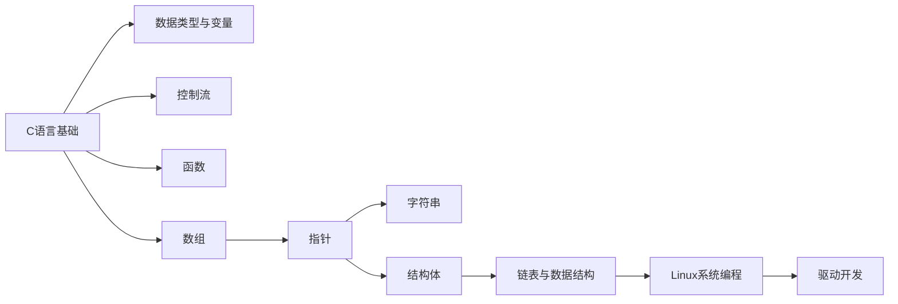

---
tags:
  - "#domain/programming"
  - "#type/moc"
  - "#lang/c"
status: 维护中
modified: 2025-11-18 21:46:54
---
# 🔧 C语言知识地图 (MOC)

> [!info] 这是C语言相关知识的导航中心
> C语言是系统编程和嵌入式开发的基础,掌握C语言对理解计算机底层原理至关重要。

## 📊 统计信息

```dataview
TABLE
  length(file.inlinks) as "被引用次数",
  length(file.outlinks) as "引用数量",
  modified as "最后修改"
FROM "10_Areas/02_Programming/C"
WHERE file.name != this.file.name
SORT modified DESC
LIMIT 10
```

## 🗺️ 知识图谱

### 基础知识 (Basic)

#### 核心概念
- [[C语言基础 - 数据类型与变量]] - 基本数据类型、变量定义、运算符
- [[C语言基础 - 控制流]] - if、for、while、switch
- [[C语言基础 - 函数]] - 函数定义、参数传递、返回值
- [[C语言基础 - 数组]] - 数组定义、遍历、多维数组

### 进阶知识 (Intermediate)

#### 核心主题
- [[C语言进阶 - 指针详解]] - 指针、指针数组、数组指针、函数指针、malloc
- [[C语言进阶 - 字符串]] - 字符串操作、标准库函数
- [[C语言进阶 - 结构体]] - 结构体定义、嵌套、链表

#### 已有笔记
- [[pointer]] - 指针专题笔记

### Linux系统编程

#### 文件IO
- [[Linux系统编程 - 文件IO]] - open、read、write、close、lseek
- [[Linux系统编程 - 文件系统]] - 文件权限、目录操作

#### 进程与线程
- [[Linux系统编程 - 进程管理]] - fork、exec、wait
- [[Linux系统编程 - 线程编程]] - pthread库、线程同步
- [[Linux系统编程 - 进程间通信]] - 管道、消息队列、共享内存

#### 驱动开发
- [[Linux系统编程 - 驱动程序设计]] - module、cdev、驱动注册
- [[Linux系统编程 - 嵌入式IO]] - GPIO、寄存器操作

### 工具链

#### 编译与调试
- [[GCC编译器]] - 编译选项、优化级别
- [[GDB调试器]] - 断点、单步执行、变量查看
- [[Make工具]] - Makefile编写、自动化编译

#### 交叉编译
- [[ARM交叉编译环境]] - 交叉编译工具链配置
- [[嵌入式Linux开发]] - U-Boot、内核编译

## 📚 学习路径



### 学习建议

1. **基础阶段** (1-2周)
   - 掌握数据类型、变量、运算符
   - 熟练使用控制流语句
   - 理解函数的定义和调用
   - 掌握数组的基本操作

2. **进阶阶段** (2-4周)
   - **重点**: 深入理解指针(C语言的灵魂)
   - 掌握字符串操作
   - 学习结构体和动态内存分配
   - 实现基本的数据结构(链表、栈、队列)

3. **系统编程阶段** (4-8周)
   - Linux文件IO编程
   - 进程和线程编程
   - 进程间通信
   - 网络编程基础

4. **嵌入式开发阶段** (持续学习)
   - 嵌入式系统基础
   - Linux驱动程序设计
   - 实际项目开发

## 🎯 学习目标

- [ ] 完成C语言基础语法学习
- [ ] 深入理解指针和内存管理
- [ ] 掌握Linux系统编程接口
- [ ] 能够编写简单的设备驱动程序
- [ ] 完成一个实际的嵌入式项目

## ⚠️ 常见陷阱

> [!warning] 初学者常犯错误
> 1. **指针未初始化**: 总是初始化指针,避免野指针
> 2. **数组越界**: 注意数组索引从0开始,最大索引是n-1
> 3. **内存泄漏**: 使用malloc后记得free
> 4. **字符串结尾**: C字符串以'\0'结尾,计算长度时要考虑
> 5. **scanf的&**: 普通变量需要&,数组名不需要&

## 💡 最佳实践

> [!tip] 编程建议
> - 养成良好的代码风格,使用有意义的变量名
> - 添加适当的注释,特别是复杂的逻辑
> - 使用const保护不应修改的数据
> - 检查函数返回值,特别是系统调用
> - 使用valgrind等工具检测内存泄漏

## 🔗 相关MOC

- [[00_Programming_MOC]] - 编程总索引
- [[00_Linux_MOC]] - Linux知识体系
- [[00_Computer_Science_MOC]] - 计算机科学基础

## 📝 最近笔记

```dataview
LIST
FROM "10_Areas/02_Programming/C"
WHERE file.name != this.file.name
SORT file.mtime DESC
LIMIT 5
```

## 📖 推荐资源

### 书籍
- **《C Primer Plus》** - C语言入门经典
- **《C程序设计语言》(K&R)** - C语言之父的权威著作
- **《C和指针》** - 深入理解指针
- **《C陷阱与缺陷》** - 避免常见错误
- **《UNIX环境高级编程》(APUE)** - Linux系统编程圣经

### 在线资源
- Learn-C.org - 交互式C语言教程
- C语言中文网
- Linux Man Pages - 系统调用文档

---

> 💭 **学习C语言的本质是理解计算机如何工作。指针、内存管理这些概念虽然复杂,但掌握它们会让你成为更好的程序员。**
