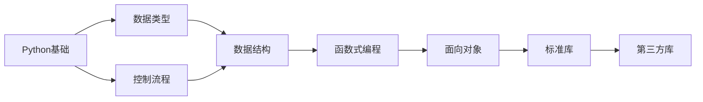

# 🐍 Python MOC

> [!info] 这是Python相关知识的导航中心

## 📊 统计信息

```dataview
TABLE 
  length(file.inlinks) as "被引用次数",
  length(file.outlinks) as "引用数量",
  modified as "最后修改"
FROM "10_Areas/02_Programming/Python"
WHERE file.name != this.file.name
SORT modified DESC
LIMIT 10
```

## 🗺️ 知识图谱

### 基础知识 (Basic)

#### 数据类型与结构
- [[Python基础 - 数据类型]] - 字符串、数字、None类型
- [[Python基础 - 列表与元组]] - 列表操作、切片、元组
- [[Python基础 - 字典]] - 键值对、遍历、嵌套

#### 控制流程
- [[Python基础 - 控制流]] - for、if、while循环

#### 函数与面向对象
- [[Python基础 - 函数]] - 函数定义、参数、返回值、模块化
- [[Python基础 - 类与面向对象]] - 类、继承、组合

### 高级主题 (Advanced)

#### 异常与并发
- [[Python高级 - 异常处理]] - try-except、异常类型
- [[Python高级 - 多线程]] - threading库、线程同步、队列

#### 进阶编程
- [[异步编程]] - async/await
- [[装饰器]] - 函数装饰器、类装饰器
- [[元编程]] - 元类、动态创建类

### 标准库

- [[文件IO]] - 文件读写操作
- [[正则表达式]] - re模块
- [[日期时间处理]] - datetime模块

### 第三方库

#### 数据分析
- [[NumPy]] - 数组计算
- [[Pandas]] - 数据处理
- [[Matplotlib]] - 数据可视化

#### Web开发
- [[Flask]] - 轻量级Web框架
- [[Django]] - 全栈Web框架
- [[FastAPI]] - 现代异步Web框架

## 📚 学习路径



## 🎯 学习目标

- [ ] 完成Python基础语法学习
- [ ] 掌握常用数据结构
- [ ] 学习面向对象编程
- [ ] 实践一个完整项目

## 🔗 相关MOC

- [[00_Programming_MOC]]
- [[00_Data_Structures_MOC]]

## 📝 最近笔记

```dataview
LIST
FROM "10_Areas/02_Programming/Python"
WHERE file.name != this.file.name
SORT file.mtime DESC
LIMIT 5
```