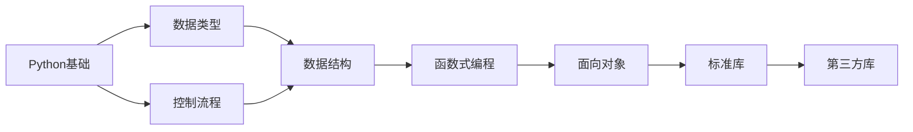

# 🐍 Python MOC

> [!info] 这是Python相关知识的导航中心

## 📊 统计信息

```dataview
TABLE 
  length(file.inlinks) as "被引用次数",
  length(file.outlinks) as "引用数量",
  modified as "最后修改"
FROM "10_Areas/02_Programming/Python"
WHERE file.name != this.file.name
SORT modified DESC
LIMIT 10
```

## 🗺️ 知识图谱

### 基础知识

- [[数据类型]] - Python的基本数据类型
- [[python的符号]] - 运算符和符号
- [[string]] - 字符串处理

### 进阶主题

- [[异步编程]]
- [[装饰器]]
- [[元编程]]

### 标准库

- [[文件IO]]
- [[正则表达式]]
- [[日期时间处理]]

### 第三方库

#### 数据分析

- [[NumPy]]
- [[Pandas]]
- [[Matplotlib]]

#### Web开发

- [[Flask]]
- [[Django]]
- [[FastAPI]]

## 📚 学习路径



## 🎯 学习目标

- [ ] 完成Python基础语法学习
- [ ] 掌握常用数据结构
- [ ] 学习面向对象编程
- [ ] 实践一个完整项目

## 🔗 相关MOC

- [[00_Programming_MOC]]
- [[00_Data_Structures_MOC]]

## 📝 最近笔记

```dataview
LIST
FROM "10_Areas/02_Programming/Python"
WHERE file.name != this.file.name
SORT file.mtime DESC
LIMIT 5
```