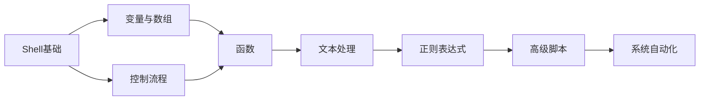

---
tags:
  - "#domain/programming"
  - "#type/moc"
  - "#lang/shell"
status: 维护中
modified: 2025-11-18 21:46:54
---
# 🐚 Shell脚本知识地图 (MOC)

> [!info] 这是Shell脚本编程相关知识的导航中心
> Shell是Linux系统管理和自动化的核心工具,掌握Shell脚本对系统运维和开发至关重要。

## 📊 统计信息

```dataview
TABLE
  length(file.inlinks) as "被引用次数",
  length(file.outlinks) as "引用数量",
  modified as "最后修改"
FROM "10_Areas/02_Programming/Shell"
WHERE file.name != this.file.name
SORT modified DESC
LIMIT 10
```

## 🗺️ 知识图谱

### 基础知识 (Basic)

#### 核心概念
- [[Shell脚本编程基础]] - 变量、数组、运算符、控制流程
- [[Shell脚本 - 函数与模块化]] - 函数定义、作用域、库文件
- [[Shell脚本 - 文本处理]] - grep、sed、awk三剑客

### 进阶知识 (Intermediate)

#### 高级主题
- [[Shell脚本 - 进程管理]] - 后台任务、信号处理、进程控制
- [[Shell脚本 - 错误处理]] - 错误码、异常处理、调试技巧
- [[Shell脚本 - 正则表达式]] - 模式匹配、文本提取

### 实战应用 (Advanced)

#### 系统管理
- [[Shell脚本 - 系统监控]] - 性能监控、日志分析
- [[Shell脚本 - 自动化部署]] - CI/CD脚本、批量操作
- [[Shell脚本 - 备份与恢复]] - 数据备份策略、定时任务

## 📚 学习路径



### 学习建议

1. **入门阶段** (1周)
   - 理解Shell的基本概念
   - 掌握变量、数组的使用
   - 熟练使用if、for、while等控制结构
   - 学会使用基本命令

2. **进阶阶段** (2-3周)
   - 掌握函数的定义和使用
   - 学习文本处理三剑客(grep、sed、awk)
   - 理解正则表达式
   - 学会错误处理和调试

3. **实战阶段** (持续学习)
   - 编写系统监控脚本
   - 实现自动化部署流程
   - 优化脚本性能
   - 学习最佳实践

## 🎯 学习目标

- [ ] 掌握Shell脚本基础语法
- [ ] 熟练使用文本处理工具
- [ ] 能够编写自动化运维脚本
- [ ] 理解Shell脚本的最佳实践
- [ ] 完成实际项目的脚本编写

## ⚠️ 常见陷阱

> [!warning] 初学者常犯错误
> 1. **空格敏感**: `[ $x -eq 1 ]`中的空格不能省略
> 2. **变量引用**: 使用`"$var"`而不是`$var`,避免空值问题
> 3. **命令替换**: 优先使用`$(command)`而不是反引号
> 4. **退出状态**: 记得检查命令的退出状态`$?`
> 5. **管道陷阱**: 管道中的变量赋值不会影响外部

## 💡 最佳实践

> [!tip] 编程建议
> - 总是在脚本开头添加`#!/bin/bash`
> - 使用`set -e`在命令失败时退出
> - 使用`set -u`在使用未定义变量时报错
> - 为变量使用有意义的名称
> - 添加适当的注释和文档
> - 使用shellcheck工具检查脚本

### 推荐的脚本模板

```bash
#!/bin/bash
#
# 脚本名称: script_name.sh
# 功能描述: 简要描述脚本功能
# 作者: Your Name
# 创建日期: 2025-11-18
#

# 严格模式
set -euo pipefail

# 全局变量
readonly SCRIPT_DIR="$(cd "$(dirname "${BASH_SOURCE[0]}")" && pwd)"
readonly SCRIPT_NAME="$(basename "${BASH_SOURCE[0]}")"

# 函数定义
function main() {
    # 主函数逻辑
    echo "Script started"
}

# 执行主函数
main "$@"
```

## 🔗 相关MOC

- [[00_Programming_MOC]] - 编程总索引
- [[00_Linux_MOC]] - Linux知识体系
- [[00_Tools_Environments_MOC]] - 开发工具

## 📝 最近笔记

```dataview
LIST
FROM "10_Areas/02_Programming/Shell"
WHERE file.name != this.file.name
SORT file.mtime DESC
LIMIT 5
```

## 📖 推荐资源

### 书籍
- **《Shell脚本学习指南》** - 入门经典
- **《Linux命令行与shell脚本编程大全》** - 全面深入
- **《Advanced Bash-Scripting Guide》** - 进阶必读

### 在线资源
- [Shell教程 - 菜鸟教程](https://www.runoob.com/linux/linux-shell.html)
- [ShellCheck](https://www.shellcheck.net/) - 在线Shell脚本检查工具
- [Bash Reference Manual](https://www.gnu.org/software/bash/manual/)

### 实用工具
- **shellcheck**: Shell脚本静态分析工具
- **shfmt**: Shell脚本格式化工具
- **bashdb**: Bash调试器

## 🛠️ 常用代码片段

### 参数解析
```bash
while [[ $# -gt 0 ]]; do
    case $1 in
        -h|--help)
            show_help
            exit 0
            ;;
        -v|--version)
            echo "Version 1.0.0"
            exit 0
            ;;
        *)
            echo "Unknown option: $1"
            exit 1
            ;;
    esac
    shift
done
```

### 错误处理
```bash
function error_exit() {
    echo "错误: $1" >&2
    exit 1
}

command || error_exit "命令执行失败"
```

### 日志记录
```bash
function log() {
    echo "[$(date +'%Y-%m-%d %H:%M:%S')] $*"
}

log "脚本开始执行"
```

---

> 💭 **Shell脚本虽然简单,但功能强大。掌握Shell不仅能提高工作效率,更能深入理解Linux系统的运作方式。**
