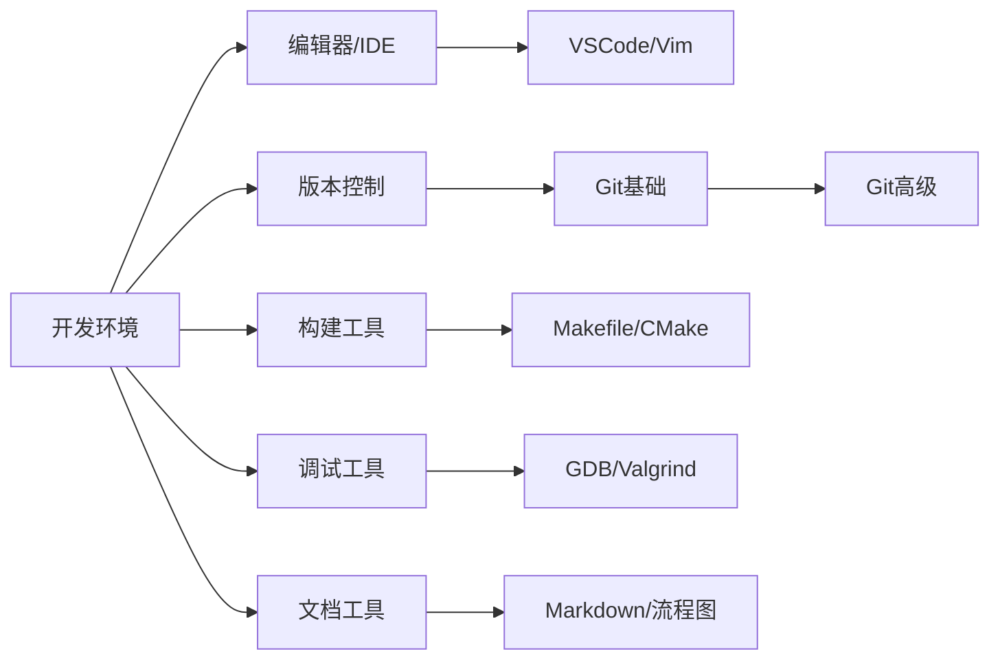

---
tags:
  - "#domain/tools"
  - "#type/moc"
  - "#grain/guide"
status: 维护中
modified: 2025-11-19
---
# 🛠️ 开发工具知识地图 (MOC)

> [!info] 这是开发工具和开发环境相关知识的导航中心
> 工欲善其事，必先利其器。掌握常用开发工具能够显著提升开发效率和代码质量。

## 📊 统计信息

```dataview
TABLE
  length(file.inlinks) as "被引用次数",
  length(file.outlinks) as "引用数量",
  modified as "最后修改"
FROM "10_Areas/02_Programming/Tools"
WHERE file.name != this.file.name
SORT modified DESC
LIMIT 10
```

## 🗺️ 知识图谱

### 编辑器与IDE (Editors & IDEs)

#### 代码编辑器
- [[VSCode完全指南]] - 安装配置、Remote-SSH、插件（GitLens/Markdown PDF）、快捷键速查
- [[Vim使用手册]] - 模式切换、命令大全、配置文件
- [[Emacs指南]] - 基础操作、插件管理

### 构建工具 (Build Tools)

#### 编译和构建
- [[Makefile完全指南]] - 语法详解、变量、自动变量、模式规则、函数
- [[CMake实战]] - CMakeLists编写、跨平台构建
- [[Ninja构建系统]] - 高速构建工具

### 版本控制 (Version Control)

#### Git工具链
- [[Git基础操作]] - add、commit、push、pull、branch、merge
- [[Git高级技巧]] - rebase、cherry-pick、bisect、子模块
- [[GitHub工作流]] - Pull Request、Code Review、Actions

### 调试工具 (Debugging Tools)

#### 调试器
- [[GDB调试器详解]] - 断点、单步、变量查看、核心转储分析
- [[LLDB使用指南]] - LLVM调试器、与GDB的差异
- [[Valgrind内存分析]] - 内存泄漏检测、性能分析

### 文档工具 (Documentation Tools)

#### 文档生成
- [[Doxygen使用指南]] - 代码注释转文档
- [[Markdown使用手册]] - 语法、扩展、最佳实践
- [[流程图绘制规范]] - 符号标准、UML序列图、Mermaid/Graphviz

### 性能分析 (Performance Tools)

#### 性能优化工具
- [[perf性能分析]] - Linux性能计数器
- [[gprof使用指南]] - 代码性能分析
- [[Flamegraph火焰图]] - 可视化性能瓶颈

### 静态分析 (Static Analysis)

#### 代码质量工具
- [[clang-tidy配置]] - C/C++静态分析
- [[cppcheck使用]] - C/C++代码检查
- [[ShellCheck]] - Shell脚本静态分析

## 📚 学习路径



### 学习建议

1. **编辑器阶段** (1周)
   - 选择并精通一款主力编辑器（VSCode/Vim）
   - 掌握常用快捷键和插件
   - 配置Remote-SSH远程开发环境

2. **版本控制阶段** (1-2周)
   - 掌握Git基础操作（add/commit/push/pull）
   - 理解分支和合并策略
   - 学习GitHub协作流程

3. **构建工具阶段** (1-2周)
   - 学会编写基本的Makefile
   - 理解构建系统的工作原理
   - 掌握跨平台构建配置

4. **调试与分析阶段** (2-3周)
   - 精通GDB调试技巧
   - 使用Valgrind检测内存问题
   - 学习性能分析方法

5. **文档与规范阶段** (1周)
   - 掌握Markdown文档编写
   - 学习流程图和UML绘制
   - 编写清晰的技术文档

## 🎯 学习目标

- [ ] 精通一款主力代码编辑器
- [ ] 熟练使用Git进行版本控制
- [ ] 能够编写Makefile构建项目
- [ ] 掌握GDB调试技巧
- [ ] 会使用Valgrind检测内存泄漏
- [ ] 能够绘制标准流程图和UML图

## ⚠️ 常见陷阱

> [!warning] 工具使用误区
> 1. **过度依赖IDE**: 理解底层命令行工具同样重要
> 2. **忽视快捷键**: 掌握快捷键能显著提升效率
> 3. **不写文档**: 好的文档是项目的重要组成部分
> 4. **忽视版本控制**: 频繁提交、写好commit message
> 5. **调试只用printf**: 学会使用专业调试器

## 💡 最佳实践

> [!tip] 工具使用建议
> - **编辑器**: 配置一致的代码风格（EditorConfig）
> - **Git**: 遵循约定式提交（Conventional Commits）
> - **构建**: 使用增量编译和并行构建加速
> - **调试**: 善用条件断点和监视点
> - **文档**: 使用图文并茂的方式提高可读性

### 推荐的VSCode插件

```
必备插件:
- C/C++ (Microsoft)
- Python (Microsoft)
- Remote - SSH
- GitLens
- Markdown All in One

可选插件:
- Bracket Pair Colorizer
- Path Intellisense
- Todo Tree
- Better Comments
```

### 推荐的Git配置

```bash
# 全局配置
git config --global user.name "Your Name"
git config --global user.email "your.email@example.com"
git config --global core.editor "vim"
git config --global pull.rebase true
git config --global alias.lg "log --graph --oneline --all"

# 差异工具
git config --global merge.tool vimdiff
git config --global diff.tool vimdiff
```

## 🔗 相关MOC

- [[00_Programming_MOC]] - 编程总索引
- [[00_C_MOC]] - C语言工具链
- [[00_Shell_MOC]] - Shell脚本工具
- [[00_Linux_MOC]] - Linux系统工具

## 📝 最近笔记

```dataview
LIST
FROM "10_Areas/02_Programming/Tools"
WHERE file.name != this.file.name
SORT file.mtime DESC
LIMIT 5
```

## 📖 推荐资源

### 书籍
- **《Pro Git》** - Git权威指南（免费在线版）
- **《The Art of Debugging with GDB, DDD, and Eclipse》** - 调试艺术
- **《Managing Projects with GNU Make》** - Makefile完全指南

### 在线资源
- [VSCode官方文档](https://code.visualstudio.com/docs)
- [Git官方文档](https://git-scm.com/doc)
- [Vim Adventures](https://vim-adventures.com/) - Vim游戏化学习
- [ShellCheck](https://www.shellcheck.net/) - Shell脚本在线检查
- [Mermaid Live Editor](https://mermaid.live/) - 流程图在线编辑

### 实用工具

| 工具 | 类别 | 用途 |
|------|------|------|
| **VSCode** | 编辑器 | 轻量级代码编辑器，插件丰富 |
| **Git** | 版本控制 | 分布式版本控制系统 |
| **Make** | 构建工具 | 自动化编译和依赖管理 |
| **GDB** | 调试器 | GNU调试器，支持多种语言 |
| **Valgrind** | 内存分析 | 内存泄漏和性能分析 |
| **clang-format** | 代码格式化 | 自动格式化C/C++代码 |
| **Doxygen** | 文档生成 | 从代码注释生成文档 |
| **draw.io** | 绘图工具 | 流程图、架构图绘制 |

## 🛠️ 常用命令速查

### Git常用命令

```bash
# 基础操作
git init                  # 初始化仓库
git clone <url>           # 克隆仓库
git add <file>            # 添加文件到暂存区
git commit -m "message"   # 提交更改
git push origin <branch>  # 推送到远程

# 分支操作
git branch <name>         # 创建分支
git checkout <branch>     # 切换分支
git merge <branch>        # 合并分支
git branch -d <branch>    # 删除分支

# 查看状态
git status                # 查看工作区状态
git log --oneline         # 查看提交历史
git diff                  # 查看未暂存的更改
```

### GDB常用命令

```bash
# 启动调试
gdb <program>             # 启动GDB
gdb -p <pid>              # 附加到进程

# 运行控制
run [args]                # 运行程序
break <location>          # 设置断点
continue                  # 继续执行
step                      # 单步进入
next                      # 单步跳过
finish                    # 执行到函数返回

# 查看信息
print <var>               # 打印变量
backtrace (bt)            # 查看调用栈
info breakpoints          # 查看断点列表
list                      # 查看源代码
```

### Make常用命令

```bash
make                      # 执行默认目标
make <target>             # 执行指定目标
make -j4                  # 使用4个并行任务
make clean                # 清理生成文件
make -n                   # 显示将执行的命令（干运行）
make -d                   # 调试模式
```

---

> 💭 **掌握开发工具是提高生产力的关键。选择适合自己的工具并深入学习，能够让开发事半功倍。**
