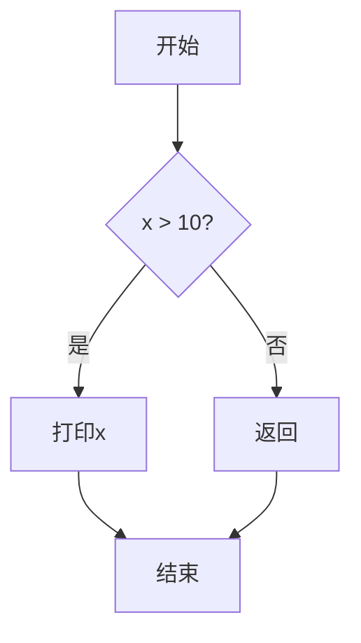
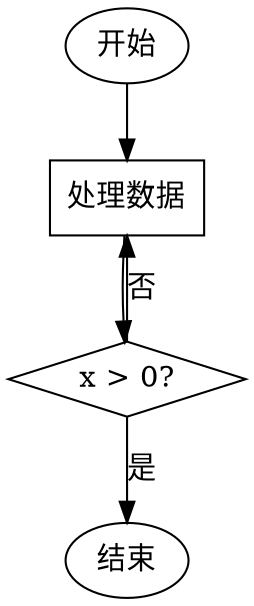

---
tags:
  - "#domain/tools"
  - "#type/reference"
  - "#tech/documentation"
  - "#grain/guide"
  - "#level/basic"
aliases:
  - Flowchart规范
  - 流程图符号
create_date: 2025-11-19
notetype: 文档规范
---

# 流程图绘制规范

流程图（Flowchart）是描述算法、业务逻辑或程序流程的可视化工具。掌握标准的流程图符号和绘制规则，能够准确、清晰地表达逻辑流程。

## 目录

1. [[#基本符号]]
2. [[#线条含义]]
3. [[#UML序列图线条约定]]
4. [[#最佳实践]]
5. [[#常用工具]]

---

## 基本符号

### 核心符号表

| 形状 | 名称 (Name) | 何时使用 (When to Use) | 示例 |
|------|------------|----------------------|------|
| **椭圆 / 圆角矩形** | **终结符 (Terminator)** | 表示流程的 **开始** 或 **结束**<br>• 一个流程图必须有且只有一个"开始"<br>• 可以有多个"结束" | `开始`<br>`结束`<br>`返回`<br>`异常退出` |
| **矩形** | **过程 (Process)** | 表示一个具体的 **操作、计算或执行步骤**<br>最常用的形状，用来描述"做什么" | `i = i + 1`<br>`计算总价`<br>`调用API`<br>`打印结果` |
| **菱形** | **判定 (Decision)** | 表示一个 **判断或分支**<br>必须引出至少两条路径（通常是"是/否"或"真/假"）<br>代表不同的决策结果 | `if (x > 10)`<br>`文件是否存在?`<br>`用户已登录?`<br>`余额充足?` |
| **平行四边形** | **数据 / 输入输出 (Data / I/O)** | 表示需要 **输入数据或输出数据** 的步骤<br>例如从键盘读取、向屏幕打印、读写文件 | `读取用户名`<br>`显示错误信息`<br>`写入日志文件`<br>`接收网络数据` |
| **带双竖边的矩形** | **预定义过程 / 子程序<br>(Predefined Process / Subroutine)** | 表示调用一个已经定义好的、相对独立的<br>**函数、模块或子流程**<br>这有助于简化主流程图 | `调用登录验证模块()`<br>`执行排序算法`<br>`初始化数据库连接` |
| **圆柱体** | **数据存储 (Data Store)** | 表示数据被存储的地方<br>如 **数据库、数据表或任何形式的持久化存储** | `用户数据库`<br>`订单表`<br>`配置文件`<br>`缓存` |
| **小圆形** | **连接符 (Connector)** | 当流程图太大，需要用连接线在 **同一页内**<br>连接两个远距离的点时使用<br>避免线条交叉混乱 | 在A点标记 `①`<br>在B点标记 `①`<br>表示流程从A流向B |
| **五边形（带尖底）** | **准备 / 初始化<br>(Preparation)** | 表示准备工作或初始化操作<br>如设置循环变量、初始化参数 | `for i = 0 to n`<br>`初始化计数器`<br>`设置标志位` |
| **六边形** | **手动操作<br>(Manual Operation)** | 需要人工介入的步骤 | `用户确认`<br>`手动输入密码`<br>`人工审核` |

### 符号使用规则

1. **唯一起点**：每个流程图只能有一个"开始"终结符
2. **明确终点**：可以有多个"结束"终结符（正常退出、错误退出等）
3. **判定必分支**：菱形判定框必须至少有两条出口路径
4. **标注分支**：判定框的出口应标注条件（"是"/"否"，"真"/"假"，">0"/"≤0"等）
5. **避免交叉**：尽量避免流程线交叉，必要时使用连接符
6. **流向一致**：通常从上到下、从左到右绘制

---

## 线条含义

### 线条类型表

| 线条样式 | 名称 (Name) | 何时使用 (When to Use) |
|---------|-----------|---------------------|
| **实线 + 箭头** | **控制流 (Control Flow)** | **这是最标准的用法**<br>表示程序执行的顺序和方向<br>箭头至关重要，它指明了流程的走向 |
| **虚线 + 箭头** | **注释/关联/可选流程/数据流** | 有三种常见含义，需结合上下文判断：<br>1. **注释/关联 (Annotation/Association)**：<br>   连接一个形状和一个注释框，说明这个步骤的额外信息<br>   这是**最常见的用法**<br><br>2. **可选流程/备用流程 (Optional/Alternate Flow)**：<br>   表示一个非主要的、可能发生的流程<br>   比如一个不常见的错误处理路径<br><br>3. **数据流 (Data Flow)**：<br>   在某些图中（非标准流程图），用来表示数据的传递而非程序的执行顺序<br>   但在UML中，数据流有更专门的表示法 |
| **没有箭头的线** | **关联 (Association)** | 在UML类图等图中，表示两个元素之间存在某种静态关系<br>但没有指明方向<br>在流程图中应**避免使用**，因为流程必须有方向 |

### 箭头方向规范

- **主流程**：从上到下或从左到右
- **返回循环**：从下到上或从右到左（通常用于循环结构）
- **判定分支**：
  - "是"/"真"分支通常向下或向右
  - "否"/"假"分支通常向右或向下
  - 必须在箭头旁标注条件

### 示例：判定框的标准用法

```
       ┌─────────┐
       │  开始   │
       └────┬────┘
            │
            ▼
       ┌─────────┐
       │ x = 10  │
       └────┬────┘
            │
            ▼
       ┌──────────┐
       │ x > 5 ?  │
       └─┬────┬───┘
         │    │
       是│    │否
         │    │
         ▼    ▼
     ┌────┐ ┌────┐
     │打印│ │返回│
     │ x  │ └────┘
     └─┬──┘
       │
       ▼
    ┌──────┐
    │ 结束 │
    └──────┘
```

---

## UML序列图线条约定

当需要描述更复杂的系统架构和交互时，会接触到 **UML (Unified Modeling Language)**。UML序列图（Sequence Diagram）用于描述对象之间的消息传递顺序，线条有特定的约定。

### UML序列图线条类型

| 线条样式 | 名称 | 含义 | 用途 |
|---------|------|------|------|
| **实线 + 实心箭头 (`→`)** | **同步调用<br>(Synchronous Call)** | 调用方发起请求，并**等待**接收方返回结果后才继续执行 | 普通函数调用<br>阻塞式API调用 |
| **虚线 + 开口箭头 (`-->`)** | **返回值<br>(Return Message)** | 从接收方指回调用方<br>表示返回执行结果 | 函数返回<br>响应消息 |
| **实线 + 开口箭头 (`->`)** | **异步调用<br>(Asynchronous Call)** | 调用方发起请求后，**不等待**接收方返回结果<br>立即继续执行自己的后续任务 | 发送事件<br>消息队列<br>非阻塞调用 |

### 示例：UML序列图

```
客户端          服务器          数据库
  │               │               │
  │──请求登录──→  │               │
  │   (同步)      │               │
  │               │──查询用户──→  │
  │               │   (同步)      │
  │               │ ←──返回数据── │
  │               │    (虚线)     │
  │ ←──返回结果── │               │
  │    (虚线)     │               │
  │               │               │
  │──发送日志──→  │               │
  │   (异步)      │               │
  │               │               │
  │继续执行       │               │
```

**说明**：
- 客户端请求登录（同步调用）→ 服务器处理
- 服务器查询数据库（同步调用）→ 数据库返回数据（虚线）
- 服务器返回结果给客户端（虚线）
- 客户端发送日志（异步调用）→ 不等待服务器处理即继续执行

---

## 最佳实践

### 1. 清晰命名

**❌ 不好**：
```
┌──────┐
│ 处理 │
└──────┘
```

**✅ 好**：
```
┌──────────────┐
│ 验证用户密码 │
└──────────────┘
```

### 2. 判定框标注条件

**❌ 不好**：
```
     ┌────────┐
     │ 检查x │
     └───┬────┘
         │
    ┌────┴────┐
    │         │
    ▼         ▼
```

**✅ 好**：
```
     ┌────────┐
     │ x > 0? │
     └───┬────┘
         │
    ┌────┴────┐
  是│        │否
    ▼         ▼
```

### 3. 避免复杂交叉

**❌ 不好**：线条交叉混乱

**✅ 好**：使用连接符
```
   A────→ ①         ① ────→ B

   （页面其他内容）
```

### 4. 一致的流向

- 主流程从上到下
- 分支流程向右或向下
- 循环返回向上

### 5. 适度分解

对于复杂流程，使用"预定义过程"符号分解为多个子流程图。

**主流程**：
```
┌─────┐
│开始 │
└──┬──┘
   ▼
┌──────────┐
║ 用户登录 ║  ← 预定义过程
╚════┬═════╝
     ▼
┌──────────┐
│ 处理业务 │
└──────────┘
```

**子流程（用户登录）**：
```
┌─────────┐
│ 开始    │
└────┬────┘
     ▼
┌──────────┐
│ 输入账号 │
└────┬─────┘
     ▼
┌──────────┐
│ 输入密码 │
└────┬─────┘
     ▼
┌──────────┐
│密码正确? │
└─┬────┬───┘
是│    │否
  ▼    ▼
┌────┐┌─────┐
│登录││返回 │
│成功││错误 │
└────┘└─────┘
```

---

## 常用工具

### 在线工具

| 工具 | 特点 | 链接 |
|------|------|------|
| **draw.io** (diagrams.net) | 免费、功能强大、支持多种图表类型 | https://app.diagrams.net/ |
| **Lucidchart** | 在线协作、模板丰富 | https://www.lucidchart.com/ |
| **ProcessOn** | 中文界面、免费额度 | https://www.processon.com/ |
| **Mermaid** | 文本转流程图、可嵌入Markdown | https://mermaid.js.org/ |

### 桌面软件

| 软件 | 平台 | 特点 |
|------|------|------|
| **Microsoft Visio** | Windows | 专业、功能全面、企业标准 |
| **OmniGraffle** | macOS | Mac平台首选 |
| **yEd** | 跨平台 | 免费、自动布局 |
| **LibreOffice Draw** | 跨平台 | 开源免费 |

### 代码生成流程图

#### Mermaid 示例

在Markdown中嵌入流程图：

````markdown

````

**渲染结果**：


#### Graphviz DOT 语言



生成图片：
```bash
dot -Tpng flowchart.dot -o flowchart.png
```

---

## 实战示例

### 示例1：登录验证流程

```
       ┌─────────┐
       │  开始   │
       └────┬────┘
            │
            ▼
     ┌──────────────┐
     │ 输入用户名   │
     └──────┬───────┘
            │
            ▼
     ┌──────────────┐
     │ 输入密码     │
     └──────┬───────┘
            │
            ▼
     ┌──────────────┐
     │ 用户名存在?  │
     └──┬────────┬──┘
      是│        │否
        │        │
        ▼        ▼
   ┌────────┐ ┌─────────┐
   │密码正确?│ │显示错误 │
   └─┬────┬─┘ └────┬────┘
   是│    │否      │
     │    └────────┤
     │             │
     ▼             ▼
  ┌──────┐    ┌──────┐
  │登录  │    │ 结束 │
  │成功  │    └──────┘
  └──┬───┘
     │
     ▼
  ┌──────┐
  │ 结束 │
  └──────┘
```

### 示例2：简单循环（累加求和）

```
       ┌─────────┐
       │  开始   │
       └────┬────┘
            │
            ▼
     ┌──────────────┐
     │ sum = 0      │
     │ i = 1        │
     └──────┬───────┘
            │
            ▼
     ┌──────────────┐
     │   i <= 10?   │
     └──┬────────┬──┘
      是│        │否
        │        │
        ▼        ▼
   ┌────────┐ ┌─────────┐
   │sum +=i │ │打印sum  │
   └────┬───┘ └────┬────┘
        │          │
        ▼          │
   ┌────────┐     │
   │ i++    │     │
   └────┬───┘     │
        │         │
        └─────┐   │
              │   │
              ▼   ▼
          (回到判定框)  结束
```

### 示例3：文件处理流程

```
       ┌─────────┐
       │  开始   │
       └────┬────┘
            │
            ▼
     ┌──────────────┐
     │ 打开文件     │
     └──────┬───────┘
            │
            ▼
     ┌──────────────┐
     │ 文件存在?    │
     └──┬────────┬──┘
      是│        │否
        │        │
        ▼        ▼
   ┌────────┐ ┌─────────┐
   │读取数据│ │显示错误 │
   └────┬───┘ └────┬────┘
        │          │
        ▼          │
   ┌────────┐     │
   │处理数据│     │
   └────┬───┘     │
        │         │
        ▼         │
   ┌────────┐    │
   │关闭文件│    │
   └────┬───┘    │
        │        │
        ▼        ▼
     ┌──────┐
     │ 结束 │
     └──────┘
```

---

## 相关资源

- [[Makefile完全指南]]：构建流程设计
- [[C语言高级 - 状态机设计模式]]：状态转换图
- [[UML类图设计]]：面向对象设计图

## 参考资料

- [ISO 5807 标准](https://www.iso.org/standard/11955.html) - 流程图符号国际标准
- [UML 官方规范](https://www.omg.org/spec/UML/)
- [Mermaid 文档](https://mermaid.js.org/intro/)

---

**最后更新**: 2025-11-19
