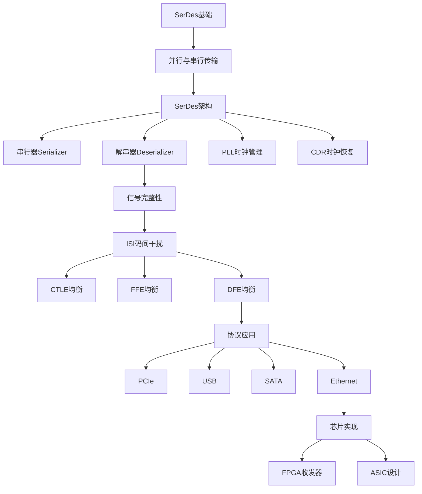

---
tags:
  - "#domain/embedded"
  - "#type/moc"
  - "#tech/serdes"
status: 维护中
modified: 2025-11-18 22:00:00
---
# ⚡ SerDes知识地图 (MOC)

> [!info] 这是SerDes技术相关知识的导航中心
> SerDes (Serializer/Deserializer) 是高速串行数据传输的核心技术,广泛应用于PCIe、SATA、USB、以太网等接口标准中。

## 📊 统计信息

```dataview
TABLE
  length(file.inlinks) as "被引用次数",
  length(file.outlinks) as "引用数量",
  modified as "最后修改"
FROM "10_Areas/03_Embeded_System/SerDes"
WHERE file.name != this.file.name
SORT modified DESC
LIMIT 10
```

## 🗺️ 知识图谱

### 基础知识 (Basic)

#### 核心概念
- [[SerDes基础 - 并行与串行数据传输]] - 并行vs串行传输对比、技术演进、应用场景

### 中级知识 (Intermediate)

#### 架构设计
- [[SerDes架构 - 芯片架构与工作原理]] - 串行器、解串器、PLL、CDR技术

### 高级知识 (Advanced)

#### 信号完整性
- [[SerDes技术 - 均衡器与信号完整性]] - ISI、CTLE、FFE、DFE均衡技术

#### Tx发送器
- [[SerDes技术 - Tx发送器模块]] - 预加重、驱动器设计、FFE实现

#### Rx接收器
- [[SerDes技术 - Rx接收器模块]] - CTLE、DFE、CDR时钟恢复

#### 时钟管理
- [[SerDes技术 - PLL与时钟管理]] - PLL设计、时钟分配、抖动管理

### 协议与应用

#### 标准协议
- [[SerDes应用 - PCIe协议]] - PCIe物理层、链路层
- [[SerDes应用 - USB协议]] - USB 3.x SerDes实现
- [[SerDes应用 - SATA协议]] - SATA物理层设计
- [[SerDes应用 - 以太网]] - 高速以太网SerDes

#### 芯片实现
- [[SerDes实现 - Xilinx GTX/GTH]] - Xilinx FPGA收发器
- [[SerDes实现 - Intel Stratix收发器]] - Intel FPGA SerDes

## 📚 学习路径



### 学习建议

1. **基础阶段** (1-2周)
   - 理解并行传输 vs 串行传输的区别
   - 掌握SerDes的基本概念和作用
   - 了解高速传输面临的挑战
   - 学习差分信号的原理

2. **架构阶段** (2-3周)
   - 深入理解Serializer和Deserializer的工作原理
   - 学习PLL和CDR技术
   - 掌握8B/10B、64B/66B等编码方案
   - 了解SerDes的整体架构

3. **信号完整性阶段** (3-4周)
   - **重点**: 理解ISI(码间干扰)的产生和影响
   - 掌握CTLE、FFE、DFE三种均衡器的原理
   - 学习眼图分析和BER测试
   - 了解抖动的分类和测量

4. **协议与应用阶段** (4-8周)
   - 学习PCIe、USB、SATA等协议的物理层
   - 了解不同协议对SerDes的要求
   - 研究实际芯片的SerDes实现
   - 进行实际项目开发

5. **深入研究阶段** (持续学习)
   - 自适应均衡算法(LMS、Zero-Forcing)
   - 高级时钟恢复技术
   - 低功耗设计
   - 高速信号测试与调试

## 🎯 学习目标

- [ ] 理解SerDes的基本概念和应用场景
- [ ] 掌握SerDes的架构和核心模块
- [ ] 深入理解信号完整性和均衡技术
- [ ] 熟悉至少一种SerDes协议(PCIe/USB/SATA)
- [ ] 能够使用FPGA收发器进行SerDes开发
- [ ] 能够进行SerDes调试和性能优化

## ⚠️ 关键概念

> [!important] 核心技术点
> 1. **差分信号**: SerDes几乎都使用差分信号传输,抗干扰能力强
> 2. **时钟嵌入**: 串行数据中嵌入时钟信息,通过CDR恢复时钟
> 3. **均衡器**: 补偿信道的频率选择性衰减,是高速SerDes的关键
> 4. **8B/10B编码**: 保证足够的跳变用于时钟恢复,实现DC平衡
> 5. **眼图**: 评估信号质量的最直观方法

## 💡 最佳实践

> [!tip] 工程建议
> - 使用差分阻抗匹配,避免信号反射
> - 合理配置均衡器参数,最大化眼图张开
> - 注意PCB走线长度匹配,减少时钟偏斜
> - 使用示波器和误码仪进行充分测试
> - 参考芯片厂商的参考设计和应用笔记

## 🔧 常用工具

### 硬件工具
- **高速示波器** - 眼图分析、抖动测量
- **误码仪(BERT)** - BER测试
- **信号完整性分析仪** - S参数测量
- **协议分析仪** - 协议层调试

### 软件工具
- **HSPICE/Spectre** - 电路仿真
- **ADS** - 射频和高速电路设计
- **Vivado/Quartus** - FPGA开发
- **HyperLynx** - 信号完整性仿真

## 📖 重要参数

| 参数 | 说明 | 典型值 |
|------|------|--------|
| **数据速率** | 每秒传输的比特数 | 1-56 Gbps |
| **UI** | 单位间隔,一个bit的时间 | 1/速率 |
| **BER** | 误码率 | <10⁻¹² |
| **眼高** | 眼图垂直张开度 | >100 mV |
| **眼宽** | 眼图水平张开度 | >0.6 UI |
| **抖动** | 时间不确定性 | <0.2 UI |

## 🔗 相关MOC

- [[00_Embeded_System_MOC]] - 嵌入式系统总索引
- [[00_Digital_IC_Design_MOC]] - 数字集成电路设计
- [[00_Signal_Integrity_MOC]] - 信号完整性知识体系

## 📝 最近笔记

```dataview
LIST
FROM "10_Areas/03_Embeded_System/SerDes"
WHERE file.name != this.file.name
SORT file.mtime DESC
LIMIT 5
```

## 📚 推荐资源

### 书籍
- **《High-Speed SerDes Devices and Applications》** - SerDes权威教材
- **《High-Speed Digital Design》** - 信号完整性经典
- **《Jitter, Noise, and Signal Integrity at High-Speed》** - 抖动分析
- **《PCI Express System Architecture》** - PCIe协议详解

### 标准文档
- PCI-SIG PCIe Base Specification
- USB 3.x Specification
- SATA Physical Layer Specification
- IEEE 802.3 Ethernet Standards

### 在线资源
- Xilinx UltraScale GTX/GTH Transceiver User Guide
- Intel Stratix 10 Transceiver PHY User Guide
- Signal Integrity Journal
- PCIe Technology Consortium

### 厂商应用笔记
- Xilinx SerDes Design Guide
- Intel SerDes Best Practices
- TI High-Speed Interface Design

## 🎓 进阶主题

### 研究方向
- **超高速SerDes** (>100 Gbps)
- **PAM4调制** - 4电平信号传输
- **前向纠错(FEC)** - 提高链路可靠性
- **自适应均衡** - 机器学习算法
- **低功耗设计** - 能效优化

---

> 💭 **SerDes是高速数字通信的核心技术。随着5G、数据中心、AI芯片的发展,SerDes的速率不断提升,从1Gbps到100Gbps+,信号完整性的挑战也越来越大。掌握SerDes技术是从事高速接口设计的必备技能。**
