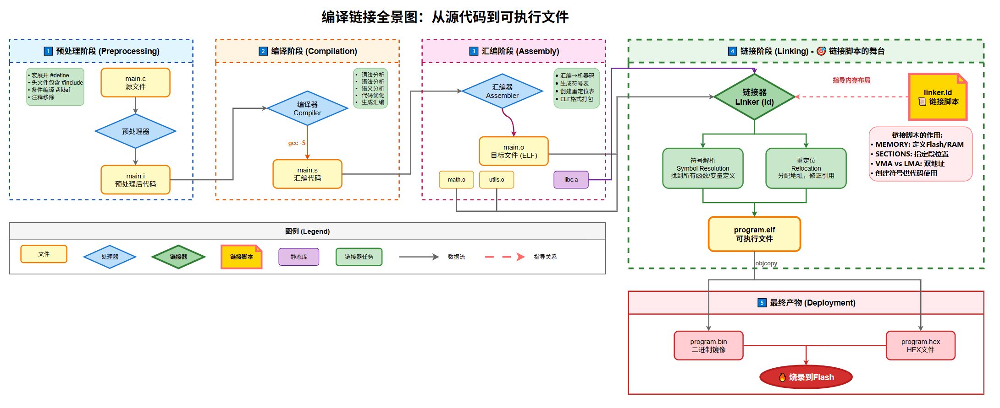
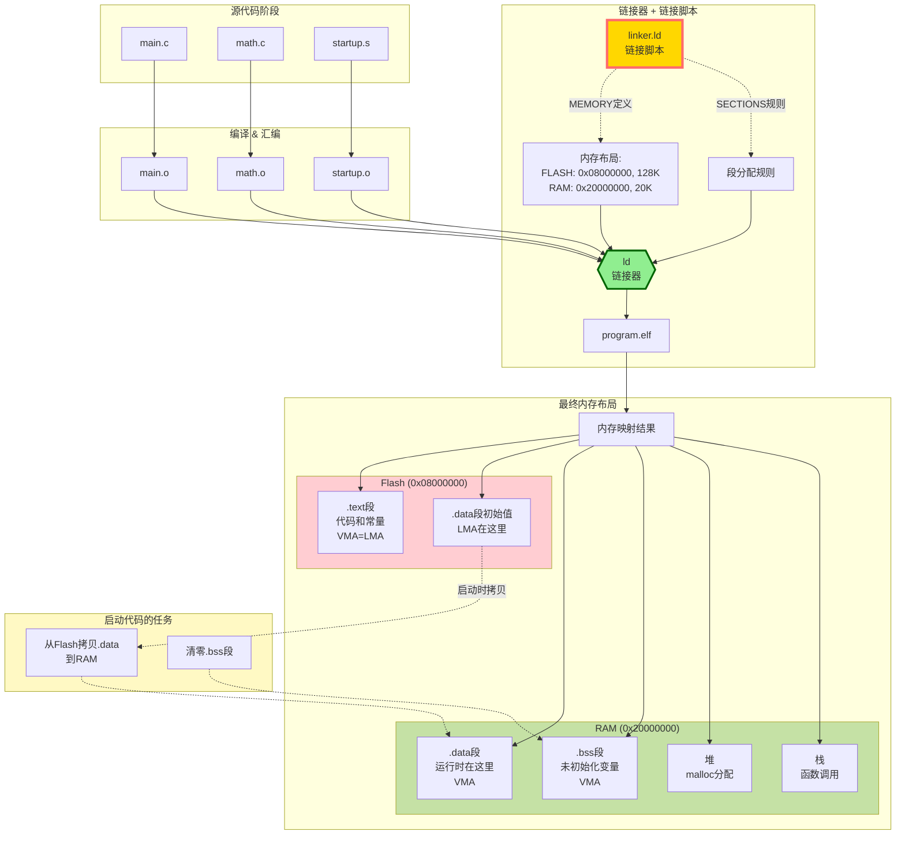

---
tags:
  - domain/toolchain
  - domain/compiler
  - domain/embeded_system
  - tech/linker
  - tech/elf
  - tech/memory-layout
  - usecase/bootloader
status: 🌿 成长中 (Growing)
complexity: ⭐️⭐️Intermediate
notetype: ⚛️ Atomic
related: []
resource:
  - doc
  - article
created: 2025-10-22 17:30:48
modified: 2025-10-24  18:24:56
---
# 链接脚本

> [!abstract] 摘要 
> 链接脚本是嵌入式开发和系统编程中的关键工具，它精确控制程序在内存中的布局。本笔记从编译链接的基础原理出发，深入讲解链接脚本的语法、核心概念和实战应用，帮助你理解如何将代码段、数据段合理地映射到Flash和RAM等物理内存区域。

## 🎯 Target

- [ ]  理解编译链接的完整流程，特别是链接阶段的作用
- [ ]  掌握链接脚本的基本语法和核心命令
- [ ]  能够读懂并分析实际项目中的链接脚本
- [ ]  理解VMA和LMA的区别及其在嵌入式系统中的应用
- [ ]  能够为简单的嵌入式项目编写基础的链接脚本


## 📝 Core

### 一、为什么需要链接脚本？

在普通的桌面程序开发中，你可能从未接触过链接脚本，因为编译器提供的默认配置已经足够好用。但在嵌入式开发中，情况完全不同。想象一下，你的微控制器只有128KB的Flash（用于存储程序）和20KB的RAM（用于运行时数据），而且它们的起始地址是硬件固定的。你需要告诉链接器：哪些代码放在Flash的什么位置，哪些变量要在RAM中分配空间，启动代码必须放在Flash的最开始位置（因为CPU复位后会从那里开始执行）。这就是链接脚本存在的意义——它是程序内存布局的精确"施工图纸"。

### 二、编译链接全景图



在深入链接脚本之前，我们需要理解程序从源代码到可执行文件的完整旅程。这个过程分为四个主要阶段，每个阶段都有其特定的任务。




#### 第一站：预处理（Preprocessing）

预处理器扫描你的C代码，处理所有以井号开头的预处理指令。它会展开宏定义，比如把所有的`MAX_SIZE`替换成具体的数值；它会递归地包含头文件，将`stdio.h`的内容插入到你的代码中；它还会根据条件编译指令决定哪些代码块需要保留。注释在这个阶段被完全移除，因为编译器不需要它们。

预处理的输出仍然是C代码，只不过是"膨胀"后的版本——所有宏都被展开，所有头文件都被包含进来了。你可以用`gcc -E main.c -o main.i`命令来查看预处理后的结果，这对于调试宏展开问题非常有用。

#### 第二站：编译（Compilation）

编译器接收预处理后的代码，将高级的C语言翻译成更接近机器的汇编语言。这个过程包含了词法分析（把代码切分成有意义的"单词"）、语法分析（检查语法是否正确）、语义分析（检查类型是否匹配）和代码优化（让程序跑得更快或更小）。

重要的是，编译器是独立处理每个`.c`文件的。它只知道当前文件内部的情况，对于外部函数和变量，它只是标记说"这里需要一个叫`printf`的函数"，具体地址稍后再说。输出的`.s`文件是人类还能勉强读懂的汇编代码。

#### 第三站：汇编（Assembly）

汇编器将汇编代码转换成真正的机器指令——一串串二进制数字。这些机器码被打包成**目标文件**（`.o`文件），这是一种结构化的二进制格式，通常是ELF（可执行与可链接格式）。

目标文件包含三个关键信息：首先是机器码和数据本身；其次是**符号表**，记录着"这个文件定义了`add`函数，使用了`printf`函数"；最后是**重定位表**，标记着"第42行调用了外部函数，链接时请填上正确地址"。

由于每个目标文件都是独立编译的，函数和变量的地址都是相对的、临时的，这就是为什么它被称为"可重定位"目标文件。

#### 第四站：链接（Linking）——链接脚本的舞台

链接是整个流程的"总装车间"。链接器接收所有的目标文件，完成两个核心任务。

**第一个任务是符号解析**。链接器构建一个全局符号表，将所有文件的符号信息汇总。当`main.o`说"我需要`add`函数"，链接器在`math.o`中找到它的定义，建立起关联。如果某个符号只被引用却找不到定义，链接器会报错："未定义的引用"。

**第二个任务是重定位**。链接器将所有同类的段合并——把各个文件的`.text`段（代码段）拼接成一个大的`.text`段，`.data`段（初始化数据）也是如此。然后，根据链接脚本的指示，为每个段分配最终的运行时地址。比如，链接脚本可能说：代码段从地址`0x08000000`开始，数据段从`0x20000000`开始。

一旦地址确定，链接器就回到重定位表，将之前的占位符地址替换成真实地址。比如，将"调用外部函数"的占位符`0x00000000`改成`add`函数的实际地址`0x08001234`。

最终输出一个完整的、自洽的可执行文件，它可以被直接加载到内存运行，所有的函数调用都指向正确的位置。而链接脚本，就是在这个阶段指导链接器"如何拼装"的详细规范。

### 三、静态链接与动态链接的权衡

理解这两种链接方式，有助于你明白为什么嵌入式系统几乎总是使用静态链接。

**静态链接**就像是准备一个自给自足的旅行包。当你的程序需要`printf`函数时，链接器会从C标准库（`.a`文件）中取出整个`printf`的实现代码，连同它依赖的所有辅助函数，一起打包进最终的可执行文件。这样生成的文件体积会比较大，但好处是它完全独立——拷贝到任何兼容的机器上都能运行，不需要担心目标机器上有没有安装标准库。

在资源受限的嵌入式系统中，静态链接是默认选择。因为这些系统往往没有操作系统，没有文件系统，自然也就没有"共享库"的概念。你的程序必须在一个单一的镜像文件中包含运行所需的一切。

**动态链接**则像是"按需取用"的公共服务。在编译时，链接器只在可执行文件中记录一个标记："我需要`libc.so`（共享库）中的`printf`"。当你运行程序时，操作系统的动态加载器会介入，在内存中查找或加载这个共享库，然后在运行时完成"最后的链接"——将程序中对`printf`的调用连接到内存中共享库的实际地址。

动态链接的巨大优势是节省空间和便于维护。如果一百个程序都需要`libc`，内存中只需要一份`libc.so`的副本，所有程序共享它。而且，如果`libc`有安全漏洞需要修复，只需要更新这一个共享库文件，所有依赖它的程序下次运行时自动使用新版本。

然而，动态链接的前提是有一个复杂的操作系统环境支持。在裸机嵌入式系统中，没有动态加载器，没有虚拟内存管理，因此只能使用静态链接。

### 四、链接脚本的核心语法

链接脚本使用一种类似C语言的语法。它用分号作为语句分隔符，支持算术表达式和运算符，也支持C风格的注释。让我们逐个学习其核心命令。

#### 入口点与文件格式

链接脚本的开头通常声明三个基本信息：

```
 ENTRY(_start)                        /* 程序入口点 */  
 OUTPUT_FORMAT(elf32-littlearm)       /* 输出文件格式 */  
 OUTPUT_ARCH(arm)                     /* 目标处理器架构 */
```

`ENTRY`命令告诉链接器程序的第一条指令在哪里。在标准的C程序中，你可能认为`main`是入口点，但实际上在`main`之前，C运行时库会先执行一段启动代码，设置好栈、初始化全局变量等，然后才调用`main`。在嵌入式系统中，你需要自己提供这段启动代码，通常是一个用汇编写的`_start`或`Reset_Handler`函数。

`OUTPUT_FORMAT`和`OUTPUT_ARCH`定义了输出文件的二进制格式和目标架构。比如，`elf32-littlearm`表示32位的ELF格式，小端序，ARM架构。这些信息帮助调试器和烧录工具正确解析你的程序。

#### MEMORY命令：描绘硬件地图

这是嵌入式链接脚本最关键的命令之一。它让你向链接器描述目标硬件的物理内存布局：

```C
 MEMORY  
 {  
   FLASH (rx)  : ORIGIN = 0x08000000, LENGTH = 128K  
   RAM   (rwx) : ORIGIN = 0x20000000, LENGTH = 20K  
 }
```


这段配置告诉链接器："这个芯片有两块内存区域。Flash从地址`0x08000000`开始，大小128KB，属性是可读（r）可执行（x）但不可写。RAM从`0x20000000`开始，大小20KB，可读可写可执行。"

属性标记很重要。Flash是非易失性存储器，断电后内容保留，适合存放程序代码和常量，但运行时不能修改。RAM是易失性存储器，断电丢失，读写速度快，用于存放运行时的变量和栈。标记属性可以让链接器进行基本的合法性检查——比如，如果你试图把需要写入的`.data`段直接放在只读的FLASH中而不做特殊处理，链接器可能会警告你。

#### SECTIONS命令：组装内存布局

`SECTIONS`是链接脚本的核心，它详细规定了如何将输入文件的各个段组合、放置到输出文件和内存中：

```c
 SECTIONS  
 {  
   .text : {  
     *(.text)      /* 所有文件的.text段 */  
     *(.text.*)    /* 所有.text.开头的段 */  
   } > FLASH       /* 放入FLASH区域 */  
     
   .data : {  
     *(.data)  
   } > RAM AT > FLASH  /* 运行时在RAM，但存储在FLASH */  
 }
```

让我们拆解这个结构。`.text`是输出段的名字，大括号内的规则描述了"把哪些输入段放进来"。`*(.text)`是最常见的模式，星号表示"所有输入文件"，括号内是段名。所以这句话的意思是："从所有`.o`文件中找出所有名为`.text`的段，合并到输出的`.text`段中。"

`> FLASH`指定了这个段应该被放置在FLASH内存区域。链接器会自动在FLASH中找一块足够大的空间来容纳整个`.text`段。

常见的段名有约定俗成的含义：`.text`存放可执行代码；`.rodata`存放只读数据，如字符串常量；`.data`存放已初始化的全局变量；`.bss`存放未初始化的全局变量（运行时会被清零）。编译器会自动将代码和数据分类放入这些段。

#### VMA与LMA：理解双地址概念

这是嵌入式链接脚本中最精妙也最容易困惑的部分。每个段实际上有两个地址：

- **VMA（Virtual Memory Address，运行时地址）**：程序运行时，CPU访问这个段的地址。
  
- **LMA（Load Memory Address，加载地址）**：这个段的内容在镜像文件中的存储位置，或者说初始烧录位置。

对于代码段`.text`，VMA和LMA通常相同。代码烧录在Flash的某个位置，CPU也从那个位置读取指令执行。但是对于初始化数据段`.data`，情况就不同了：

```C
 .data : {  
   _sdata = .;     /* VMA起始 */  
   *(.data)  
   _edata = .;     /* VMA结束 */  
 } > RAM AT > FLASH  
 _sidata = LOADADDR(.data);  /* LMA起始 */
```


这段配置的含义是：`.data`段的VMA在RAM中（因为变量需要可写），但它的LMA在FLASH中（因为初始值必须掉电保存）。在芯片出厂或烧录时，初始化数据被存储在FLASH里。但程序启动时，需要一段启动代码将这块数据从FLASH（LMA）拷贝到RAM（VMA），然后程序才能正常读写这些变量。

链接脚本通过定义符号`_sdata`、`_edata`和`_sidata`，将这些地址信息传递给启动代码，启动代码可以通过这些符号知道"应该从FLASH的哪里拷贝多少字节到RAM的哪里"。

#### 位置计数器与辅助函数

在`SECTIONS`内部，有一个特殊的变量`.`（点号），称为位置计数器。它始终指向当前正在处理的输出位置地址。你可以读取它来定义符号，也可以修改它来控制布局：

```C
 .text : {  
   . = ALIGN(4);        /* 对齐到4字节边界 */  
   _text_start = .;     /* 记录.text段起始地址 */  
   *(.text)  
   *(.rodata)  
   _text_end = .;       /* 记录.text段结束地址 */  
 } > FLASH
```

`ALIGN(4)`确保接下来的内容从4字节对齐的地址开始。许多处理器要求指令或某些数据类型必须对齐访问，否则会触发异常或性能下降。

你还可以使用内置函数获取段的信息：`SIZEOF(.text)`返回`.text`段的大小，`ADDR(.text)`返回其起始地址，`LOADADDR(.text)`返回其加载地址。这些函数常用于计算和验证内存使用情况。

#### KEEP命令：防止误删

链接器有一个优化功能叫"垃圾回收"（Garbage Collection），会删除未被引用的函数和变量以减小文件大小。但在嵌入式系统中，有些代码虽然在源代码中看起来"没被调用"，却在运行时必不可少——典型的例子是中断服务程序和复位向量：

```C
 .text : {  
   KEEP(*(.isr_vector))  /* 强制保留中断向量表 */  
   KEEP(*(.reset_vector))  
   *(.text)  
 } > FLASH
```


中断服务程序不是通过普通函数调用触发的，而是由硬件直接跳转。如果链接器因为"找不到调用"而删除了它们，程序就会在发生中断时崩溃。`KEEP`命令防止这种情况发生。

#### ASSERT：在链接时做检查

链接脚本可以包含断言，在链接时检查内存是否溢出：

```C
 ASSERT(SIZEOF(.text) + SIZEOF(.data) <= LENGTH(FLASH),   
        "Flash memory overflow!")  
 ASSERT(SIZEOF(.data) + SIZEOF(.bss) <= LENGTH(RAM),   
        "RAM overflow!")
```


如果断言失败，链接过程会中止并显示错误信息。这是一种"防呆"机制，能在编译时就发现问题，而不是等到程序烧录后才发现装不下。

### 五、实战案例分析

让我们通过一个实际的STM32单片机链接脚本来巩固理解：

```C
 MEMORY
{
  FLASH (rx)  : ORIGIN = 0x08000000, LENGTH = 128K
  RAM   (rwx) : ORIGIN = 0x20000000, LENGTH = 20K
}

_estack = ORIGIN(RAM) + LENGTH(RAM);  /* 栈顶地址 */

SECTIONS
{
  .text : {
    . = ALIGN(4);
    KEEP(*(.isr_vector))  /* 中断向量表必须在最开始 */
    *(.text)
    *(.text.*)
    *(.rodata)
    . = ALIGN(4);
  } > FLASH
  
  .data : {
    . = ALIGN(4);
    _sdata = .;
    *(.data)
    _edata = .;
  } > RAM AT > FLASH
  _sidata = LOADADDR(.data);
  
  .bss (NOLOAD) : {
    _sbss = .;
    *(.bss)
    *(COMMON)
    _ebss = .;
  } > RAM
}
```


这个脚本讲述了这样一个故事：

首先，芯片有128KB的Flash（从`0x08000000`开始）和20KB的RAM（从`0x20000000`开始）。栈被安排在RAM的最顶部，`_estack`符号标记了栈顶位置。

代码段从Flash的起始位置开始布局。最前面必须是中断向量表，因为ARM Cortex-M处理器的硬件设计要求复位后从Flash起始读取向量表。接着是所有的代码段和只读数据。所有内容都在Flash中，这样断电后程序依然保留。

数据段的初始值存储在Flash中（紧跟在代码段之后），但运行时地址在RAM中。启动代码会读取`_sidata`、`_sdata`、`_edata`这些符号，执行这样的循环：

```C
 // 伪代码：启动时的数据拷贝  
 uint8_t *src = &_sidata;   // FLASH中的源地址  
 uint8_t *dst = &_sdata;    // RAM中的目标地址  
 while (dst < &_edata) {  
     *dst++ = *src++;  
 }
```


BSS段只在RAM中分配空间，不在Flash中占用存储。`(NOLOAD)`标记告诉链接器"不要把这个段的内容写入输出文件"。启动代码会将这块内存清零：

```C
 // 伪代码：启动时的BSS清零  
 uint8_t *p = &_sbss;  
 while (p < &_ebss) {  
     *p++ = 0;  
 }
```


通过这样的精心编排，程序既能在掉电后保留代码和初始数据（在Flash中），又能在运行时高速读写变量（在RAM中）。


## 🤔 Q&A

### Q1: 为什么`.bss`段不直接在Flash中存零？

**A**: 这是一个绝妙的空间优化。未初始化的全局变量在C标准中要求"默认为零"，但如果在可执行文件中真的存储成千上万个零，会极大浪费存储空间。`.bss`段的设计哲学是："既然反正要初始化为零，那就别在文件里存了，只记录大小，运行时用代码清零就行。"这样一个100KB的`.bss`段在镜像文件中占用空间为零，只是在RAM中占用100KB。

### Q2: 如果不小心把`.data`段直接放在Flash中不用`AT`会怎样？

**A**: 程序会出现奇怪的bug。你的全局变量看起来初始化正确，但任何写入操作都会悄无声息地失败（因为Flash不可写），或者触发硬件错误。更糟的是，如果你的编译器做了优化，可能在某些时候从寄存器读取缓存值，让你误以为写入成功了，但实际内存中的值从未改变。

### Q3: 栈和堆是如何分配的？

**A**: 栈通常从RAM的顶部向下生长，堆从`.bss`段结束的位置向上增长。链接脚本通常会定义栈顶位置（如`_estack`），但不会在`SECTIONS`中显式分配栈空间，因为栈是由硬件栈指针寄存器动态管理的。堆的分配则由运行时库（如`malloc`实现）负责，链接脚本可能会预留一块空间或通过符号告诉运行时库可用内存的边界。


## 🚀 Tasks
- [ ]  使用`objdump -h your_program.elf`查看一个实际程序的段信息
- [ ]  手动编写一个最简单的ARM Cortex-M链接脚本
- [ ]  尝试故意制造内存溢出，观察链接器的错误提示
- [ ]  修改现有项目的链接脚本，增加一个自定义段用于存放特定数据
- [ ]  理解并实现一个简单的启动代码，完成`.data`拷贝和`.bss`清零

## 📚 Reference
* GNU Linker (ld) 官方文档：[https://sourceware.org/binutils/docs/ld/](https://sourceware.org/binutils/docs/ld/)
  
- 《嵌入式C语言自我修养》第7章：链接脚本详解
  
- ARM Cortex-M编程手册：复位序列与内存映射
  
- [[build文件的使用]]：理解如何通过构建系统调用链接器

## 🕸️ Relation
* 这篇笔记与 [另一篇笔记] 的关系是... (在这里描述上下文)