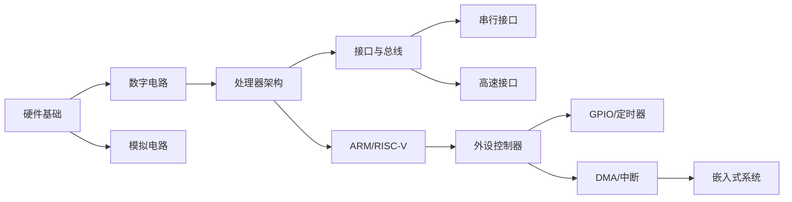

---
tags:
  - "#domain/hardware"
  - "#type/moc"
  - "#grain/system-design"
status: 维护中
modified: 2025-11-19
---
# ⚙️ 硬件知识地图 (MOC)

> [!info] 这是硬件设计和嵌入式系统硬件相关知识的导航中心
> 硬件是软件的基础，理解硬件原理对嵌入式系统开发至关重要。

## 📊 统计信息

```dataview
TABLE
  length(file.inlinks) as "被引用次数",
  length(file.outlinks) as "引用数量",
  modified as "最后修改"
FROM "10_Areas/03_Hardware"
WHERE file.name != this.file.name
SORT modified DESC
LIMIT 10
```

## 🗺️ 知识图谱

### 嵌入式硬件基础 (Embedded Hardware Basics)

#### 核心概念
- [[嵌入式硬件 - PINMUX引脚复用]] - Pin Multiplexing、GPIO配置、STM32/RISC-V/Linux设备树实例

#### 处理器架构
- [[ARM处理器架构]] - Cortex-M/Cortex-A系列、寄存器、中断
- [[RISC-V架构基础]] - RISC-V指令集、特权模式、CSR寄存器
- [[x86架构概述]] - x86/x64架构、保护模式、分段分页

### 接口与总线 (Interfaces & Buses)

#### 串行接口
- [[UART通信协议]] - 串口通信、波特率、握手信号
- [[I2C总线详解]] - 两线式总线、主从模式、地址寻址
- [[SPI总线详解]] - 四线式总线、全双工、时钟极性/相位

#### 高速接口
- [[PCIe接口技术]] - PCI Express、链路训练、事务层协议
- [[USB协议详解]] - USB 2.0/3.0、枚举过程、端点
- [[Ethernet以太网]] - MAC/PHY、MII/RMII、TCP/IP硬件卸载

### 存储器 (Memory)

#### 存储器类型
- [[DRAM原理与时序]] - DDR3/DDR4、刷新机制、时序参数
- [[Flash存储器]] - NAND Flash、NOR Flash、擦写寿命
- [[EEPROM与FRAM]] - 非易失性存储、写周期限制

### 外设控制器 (Peripherals)

#### 基础外设
- [[GPIO控制]] - 通用输入输出、上拉下拉、中断触发
- [[定时器与计数器]] - 硬件定时器、PWM生成、输入捕获
- [[ADC模数转换]] - 采样率、分辨率、参考电压
- [[DAC数模转换]] - 输出电压、精度、输出阻抗

#### 高级外设
- [[DMA控制器]] - 直接内存访问、传输模式、通道优先级
- [[中断控制器]] - NVIC、中断优先级、中断嵌套
- [[看门狗定时器]] - 系统复位、窗口看门狗、独立看门狗

### 电源管理 (Power Management)

#### 功耗优化
- [[低功耗设计]] - 睡眠模式、时钟门控、电源域
- [[电源管理芯片]] - PMIC、LDO、DC-DC转换器
- [[电池管理系统]] - 充放电管理、电量计

### 调试接口 (Debug Interfaces)

#### 硬件调试
- [[JTAG调试接口]] - 边界扫描、TAP控制器、调试端口
- [[SWD调试接口]] - Serial Wire Debug、单线调试
- [[OpenOCD使用]] - 开源片上调试器、GDB配合

## 📚 学习路径



### 学习建议

1. **基础阶段** (2-3周)
   - 理解数字电路和模拟电路基础
   - 学习基本的电子元件（电阻、电容、晶体管）
   - 掌握芯片数据手册的阅读方法

2. **处理器阶段** (3-4周)
   - 学习ARM或RISC-V架构
   - 理解寄存器、中断、存储器映射
   - 掌握引脚复用和GPIO配置

3. **接口阶段** (4-6周)
   - 掌握UART/I2C/SPI串行接口
   - 理解时序图和协议细节
   - 实践驱动编写和调试

4. **高级阶段** (持续学习)
   - 学习高速接口（PCIe/USB/Ethernet）
   - 掌握DMA和中断管理
   - 优化功耗和性能

## 🎯 学习目标

- [ ] 理解常见处理器架构（ARM/RISC-V）
- [ ] 掌握引脚复用和GPIO配置
- [ ] 熟练使用UART/I2C/SPI接口
- [ ] 会读芯片数据手册和时序图
- [ ] 理解中断和DMA工作原理
- [ ] 能够进行硬件调试（JTAG/SWD）

## ⚠️ 常见陷阱

> [!warning] 硬件开发易错点
> 1. **电平不匹配**: 注意3.3V和5V逻辑电平兼容性
> 2. **上拉下拉**: I2C需要外部上拉电阻
> 3. **时钟配置**: 错误的时钟配置会导致外设不工作
> 4. **引脚冲突**: PINMUX配置冲突会导致功能异常
> 5. **ESD防护**: 静电放电可能损坏芯片

## 💡 最佳实践

> [!tip] 硬件开发建议
> - **查手册**: 遇到问题先查阅芯片数据手册和参考手册
> - **用示波器**: 使用示波器验证信号时序和波形
> - **逐步调试**: 从简单功能开始逐步验证复杂功能
> - **硬件复位**: 配置寄存器前先复位外设
> - **电源稳定**: 确保电源稳定，添加去耦电容

### 常用硬件调试技巧

```
1. 使用万用表:
   - 测量电压是否正常
   - 检查短路和断路
   - 验证电阻值

2. 使用示波器:
   - 观察信号波形
   - 测量频率和占空比
   - 检查时序关系

3. 使用逻辑分析仪:
   - 分析数字信号
   - 解码协议数据
   - 捕获事件触发

4. 使用JTAG/SWD:
   - 读取寄存器值
   - 设置断点
   - 单步执行
```

## 🔗 相关MOC

- [[00_Programming_MOC]] - 编程总索引
- [[00_C_MOC]] - C语言嵌入式编程
- [[00_Linux_MOC]] - Linux系统编程
- [[00_SerDes_MOC]] - SerDes高速接口

## 📝 最近笔记

```dataview
LIST
FROM "10_Areas/03_Hardware"
WHERE file.name != this.file.name
SORT file.mtime DESC
LIMIT 5
```

## 📖 推荐资源

### 书籍
- **《ARM Cortex-M3权威指南》** - ARM架构经典
- **《嵌入式系统设计与实践》** - 系统设计方法论
- **《计算机组成与设计：硬件/软件接口》** - 硬件基础经典

### 芯片厂商资源
- [STM32 Reference Manual](https://www.st.com/) - STMicroelectronics官方文档
- [SiFive Freedom E SDK](https://github.com/sifive/freedom-e-sdk) - RISC-V开发资源
- [ARM Developer](https://developer.arm.com/) - ARM官方开发者网站

### 在线资源
- [All About Circuits](https://www.allaboutcircuits.com/) - 电路设计教程
- [EEVblog](https://www.eevblog.com/) - 电子工程视频教程
- [Embedded.com](https://www.embedded.com/) - 嵌入式技术文章

### 实用工具

| 工具 | 类别 | 用途 |
|------|------|------|
| **STM32CubeMX** | 配置工具 | STM32芯片图形化配置，PINMUX设置 |
| **OpenOCD** | 调试工具 | 开源片上调试器，支持JTAG/SWD |
| **Sigrok PulseView** | 逻辑分析 | 开源逻辑分析仪软件 |
| **KiCad** | EDA工具 | 开源PCB设计软件 |
| **LTspice** | 仿真工具 | 免费的电路仿真软件 |

## 🛠️ 常用寄存器操作

### GPIO配置（STM32示例）

```c
// 使能GPIOA时钟
RCC->AHB1ENR |= RCC_AHB1ENR_GPIOAEN;

// 配置PA5为输出模式
GPIOA->MODER &= ~(3U << (5 * 2));  // 清除原配置
GPIOA->MODER |= (1U << (5 * 2));   // 设置为输出模式

// 配置为推挽输出
GPIOA->OTYPER &= ~(1U << 5);

// 配置输出速度为高速
GPIOA->OSPEEDR |= (3U << (5 * 2));

// 配置为上拉
GPIOA->PUPDR &= ~(3U << (5 * 2));
GPIOA->PUPDR |= (1U << (5 * 2));

// 设置输出高电平
GPIOA->ODR |= (1U << 5);
```

### PINMUX配置（Linux设备树）

```dts
&pinctrl {
    uart0_pins: uart0 {
        pins = "gpio14", "gpio15";
        function = "uart0";
        bias-disable;
    };

    spi0_pins: spi0 {
        pins = "gpio9", "gpio10", "gpio11";
        function = "spi0";
        bias-disable;
    };
};
```

---

> 💭 **硬件是软件的舞台，理解硬件原理能让你成为更优秀的嵌入式工程师。动手实践和查阅数据手册是学习硬件最有效的方法。**
