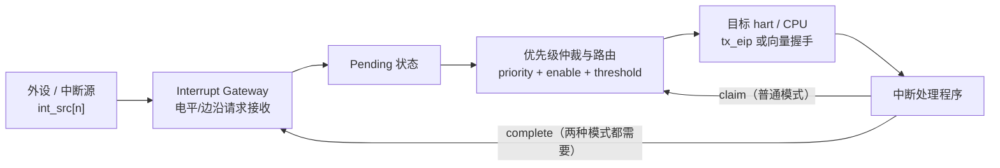
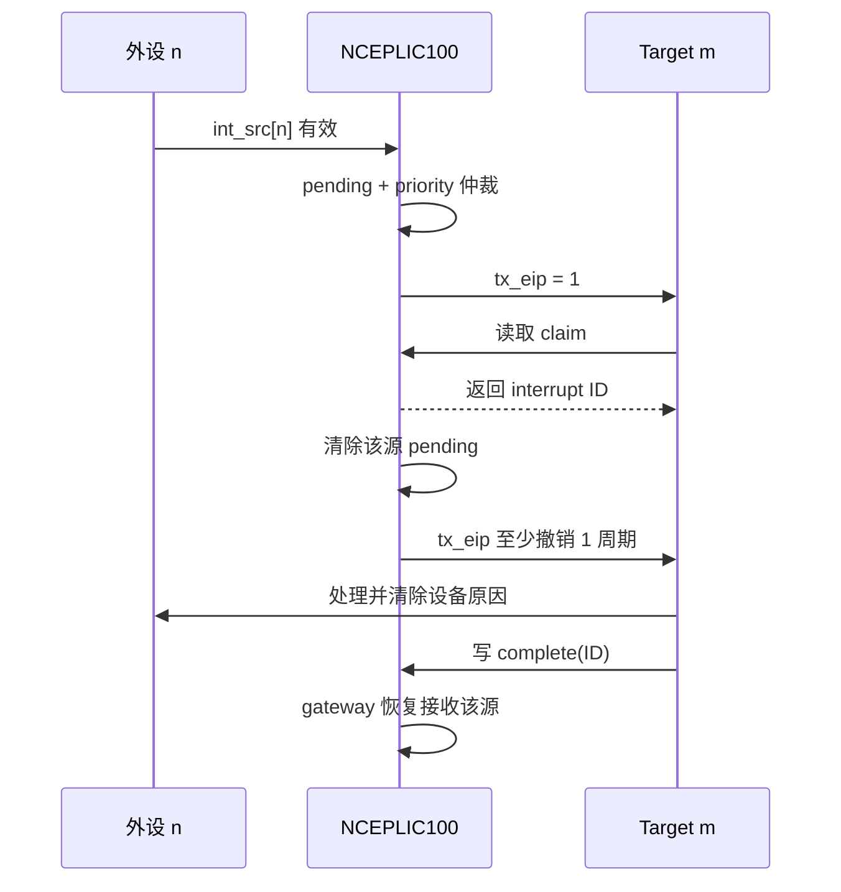
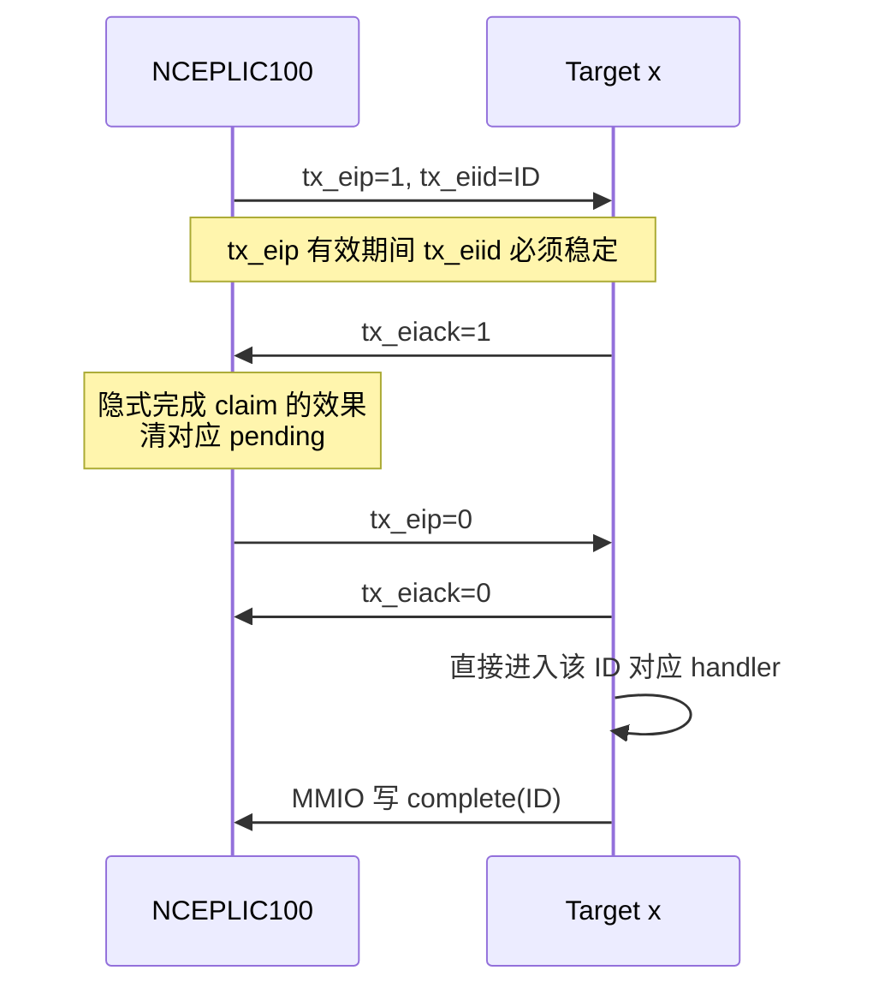

> [!abstract] 核心结论
> 用一两句话写下这篇笔记最重要的结论。

正文直接使用能够说明实际内容的标题，例如“工作原理”“执行流程”或“常见问题”；不需要保留空的固定章节。


## 流程map

三个最重要的结论：

1. `priority = 0` 将“永不触发中断”。
    
2. 只有 `priority > threshold` 才能通知目标；等于阈值也不行。
    
3. claim 会清除对应的 pending 状态，但 complete 才会让该源的 gateway 重新接收后续请求。

## PLIC 概述 
Andes PLIC[^1]控制器 NCEPLIC100 优先考虑并分配全局中断，与riscv的plic是兼容的，具备以下通用的功能：
- 可配置中断触发类型 [[N25F 中断机制#Q 中断的触发类型都有哪些？|❓中断的触发类型都有哪些]]
- 软件可编程中断生成
- 优先级中断抢占扩展
- 向量中断

### NCEPLIC100 运行逻辑
![[NCEPLIC100 Block Diagram.png|500]]
图中是Andes官方文档中给出的设计图，大致的逻辑是外部中断源（可能是设备）通过 `int_src[N:1]` 信号传入芯片，这个信号可以是电平触发和边沿触发([[N25F 中断机制#Q 什么是边沿触发？什么是电平触发？|❓什么是边沿触发？什么是电平触发?]])，然后由中断网关（图中的<mark style="background:rgba(3, 135, 102, 0.2)">'Prioritization and Routing'</mark>)将触发转换为中断请求。

中断请求根据**中断设置**好的中断优先级排序 → 路由到中断目标

中断设置包括：
- 使能位
- 优先级
- 优先级阈值  

生命周期概括：
interrupt generate → pending → claim (此时pending会被清除) → handler → complete
在 `claim` 和 `complete` 之间，虽然pending位已经被清零，但是整个中断仍然处于 in-service的状态，gateway还在等待complete信号
<br>

> [!note]
> "Note that interrupt targets should not modify enable bits, priorities and priority thresholds if there are any un-serviced interrupts."
> 
> 原文中提到这句话，其核心想表达 “一旦某个中断已经被PLIC选中、claim，但是这个中断还没有complete，就不能改相关的enable、priority、threshold”
> 
> 这里的 un-serviced interrupts 应理解为 “尚未完成完整服务流程的中断”
> [[N25F 中断机制#Q:为什么不能修改enable? priority? threshold?|❓为什么不能修改enable? priority? threshold?]]
> 

<br>

`tx_eip`[^2] 是发往外部目标的中断待处理信号，是一种电平信号，用于汇总所有中断源对目标 x 的中断待处理（IP）状态

当目标接受到`tx_eip`的信号，向总线发送中断申请请求(claim request)，以获取中断ID。随后pending的状态位会被清除，且 `tx_eip` 拉低使能，使能的状态需要保持至少一个时钟周期，大概时序
![[tx_eip时序.png|400]]
```
① 某个或多个中断满足交付条件
   pending && enable && priority > threshold

② PLIC 拉高 tx_eip
   tx_eip = 1

③ CPU 检测到外部中断并进入 handler
   此时 tx_eip 通常仍然为 1

④ handler 读取 Claim/Complete Register
   PLIC 完成仲裁，返回最高优先级 interrupt ID

⑤ claim 生效
   - 清除该 interrupt ID 对应的 pending 位
   - tx_eip 被拉低

⑥ tx_eip 至少保持低电平 1 个周期

⑦ PLIC 重新检查剩余 pending 中断
   - 如果还有可交付中断：tx_eip 再次拉高
   - 如果没有：tx_eip 继续保持低电平

```
<br>

> [!abstract]
> 普通非向量模式下，`tx_eip` 在 PLIC 处理 claim 寄存器读取、确定并返回 interrupt ID 时被拉低；它至少保持低电平一个周期，之后如果仍有其他满足条件的 pending 中断，才会再次拉高。


## 中断触发的层级
在整个中断触发的过程中，有三个层级，分别是 **外设层、PLIC层、CPU内核层**

### 外设层
中断是由外设产生的，通过`int_src[n]`输入到PLIC当中，中断源可以是电平触发、边沿触发、同步输入、异步输入

### PLIC层
PLIC层负责主要的工作，接受中断源的信号，分发中断任务等等，具体：
- 接收中断源；
- 维护 pending 状态；
- 根据每个源的 priority 仲裁；
- 根据每个 target 的 enable 位决定路由；
- 用每个 target 的 threshold 做优先级过滤；
- 向 target 发出外部中断通知；
- 通过 claim/complete 协议控制一次服务的生命周期。

### CPU层
PLIC发出中断处理请求之后，CPU会接收该信号，最终由机器态中断处理机制裁决后进入处理程序，常见的CPU侧状态包括：
- `mstatus.MIE`[^3]：机器态全局中断使能；
- `mip.MEIP`[^4]：机器态外部中断 pending；
- `mtvec`[^5]：trap 入口，或 Andes 向量模式下的入口地址表基址；
- `mmisc_ctl.VEC_PLIC`[^6]：CPU 侧 Andes 向量 PLIC 开关。


## 抽象理解中断
抛开具体的知识点，抽象的认识中断，想象一个场景，某个外设（例如I2C）完成了一次传输，需要CPU当下立即处理，它拉高一根物理信号线，CPU 在执行完当前指令后**强行跳转**到一段约定好的代码去处理， 处理完再**跳回原来的地方继续跑**，被打断的代码完全不知道发生过什么

而中断的设计核心理念就是 “完全不知道发生过什么”，这就要求从中断发生到结束时，有几样东西是要保证的

| 要保证的东西            | 谁负责                       |
| ----------------- | ------------------------- |
| 记住被打断的位置（PC）      | 硬件自动存进 `mepc`[^7]         |
| 记住被打断时的状态（中断开关等）  | 硬件自动存进 `mstatus.MPIE`[^8] |
| 通用寄存器的值不能被 ISR 改坏 | 软件负责（`trap.s` 保存/恢复）      |
| 跳到哪去              | 软件提前写好 `mtvec`            |
| 怎么知道是谁中断的         | `mcause` + PLIC 的 claim   |
| 怎么跳回去             | `mret`[^9] 指令             |

>进trap 时，硬件会把当时 `MIE` 的值**备份**到 `MPIE`，然后把 `MIE` 清零（这样中断处理过程中默认不会被同级或低优先级中断打断）；等 `mret` 执行时，硬件会把 `MPIE` 的值**恢复**回 `MIE`，也就是回到中断发生前"中断使能"的原始状态。


### ISR
ISR是中断极为常见的一个词，全称**Interrupt Service Routine（中断服务程序）**。本质上是处理某一个中断的代码，例如“uart收到数据”要如何处理、“Timer超时要如何处理”等等

简单来说，ISR代表要如何处理某个中断，硬件保证的内容是服务于ISR的。举一个简单的机制：
- 中断发生 → 硬件自动存 `mepc` / `mstatus.MPIE`，跳到 `mtvec` 指定的地址
- `trap.s`（有时候也叫 exception handler / trap handler）先保存现场，然后读 `mcause`（或者 Vectored 模式下直接跳向量表）判断中断类型，**找到并跳转到对应的 ISR**
- ISR 本体执行真正的处理逻辑（比如fw中 PLIC claim/complete 就是在 UART/GPIO 等外部中断的 ISR 里做的）
- ISR 执行完，返回 `trap.s`，恢复现场
- 执行 `mret`，硬件恢复 `mepc`/`mstatus.MIE`，回到被打断的地方继续跑

> 从抽象的理解，`trap.s`好比一个调度层，ISR则是被调度的处理函数。在Direct模式下，所有中断共用trap.s这个入口，通过软件读 mcause 从何分发到具体的ISR；而Vectored模式下，硬件会直接根据PLIC claim到的ID跳到向量表，更快的进入对应ISR，省去了mcause判断分发的过程


## 生命周期与时序
本节内容结合block diagram理解
### Request：请求和通知
1. 外设使 `int_src[n]` 有效。
2. Interrupt Gateway 将它转换为中断请求。
3. 对应源进入 pending 状态。
4. PLIC 检查 source priority、target enable 和 target threshold。
5. 仲裁后，PLIC 通过 `tx_eip` 通知目标 CPU。
`tx_eip` 是一个**汇总电平信号**：它表示目标 `x` 至少存在一个可交付的外部中断，而不是某个固定中断源的独立信号。

### Claim：领取中断
目标 CPU 进入外部中断处理后，读取本 target 的 Claim/Complete Register：`id = *(PLIC_BASE + 0x200004 + 0x1000 * target)`

但是，在这期间，容易带来的问题是
- PLIC 原子地选出当前最高优先级的 pending 中断；
- 返回该中断源 ID；
- 清除该源的 pending 位；
- 使 `tx_eip` 撤销。

即使还有其他 pending 源，`tx_eip` 也保证至少撤销一个周期，然后才可能重新拉高，以便 CPU 的检测逻辑看见“下一次”通知。

### service：处理真正的设备原因

claim 得到 ID 后，软件跳转或分发到对应设备处理程序。通常应：

1. 读取设备状态，确认具体原因；
2. 清除或消费设备侧的中断条件；
3. 更新软件状态；
4. 最后向 PLIC complete。

特别是电平触发中断，如果设备侧电平条件在 complete 时仍然存在，gateway 恢复工作后可能立刻再次产生请求。这通常表现为“中断风暴”，并不一定是 PLIC 故障

### complete：归还中断源
处理完成后，把同一个中断 ID 写回 Claim/Complete Register： `*(PLIC_BASE + 0x200004 + 0x1000 * target) = id`

**注意**complete 的作用不是清 pending；pending 已经在 claim 时清除。complete 的关键作用是通知对应 gateway：<mark style="background:rgba(3, 135, 102, 0.2)"><font color="#000000">上一次请求已经服务完成，可以重新接收该源后续请求。</font></mark>

如果当前任务 source 对该 target 的 enable 位已经被清除，对应 completion 会被忽略。因此，不应在存在未完成中断时随意修改 enable、priority 或 threshold。

### 时序



### 一次中断的完整时间线
```
① 外设拉高 int_src[10]
② PLIC: enable[10]=1? priority[10] > threshold? → 是，拉高 meip
③ CPU: mie.MEIE=1 且 mstatus.MIE=1? → 是，接受中断
④ CPU 硬件自动做：
      mepc     ← 当前 PC
      mstatus.MPIE ← mstatus.MIE
      mstatus.MIE  ← 0          ← 注意！中断被自动关掉了
      mcause   ← 0x8000000B     ← bit31=1 表示中断，低位 11 = MEI
      PC       ← mtvec          ← 跳到 trap_entry
⑤ trap.s: trap_entry 保存 18 个寄存器到栈
⑥ trap.s: call trap_handler(mcause, sp)
⑦ n25f_isr.c: trap_handler 看到 cause=11 → mext_interrupt()
⑧ n25f_isr.c: int_num = __plic_claim_interrupt()  → 得到 10
⑨ platform_isr.c: platform_mei_isr(10) → platform_isr_lut[10]() → i2c1_isr()
⑩ 你的 i2c1_isr() 干活，清外设状态位
⑪ n25f_isr.c: __plic_complete_interrupt(10)
⑫ trap.s: 恢复 18 个寄存器
⑬ trap.s: mret → 硬件自动做：PC ← mepc，mstatus.MIE ← mstatus.MPIE
⑭ 回到 ① 之前被打断的那条指令，继续跑
```

[[N25F 中断机制#Q:区分MIE和MEIE|❓③中mie.MEIE和mstatus.MIE分别是什么？]]

## 中断配置
中断常见的配置有 Source Priority、Target Enable、Target Threshold

### Source Priority
每个中断源有一个 priority：

- 地址偏移：`4 * n`
- `n` 范围：1-1023
- 复位值：1
- 0：永不触发
- 数字越大：优先级越高
- 有效上限由 `MAX_PRIORITY` 决定


### Target Enable
每个 target 都有自己的一套 enable 位，因此“某源是否能送到某 target”是一个二维关系：
```c
enable[target][source]
```
中断源 `n` 到 target `m` 的地址和位：
```c
word offset = 0x2000 + 128*m + 4*floor(n/32)
bit         = n mod 32
```

### Target Threshold
每个 target 有一个 threshold：`offset = 0x200000 + 0x1000*m`

实际上，只有Priority严格大于threshold的活动 中断才会通知该target

常用方法：
- `threshold = 0`：允许所有 priority 大于 0 的已使能中断；
- `threshold = MAX_PRIORITY`：屏蔽所有 PLIC 中断；
- 临时提高 threshold：屏蔽低优先级中断，只保留更紧急的源。


### 同优先级的配置处理？
- [ ] 了解如何当两个或多个中断源同时触发时，会怎么决定顺序 #task 🔼 📅 2026-08-07
- [ ] 把C:\Users\desen.li\Documents\Codex\2026-07-28\andes-n25f-3\outputs\Andes_N25F_PLIC_中断深度学习笔记.md补充进本笔记 #task ⏫ 📅 2026-08-02

## 优先级抢占
有一种情况：当前正在handle一个低优先级的中断，此时有一个高优先级的中断信号进来，此时如果全局中断没有打开，高优先级的中断是必须等待低优先级任务完成

Andes这块芯片对抢占有额外的设定：
- 当前正在处理低优先级中断；
- handler 保存好上下文后重新置 `mstatus.MIE = 1`；
- 更高优先级中断到来；
- CPU 暂停低优先级 handler，先处理高优先级中断；
- 高优先级完成后，再恢复低优先级 handler。

同优先级或更低优先级不会抢占当前 handler，在PLIC侧的开关是
```
Feature Enable Register (offset 0x0)
PREEMPT = bit 0
```


### 抢占为何能自然发生？
抢占模式使能的情况下，cliam除了返回ID、清楚pending，会做额外的事情：
1. 把 target 原来的 threshold 保存到该 target 的 preempted priority stack；
2. 把刚 claim 的中断优先级写入 target threshold。

在这种情况下，假如当前正在处理优先级是P (threshold)，而抢占能发生的条件一定是 new_priority > threshold。complete后，PLIC 从抢占优先级栈恢复先前的 threshold


### 栈后进先出

抢占模式不允许乱序 complete，必须满足：

```text
claim A
  claim B
    claim C
    complete C
  complete B
complete A
```

错误示例：

```text
claim A
claim B
complete A   <- 错误，破坏抢占状态的嵌套关系
complete B
```

如果系统允许嵌套中断，中断 ID 不能只放在一个全局变量里；每一层 handler 都必须保留自己的 ID。

### 抢占模式处理顺序
在spec中(18.2.3)，提到了在 “非向量模式+抢占”的情况下，推荐何种处理顺序
1. 保存寄存器和 CSR；
2. 读取 claim；
3. 置 `mstatus.MIE = 1`；
4. 处理中断；
5. 写 complete；
6. 恢复寄存器和 CSR；
7. 中断返回。

原文中补充：
> [!tip]
> 原文指出，claim 和 complete 都是对 device region 的 load/store，非向量模式下它们应按顺序正确执行；与下面的向量模式相比，complete 之前不要求关闭全局中断，complete 后也不要求额外插入 `FENCE`。


### Andes n25f 优先级中断扩展
Andes可以通过 `Feature Enable Register`的bit 0 `PREEMPT` 置为1来使能。


## 向量中断
向量中断是中断的一种模式，是非常常见常用的中断扩展用法。然而 Andes Vectored PLIC 扩展让 CPU 在接受外部中断时直接获得 source ID，避免 handler 再通过总线读取 claim 寄存器，**从而缩短分发路径**。这是一种不同于传统 riscv plic的功能（操作模式）。

在启用时，要同时把PLIC侧和CPU侧打开，只开一边无法工作
```
PLIC 侧使能VECTORED字段：Feature Enable Register.VECTORED = 1
CPU 侧：mmisc_ctl.VEC_PLIC = 1
```
在 CPU 侧向量模式下，`mtvec` 指向一个入口地址表，每个外部中断对应一个 entry point address。


### 三个握手信号
- `tx_eip`：target `x` 的外部中断 pending 通知；
- `tx_eiid[9:0]`：送给 target `x` 的中断源 ID；
- `tx_eiack`：target `x` 对该向量中断的接受确认。

协议中有约束：

1. `tx_eip = 1` 时，`tx_eiid` 须保持稳定；
2. `tx_eip` 会保持，直到 target 拉高 `tx_eiack`，或软件执行普通 claim；
3. `tx_eiack` 使 `tx_eip` 撤销；
4. `tx_eip` 撤销后，`tx_eiack` 随之撤销；
5. 如果还有 pending 中断，在 `tx_eiack` 撤销后，`tx_eip` 可以再次拉高。

注意：只要 `EIP` 保持为 1，`EIID` 就必须稳定，不能从 1 突然变成 2。


### claim
在向量模式下，没有显示的claim，但实际在信号握手的期间，已完成了如下操作：
- CPU 获得 source ID；
- 对应 pending 被清除；
- `tx_eip` 被撤销。

但是，在中断处理完毕之后，仍然必须写 Claim/Complete Register 完成 completion，让 gateway 恢复接收后续请求。即使在向量模式下，普通 claim 寄存器读取仍可使用，handler 可以用它继续领取额外 pending 中断。


### 中断分配
在非向量模式的情况下，PLIC发出了`tx_eip`后，才进入到仲裁，知道claim请求被真正处理的时候才会最终确定ID，期间包含了软件的操作

但是在向量模式下，`tx_eip` 发给 target 的那一刻，仲裁结果已经最终确定；`tx_eiid` 不允许在握手期间动态变化。这是为了防止 PLIC 与 CPU 如果处于不同的时钟域，ID 也能稳定传递。

向量模式要求每个 interrupt source 静态分配给单一 target。不能让两个 target 通过 `tx_eiack` 竞争同一个 source，否则结果不可预测。因此，配置向量模式时应把“单源单 target”当作强约束检查。


### 抢占模式处理顺序
上一节提到非向量模式+抢占的处理顺序，向量模式应修正为
1. 保存寄存器和 CSR；
2. 置 `mstatus.MIE = 1`；
3. 处理中断；
4. 清 `mstatus.MIE`；
	 由于向量模式的 claim 是隐式的。如果 complete 与下一次隐式 claim 发生竞争，抢占栈的顺序可能被破坏。
5. 写 complete；
6. 恢复寄存器和 CSR；
7. 执行 `FENCE io,io`，确保 completion 已到达 PLIC；
	中断返回会再次恢复全局中断使能，必须保证 completion 的 device-store 已经到达 PLIC，才允许下一次隐式 claim 开始，所以要 FENCE io
8. 中断返回。


## Sum 三种工作方式对比

| 维度                       | 普通非向量         | 非向量 + 抢占         | 向量 + 抢占                  |
| ------------------------ | ------------- | ---------------- | ------------------------ |
| 如何获得中断 ID                | 读 claim 寄存器   | 读 claim 寄存器      | `tx_eiid`/向量入口，隐式 claim  |
| claim 是否清 pending        | 是             | 是                | 是，接受握手时隐式完成              |
| 是否必须 complete            | 是             | 是                | 是                        |
| handler 内重新开 `MIE`       | 通常不必          | 保存上下文并 claim 后打开 | 保存上下文后打开                 |
| 允许谁抢占                    | 取决于软件配置       | 仅更高 priority     | 仅更高 priority             |
| complete 顺序              | 一般无特殊限制       | 必须 LIFO          | 必须 LIFO                  |
| complete 前关 `MIE`        | spec中无特殊要求    | spec明确不要求        | 必须                       |
| complete 后 `FENCE io,io` | spec中无特殊要求    | spec原文明确不要求      | 必须                       |
| source 到 target 的约束      | 本章未要求单 target | 本章未要求单 target    | 每个 source 静态分配给单一 target |


## 中断延迟
spec给出的最小延迟从 `INT_SRC[n]` 断言开始，计算到 handler 第一条指令执行并退休结束：

```text
最小延迟 = 3 BUS_CLK + 8 CORE_CLK
```

关键阶段：

1. NCEPLIC100 用 3 个 `BUS_CLK` 周期完成仲裁并产生 `MEIP`；
2. CPU 用 2 个 `CORE_CLK` 周期把信号锁存进 `mip.MEIP`；
3. 向量设置决定 trap 入口的取法；
4. N25(F) 是 5 级流水线，handler 第一条指令执行并退休至少需要相应流水阶段。

向量模式下，手册还描述了从入口地址表取得对应 handler entry point address 的 3 个额外 `CORE_CLK` 周期。分析具体实现时，应以原始时序图和真实 `BUS_CLK:CORE_CLK` 比例为准，不要把不同阶段简单当作同一时钟域做算术相加。

上述数字只是假设 instruction fetch 无 wait state 的理论最小值。实际延迟还可能受以下因素影响：

- 总线与核心时钟比；
- 异步输入同步；
- cache miss 或取指等待；
- 当前指令和流水线状态；
- 更高优先级异常/中断；
- handler 保存上下文的代码；
- 普通模式 claim 的总线访问延迟；
- 内存系统和总线拥塞。


## Spec中建议的软件初始化顺序
只是通用思路，具体 CSR 名称、平台地址和启动阶段还要结合 BSP：

1. 从芯片内存映射或设备树确定 `PLIC_BASE`；
2. 读取 `NUM_INTERRUPT`、`NUM_TARGET`、`MAX_PRIORITY`，核对硬件实例；
3. 关闭或屏蔽待配置 source；
4. 设置 source priority；
5. 设置 source 到 target 的 enable 位；
6. 设置 target threshold；
7. 如需抢占，设置 `PREEMPT`；
8. 如需向量 PLIC，同时确认硬件支持，并设置 PLIC `VECTORED` 与 CPU `mmisc_ctl.VEC_PLIC`；
9. 配置 CPU 外部中断独立使能；
10. 最后打开 `mstatus.MIE`。

为什么通常把全局中断放最后？

这样可以避免 priority、enable、threshold 和 handler 尚未就绪时提前进入中断。


## Pending Array

- 一共 32 个 32 位寄存器；
    
- 覆盖 source 1-1023；
    
- source 0 无效，所以第一个寄存器 bit 0 固定为 0；
    
- 读：得到 pending 状态；
    
- 写：写入 bit mask，把相应 pending 位置 1；
    
- pending 只能通过 claim 清除。

软件触发 source `n`：

 offset = 0x1000 + 4 * floor(n/32)  
 mask   = 1 << (n mod 32)  
 write32(PLIC_BASE + offset, mask)

注意它是“写 1 置位”语义，不是普通的整字覆盖状态寄存器，也不能靠写 0 清 pending。

这项功能适合：

- 验证中断路由与 handler；
    
- 测试优先级仲裁；
    
- 测试抢占嵌套；
    
- 在没有真实外设输入时做软件联调。


## 问题与思考
### Q:中断的触发类型都有哪些？
参考[[RISCV - 中断机制#中断源的分类]]

### Q:什么是边沿触发？什么是电平触发？


### Q:为什么不能修改enable? priority? threshold?
**为什么不能修改 enable？**

手册明确说明：执行 complete 时，只有该 source 对当前 target 的 enable 位仍为 1，gateway 才会恢复工作。

假设 source 5 已经被 target 0 claim：

```
claim(5)
→ 软件把 enable[0][5] 清零
→ complete(5)
```

此时 completion 可能被 PLIC 忽略。该 source 的 gateway 可能无法正常恢复，以后该源即使重新使能，也可能出现异常行为。

这是三项修改中最直接、最危险的一种。

**为什么不能修改 priority？**
在普通模式下，PLIC 从通知 `tx_eip` 到软件实际读取 claim 之间，仲裁结果可能还没有最终确定。

例如：
```
source A：priority 3，pending
source B：priority 5，pending
PLIC 已经拉高 tx_eip
CPU 还没有读取 claim
```

如果此时修改 A 或 B 的 priority，那么 CPU 最后 claim 到的 ID 可能与软件根据旧配置预期的结果不同。

抢占模式下问题更严重。claim 会：

1. 保存旧 threshold；
2. 把被 claim 中断的 priority 写入当前 threshold；
3. complete 时恢复先前 threshold。

因此，正在服务期间修改 priority，可能令硬件维护的抢占层级与软件看到的 priority 配置不一致。

**为什么不能修改 threshold？**
threshold 决定当前哪些 pending 中断有资格通知 target：`priority > threshold`

如果有尚未处理的中断时修改 threshold，可能导致：

- 已经产生的通知突然消失；
- 一个原来被屏蔽的中断突然变成可交付；
- `tx_eip` 和软件预期不一致；
- 抢占模式下破坏硬件自动维护的 threshold。

尤其在抢占模式中，threshold 不再只是一个普通屏蔽值，它还是硬件记录“当前正在处理哪个优先级”的一部分。

例如：

```
原始 threshold = 0
claim priority 3
→ 硬件自动令 threshold = 3

priority 7 抢占
→ 硬件保存 3，令 threshold = 7
```

如果软件此时自行写 threshold，complete 恢复抢占状态时就可能出现混乱。

 **“不修改”都覆盖哪个时间段？**

最安全的理解是：

```
开始配置
  → 设置 priority、enable、threshold
  → 开放中断
  → 中断交付、claim、处理、complete
  → 确认没有 pending/in-service 中断
  → 才重新配置
```

也就是说，重新配置时最好先：

1. 在 CPU 侧禁止新的外部中断进入；
2. 等待或完成已经 claim 的中断；
3. 确认没有相关的 pending/in-service 请求；
4. 修改 enable、priority、threshold；
5. 再恢复中断。

需要注意：仅检查 Pending Array 为 0 还不完全够，因为中断可能已经被 claim，pending 已清零，但尚未 complete。


### Q:区分MIE和MEIE
`MIE`（作为 `mie` 寄存器整体）vs `mstatus.MIE`（作为一个位）——这是两个完全不同的东西，容易搞混，先厘清:

**1. `mstatus.MIE` — 全局中断总开关**

之前提过，`mstatus` 寄存器里的 `MIE` 位，是**机器态所有中断的总闸**。这个位=0，无论哪种中断 pending 且各自使能了，CPU 都不会响应；必须=1，才会进一步看具体是哪种中断被使能了。

**2. `mie` — Machine Interrupt Enable 寄存器（注意：这是一整个独立寄存器，不是位）**

这是一个单独的 CSR，里面按中断类型分了好几个使能位，比如：

- `MEIE` — **Machine External Interrupt Enable**（外部中断使能位，对应你问的这个）
- `MTIE` — Machine Timer Interrupt Enable（定时器中断使能）
- `MSIE` — Machine Software Interrupt Enable（软件中断使能）

**`MEIE` 就是 `mie` 寄存器里的一个位**，专门控制"外部中断"这一类是否被允许触发。

**串起来看，一个外部中断要真正打断 CPU，需要同时满足三个条件（缺一不可）：**

1. **`mip.MEIP` = 1** —— 硬件层面，PLIC 确实拉高了 `tx_eip` 信号，表示"有外部中断在等" (你之前问过的那个)
2. **`mie.MEIE` = 1** —— 软件提前配置好，允许"外部中断"这一类被响应（这是本次问的）
3. **`mstatus.MIE` = 1** —— 软件的全局中断总开关是打开的

三者是**逻辑与**的关系：`MEIP`（有没有中断发生）× `MEIE`（这类中断允不允许）× `mstatus.MIE`（总开关开不开），全部为 1，CPU 才会真正跳去 trap handler，进而分发到具体的外部中断 ISR 里，走你之前问的 `trap.s` → PLIC claim 那一整套流程。

**一个便于记的类比：**

- `mstatus.MIE` 像是**总电闸**
- `mie.MEIE`（以及 `MTIE`/`MSIE`）像是**各个房间各自的开关**（外部中断房间、定时器房间、软件中断房间）
- `mip.MEIP` 像是**某个房间里有没有人按门铃**（这是被动状态，不是你能"使能"的，是硬件根据 PLIC 信号自动置位的）

只有总闸开、对应房间开关开、且真有人按门铃，你（CPU）才会真的去应门（跳转到 ISR）。

## 速查
### 寄存器
以下都是相对 `PLIC_BASE` 的偏移，且 NCEPLIC100 **只支持 32 位传输**。8 位和 16 位访问行为未定义，可能被忽略或返回错误。

| 偏移范围 | 寄存器 | 关键作用 |
|---|---|---|
| `0x000000` | Feature Enable | bit0 `PREEMPT`，bit1 `VECTORED` |
| `0x000004` - `0x000FFF` | Source Priority | source `n` 位于 `4*n` |
| `0x001000` - `0x00107F` | Pending Array | 读取 pending；写 1 产生软件中断 |
| `0x001080` - `0x0010FF` | Trigger Type Array | 只读；0 电平、1 边沿 |
| `0x001100` | Num Interrupt/Target | `[15:0]` source 数；`[31:16]` target 数 |
| `0x001104` | Version/Max Priority | `[15:0]` version；`[31:16]` max priority |
| `0x002000` 起 | Target Enable | 每个 target 占 128 字节 |
| `0x200000 + 0x1000*m` | Target Threshold | priority 必须严格大于它 |
| `0x200004 + 0x1000*m` | Claim/Complete | 读为 claim，写为 complete |
| `0x200400 + 0x1000*m` 起 | Preempted Priority Stack | 8 × 32 位，主要用于诊断

### 通用地址公式
```
priority_offset(n)
  = 4*n

pending_word_offset(n)
  = 0x1000 + 4*floor(n/32)

trigger_word_offset(n)
  = 0x1080 + 4*floor(n/32)

enable_word_offset(n, m)
  = 0x2000 + 128*m + 4*floor(n/32)

source_bit(n)
  = n mod 32

threshold_offset(m)
  = 0x200000 + 0x1000*m

claim_complete_offset(m)
  = 0x200004 + 0x1000*m
```


### 配置参数

| 参数                    | 合法值 / 范围             | 默认值 | 含义                  |
| --------------------- | -------------------- | --: | ------------------- |
| `INT_NUM`             | 1-1023               |  63 | 中断源数量               |
| `TARGET_NUM`          | 1-16                 |   1 | target 数量           |
| `MAX_PRIORITY`        | 3/7/15/31/63/127/255 |  15 | 最大优先级               |
| `EDGE_TRIGGER`        | `(INT_NUM+1)` 位向量    |   0 | 每个源的触发类型            |
| `ASYNC_INT`           | `(INT_NUM+1)` 位向量    |   0 | 每个源是否异步             |
| `ADDR_WIDTH`          | ≥22                  |  32 | PLIC 总线地址宽度         |
| `DATA_WIDTH`          | 32/64                |  32 | PLIC 总线数据宽度         |
| `VECTOR_PLIC_SUPPORT` | yes/no               | yes | 是否综合 Andes 向量扩展     |
| `PLIC_BUS`            | ahb/axi              | axi | 选择 AHB 或 AXI4 slave |
| `ID_WIDTH`            | 4-32                 |   4 | 总线 ID 宽度            |

重要区别：
- `VECTOR_PLIC_SUPPORT=yes`：硬件是否包含该能力；
- Feature Register `VECTORED=1`：软件运行时是否启用；
- CPU `mmisc_ctl.VEC_PLIC=1`：CPU 侧是否配合启用。


### 地址计算的例子
**source 35 到 target 2**

```
 n = 35  
 m = 2  
 floor(35/32) = 1  
 35 mod 32 = 3
```

因此：

|项目|计算|结果|
|---|---|---|
|priority|`4*35`|`0x008C`|
|pending word|`0x1000 + 4*1`|`0x1004`，bit 3|
|trigger word|`0x1080 + 4*1`|`0x1084`，bit 3|
|target 2 enable|`0x2000 + 128*2 + 4*1`|`0x2104`，bit 3|
|target 2 threshold|`0x200000 + 0x1000*2`|`0x202000`|
|target 2 claim/complete|`0x200004 + 0x1000*2`|`0x202004`|


### 配置参数：哪些是硬件能力，哪些是软件寄存器

|参数|合法值 / 范围|默认值|含义|
|---|---|---|---|
|`INT_NUM`|1-1023|63|中断源数量|
|`TARGET_NUM`|1-16|1|target 数量|
|`MAX_PRIORITY`|3/7/15/31/63/127/255|15|最大优先级|
|`EDGE_TRIGGER`|`(INT_NUM+1)` 位向量|0|每个源的触发类型|
|`ASYNC_INT`|`(INT_NUM+1)` 位向量|0|每个源是否异步|
|`ADDR_WIDTH`|≥22|32|PLIC 总线地址宽度|
|`DATA_WIDTH`|32/64|32|PLIC 总线数据宽度|
|`VECTOR_PLIC_SUPPORT`|yes/no|yes|是否综合 Andes 向量扩展|
|`PLIC_BUS`|ahb/axi|axi|选择 AHB 或 AXI4 slave|
|`ID_WIDTH`|4-32|4|总线 ID 宽度|

重要区别：

- `VECTOR_PLIC_SUPPORT=yes`：硬件是否包含该能力；
    
- Feature Register `VECTORED=1`：软件运行时是否启用；
    
- CPU `mmisc_ctl.VEC_PLIC=1`：CPU 侧是否配合启用。
    

三者不能混为一谈。

## 相关笔记 Relation

- [[ ]]

## 来源 Reference


[^1]: PLIC：Platform-Level Interrupt Controller 平台级中断控制器

[^2]: eip是**External Interrupt Pending**（外部中断悬起/待处理位）的缩写

[^3]: mstatus:Machine status寄存器，MIE(Machine Interrupt Enable)是其中一位，作为机器态中断的全局使能开关

[^4]: mip是Machine Interrupt Pending寄存器，MEIP即eip的具体位

[^5]: Machine Trap-Vector Base-Address Register，存放trap handler的入口地址，有Direct模式(低2位=00)和Vectored模式(低2位=01)

[^6]: Andes私有扩展位，非riscv通用寄存器，Machine Miscellaneous Control寄存器，VEC_PLIC位是PLIC向量模式的使能开关

[^7]: Machine Exception Program Counter，硬件trap时会自动把当前PC存入该寄存器，在 `mret`执行时从这里吧PC恢复

[^8]: Machine Previous Interrupt Enable,和MIE是一对，进入trap时，硬件会默认把MIE的值拷贝到MPIE

[^9]: Machine Return，trap 处理完成后执行的指令，作用是：把 PC 恢复成 `mepc` 里的值、把 `mstatus.MIE` 恢复成 `mstatus.MPIE` 里备份的值、权限模式也切回进 trap 前的模式，然后跳回去继续执行原程序。