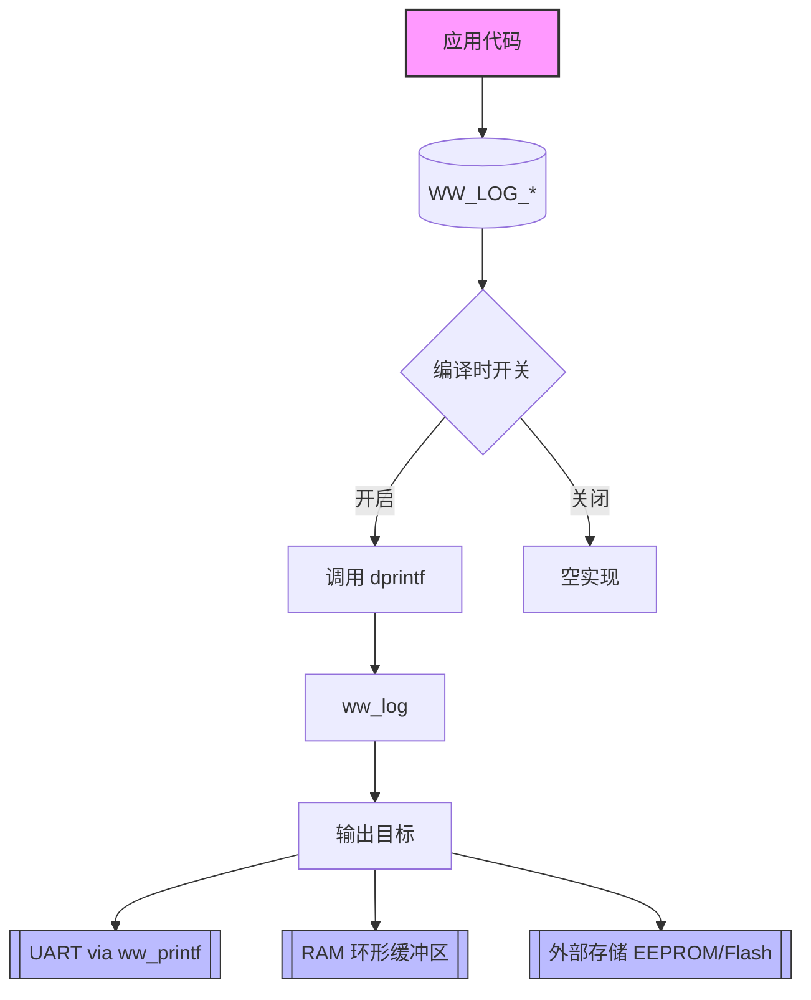
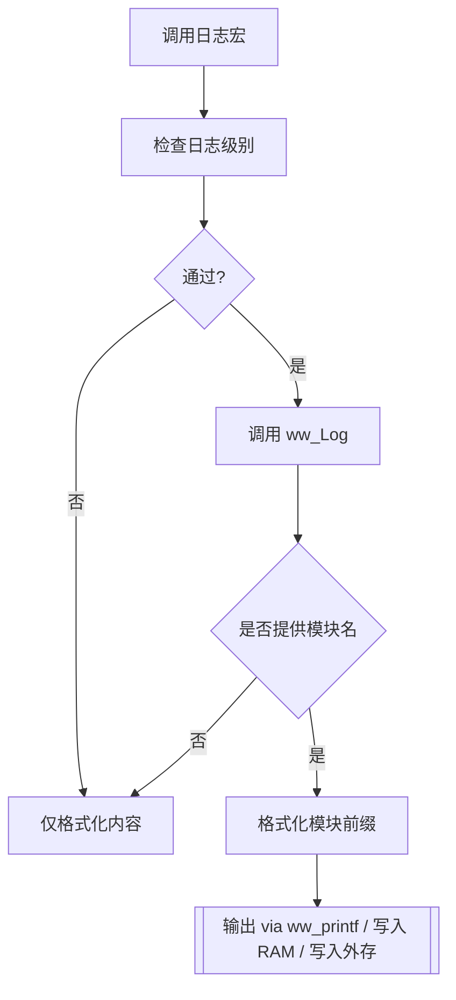

# WW_LOG 模块设计文档

---

## 1. 背景与设计目标

目标：现在日志实现 `str_mode`，采用字符串方式记录，代码模块大且 RAM 占用高。需求提出 `encode_mode`，通过编码方式压缩日志，降低资源消耗。

### 目标：
1. **代码体积**：通过字符串编译链接会使用的字模模块，最大化压缩 flash 占用。
2. **RAM 占用**：编码模式将降低日志记录时的堆栈占用，控制最小占用。
3. **可配置化**：支持常量、字符串、`str_mode` 与 `encode_mode` 两套接口。
4. **动态开关**：按需控制模块的开关，支持运行时动态调整。

---

## 2. 需求概述

| 编号 | 需求描述                               | 类型   |
| ---- | -------------------------------------- | ------ |
| R1   | 支持多种日志级别（ERR/WRN/INF/DBG）    | 功能   |
| R2   | 支持字符串日志记录                     | 功能   |
| R3   | 运行中支持日志开关控制                 | 功能   |
| R4   | 支持 UART、RAM、外部存储等一种输出方式 | 功能   |
| R5   | 多任务安全（可选互斥）                 | 非功能 |
| R6   | 静态与动态开关实现                     | 功能   |
| R7   | 提供统一接口：如 `WW_LOG_XXX`          | 功能   |

---

## 3. 高层架构




---

## 4. 模块划分

| 模块           | 文件         | 说明                                                   |
| -------------- | ------------ | ------------------------------------------------------ |
| 核心日志实现   | `ww_log.c/h` | `ww_Log` 函数、宏定义、断言                            |
| 子模块宏       | `ww_log.h`   | INIT、REG、VDC、IMG_UPG、DFX 等                        |
| 配置宏         | `config.h`   | `CONFIG_WW_LOG_LEVEL_DEFT`、`CONFIG_WW_LOG_MOD_XXX_EN` |
| 对应缓冲区定义 | `ww_log.c`   | `WW_LOG_RAM_T` 结构体及操作函数（可抽象）              |

---

## 5. 接口定义

### 核心函数
```c
/* 核心函数 */
void ww_log(char *vpFun, const char *vpFile, int vFunLen, int vLine,
            int vLevel, const char *fmt, ...);

/* 宏入口实例 */
#define WW_LOG_ERR(...)     dprintf(NULL, WW_LOG_LEVEL_ERR, __VA_ARGS__)
#define WW_INIT_LOG_ERR(...) dprintf("INIT", WW_LOG_LEVEL_ERR, __VA_ARGS__)

#define WW_ASSERT(test, fmt...) \
    do { \
        if(!(test)) { \
            dprintf(NULL, fmt, __VA_ARGS__); \
            SDBBP(); \
        } \
    } while(0)

```

## 6. 数据结构

### 环形缓冲区数据结构（RAM）

```c
typedef struct
{
    U16 logEntryHead;                           // 读取索引
    U16 logEntryTail;                           // 写入索引
    U32 logEntry[WW_LOG_RAM_ENTRY_NUM];         // 日志数据缓冲区
    U32 logHeadId;                              // 分片已记录计数
} WW_LOG_RAM_T;
```

## 7. 日志级别与宏表

| 宏                 | 值   | 说明         |
| ------------------ | ---- | ------------ |
| `WW_LOG_LEVEL_OFF` | 0    | 关闭所有日志 |
| `WW_LOG_LEVEL_ERR` | 1    | 错误级别     |
| `WW_LOG_LEVEL_WRN` | 2    | 警告级别     |
| `WW_LOG_LEVEL_INF` | 3    | 信息级别     |
| `WW_LOG_LEVEL_DBG` | 4    | 调试级别     |

```c
#define WW_LOG_LEVEL_OFF    (0)
#define WW_LOG_LEVEL_ERR    (1)
#define WW_LOG_LEVEL_WRN    (2)
#define WW_LOG_LEVEL_INF    (3)
#define WW_LOG_LEVEL_DBG    (4)
```

## 8. `encode_mode` 实现细节

- **静态缓冲区（用于格式化）**

```c
s_wwLogBufRam[128], s_wwLogBufMod[16], s_wwLogBufFun[32], s_wwLogBufAll[64]
```

- **格式化流程**
  1. 格式化字符串 `vsnprintf` 生成原始日志输出到 `s_wwLogBufRam`
  2. 若提供模块名 `vpMod` ，调用 `ww_strncpy` 限长复制到 `s_wwLogBufMod`
  3. 若提供函数名 `vpFun`，同理复制到 `s_wwLogBufFun`，并凭借形成 `s_wwLogBufAll`:`[mod][level]func(line):msg`
  4. 根据是否有函数名决定最终打印到缓冲区 `bufToPrint`
  5. `ww_printf("%s\n", bufToPrint);` 完成输出

------

## 9. 动态/静态开关实现

### 编译时（静态）

```c
#ifdef CONFIG_WW_LOG_MOD_INIT_EN
#define WW_INIT_LOG_ERR(...) dprintf("INIT", WW_LOG_LEVEL_ERR, __VA_ARGS__)
#else
#define WW_INIT_LOG_ERR(...)
#endif
```

### 运行时（动态）

`dprintf` 内部判断 `level <= CONFIG_WW_LOG_LEVEL_DEFT` ，不满足则直接返回

------

## 10. 多任务安全性

- 所有缓冲区应为 **静态** 无关任务，避免竞争。
- **`ww_log`** 接口调用，在多任务操作共享缓冲区时需增加 **互斥锁** 或 **禁止中断** 防止自点交叉覆盖。

------

## 11. 错误处理与断言

```c
#define WW_ASSERT(test, fmt...) \
    do { \
        if(!(test)) { \
            WW_LOG_ERR(fmt, __VA_ARGS__); \
            SDBBP(); \
        } \
    } while(0)

#define WW_PANIC() WW_ASSERT(0, "panic")
```

> 所有断言应在记录日志后立即调用 `SDBBP()`（调试断点），便于定位。

------

## 12. 使用示例

### API 调用

```c
WW_LOG_ERR("init failed, rc=%d", rc);
WW_INIT_LOG_INF("init success");
```

### `encode_mode` 调用

```c
log_only(0xDEADDEEF);
log_data_1(0x1234, 0x5678);
log_data_2(0x1234, ptx, len);
```

------

## 13. 性能与资源评估

| 项目     | 估算值                                                      | 说明                       |
| -------- | ----------------------------------------------------------- | -------------------------- |
| 代码体积 | ~1.2 KB（未启用断言编译后）                                 | 编译 GCC -O3 优化          |
| RAM 占用 | 176 B（环形缓冲区） = 环形缓冲区 (WW_LOG_RAM_ENTRY_NUM * 4) | 环形缓冲区大小可调整       |
| CPU 占用 | `ww_vsnprintf` 5-10 μs (80 MHz MCU)                         | 仅在日志级别判断通过时使用 |
| 中断影响 | `ww_log` 可用，中断建议只在关键信息中使用                   |                            |

------

## 14. 测试计划

1. **单元测试**
   - 验证宏接口输出
   - 模块名、函数名各缺省情况
2. 边界测试
   - 缓冲区慢、ringbuffer翻转
   - `vFunLen` 超过 `WW_LOG_FUN_SIZE`.
3. 多任务并发
   - 在RTOS环境下并发调用 `ww_log`,检查数据竞争（需外部互斥）
4. 开关验证
   - 编译时关闭子模块，确认宏为空实现
   - 运行时调解 `CONFIG_WW_LOG_LEVEL_DEFT`，验证过滤效果

--------

## 15. 维护与扩展

* **新增子模块**：在 `ww_log.h` 添加对应 `WW_XXX_LOG_YYY` 宏，使用 `dprintf`即可
* **新增输出介质**：在 `ww_log.c`中，`bufToPrint`处理分支中加入对应实现（如网络发送）
* **环形缓冲区扩容**：修改 `WW_LOG_RAM_T` 中 `logEntry` 大小或 `WW_LOG_RAM_ENTRY_NUM` 宏

## 16. 模块志处理流程图

- 新增模块宏
- 扩展缓冲区

------

## 16. 附录：日志处理流程图



------

## 17. 详细算法

1. 入口检查  
   - dprintf 首先比较 level 与 CONFIG_WW_LOG_LEVEL_DEFT，若 level 低于配置阈值则直接返回，不进入 ww_log。
2. 参数提取  
   - vpMod（模块名）若非空，使用 strncpy 拷贝至 s_wwLogBufMod 并在末尾补 \0。  
   - vpFun（函数名）若非空，使用 strncpy 拷贝至 s_wwLogBufFun 并在末尾补 \0。  
   - vFunLen 用于位置信息（函数名长度）检验或截断，防止溢出。
3. 原始日志格式化  
   - 调用 vsnprintf(s_wwLogBufRaw, sizeof(s_wwLogBufRaw), LINESEP_FORMAT_WINDOWS, fmt, ap) 生成用户自定义内容。
4. 组合全信息（字符串模式）  
   - 组装完整输出：如将 wwLogLevelStr[vLevel]、s_wwLogBufFun、vLine、s_wwLogBufRaw（必要时拼接 s_wwLogBufMod）组合到 s_wwLogBufAll。
5. 仅编码参数 vs 字符串模式  
   - encode_mode 下，bufToPrint 指向编码后的数据或 s_wwLogBufRaw；字符串模式下，bufToPrint 指向 s_wwLogBufAll。
6. 输出  
   - ret = （wmsnprintf / vsnprintf）返回值 非零时，调用 ww_printf("%s", bufToPrint)，将日志发送至 UART（或当前输出目标）。  
   - 根据 CONFIG_WW_LOG_SAVE_TO_RAM、CONFIG_WW_LOG_SAVE_TO_FLASH（若定义）选择保存到环形缓冲区或外部存储。
7. 环形缓冲区入队（日志存储）  
   - 更新 logEntryTail、logEntryHead；写入 encoded_log_entry。  
   - 处理环满策略：logEntryTail 追尾时根据策略覆盖或丢弃旧记录。  
   - logEntryHead 前移，记录分片累计计数 logHeadId。
8. 错误处理  
   - 在异常或格式化失败路径返回前，记录 WW_ASSERT，并触发调试断点 SDBBP()。

------

## 18. 配置宏一览

| 宏定义                         | 作用                | 默认值             |
| ------------------------------ | ------------------- | ------------------ |
| `CONFIG_WW_LOG_LEVEL_DEFT`     | 运行时日志级别      | `WW_LOG_LEVEL_ERR` |
| `CONFIG_WW_LOG_MOD_INIT_EN`    | 编译时启用 INIT     | 未定义             |
| `CONFIG_WW_LOG_MOD_REG_EN`     | 编译时启用 REG      | 未定义             |
| `CONFIG_WW_LOG_MOD_VDC_EN`     | 编译时启用 VDC      | 未定义             |
| `CONFIG_WW_LOG_MOD_IMG_UPG_EN` | 编译时启用 IMG_UPG  | 未定义             |
| `CONFIG_WW_LOG_MOD_DFX_EN`     | 编译时启用 DFX      | 未定义             |
| `CONFIG_WW_LOG_SAVE_TO_RAM`    | 保存到 RAM          | 未定义             |
| `CONFIG_WW_LOG_SAVE_TO_FLASH`  | 保存到 Flash/EEPROM | 未定义             |
| `CONFIG_WW_LOG_MAX_ENTRY_NUM`  | 环形缓冲区条目数    | 64                 |

> *注意：所有宏均在项目全局 config.h 中统一管理，修改后需重新编译。*

------

## 19. 集成指南

1. **头文件引用**

   ```
   #include "ww_log.h"
   ```

2. 宏配置

   在 `config.h` 中按需启用/关闭相关子模块宏，例如：

   ```c
   #define CONFIG_WW_LOG_LEVEL_DEFT   WW_LOG_LEVEL_DBG
   #define CONFIG_WW_LOG_MOD_INIT_EN
   #define CONFIG_WW_LOG_SAVE_TO_RAM
   #define CONFIG_WW_LOG_MAX_ENTRY_NUM 128
   ```

3. 初始化（可选）
   清空 RAM/flash 环形缓冲区（实际项目中在系统初始化时调用初始化函数（自行实现），以清除环形缓冲区或恢复持久化状态）。

4.  使用示例

      ```c
      // 记录错误
      WW_LOG_ERR("Failed to open file %s", filename);
      
      // 记录初始化
      WW_INIT_LOG_INF("System init completed");
      
      // encode_mode 直接调用
      log_only(0xDEADBEEF);
      ```

5. 调试

      - 在调试模式下，确认 `SDBBP()` 已映射到调试断点。
      - 使用 `WW_ASSERT` 捕获关键错误。

------

## 20. 未来扩展方向

- 
- | 方向           | 说明                                                         |
  | -------------- | ------------------------------------------------------------ |
  | 网络日志输出   | 在 `ww_log.c` 增加 `#ifdef CONFIG_WW_LOG_NET_EN` 分支，将日志通过 TCP/UDP 发送至采集服务器。 |
  | 可配置日志格式 | 引入格式化配置，支持按需定义的前缀、时间戳、线程 ID 等。     |
  | 多级环形缓冲区 | 为不同日志级别设置独立缓冲区，提升并发效率。                 |
  | 日志压缩存储   | 在 Flash 写入时可选择压缩编码（如 RLE），进一步降低存储占用。 |
  | 日志回读策略   | 实现持久化时的回读校验/回收策略，防止缓冲区永久占满。        |