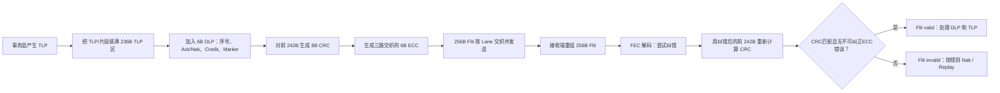

# PCIe FLIT 模式预习：先建立地图，再看字节排布

> 适合对象：刚开始学习通信协议和 PCIe，准备阅读 `01_64_Filt模式_字节排布*` 系列笔记。
>
> 文件名里的 `Filt` 是笔误，正确拼写是 **Flit**。规范中的 Flit 是 **Flow Control Unit**。

## 0. 学完这篇，应该能回答什么

先不要急着记 CRC 多项式或 DLP 位域。读完本预习，至少应该能回答：

1. PCIe 的事务层、数据链路层、物理层分别做什么？
2. TLP、DLLP/DLP、Flit、Ordered Set 是什么关系？
3. 为什么 PCIe 6.x 要把数据装进固定的 256B Flit？
4. `236B + 6B + 8B + 6B` 分别是什么？
5. FEC、CRC、Ack/Nak、Replay 为什么同时存在？
6. NOP TLP、NOP Flit、IDLE Flit为什么不是一回事？
7. 一个 TLP 为什么可以跨多个 Flit，一个 Flit又为什么可以装多个 TLP？

如果这些问题还说不清楚，直接进入 CRC/FEC 数学细节会很容易迷路。

---

# 1. 从“通信协议”开始理解

## 1.1 通信协议是什么

通信协议就是通信双方共同遵守的一套约定，至少要规定：

- **传什么**：地址、命令、数据、状态等；
- **怎么排**：各字段放在哪里、占多少位；
- **什么时候能发**：对端是否有缓冲空间、链路是否准备好；
- **怎么知道发对了**：校验、序号、确认；
- **发错了怎么办**：丢弃、重传、重新训练；
- **如何开始和结束**：链路训练、进入正常传输、低功耗和恢复。

PCIe 不是简单的“几根线传 0 和 1”，而是一整套从软件事务到电信号的分层协议。

## 1.2 PCIe 的三层

| 层次 | 主要关心什么 | 在本章中看到的东西 |
| --- | --- | --- |
| Transaction Layer，事务层 | 要做哪一笔读、写、完成或消息事务 | TLP、流控 Credit、Poisoned 语义 |
| Data Link Layer，数据链路层 | 相邻两个端口之间如何可靠交付 | DLP/DLLP、Sequence Number、Ack/Nak、Replay、CRC |
| Physical Layer，物理层 | 如何在 Lane 上编码、发送、对齐、纠错 | Flit 打包、FEC、Lane 交织、Ordered Set、PAM4 |

可以先用快递类比：

- **TLP**：真正要寄送的业务包裹；
- **DLP/DLLP**：快递站之间的签收、退件和仓库余量通知；
- **CRC**：开箱前核对的完整性封条；
- **FEC**：运输途中包装轻微破损时的现场修补能力；
- **Replay**：修不好或核对失败时重新寄送；
- **Lane**：并行使用的运输通道；
- **Ordered Set**：不属于普通包裹、专门用于维护运输系统的控制信号。

类比只帮助入门，最终仍要回到协议规则。

---

# 2. 先认识物理连接

## 2.1 Port、Link、Lane

- **Port**：一个 PCIe 组件用于连接链路的接口。
- **Link**：两个 Port 之间的点到点连接。
- **Lane**：Link 中最小的双向串行传输通道。
- **Link Width**：一个 Link 使用多少条 Lane，例如 x1、x4、x8、x16。

一个 x16 Link 可以理解为 16 条 Lane 并行工作。Flit 是 **Link-wide** 的数据单元：256 个字节会按规则分布到各条 Lane，而不是在某一条 Lane 上简单地从 Byte 0 串行排到 Byte 255。

## 2.2 GT/s 不是 GB/s

- **GT/s**：每秒多少次传输（Transfer）；
- **Gb/s**：每秒多少 bit；
- **GB/s**：每秒多少 Byte。

三者不能直接画等号。还要考虑 NRZ/PAM4、编码、CRC/FEC 和协议头等开销。

PCIe 6.0 的 64.0 GT/s 使用 PAM4。PAM4 一个符号有 4 个电平，可以表达 2 bit，但电平间距变小，更容易受到噪声影响，因此需要更强的纠错和检错机制。

---

# 3. 最关键的四个数据单位

## 3.1 DW

**DW（Double Word）= 4 Bytes = 32 bits**。

PCIe 的许多包头、长度和对齐规则都以 DW 为单位。例如：

- NOP TLP 是 1DW；
- 常见 TLP Header 是 3DW 或 4DW；
- NOP TLP 一旦开始填充，要填到下一个 4DW 对齐边界或 Flit 边界。

## 3.2 TLP

**TLP（Transaction Layer Packet）** 是事务层的数据包，表达真正的业务事务，例如：

- Memory Read / Memory Write；
- Configuration Read / Write；
- Completion；
- Message。

TLP 通常包含：

```text
----------------+----------------+----------------+
 Header         | Data Payload   | 可选的其他信息 |
----------------+----------------+----------------+
```

在 Flit Mode 中，TLP 的编码和 Non-Flit Mode 不完全相同。阅读 TLP Type 时必须确认自己看的是 **Flit Mode TLP Header Type Encodings**。

## 3.3 DLLP 与 DLP

**DLLP（Data Link Layer Packet）** 是数据链路层控制包，常用于：

- 流控 Credit 更新；
- Ack/Nak；
- 电源管理等链路控制。

在 Flit Mode 中，每个 256B Flit 固定留出 **6B DLP Bytes**。它们复用了大部分 DLLP 机制，又增加了适合 Flit Mode 的信息，例如：

- Flit Usage；
- Prior Flit was Payload；
- Replay Command；
- 10-bit Flit Sequence Number；
- DLLP Payload / Optimized Update FC / Flit Marker。

因此不要简单理解成“DLP 就是把老 DLLP 原封不动塞进去”。更准确地说，DLP 是 Flit 中固定的数据链路控制槽，其中一部分可以承载传统 DLLP 风格的 Payload。

## 3.4 Flit

**Flit（Flow Control Unit）** 是 Flit Mode 下固定大小的传输和错误恢复单元。

PCIe Standard 256B Flit 的布局是：

```text
----------------------+--------+----------+--------+
 TLP Bytes            | DLP    | CRC      | ECC    |
 Byte 0..235          |236..241|242..249  |250..255|
 236B                 | 6B     | 8B       | 6B     |
----------------------+--------+----------+--------+
             总计 256 Bytes
```

| 区域        |   大小 | 作用                               |
| --------- | ---: | -------------------------------- |
| TLP Bytes | 236B | 装一个或多个 TLP，也可能装某个跨 Flit TLP 的一部分 |
| DLP Bytes |   6B | 序号、Ack/Nak、Credit、状态标记等链路控制      |
| CRC Bytes |   8B | 对前 242B，也就是 TLP + DLP，做强完整性检查    |
| ECC Bytes |   6B | 三路交织 FEC 所使用的纠错码字节               |

必须建立两个观念：

1. **一个 Flit 可以装多个 TLP。**
2. **一个较大的 TLP 可以跨多个 Flit。**

所以 TLP 和 Flit 不是一一对应关系。

---

# 4. 为什么需要 Flit Mode

## 4.1 Non-Flit Mode 的基本思路

在传统 Non-Flit Mode 中：

- TLP 是变长的；
- DLLP 也是独立传输的包；
- 物理层需要识别 TLP、DLLP、Ordered Set 以及它们的边界；
- 每个 TLP 有自己的 Sequence Number 和 LCRC；
- 出错后主要按 TLP 重放。

这套方法在较低速率下工作良好，但到了 PCIe 6.0 的 PAM4 高速链路，错误更容易呈现短突发形式，而且变长包的定界、逐包校验和重传开销更难兼顾低延迟与高带宽效率。

## 4.2 Flit Mode 的思路

Flit Mode 把数据组织成固定的 256B 单元：

- 固定边界便于硬件流水线处理；
- 多个小 TLP 可以共享一份 DLP/CRC/ECC 开销；
- FEC 可以先修复短突发错误；
- CRC 对纠错后的内容做最终检查；
- 仍有问题时按 Flit 做 Replay；
- DLP 固定存在，Ack/Nak/Credit 等控制信息可以随 Flit 传输。

一句话记忆：

> Flit Mode 用“固定装箱 + 先纠错 + 再校验 + 必要时重传”适应更高速、误码形态更复杂的链路。

---

# 5. 一个 Flit 是怎样生成和接收的



这里最重要的是接收顺序：

1. 收齐并重组 Flit；
2. **FEC 先尝试纠错**；
3. 使用纠错后的前 242B 计算 CRC；
4. CRC 匹配且 ECC 组没有报告不可纠正错误，Flit 才是 valid；
5. invalid Flit 可能触发 Nak 和 Replay。

FEC 和 CRC 不是重复设计：

- FEC 负责“尽量修”；
- CRC 负责“严格验”；
- Replay 负责“修不好就重发”。

---

# 6. 读 TLP Bytes 笔记前必须知道的规则

## 6.1 为什么 236B 必须填满

Flit Mode 不使用 STP token 来标出每个 TLP 的开始。固定的 236B TLP 区不能留成“没有定义的空洞”，事务层即使没有真实 TLP，也要用 **NOP TLP** 填充。

接收端依靠 TLP Header 中预定义位置的类型、长度等信息，一个接一个地解析边界。

## 6.2 NOP TLP

NOP TLP 是 1DW 的特殊 TLP：

- 不承载事务语义；
- 不消耗 Credit；
- 接收端不需要为它分配事务缓冲区；
- 用于填充 TLP Bytes 中暂时没有真实 TLP 的位置。

一旦开始调度 NOP TLP，要继续填到：

- 下一个 4DW 对齐边界；或
- 当前 Flit 边界；

二者中先到的位置。

## 6.3 每半个 Flit 最多 8 个 non-NOP TLP

计数范围是：

- 第一半：Flit Byte 0..127；
- 第二半：Flit Byte 128..235。

每半最多 8 个 non-NOP TLP，**partial TLP 也计数**。一个 TLP 可以跨过两个 half，但它会在两个 half 中都被计入。

可以把这理解为给接收端并行解析硬件设置复杂度上限：在一个固定处理窗口里，不能要求它识别无限多的小 TLP 边界。

## 6.4 跨 Flit 的 TLP

例如一个 TLP 在 Flit A 中只放下前半部分：

```text
Flit A: [其他TLP][大TLP的开头........................]
Flit B: [大TLP的后续........][下一个TLP][NOP...]
```

接收端根据已经解析出的 TLP 长度，知道 Flit B 开头是前一个 TLP 的延续，而不是新 TLP。

跨 Flit TLP 可能被 SKP、NOP Flit、Recovery 等打断。发送端应尽量避免这种中断以优化延迟，但接收端必须能够处理。

---

# 7. 三个最容易混淆的“空”

| 名称 | 所在层次/位置 | 是否有真实 TLP | 是否推进 Payload Sequence | 主要用途 |
| --- | --- | --- | --- | --- |
| NOP TLP | 236B TLP Bytes 内 | 否 | 取决于它所在的整个 Flit 类型 | 填满 TLP 区并维持可解析边界 |
| NOP Flit | 整个 256B Flit 的分类 | 否，TLP 区没有 normal TLP | 不消耗新的 Payload Flit 序号 | L0 正常阶段无业务时继续携带最新 DLP 控制信息 |
| IDLE Flit | 整个 256B Flit 的分类 | 否 | Sequence Number = 0 | Data Stream 开始时进行 Flit/序号握手 |

关键区别：

- **IDLE Flit** 只用于建立正常 Flit 交换前的握手；
- 进入 L0 并出现第一个 valid non-IDLE Flit 后，不能再拿 IDLE Flit 表示普通空闲；
- 正常运行中没业务，使用 **NOP Flit**；
- NOP Flit 的 TLP 区中，本质上是没有 normal TLP 的占位内容，而 **NOP TLP** 是 TLP 区内部的 1DW 填充单元。

---

# 8. 读 DLP 笔记前的概念

## 8.1 Credit：先确认对方有地方放

PCIe 使用基于 Credit 的流控。

接收端告诉发送端：“我的某类缓冲区还有多少空间。”发送端只有拥有足够 Credit，才能发送相应的 TLP，避免把接收端缓冲区冲爆。

常见缩写：

- **P（Posted）**：发送请求后通常不需要 Completion，例如 Memory Write；
- **NP（Non-Posted）**：发送后需要 Completion，例如 Memory Read；
- **Cpl（Completion）**：对 Non-Posted 请求的完成响应；
- **H（Header Credit）**：包头缓冲资源；
- **D（Data Credit）**：数据缓冲资源；
- **VC（Virtual Channel）**：在同一物理链路上划分的逻辑流量通道。

不要把 Credit 理解为“带宽额度”。它首先表示 **接收缓冲区容量的许可**。

## 8.2 Sequence Number

Payload Flit 使用 10-bit Sequence Number：

- 正常 Payload 序号范围是 1..1023；
- 0 专用于 IDLE Flit；
- 1023 后回到 1；
- NOP Flit不消耗新的 Payload 序号；
- 未被 Ack 的 Payload Flit保存在 TX Retry Buffer 中。

## 8.3 Ack、Nak、Replay

- **Ack**：到某个序号为止的数据已经正确收到；
- **Nak**：检测到缺失或错误，请发送端重放；
- **Replay**：从 TX Retry Buffer 重新发送。

两种 Nak 的直觉：

- **Standard Nak**：从断点之后，把所有未确认 Payload Flit 重发；
- **Selective Nak**：只补缺失的那个 Flit，后面已正确收到的 Flit先存在 RX Retry Buffer。

Selective Nak 更省带宽，但接收端状态和缓冲管理更复杂；连续错误、缓冲不足等情况下可以退回 Standard Nak。

## 8.4 Prior Flit was Payload 为什么存在

如果当前 Flit 已经损坏，它自己的 DLP 也不可信，接收端可能不知道坏的是 Payload Flit还是不需要重传的 NOP Flit。

下一个 valid Flit 中的 `Prior Flit was Payload` 可以说明前一个 Flit 是否载有 Payload：

- 0：前一个是 IDLE/NOP，可避免无意义重传；
- 1：前一个是 Payload，需要按规则 Nak/Replay。

这是一个很典型的协议设计：让后一个健康单元帮助判断前一个损坏单元的性质。

---

# 9. Poisoned、Nullified 与 Flit_Status

## 9.1 Poisoned

Poisoned 表示：

- 这笔 TLP 仍然是一笔存在的事务；
- 但其数据被标为不可信；
- 接收方继续按 poisoned data 的协议语义处理和上报。

可类比为：“文件仍然交付，但盖了‘内容有问题’的章。”

## 9.2 Nullified

Nullified 表示：

- 这笔已经进入发送路径的 TLP 被作废；
- 接收端不把它交给事务层生效；
- 如果 Flit 本身 valid，仍要释放它原先占用的 Credit，避免 Credit 永久丢失。

可类比为：“订单取消，不交付，但仓库和账本要正确收尾。”

## 9.3 为什么还需要 DLP 中的 Flit_Status

TLP Header 中虽然有 EP 等状态，但 Flit_Status 还解决了 Flit 打包层面的事情：

- TLP 可能跨多个 Flit；
- Poison/Nullify 可能在 TLP Header 已经发出后才被确定；
- 链路层需要知道当前 Flit 中最后结束的 TLP 是否被标记；
- 被 EDB/Poisoned 的 TLP 后面直到 Flit 结束只能放 NOP TLP，避免状态和边界歧义。

因此 TLP 状态字段和 Flit_Status 所处层次不同，不能简单认为重复。

---

# 10. CRC、FEC、ECC：三个词不要混

## 10.1 CRC

CRC 用于高强度**检错**：

- 输入：TLP 236B + DLP 6B，共 242B；
- 输出：8B CRC；
- 接收端在 FEC 纠错后重新计算；
- 任一 CRC Byte 不匹配，Flit 不能被当成 valid。

这里的 8B CRC 不要理解成“8 个普通 CRC-8”，也不要直接套用常见 CRC-64 参数。规范定义的是在 `GF(2^8)` 上按字节符号运算的生成多项式，并给出规范矩阵/参考实现。

初学阶段只需掌握：

> CRC 不负责修数据，只负责非常可靠地判断“纠错后的内容是否可信”。

## 10.2 FEC 与 ECC

- **FEC（Forward Error Correction）**：前向纠错这套机制；
- **ECC（Error Correcting Code）**：实现纠错所使用的码和 6B 校验符号。

可以理解为：

- FEC 是“现场修复制度”；
- ECC 是“用于现场修复的编码工具”。

## 10.3 三路交织

PCIe 的 Flit FEC 是 **3-way interleaved ECC**：

- Flit 字节按规则交织到 3 个 ECC group；
- 每组有 2B ECC，共 6B；
- 每个 codeword 能纠正 1 个 Byte error；
- 交织把同一条 wire 上的连续短突发错误分散到不同 codeword；
- 规范保证一条 wire 上长度不超过 16 bit 的 burst 不会让同一个 codeword 中超过一个 symbol 受影响。

注意，“ECC 保护整个 Flit”不应理解成发送端循环地“用 ECC 计算 ECC 自己”。更准确的理解是：

- 发送端根据各组信息符号生成 check/parity 符号；
- 接收端把信息符号与收到的 ECC 符号共同看作完整 codeword 来计算 syndrome；
- 因此 ECC 字节自身发生错误也可以被检测或纠正。

## 10.4 为什么 FEC 后还需要 CRC

FEC 的单字节纠错能力有限，也可能遇到：

- 同一 codeword 多字节错误；
- 无法纠正的错误；
- 误纠；
- CRC Byte 自身受损。

因此接收端采用：

```text
FEC 尝试纠错
    ↓
CRC 检查纠错后的 TLP + DLP
    ↓
通过：接收
失败：Nak / Replay
```

---

# 11. Ordered Set 在这组笔记中的位置

**Ordered Set（OS，有序集）** 不是 TLP，也不是普通 Flit Payload。它用于链路训练、对齐、时钟补偿、电气空闲和 Recovery 等物理层维护。

在 Flit Mode Data Stream 中：

- SKP OS 周期性出现，用于时钟补偿等；
- EIOS 用于结束 Data Stream 并准备进入低功耗；
- EIEOS 用于结束 Data Stream 并进入 Recovery；
- EIOS/EIEOS 只能在预定的 SKP 时隙替代 SKP，不能随意插进 Flit 数据；
- 接收端只在预期的 OS 时隙检测这些序列。

这解释了规范 `4.2.3.4.5 Ordered Set insertion` 为什么紧跟 TLP/DLP/CRC/ECC：固定 Flit 流仍然需要物理层维护信号，但插入位置必须受严格约束，不能破坏 Flit 边界和解释节奏。

---

# 12. 建议的阅读顺序

## 第一步：只看全局结构

先读：

1. [[01_02_pcie概述]]
2. [[01_63_Flit模式_数据流]]

目标：

- 记住三层；
- 记住 `236 + 6 + 8 + 6 = 256B`；
- 理解发送端与接收端的处理顺序；
- 暂时跳过 CRC/ECC 数学推导。

## 第二步：看 TLP 怎么装箱

读：

3. [[01_64_Filt模式_字节排布_TLP]]

重点只抓：

- 一个 Flit 多个 TLP；
- 一个 TLP 跨多个 Flit；
- NOP TLP 填充；
- 4DW 对齐；
- 每 half 最多 8 个 non-NOP TLP；
- Poisoned/Nullified 后的填充规则。

## 第三步：看链路如何可靠运行

读：

4. [[01_64_Filt模式_字节排布_DLP]]

重点只抓：

- 三种 Flit：IDLE、NOP、Payload；
- Sequence Number；
- TX/RX Retry Buffer；
- Ack、Standard Nak、Selective Nak；
- Credit；
- Prior Flit was Payload。

第一次阅读不必背所有 DLP bit 位。

## 第四步：看“先修、再验”

读：

5. [[01_64_Filt模式_字节排布 CRC]]
6. [[01_64_Filt模式_字节排布_FEC]]

第一遍的目标：

- CRC 保护前 242B；
- FEC 使用 3 路交织；
- 接收端先 FEC、后 CRC；
- 修不好或 CRC 不匹配才进入 Replay。

GF(2^8)、α、生成矩阵、log/antilog table 可以放到第二遍。

## 第五步：补 Data Stream 中的 OS

读：

7. [[01_62_Flit模式_数据流中OS]]

目标是知道 Flit 之外还有周期性的物理层维护时隙，并理解 SKP/EIOS/EIEOS 不会随意破坏 Flit 流。

---

# 13. 读 01_64 系列时的五条主线

每看到一个新字段，都可以问它属于下面哪条主线：

1. **装箱**：TLP 如何填进固定 236B？
2. **流控**：对端有空间接收吗？
3. **排序与确认**：这是第几个 Payload Flit，对端收到哪里了？
4. **错误处理**：能否用 FEC 修复，CRC 是否通过，是否需要 Replay？
5. **链路维护**：何时插入 OS、何时空闲、何时进入 Recovery？

如果一个细节暂时放不进这五条主线，先标记，不要孤立死记。

---

# 14. 初学者最容易踩的坑

1. **把 TLP 和 Flit 当成一一对应。**  
   实际上一个 Flit 可装多个 TLP，一个 TLP 也可跨多个 Flit。

2. **把 NOP TLP、NOP Flit、IDLE Flit当成同一个“空”。**  
   它们所在层次、使用阶段和序号规则不同。

3. **认为 FEC 能保证所有错误都被修好。**  
   FEC 能力有限，所以必须用 CRC 兜底，并保留 Replay。

4. **认为 CRC 失败就一定是 TLP 数据坏了。**  
   DLP 或 CRC 字节本身损坏也可能导致失败。

5. **把 Credit 当作速率或带宽配额。**  
   Credit 主要表示接收端缓冲资源许可。

6. **认为 Nak 重传的是单个 TLP。**  
   Flit Mode 的 Retry/Replay 管理单位是 Payload Flit。

7. **认为 Replay 时 256B 全部原样重发。**  
   TLP 相关内容需要重放，但 Ack/Nak、Credit 等动态 DLP 信息要反映当前状态，CRC/ECC 也必须据此重新生成。

8. **第一遍就钻进 GF(2^8) 公式。**  
   先理解输入、输出、保护范围和处理顺序，再学数学实现。

---

# 15. 一页速记

```text
PCIe 三层：
  Transaction：产生 TLP，表达读/写/完成/消息
  Data Link：Credit、Sequence、Ack/Nak、Replay、CRC
  Physical：Flit、Lane 交织、FEC、Ordered Set、PAM4

256B Flit：
  236B TLP + 6B DLP + 8B CRC + 6B ECC

发送：
  TLP 装箱 -> 加 DLP -> 算 CRC -> 算 ECC -> 分布到 Lane

接收：
  Lane 重组 -> FEC 纠错 -> CRC 检查 -> 处理 DLP/TLP
                            |
                            +-> 失败则 Nak / Replay

空数据：
  NOP TLP  = TLP 区内的 1DW 填充
  NOP Flit = L0 正常运行但无 Payload，可继续带 DLP
  IDLE Flit= Data Stream/序号握手阶段，seq=0

可靠性：
  Credit 防止接收 Buffer 溢出
  Sequence 标识 Payload Flit 次序
  Ack 表示收到
  Nak 表示有缺口/错误
  Replay 从 Retry Buffer 重发
```

---

# 16. 自测题

## 问题

1. 为什么 Flit 的 TLP 区没有真实 TLP 时不能简单“什么都不放”？
2. 为什么一个 TLP 可以跨 Flit？
3. 为什么 NOP Flit 不推进新的 Payload Sequence Number？
4. 为什么坏掉的 Flit 之后还要看下一个 valid Flit 的 `Prior Flit was Payload`？
5. 为什么先 FEC 再 CRC，而不是反过来？
6. 为什么 Nullified TLP 被忽略后仍要释放 Credit？
7. Selective Nak 比 Standard Nak 节省了什么，又增加了什么成本？
8. CRC 保护哪些字节？ECC 字节有多少？

## 参考答案

1. Flit Mode 没有 STP token 标记每个 TLP 的开始，236B 区必须按规则填满，接收端才能持续解析边界。
2. TLP 是变长事务包，Flit 是固定 256B 容器；较大 TLP 自然可能装不进一个 Flit。
3. 它没有发送新的业务 Payload，不应让接收端期待一个实际不存在的新 Payload 序号。
4. 当前坏 Flit 的 DLP 不可信；下一个健康 Flit 可以帮助判断前一个坏的是 Payload 还是无须重传的 NOP。
5. FEC 先修正可纠正的线路错误，CRC 再验证修正结果是否可信；反过来会把本可修好的错误先判失败。
6. 发送端调度它时已经消耗了接收缓冲 Credit；不释放会造成 Credit 泄漏，最终可能阻塞链路。
7. 它只补缺失 Flit，节省重传带宽；代价是接收端需要 RX Retry Buffer 和更复杂的乱序暂存状态。
8. CRC 保护 Byte 0..241，即 236B TLP + 6B DLP；ECC 共 6B。

---

# 17. 对应规范位置

- PCI Express Base Specification Revision 6.2，§4.2.3.4 Bytes in Flit Layout
- [[NCB-PCI_Express_Base_6.2.pdf#page=400|§4.2.3.4.1 TLP Bytes in Flit，PDF p.400]]
- [[NCB-PCI_Express_Base_6.2.pdf#page=403|§4.2.3.4.2 DLP Bytes in Flit，PDF p.403]]
- [[NCB-PCI_Express_Base_6.2.pdf#page=430|§4.2.3.4.3 CRC Bytes in Flit，PDF p.430]]
- [[NCB-PCI_Express_Base_6.2.pdf#page=431|§4.2.3.4.4 ECC Bytes in Flit，PDF p.431]]

第一次预习不要求背规范位域和公式。先能用自己的话讲清楚下面这句话即可：

> PCIe Flit Mode 把一个或多个 TLP 装入固定的 256B Flit，用 DLP 携带链路控制，用 FEC 修复短突发错误，用 CRC 验证修复后的内容，并在仍然出错时按 Flit 进行 Replay。
