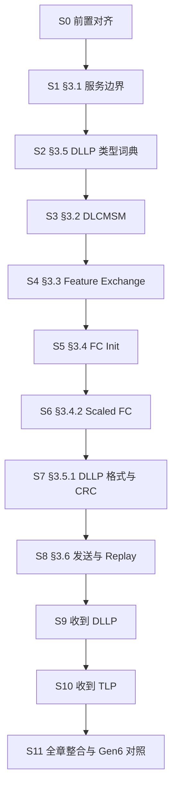

> [!abstract] 本章入口
> 这是 PCIe Base Specification 5.0 Rev 1.0 第 3 章 Data Link Layer 的个人学习入口。
> 权威来源：[[gen5_chap3.pdf]]（PDF p.1–36 = Spec p.209–244）；完整规范见 [[NCB-PCI_Express_Base_5.0r1.0-2019-05-22.pdf]]。

# 1. 内容为什么分成三层

| 层 | 目录 | 回答的问题 | 使用方式 |
|---|---|---|---|
| **细节笔记** | `10_学习笔记/` | Spec 写了什么、在哪一节、边界条件是什么 | 查规则、逐条复核 |
| **独立讲义** | `20_独立讲义/` | 为什么这样设计、状态如何连起来、遇到场景怎么推 | 连续学习、复述、做题 |
| **历史稿** | `90_历史稿/` | 早期 Gen6 视角和旧草稿 | 只作版本追溯，不作为 Gen5 结论来源 |

> [!important] 平衡原则
> 参考笔记和“教会一个人”的材料目标不同。参考笔记应短、精确、可定位；讲义则必须允许重复、类比、推演和反例。
> 因此这里不强迫一份文件同时承担两种任务，而是让两层通过双向链接互相校验。

# 2. 推荐学习路线

## 第一遍：先建立整章骨架

1. [[讲义00_学习路线与掌握标准]]
2. [[讲义01_从LinkUp到DL_Active]]
3. [[讲义02_DLLP与信用协议]]
4. [[讲义03_TLP可靠传输与Replay]]
5. [[讲义04_接收判定_计时器与调试]]
6. [[01_3c_全链路推演.canvas|全链路推演 Canvas]]

## 第二遍：按 S0–S11 查细节



| 站 | 笔记 | 学习 Canvas | Spec |
|---|---|---|---|
| S0 | [[01_30_S0_前置对齐]] | [[01_30_S0_地图.canvas\|概念地图]] | 前置 |
| S1 | [[01_31_S1_数据链路层概述]] | [[01_31_S1_四条路径.canvas\|四条路径]] | §3.1 |
| S2 | [[01_32_S2_DLLP初识]] | [[01_32_S2_编码解码器.canvas\|编码解码器]] | §3.5 前半 |
| S3 | [[01_33_S3_DLCMSM]] | [[01_33_S3_一次开机.canvas\|一次开机]] | §3.2 |
| S4 | [[01_34_S4_数据链路特性交换]] | [[01_34_S4_一个bit握手.canvas\|一个 bit 握手]] | §3.3 |
| S5 | [[01_35_S5_流控初始化]] | [[01_35_S5_两阶段握手.canvas\|两阶段握手]] | §3.4–3.4.1 |
| S6 | [[01_36_S6_ScaledFC]] | [[01_36_S6_移位.canvas\|缩放与移位]] | §3.4.2 |
| S7 | [[01_37_S7_DLLP详解]] | [[01_37_S7_格式画廊.canvas\|格式画廊]] | §3.5–3.5.1 |
| S8 | [[01_38_S8_数据完整性_发送端]] | [[01_3c_全链路推演.canvas\|全链路推演]] | §3.6.1–3.6.2.1 |
| S8 专题 | [[01_38_S8_专题_序号环与ACKD_SEQ复位]] | （组库 `01_35_00_…_实例.canvas`） | Eq 3-1 / Fig 3-18 / §3.6.3.1 的四处 mod 4096，含反例推演 |
| S9 | [[01_39_S9_数据完整性_收DLLP]] | [[01_3c_全链路推演.canvas\|全链路推演]] | §3.6.2.2 |
| S10 | [[01_3a_S10_数据完整性_接收端]] | [[01_3c_全链路推演.canvas\|全链路推演]] | §3.6.3–3.6.3.1 |
| S11 | [[01_3b_S11_全章整合]] | [[01_3c_全链路推演.canvas\|全链路推演]] | 整合/版本对照 |

# 3. 整章只抓两条主线

```text
启动闭环：Physical LinkUp → [Feature] → FC_INIT1 → FC_INIT2 / DL_Up → DL_Active
可靠闭环：credit 放行 → Seq + LCRC → Retry Buffer → 校验/排序 → Ack 或 Nak → 清理或 Replay
公共语言：6-Byte DLLP（Feature、Init/UpdateFC、Ack/Nak、PM、NOP、Vendor）
```

启动闭环回答“链路何时有资格工作”；可靠闭环回答“开始工作后如何保证一跳不丢、不错、不乱序”。
Flow Control 管“能不能再发新事务”，Replay 管“已发事务要不要重来”，两套账本不能混为一谈。

# 4. 这次校正过的高风险结论

| 易错说法 | 正确结论 |
|---|---|
| 一个 Lane 是“一对差分线” | 一个 Lane 有 **TX、RX 两个单向差分对** |
| 完成 Feature 和 FC 后才拉 `DL_Up` | `DL_Up` 在 **FC_INIT2** 已拉高，早于 `DL_Active` |
| 每一种 DLLP 都周期重发、都是绝对状态 | 不同类型分别靠周期重发、累计覆盖或 Replay Timer 兜底 |
| Gen5 FC 格式图没画 Scale | Figure 3-7/8/9 **明确画出** HdrScale/DataScale |
| Figure 3-12 没画 Feature Ack | 明确位于 **Byte 1 bit[7]** |
| DLLP CRC 图只输入 Byte 0–2 | CRC 覆盖 **Byte 0–3**；图中省略号包含 Byte 3 |
| Equation 3-1 左式就是在途数量 | 左式 = **未确认数量 + 1**；保护条件下实际未确认上限 2047 |
| replay 再次消耗 credit | 同一 TLP 第一次发送前已通过 FC gating；replay 不再次扣 credit |
| `NAK_SCHEDULED=1` 时任何 Ack 都不发 | 只挡常规时延 Ack；**重复 TLP 仍触发 Ack** |
| Ack/Nak timer 从“最后发包”计 | 概念 timer 在安排 Ack/Nak 时重启；合规测量另从 Port 收到 TLP 最后 Symbol 开始 |
| Gen6 FC bit[3] 是第 4 个 VC 位 | Gen6.2 中 `0=Shared FC`、`1=Dedicated FC`，VC 仍为 bit[2:0] |

# 5. 仍然需要保留为“未知”的问题

1. Gen5 本章要求 InitFC 按 P → NP → Cpl 的相对顺序发送，但没有解释为何选择这个顺序。可以提出设计猜想，必须标成推测。
2. Ack Latency 表里 MPS ≥ 512 时 x8=x16、x12 更大，已确认是规范原表；本章没有给出推导，不应按直觉改表或杜撰原因。
3. Credit 的分配、消耗和回收语义主要在 §2.6；第 3 章只规定初始化和 DLLP 传输接口。

# 6. 掌握判据

不看笔记能完成以下任务，才算真正掌握：

- 画出 DLCMSM 与 FC_INIT1/2 的嵌套关系，并指出 `DL_Up` 的时刻。
- 从一个 FC DLLP 的 Byte 0 解出家族、P/NP/Cpl 与 VC。
- 给定 `ACKD_SEQ`、`NEXT_TRANSMIT_SEQ` 和一个 Ack/Nak 序号，按模 4096 规则判断合法性。
- 推演一次“丢 TLP”、一次“丢 Ack”、一次“丢 Nak”，说清最终怎样自愈。
- 解释 Flow Control credit 与 Retry Buffer 为什么不能合并成一套账。
- 解释 `NAK_SCHEDULED` 的正常抑制路径和重复包 Ack 例外。
- 区分概念 timer、规范阈值和 Port 处合规测量区间。

## 相关笔记

- [[MOC - PCIe]]
- 历史 Gen6 资料只作版本追溯：[[01_20_数据链路层_3.1-3.2_讲义]]、[[01_21_数据链路层_3.5_DLLP_讲义]]、[[DLL_DLLP]]、[[DLL_DLCMSM]]、[[01_64_Flit模式_预习]]
