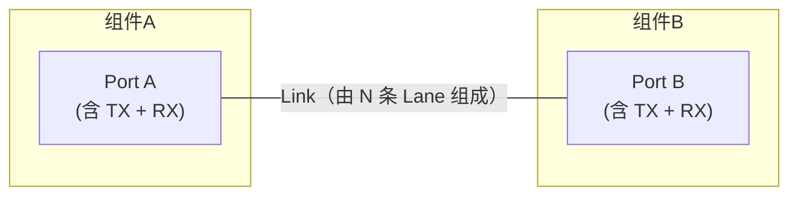
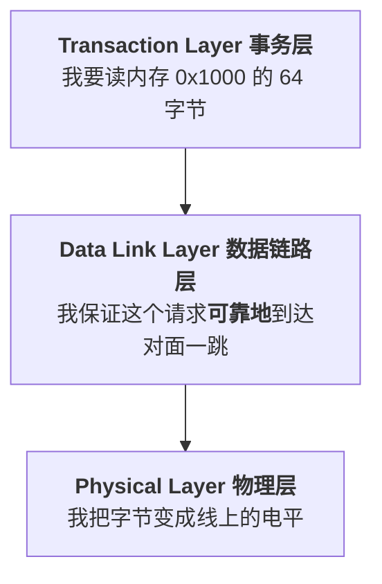
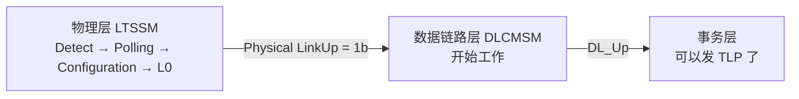

> [!abstract] 这一站要解决的问题
> 在翻开 Gen5 Spec 第 3 章第一页之前，把「读这一章需要的最小知识」补齐，并且**把 Gen6 Flit Mode 的包袱卸掉**。
> 这一站不对应任何 spec 章节，是我自己的脚手架。
>
> 📋 配套看板：[[01_30_S0_地图.canvas]] —— 把本站 5 块内容画成一张概念地图，**建议先看图再读文**。

![[01_30_S0_地图.canvas]]

# 0. 先卸包袱：Gen5 没有 Flit Mode

我上一轮是从 **Gen6** 学的，最大的困惑来源是：Gen6 的第 3 章里每一条规则都要分两种模式讲一遍，
「Non-Flit Mode 时……，Flit Mode 时……」，我根本分不清哪句话属于哪个世界。

Gen5 里这个问题**根本不存在**：

> [!important] Gen5 只有一种模式
> Gen5 spec 第 3 章里**一次都没有出现 Flit / DLP / FEC 这些词**。
> Gen6 里被称作「Non-Flit Mode」的那一套，在 Gen5 就是**唯一的一套**，所以 Gen5 根本不需要给它起名字。

所以从 Gen5 学的时候，凡是我脑子里冒出「那 Flit Mode 呢？」，正确反应是：**先记下来，别现在处理**。
这些问题统一留到最后一站 [[01_3b_S11_全章整合|S11（Gen5 → Gen6 差异对照）]] 再一次性回答。

| 我在 Gen6 学过的概念 | Gen5 里的状态 |
|---|---|
| Flit（256B 定长帧） | ❌ 不存在 |
| DLP bytes（Flit 里的固定链路控制区） | ❌ 不存在 |
| Optimized_Update_FC / Flit_Marker | ❌ 不存在 |
| NOP2 DLLP | ❌ 不存在（只有 NOP） |
| FEC（前向纠错） | ❌ 不存在 |
| L0p / Link Management DLLP | ❌ 不存在 |
| DLLP 是独立的 6 字节包 | ✅ **就是 Gen5 的全部** |
| Ack / Nak / Replay 重传机制 | ✅ 是 Gen5 的核心 |

---

# 1. 物理连接：Port、Link、Lane

这三个词在 spec 里到处出现，混淆了后面全读不懂。

| 术语 | 定义 | 记忆抓手 |
|---|---|---|
| **Lane** | 两对单向差分信号：一个 TX 差分对 + 一个 RX 差分对（共 4 根线） | 最小的全双工物理通道单位 |
| **Link** | 连接**恰好两个**组件的一组 Lane（x1/x2/x4/x8/x16） | 一条 Link 只有两端，没有第三方 |
| **Port** | 一个组件上负责一条 Link 的那套收发逻辑 | Port 是「插口」，Link 是「线」 |

> [!important] 整章最重要的一句前置 ^one-hop
> **一条 Link 只连接两个直接相邻的组件。**
>
> 数据链路层的所有行为——Ack/Nak、Flow Control、DLLP——**全部只发生在这一跳之内**。
> Switch 收到 DLLP 后不会转发它，而是自己处理掉，然后在它的另一个 Port 上重新做一遍数据链路层的工作。

## 1.1 每个 Port 同时是发送方也是接收方 ^port-both-directions

这一点后面会反复咬人。读 3.6 的时候，spec 会分别写「TLP Transmitter 的规则」和「TLP Receiver 的规则」，
**这两套规则同一个 Port 都要实现**，因为它同时在收也在发。

一个 Port 内部同时跑着：

- **发送侧**：给 TLP 打序号、算 LCRC、存进 Retry Buffer、等对方 Ack
- **接收侧**：检查收到 TLP 的 LCRC 和序号、决定回 Ack 还是 Nak

所以「A 给 B 发 Ack」和「B 给 A 发 Ack」是两条**互不相干**的逻辑，各自有各自的计数器。

## 1.2 Upstream Port 和 Downstream Port

spec 里 §3.2.1 会用到这对词，先认识一下：

| 名称 | 指的是 | 例子 |
|---|---|---|
| **Downstream Port** | 朝**远离 Root Complex** 方向、往下游接设备的口 | Root Port、Switch 的下游口 |
| **Upstream Port** | 设备自己朝**上游（往 Root Complex）**的口 | Endpoint 的口、Switch 的上游口 |

> [!tip] 一句话
> **Downstream Port 是「主人」，Upstream Port 是「客人」。** 同一件事（链路断了）对两者的含义不同，S3 会详细讲。

---

# 2. 数据单位：Bit、Byte、DW、Symbol

| 单位 | 大小 | 在第 3 章里用来量什么 |
|---|---|---|
| **Byte** | 8 bit | DLLP 的长度（固定 6 Byte）|
| **DW**（Double Word） | 4 Byte = 32 bit | TLP Header 的长度、Data Payload 的长度、**1 个 data credit = 4 DW** |
| **UI**（Unit Interval） | 传 1 个 bit 的时间 = 1 / 速率 | 换算 Symbol Time 用 |
| **Symbol** | 8b/10b 时代 = 1 字节编码后的 **10 bit**；128b/130b 时代 = **8 bit** | 第 3 章末尾的 Ack Latency 表用 **Symbol Time** 做单位 |
| **Symbol Time** | 传输一个 Symbol 所需的时间 | 见下表 |

## 2.1 Symbol Time 换算表（我自己算的，S10 要用）^symbol-time-table

| 速率 | 编码 | 1 UI | 1 Symbol | **1 Symbol Time** |
|---|---|---|---|---|
| 2.5 GT/s | 8b/10b | 0.4 ns | 10 UI | **4 ns** |
| 5.0 GT/s | 8b/10b | 0.2 ns | 10 UI | **2 ns** |
| 8.0 GT/s | 128b/130b | 0.125 ns | 8 UI | **1 ns** |
| 16.0 GT/s | 128b/130b | 0.0625 ns | 8 UI | **0.5 ns** |
| 32.0 GT/s | 128b/130b | 0.03125 ns | 8 UI | **0.25 ns** |

> [!note] 为什么第 3 章要用 Symbol Time 而不是 ns
> 因为 Ack 的延迟上限跟**链路速率**有关。用 Symbol Time 表达，同一张表可以复用，
> 只要换算「1 Symbol Time 在当前速率下是多少 ns」就行。这就是 spec 里有 Table 3-7/3-8/3-9 三张表的原因。
>
> ⚠️ **S10 会遇到一个坑：速率越高，表里的 Symbol Time 数值反而越大。** 那是因为 Symbol Time 本身在变短。到时候回来看这张表。
>
> （Symbol 在 128b/130b 下的精确定义属于第 4 章，这里只要知道「一个 Symbol ≈ 一个字节的传输时间」就够了。）

## 2.2 Ordered Set 是什么（一句话）

§3.4.1 会说「不许阻塞物理层发起的传输，例如 **Ordered Set**」。

**Ordered Set（OS）= 物理层自己发的固定序列**，不是 TLP 也不是 DLLP，用于链路训练、时钟补偿（SKP OS）、进出电气空闲等。
**它的优先级最高**，因为它维持的是「线本身能不能用」。第 3 章只需要知道它存在、且不能被挡。

---

# 3. 三层分工：一句话记住

| 层 | 一句话职责 | 它的「包」 |
|---|---|---|
| 事务层 | 表达**要做什么事**（读/写/完成），负责端到端路由 | TLP |
| **数据链路层** | 保证 TLP 在**这一跳**上不丢不错不乱序 | DLLP |
| 物理层 | 把字节序列变成电信号，负责链路训练 | Ordered Set |

> [!tip] 类比
> - 事务层 = 写信的人，写好信封（收件地址在别的城市）
> - **数据链路层 = 快递中转站，负责「本站到下一站」这一段。签收单（Ack）只在相邻两站之间流转**
> - 物理层 = 卡车和公路

---

# 4. 两种「包」：TLP 与 DLLP 的本质区别 ^tlp-vs-dllp

这是整章的第一分水岭。

| | **TLP** | **DLLP** |
|---|---|---|
| 全称 | Transaction Layer Packet | Data Link Layer Packet |
| 谁生成 | 事务层 | **数据链路层自己** |
| 谁消费 | 对端**事务层** | 对端**数据链路层** |
| 能否被路由 | ✅ 可以穿过 Switch 到达几跳之外 | ❌ **绝不跨跳**，只在本条 Link 两端 |
| 长度 | 可变，可以很长 | **固定 6 Byte** |
| 校验 | 32-bit LCRC | 16-bit CRC |
| 有无序号 | ✅ 有 12-bit Sequence Number | ❌ **没有序号** |
| 校验失败怎么办 | **重传**（Retry） | **直接丢弃**，不重传 |
| 受流控管吗 | ✅ 没 credit 不能发 | ❌ **不受流控管辖** |

> [!question] 为什么坏掉的 DLLP 可以直接丢，坏掉的 TLP 却必须重传？ ^state-vs-event
> 因为两者的**信息性质**不同：
>
> - **DLLP 是多种控制机制共用的载体，恢复方式要按类型判断。**
>   InitFC / Feature 会周期重发；UpdateFC 的后续累计值可以覆盖旧值；Ack 是累计确认；
>   Nak 丢失则由发送端 `REPLAY_TIMER` 兜底。规范所说的 **self-repairing**，是这些具体机制共同保证的，
>   不是“每一种 DLLP 都周期重发、每一条都能被下一条完整覆盖”。
>   代价只是性能损失一点点，不会导致错误。
>
> - **TLP 携带的是「事件」，丢了就永远没了。**
>   一个 Memory Write 丢了，对方永远不会知道有这次写。所以必须靠序号发现丢失，靠 Retry 补回来。
>
> 这一条我要记死，因为它解释了第 3 章后面**一半**的设计。

> [!note] 最后一行「受流控管吗」是后面会用到的伏笔
> DLLP 不受流控管辖，所以它**可以在流控还没初始化的时候先跑起来**——这正是 §3.4 能用 DLLP 来初始化流控的前提（S5 会讲「鸡生蛋」问题）。
> 代价是：**接收方必须以线速处理 DLLP，不许背压**（S9 会讲）。

---

# 5. 数据链路层什么时候才开始工作 ^linkup-vs-dlup

第 3 章的所有内容，都建立在一个前提上：**物理层已经把链路训练好了**。

| 信号 | 方向 | 含义 |
|---|---|---|
| `Physical LinkUp` | 物理层 → 数据链路层 | 链路电气上通了、训练完了 |
| `DL_Up` / `DL_Down` | 数据链路层 → 事务层 | 对面的数据链路层能不能对话 |

> [!warning] 极易搞混的一点
> **`Physical LinkUp = 1b` ≠ 可以发 TLP 了。**
>
> 物理层通了只是**必要条件**。数据链路层还要做完两件事才允许 TLP 通过：
> 1. （可选）Data Link Feature 交换 —— 第 3.3 节
> 2. VC0 的 Flow Control 初始化 —— 第 3.4 节
>
> Feature（若启用）和 VC0 Flow Control 初始化完成后，DLCMSM 才进入 `DL_Active`。
> 但 `DL_Up` 在 `FC_INIT2` 期间已经拉高，**早于**进入 `DL_Active`；事务层是否能发送某个 VC 的 TLP，
> 还必须同时满足该 VC 的 FC 初始化与 credit gating 条件。
> **第 3 章的 3.2/3.3/3.4 三节，讲的全是这个「从 LinkUp 到 DL_Active」的过程。**
>
> （S3 还会发现一个更细的事实：`DL_Up` 其实比 `DL_Active` **早一点**拉高。先留个印象。）

---

# 6. Flow Control / Credit 的最小认知 ^credit-minimum

Flow Control 的完整语义在 **spec 第 2 章 2.6 节**，不属于第 3 章。
但第 3.4 节全篇都在讲「怎么初始化它」，所以我至少要知道它是什么。

## 6.1 Credit 是什么

> [!tip] 一句话
> **Credit = 接收方预先告诉发送方「我还有多少空位」的额度。**

PCIe 的流控是 **credit-based（基于额度）**，不是「先发了再说，堵了再重传」。
发送方在发 TLP 之前，必须确认自己手上还有足够的 credit；没有就憋着不发。

这样做的好处：**接收方的缓冲区永远不会溢出**，所以永远不会因为「对方缓冲满了」而丢包。
这跟以太网完全不同，是 PCIe 「无损」的根基。

## 6.2 Credit 分几种

Credit 按两个维度切分，所以一共 **3 × 2 = 6 种计数器**（每个 VC）：

| 维度一：事务类型 | 含义 |
|---|---|
| **P**（Posted） | 不需要 Completion 的，比如 Memory Write |
| **NP**（Non-Posted） | 需要 Completion 的，比如 Memory Read |
| **Cpl**（Completion） | 回给 NP 的应答 |

| 维度二：占用什么空间 | 单位 |
|---|---|
| **Header credit（HdrFC）** | 1 个 credit = 1 个 TLP Header 的空间 |
| **Data credit（DataFC）** | 1 个 credit = **4 DW（16 Byte）** 的 payload 空间 |

> [!note] 为什么分 P / NP / Cpl 三类
> 为了**避免死锁**。如果三类共用一个缓冲区，可能出现「Completion 发不出去，因为缓冲被 Read 请求占满了；
> 而 Read 请求又在等 Completion」的循环。分开计数就切断了这个环。
> （细节属于第 2 章，这里知道结论就够了。）

## 6.3 三种 FC DLLP 的分工

| DLLP | 什么时候用 | 干什么 |
|---|---|---|
| **InitFC1** | 初始化第 1 阶段 | 「我的接收缓冲有这么多 credit」——**首次通告** |
| **InitFC2** | 初始化第 2 阶段 | 「我确认收到你的通告了」——**握手确认** |
| **UpdateFC** | 正常运行期，一直发 | 「我又腾出空间了，credit 还回来」——**持续归还** |

> [!important] 这三个的关系，用一句话锁住
> **InitFC1/InitFC2 只在初始化时用一次（每 VC），UpdateFC 在整个运行期一直用。**
> 初始化完成后就再也不会看到 InitFC1/InitFC2 了。

## 6.4 VC 是什么（一句话）

**VC（Virtual Channel，虚拟通道）** = 在同一条物理 Link 上开出的多条**独立流控的逻辑通道**。
每个 VC 有自己独立的 6 个 credit 计数器，互不干扰，用来做 QoS。

**VC0 是必须存在的默认通道**，VC1–VC7 可选、由软件使能。
第 3.4 节说的「初始化 VC0」，就是链路启动时唯一必做的那次。

---

# 7. 读 spec 之前：措辞的分量 ^spec-wording

第 3 章里同一段话里会混用几种语气词，**它们的法律效力完全不同**。后面每一站我都会盯着这些词，先在这里定个标准：

| 措辞 | 分量 | 违反了会怎样 | 第 3 章里的例子 |
|---|---|---|---|
| **must** / must not | **硬性要求** | 不合规 | 「InitFC1 **must** be transmitted at least once every 34 µs」 |
| **required** | 硬性要求 | 不合规 | 「Implementations that support 16.0 GT/s ... **must** use the Simplified Limits」 |
| **permitted** | **允许**（可做可不做） | 都合规 | 「it is **permitted** for this to be a reported error」 |
| **should** / **recommended** | **建议** | 合规，但不推荐 | 「it is **recommended** that the Port only report such an error when NAK_SCHEDULED is clear」 |
| **strongly encouraged / strongly recommended** | 强烈建议 | 合规，但很不推荐 | 「It is **strongly encouraged** that the InitFC1 DLLP transmissions are repeated frequently」 |
| **Note:** | 解释性注解，帮助理解 | —（不是规则） | 「Note: Receipt of a Nak is not a reported error」 |
| **IMPLEMENTATION NOTE** | 给实现者的经验/建议，**不是规范** | —（不是规则） | 「Recommended Priority of Scheduled Transmissions」 |

> [!important] 为什么要在意这个
> 讲解会上最容易被问的一类问题就是「**这条是必须的还是建议的？**」
> 比如传输优先级那 8 级是 Implementation Note（**建议**），而 Ack Latency Limit 是正文（**必须**）——
> 两者的分量天差地别，混在一起讲会误导听众。

---

# 8. 术语速查（读 spec 时随时回来看）

| 缩写 | 全称 | 中文 |
|---|---|---|
| DLL | Data Link Layer | 数据链路层 |
| DLLP | Data Link Layer Packet | 数据链路层包 |
| DLCMSM | Data Link Control and Management State Machine | 数据链路控制与管理状态机 |
| TLP | Transaction Layer Packet | 事务层包 |
| LCRC | Link CRC | 链路 CRC（TLP 用的 32 位） |
| FC | Flow Control | 流量控制 |
| VC | Virtual Channel | 虚拟通道 |
| P / NP / Cpl | Posted / Non-Posted / Completion | 三类事务 |
| LTSSM | Link Training and Status State Machine | 链路训练状态机（第 4 章） |
| OS | Ordered Set | 有序集（物理层发的固定序列） |
| UI | Unit Interval | 1 bit 的传输时间 |
| FLR | Function Level Reset | 功能级复位 |
| MPS | Max_Payload_Size | 最大负载大小 |
| PMUX | Protocol Multiplexing | 协议复用（Appendix G） |

---

# 9. 自检：进入 S1 之前我应该能回答

- [ ] 为什么 DLLP 不能被 Switch 转发，而 TLP 可以？
- [ ] 为什么坏的 DLLP 直接丢，坏的 TLP 要重传？「self-repairing」是什么意思？
- [ ] `Physical LinkUp = 1b` 之后，事务层能马上发 TLP 吗？还差哪两步？
- [ ] Credit 为什么要分 P/NP/Cpl 三类？
- [ ] InitFC1、InitFC2、UpdateFC 三者的使用时机差别是什么？
- [ ] 8 GT/s 时 1 个 Symbol Time 是多少 ns？为什么 Symbol 的位数从 10 变成了 8？
- [ ] spec 里 must / permitted / recommended / Implementation Note 各是什么分量？

---

## 相关笔记 Relation
- 下一站 → [[01_31_S1_数据链路层概述]]
- 本章导航 → [[01_3f_Gen5_DLL_MOC]]
- 旧的 Gen6 笔记（暂时不要看，学完 Gen5 再回来对比）→ [[PCIe 前置内容]]、[[01_64_Flit模式_预习]]

## 来源 Reference
- 本站无直接 spec 对应，是为 Gen5 spec 第 3 章准备的前置
- Credit 语义原文在 Gen5 spec §2.6；Symbol / UI 定义在第 4 章
