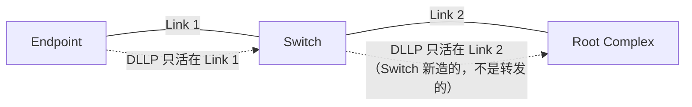
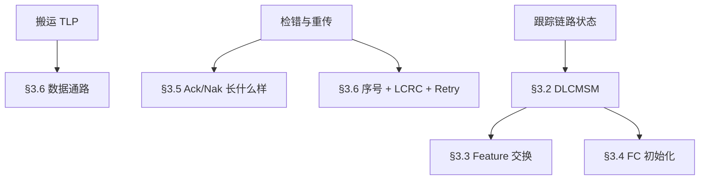

> [!abstract] 对应 Spec
> **Gen5 §3.1 Data Link Layer Overview** — spec p.209–210 = [[gen5_chap3.pdf#page=1|gen5_chap3.pdf p.1–2]]
>
> 这一节是全章的**目录页**：它把数据链路层要干的事列了个清单，后面 3.2–3.6 每一节展开清单里的一项。
> 读它的正确方式不是背，而是**建立一张地图**，知道后面每节在补哪一块。
>
> 📋 配套看板：[[01_31_S1_四条路径.canvas]] —— 图 3-1 的 1/2/3/4 到底指什么、以及「路径 1 的后果由路径 4 处理」这个后面反复出现的关系。

![[01_31_S1_四条路径.canvas]]

# 1. 开篇那句话，是整章的题眼

> The Data Link Layer acts as an intermediate stage between the Transaction Layer and the Physical Layer.
> Its primary responsibility is to provide a **reliable mechanism** for exchanging TLPs between the two components on a Link.

拆成三个关键词，每个都对应后面的具体章节：

| 关键词                              | 含义                            | 展开在  |
| -------------------------------- | ----------------------------- | ---- |
| **intermediate stage**           | 它夹在事务层和物理层中间，两头都要打交道          | §3.1 |
| **reliable**                     | 保证不丢、不错、不乱序 —— **这是它存在的唯一理由** | §3.6 |
| **the two components on a Link** | 只管**一跳**，不管端到端                | 全章   |

> [!important] 一句话记住数据链路层
> **它是一个「只管一跳、但把这一跳做到绝对可靠」的中间层。**

---

# 2. 图 3-1 应该怎么读 ^fig31-numbering

![[gen5_fig3-1_layering.png|500]]

这张图第一眼看上去平平无奇，但**它标了 1/2/3/4 四个数字，后面 §3.6 会反复引用**，必须先搞清楚。

图上写的是：`4  Data Link  1  |  2  Data Link  3`


| 编号    | 是什么           | spec 里怎么称呼               |
| ----- | ------------- | ------------------------ |
| **1** | A 组件的**发送**路径 | Transmit Data Link Layer |
| **2** | B 组件的**接收**路径 | Receive Data Link Layer  |
| **3** | B 组件的**发送**路径 | Transmit Data Link Layer |
| **4** | A 组件的**接收**路径 | Receive Data Link Layer  |

> [!tip] 抓手
> **奇数（1、3）= 发送，偶数（2、4）= 接收。**
> `1→2` 是 A 到 B 的方向，`3→4` 是 B 到 A 的方向。这是两条**完全独立**的通路。
>
> 后面 §3.6.2 标题是「LCRC, Sequence Number, and Retry Management **(TLP Transmitter)**」，讲的就是 1 和 3；
> §3.6.3「LCRC and Sequence Number **(TLP Receiver)**」讲的就是 2 和 4。
> 这就是为什么 §3.6 要分成发送端和接收端两大块写。

## 2.1 一个现在就要埋下的伏笔：路径 1 的「后果」由路径 4 处理 ^path-consequence

A 在路径 1 上发了 TLP，B 收到后回一个 Ack。**这个 Ack 走的是 B 的路径 3 → A 的路径 4。**
但它改的是什么？是 A **路径 1** 的状态（Retry Buffer 里哪些可以清、`ACKD_SEQ` 推进到哪）。

```
路径 1（A 发 TLP）──────────────────→ B
A ←──────────────── 路径 3（B 发 Ack）
   ↑ 在 A 这边，这个 Ack 从路径 4 进来，却在改路径 1 的账本
```

> [!note] 为什么现在就提
> 因为 §3.6.2.2「Handling of Received DLLPs」讲的是**接收** DLLP，却被放在 **(TLP Transmitter)** 那一节下面，
> 我第一遍读的时候完全没想通。答案就在这里：**它虽然发生在接收侧，服务的是发送侧的状态。**
> 到 [[01_39_S9_数据完整性_收DLLP|S9]] 时回来看这一段。

---

# 3. 服务清单：数据链路层到底干几件事 ^service-list

spec 原文把服务分成三组。我把它整理成表，并标注每一项后面在哪节展开：

## 3.1 Data Exchange（搬运数据）

| 做什么 | 方向 |
|---|---|
| 从发送侧事务层接收 TLP，交给发送侧物理层 | 路径 1 / 3 |
| 从物理层接收 TLP，交给接收侧事务层 | 路径 2 / 4 |

> [!note] 注意这里没提 DLLP
> 因为 DLLP **不是「搬运」来的，是数据链路层自己造的**。
> 事务层根本不知道 DLLP 的存在。这个区别在 §3.5 会更明显。

## 3.2 Error Detection and Retry（检错与重传）—— 展开在 §3.6

| 清单项（spec 原文） | 中文 | 展开位置 |
|---|---|---|
| TLP Sequence Number and LCRC generation | 给 TLP 加序号、算 32 位 LCRC | §3.6.2.1 |
| Transmitted TLP storage for Data Link Layer Retry | 把发出去的 TLP 存起来（**Retry Buffer**） | §3.6.2.1 |
| Data integrity checking for TLPs and DLLPs | 收到后校验 | §3.6.2.2 / §3.6.3.1 |
| Positive and negative acknowledgement DLLPs | **Ack / Nak** | §3.5 + §3.6 |
| Error indications for error reporting and logging | 报错给上层 | §3.6 + 第 6 章 |
| Link Acknowledgement Timeout replay mechanism | **等不到 Ack 就自动重发**（REPLAY_TIMER） | §3.6.2.1 |

> [!important] 这 6 条就是 §3.6 的全部内容
> §3.6 占了 p.227–244 共 18 页，是全章篇幅的一半。它讲的就是上面这 6 件事。
> 现在看不懂没关系，**记住这张清单，等 S8–S10 逐条来对**。

## 3.3 Initialization and Power Management —— 展开在 §3.2

| 清单项 | 中文 |
|---|---|
| Track Link state and convey active/reset/disconnected state to Transaction Layer | 跟踪链路状态，把「活着 / 复位了 / 断了」告诉事务层 |

这就是 **DLCMSM（§3.2）** 干的事，也就是 `DL_Up` / `DL_Down` 那两个状态输出。

> [!note] 标题里的「Power Management」在本章几乎没展开
> 第 3 章只负责**收发** PM DLLP（§3.5），电源管理的语义在**第 5 章**。
> 所以这一组服务实际上就是 DLCMSM 一件事。

---

# 4. DLLP 的两条定性描述 ^dllp-definition

spec 在这一节给 DLLP 下了两句定义，都很关键：

> DLLPs are **used for Link Management functions** including TLP acknowledgement, power management, and exchange of Flow Control information.

> DLLPs are **transferred between Data Link Layers of the two directly connected components** on a Link.

第二句里的 **directly connected（直接相连）** 是重点。紧接着 spec 又强调了一次对比：

> DLLPs are sent **point-to-point**, between the two components on one Link.
> TLPs are **routed** from one component to another, potentially through one or more intermediate components.



> [!important] Switch 不转发 DLLP ^switch-no-forward
> Switch 收到一个 Ack DLLP，**不会**把它往前传。
> 它自己消化掉（更新自己的 Retry Buffer），然后在另一条 Link 上，作为一个独立的发送方，
> **重新走一遍完整的数据链路层流程**（重新打序号、重新算 LCRC、重新等 Ack）。
>
> 换句话说：**TLP 的可靠传输是「逐跳接力」实现的，不是端到端实现的。**

---

# 5. 检错机制：为什么 TLP 和 DLLP 待遇不同

spec 这一段是全节最有信息量的：

| | DLLP | TLP |
|---|---|---|
| 校验方式 | **16-bit CRC** | **32-bit LCRC** |
| 额外保护 | 无 | **+ Sequence Number（序号）** |
| 校验失败的处理 | **discarded（直接丢弃）** | **re-sent by the Transmitter（重传）** |

## 5.1 为什么 TLP 要多一个序号？ ^why-seqnum

> TLPs additionally include a sequence number, which is used to **detect cases where one or more entire TLPs have been lost**.

> [!question] LCRC 不是已经能检错了吗，为什么还要序号？
> 因为 **LCRC 只能发现「收到的这一包错了」，发现不了「有一包压根没收到」**。
>
> 假设发送方发了 TLP \#5、\#6、\#7，而 \#6 在传输中被完全丢失（比如物理层没识别出帧头）。
> 接收方收到 #5 和 \#7，两个的 LCRC 都是对的——**光看 LCRC 一切正常**。
>
> 只有靠序号，接收方才能发现「我期待 \#6，来的却是 \#7」，从而知道丢包了。
>
> **LCRC 管「内容对不对」，Sequence Number 管「有没有少」。两者缺一不可。**

> [!note] 序号还有第二个用途，S10 会讲
> 除了发现「少了」，序号还能发现「**多了**」——同一个包收到两次（因为 Ack 丢了导致对方重发）。
> 「少了」回 Nak，「多了」回 Ack。这两种情况的判定用的是同一个模运算，留到 [[01_3a_S10_数据完整性_接收端|S10]]。

## 5.2 为什么 DLLP 不需要序号也不需要重传 ^self-repairing

spec 原文：

> Received DLLPs that fail the CRC check are discarded. The mechanisms that use DLLPs may suffer a **performance penalty** from this loss of information, but are **self-repairing** such that a **successive DLLP will supersede any information lost**.

这里的逻辑链条是：

1. DLLP 承载链路本地控制信息，但**不同 DLLP 的自愈机制不同**
2. Feature / InitFC 靠周期重发，UpdateFC 与 Ack 靠后续累计状态覆盖，Nak 靠 `REPLAY_TIMER` 兜底
3. 所以 DLLP 不进入 Retry Buffer；坏 DLLP 被丢弃并报告 Bad DLLP，协议仍能靠上述机制恢复

举例对照：

| DLLP 类型 | 丢了会怎样 | 怎么自愈 |
|---|---|---|
| UpdateFC | 发送方晚一点知道有新 credit，可能多憋一会儿 | 下一条 UpdateFC 携带更新的绝对值 |
| Ack | 发送方的 Retry Buffer 晚一点释放 | 下一条 Ack 覆盖（Ack 是**累积**确认） |
| InitFC1 | 初始化慢一轮 | spec 要求每 34 µs 至少重发一次 |

> [!warning] Nak 是最容易误解的一类
> Nak DLLP 丢了怎么办？接收方不会重发 Nak。
> 答案是：**发送方的 REPLAY_TIMER 超时后会自动重传**，兜底机制在那里。
> 这就是清单里「Link Acknowledgement Timeout replay mechanism」的作用。细节在 §3.6。

> [!note] 「supersede」这个词后面会以三种面目反复出现
> - §3.5.1：Ack 是**累积**确认 → 序号大的 Ack 包含序号小的
> - §3.6.2.1：replay 期间多个 Ack/Nak 可以 **collapse（折叠）**
> - §3.6.2.1 优先级注记：待发的同类 DLLP 可以合并
>
> 它们都是“后来的信息能覆盖较早信息”的表现，但恢复机制并不完全相同：Feature/Init 周期重发，UpdateFC 与 Ack 累计覆盖，Nak 丢失由 Replay Timer 兜底。不能推广成“每条 DLLP 都携带绝对状态”。

## 5.3 重传机制的三句话概括 ^retry-summary

spec 这段把 §3.6 的核心机制压缩成了三句：

> The Transmitter **stores a copy of all TLPs sent**, re-sending these copies when required, and **purges the copies only when it receives a positive acknowledgement** of error-free receipt from the other component.

> If a positive acknowledgement has not been received within a specified time period, the Transmitter will **automatically start re-transmission**.

> The Receiver can request an **immediate re-transmission** using a negative acknowledgement.

翻译成机制：

| 机制 | 触发条件 | 对应变量（§3.6 会详讲） |
|---|---|---|
| **存副本** | 每发一个 TLP | Retry Buffer |
| **清副本** | 收到 Ack | `ACKD_SEQ` |
| **超时自动重传** | 太久没收到 Ack | `REPLAY_TIMER` |
| **立即重传** | 收到 Nak | `REPLAY_NUM` |

> [!tip] 这四行就是 §3.6 的骨架
> 我到 S8/S9 只需要往这四行里填细节。

---

# 6. 数据链路层对事务层「长什么样」

这是本节最后一段，讲的是**接口语义**——事务层眼里的数据链路层是什么。

> The Data Link Layer appears as an **information conduit with varying latency** to the Transaction Layer.

关键词两个：

## 6.1 conduit（管道）—— 保序 ^in-order

> On any given individual Link all TLPs fed into the Transmit Data Link Layer (1 and 3) will appear at the output of the Receive Data Link Layer (2 and 4) **in the same order** at a later time.

> [!important] 数据链路层保证「顺序不变」
> 进去的顺序 = 出来的顺序。**数据链路层不会重排 TLP。**
>
> 注意这句的作用域：**on any given individual Link**（在任意一条单独的 Link 上）。
> 跨 Switch 的端到端顺序不归数据链路层管，那是事务层的 Ordering Rules（第 2 章）。

> [!question] 重传会不会破坏顺序？
> 不会——这正是 §3.6 replay 规则「**从最老的开始，按原始发送顺序重发**」存在的理由（S8）。
> 接收方那边也有对应设计：卡在缺口上的包一律丢弃、只发一次 Nak，等缺口补上再继续（S10 的 `NAK_SCHEDULED`）。
> **「保序」不是免费的，是发送端和接收端各出一半规则换来的。**

## 6.2 varying latency（时延可变）—— 不保时

时延由这几个因素决定：

| 因素 | 说明 |
|---|---|
| pipeline latencies | 芯片内部流水线级数 |
| width and operational frequency of the Link | x1 还是 x16、2.5G 还是 32G |
| transmission of electrical signals across the Link | 走线长度、飞行时间 |
| **delays caused by Data Link Layer Retry** | **重传！这个是不确定性的主要来源** |

> [!question] 为什么强调 latency 是 varying 的？
> 因为**重传是随机发生的**。同一个 TLP，运气好一次过，运气差要重发好几遍。
> 所以事务层**不能假设固定时延**，必须设计成能容忍抖动。
>
> 这也是为什么 §3.6 末尾要专门讨论 Retry Buffer 的大小和 Ack Latency Limit——
> 就是在给这个「可变」划一个上界。

## 6.3 两个方向的接口信号 ^backpressure-vs-fc

> As a result of these delays, the Transmit Data Link Layer (1 and 3) can apply **backpressure** to the Transmit Transaction Layer, and the Receive Data Link Layer (2 and 4) **communicates the presence or absence of valid information** to the Receive Transaction Layer.

| 方向 | 信号 | 含义 |
|---|---|---|
| 发送侧：DLL → TL | **Backpressure（背压）** | 「我这儿满了，你先别给我 TLP」 |
| 接收侧：DLL → TL | valid / not valid | 「这拍有有效数据 / 没有」 |

> [!tip] 什么是 Backpressure
> 就是**反向的流量控制信号**。下游处理不过来时，往上游喊停。
>
> 数据链路层什么时候会背压事务层？两种典型情况（S8 会给出精确条件）：
> - **Retry Buffer 满了**——已经发出去但还没被 Ack 的 TLP 攒够了，再发就没地方存副本
> - **序号窗口触发停止条件**——Equation 3-1：`(NEXT_TRANSMIT_SEQ - ACKD_SEQ) mod 4096 >= 2048`。左式等于“当前未确认数 + 1”，因此不能直接把它命名为在途数量
>
> 注意区分：
> - **Backpressure** 是**组件内部**、层与层之间的信号（不上线）
> - **Flow Control / Credit** 是**跨 Link**、组件与组件之间的机制（走 DLLP）
>
> 这两个都是「流控」，但作用域完全不同，非常容易混。

> [!note] 背压是一条贯穿三层的链
> 物理层也会背压数据链路层（§3.2 末尾的 Implementation Note「Physical Layer Throttling」，S3 会讲）：
> ```
> 事务层  ←─背压─  数据链路层  ←─背压─  物理层
> ```

---

# 7. 本节小结：一张地图



---

# 8. spec 逐段对照表

> [!note] 用法
> §3.1 没有编号规则，是叙述体。这张表按**原文段落**列，保证每段都有落点。

| # | spec 原文段落 | 本文位置 |
|---|---|---|
| 1 | 开篇：intermediate stage / reliable mechanism / two components on a Link | §1 |
| 2 | Figure 3-1 及路径编号 1/2/3/4 | §2 |
| 3 | 服务清单 — Data Exchange（2 条） | §3.1 |
| 4 | 服务清单 — Error Detection and Retry（6 条） | §3.2 |
| 5 | 服务清单 — Initialization and power management（1 条） | §3.3 |
| 6 | DLLPs are: used for Link Management functions… / transferred between DLLs of directly connected components | §4 |
| 7 | DLLPs point-to-point vs TLPs routed | §4 |
| 8 | 16-bit CRC for DLLP / 32-bit LCRC + sequence number for TLP | §5 |
| 9 | Received DLLPs failing CRC are discarded; self-repairing; successive DLLP supersedes | §5.2 |
| 10 | TLPs failing checks or lost are re-sent; Transmitter stores copies; purges on positive ack | §5.3 |
| 11 | No ack within specified time → automatic re-transmission | §5.3 |
| 12 | Receiver can request immediate re-transmission with negative ack | §5.3 |
| 13 | Information conduit with varying latency; same order on any given Link | §6.1 |
| 14 | Latency factors（4 项） | §6.2 |
| 15 | Transmit DLL applies backpressure to Transmit TL; Receive DLL communicates presence/absence of valid information | §6.3 |

---

# 9. 自检

- [ ] 图 3-1 里的 1/2/3/4 分别是什么？为什么 §3.6 要分 Transmitter 和 Receiver 两节？
- [ ] B 回给 A 的 Ack 走的是哪条路径？改的是哪条路径的状态？
- [ ] TLP 已经有 LCRC 了，为什么还需要 Sequence Number？举个 LCRC 查不出来的例子。
- [ ] 「self-repairing」是什么意思？为什么 DLLP 是自愈的而 TLP 不是？
- [ ] Backpressure 和 Flow Control Credit 有什么区别？
- [ ] 数据链路层保证保序吗？保证固定时延吗？为什么？重传会破坏保序吗？

---

## 相关笔记 Relation
- 上一站 → [[01_30_S0_前置对齐]]
- 下一站 → [[01_32_S2_DLLP初识]]
- 本章导航 → [[01_3f_Gen5_DLL_MOC]]

## 来源 Reference
- Gen5 spec §3.1，p.209–210 → [[gen5_chap3.pdf#page=1|PDF p.1–2]]
