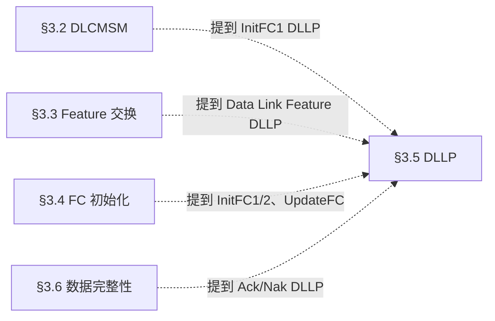
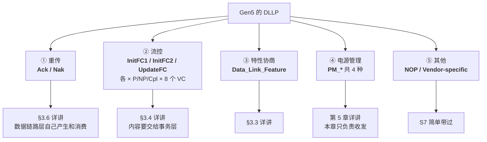

> [!abstract] 对应 Spec
> **Gen5 §3.5 前半（DLLP 的通用形状 + Table 3-3 类型表）** — spec p.221–222 = [[gen5_chap3.pdf#page=13|gen5_chap3.pdf p.13–14]]
>
> **这一站是「查字典」，不是「读文章」。**
> 我故意把 §3.5 拆成两遍读：这一遍只解决「DLLP 长什么样、一共有哪几种」，
> **不看任何一种 DLLP 内部字段的含义**。因为 §3.2 / §3.3 / §3.4 全都要用 DLLP 的名字说话，
> 我必须先有词汇表，否则读那三节会一直卡住。
>
> 逐类型的字段含义留到 **S7**（[[01_37_S7_DLLP详解]]）。
>
> 📋 配套看板：[[01_32_S2_编码解码器.canvas]] —— Table 3-3 不是乱排的，看板把编码拆成 4 个位段，**看完就不用背表**，末尾还有 3 道练习。

![[01_32_S2_编码解码器.canvas]]

# 1. 为什么先学 §3.5

Spec 的编号顺序是 3.1 → 3.2 → 3.3 → 3.4 → 3.5，但它**不是可读顺序**：



**四节全部前向引用 §3.5**。所以正确顺序是先把 §3.5 的「壳」啃掉。

---

# 2. DLLP 的通用形状：固定 6 字节 ^dllp-shape


![[gen5_fig3-4_dllp_generic.png]]

图 3-4 说的就是这么一件事：

```
        +0          +1          +2          +3
   7......0    7......0    7......0    7......0
  ┌──────────┬──────────────────────────────────┐
0 │ DLLP Type│   Type-Specific Info（3 字节）    │
  ├──────────┴──────────────┬───────────────────┘
4 │      16-bit CRC         │
  └─────────────────────────┘
```

| 字节 | 内容 | 大小 |
|---|---|---|
| Byte 0 | **DLLP Type** | 1 Byte |
| Byte 1–3 | **Type-Specific（随类型变化）** | 3 Byte |
| Byte 4–5 | **16-bit CRC** | 2 Byte |
| | **合计** | **6 Byte** |

> [!important] 三个必须刻死的事实
> 1. **所有 DLLP 都是 6 字节，一个例外都没有。** 不像 TLP 长度可变。
> 2. **Byte 0 永远是 Type**，所以只要拿到第一个字节，就知道这是什么 DLLP。
> 3. **最后 2 字节永远是 CRC**，中间那 3 字节的解释方式完全由 Type 决定。

## 2.1 为什么 spec 只画了 Type 和 CRC，中间留白？

因为图 3-4 是**通用模板**。它想表达的是「所有 DLLP 的共同点只有这两处」。
中间 3 字节的具体布局，每种类型一张图（Figure 3-5 到 Figure 3-12），那是 S7 的事。

spec 原文对「共同点」的措辞：

> All DLLPs include the following fields:
> - **DLLP Type** - Specifies the type of DLLP. The defined encodings are shown in Table 3-3.
> - **16-bit CRC**

**就这两项。** 其他一切都是 type-specific。

## 2.2 为什么固定 6 字节？

Spec 没有直接解释，但把两件事放一起就清楚了：

| 理由 | 说明 |
|---|---|
| **不需要长度字段** | 长度固定，接收方数满 6 个字节就知道包结束了，省掉了 Length 字段和解析逻辑 |
| **DLLP 承载的都是小状态量** | Ack 只要一个序号，UpdateFC 只要两个计数值，3 字节完全够用 |
| **硬件实现简单** | 固定长度意味着定长移位寄存器就能收发，CRC 电路也是定长的 |

> [!question] DLLP 前后是什么？6 字节就能上线吗？
> 不能。物理层还会给它加**帧（Framing）**：8b/10b 时代前后是 `SDP` 和 `END` Symbol，
> 128b/130b 时代用的是 Token。
>
> **但这些不属于第 3 章。** 第 3 章只管这 6 个字节，成帧是第 4 章物理层的事。
> 这一点很重要：数据链路层交给物理层的就是「6 个裸字节 + 一个标记说明这是 DLLP 不是 TLP」。
>
> spec §3.5.1 原文也确认了这点：
> > DLLPs are **differentiated from TLPs when they are presented to, or received from, the Physical Layer**.
> 也就是说「怎么区分 TLP 和 DLLP」是层间接口的事，spec 不规定实现方式。

---

# 3. Reserved 字段的通用规则 ^reserved-rule

> All DLLP fields marked Reserved (sometimes abbreviated as **R**) must be **filled with all 0's** when a DLLP is formed.
> Values in such fields **must be ignored by Receivers**.
> The handling of Reserved values in **encoded fields** is specified for each case.

这条规则很短但有**三层**，我拆开理解：

| 对象 | 规则 | 为什么 |
|---|---|---|
| **发送方** 遇到 Reserved **字段** | 必须**全填 0** | 保证今天的实现是确定的 |
| **接收方** 遇到 Reserved **字段** | **必须忽略**（不管它是什么值） | 保证**未来兼容性** |
| **Reserved 编码值**（encoded fields） | **逐案规定**（specified for each case） | 见下 |

> [!important] 这是「向前兼容」的标准手法
> 假如未来 Gen7 想给某个 Reserved 位赋予新含义，让它=1。
> 一个老的 Gen5 设备收到这个包：
> - 因为规则要求「忽略 Reserved」，它**不会报错、不会丢包**，只是当作看不见
> - 于是老设备和新设备仍然能通信，只是老设备用不上新特性
>
> 如果当初规定「Reserved 必须是 0，否则报错」，那 Gen7 就永远没法扩展了。
>
> **所以「发送方填 0、接收方忽略」这条搭配是刻意设计的，不是随便写的。**

## 3.1 「Reserved 字段」和「Reserved 编码」不是一回事 ^reserved-field-vs-encoding

第三句话很容易略过，但它区分了两种「Reserved」：

| 种类 | 例子 | 处理方式 |
|---|---|---|
| **Reserved 字段**（一段 bit 位） | Ack DLLP 的 Byte 1；PM DLLP 的 Byte 1–3 | 发 0，收忽略（上面的规则） |
| **Reserved 编码**（某个字段的某些取值） | Table 3-3 里「All other encodings Reserved」；PM 类型 bit[2:0] 没定义的 `010`/`101`/`110`/`111` | **每处单独规定** |

「单独规定」的最重要一处在 §3.6.2.2（S9 会讲）：

> A received DLLP that ... uses **unsupported DLLP Type encodings** is **discarded without further action**. **This is not considered an error.**

> [!tip] 两者合起来才是完整的兼容契约
> - Reserved **字段**里的值 → 忽略
> - Reserved **编码**（不认识的 Type）→ 整包静默丢弃、不报错
>
> 缺了任何一条，新旧设备混用时都会出问题。

> [!note] 但 CRC 要算上 Reserved
> spec 在 CRC 规则里特别说了：
> > CRC calculation uses **all bits of the DLLP, regardless of field type, including Reserved fields**.
>
> 也就是说 Reserved 位虽然语义上被忽略，但**物理上参与 CRC 计算**。
> 这不矛盾：CRC 保护的是「这 4 个字节有没有传错」，跟语义无关。

---

# 4. Table 3-3：DLLP 类型全表 ^type-table

![[gen5_tab3-3_dllp_types.png]]


[[gen5_chap3.pdf#page=13|Table 3-3 原页]]

## 4.1 全表（Gen5）

| 编码 (b)         | DLLP Type                  | 分组    |
| -------------- | -------------------------- | ----- |
| `0000 0000`    | **Ack**                    | 重传    |
| `0000 0001`    | MRInit（MR-IOV 规范）          | 外部规范  |
| `0000 0010`    | **Data_Link_Feature**      | 特性协商  |
| `0001 0000`    | **Nak**                    | 重传    |
| `0010 0000`    | PM_Enter_L1                | 电源管理  |
| `0010 0001`    | PM_Enter_L23               | 电源管理  |
| `0010 0011`    | PM_Active_State_Request_L1 | 电源管理  |
| `0010 0100`    | PM_Request_Ack             | 电源管理  |
| `0011 0000`    | Vendor-specific            | 厂商自定义 |
| `0011 0001`    | **NOP**                    | 占位    |
| `0100 0v₂v₁v₀` | **InitFC1-P**              | 流控    |
| `0101 0v₂v₁v₀` | **InitFC1-NP**             | 流控    |
| `0110 0v₂v₁v₀` | **InitFC1-Cpl**            | 流控    |
| `0111 0v₂v₁v₀` | MRInitFC1（MR-IOV）          | 外部规范  |
| `1000 0v₂v₁v₀` | **UpdateFC-P**             | 流控    |
| `1001 0v₂v₁v₀` | **UpdateFC-NP**            | 流控    |
| `1010 0v₂v₁v₀` | **UpdateFC-Cpl**           | 流控    |
| `1011 0v₂v₁v₀` | MRUpdateFC（MR-IOV）         | 外部规范  |
| `1100 0v₂v₁v₀` | **InitFC2-P**              | 流控    |
| `1101 0v₂v₁v₀` | **InitFC2-NP**             | 流控    |
| `1110 0v₂v₁v₀` | **InitFC2-Cpl**            | 流控    |
| `1111 0v₂v₁v₀` | MRInitFC2（MR-IOV）          | 外部规范  |
| 其余             | Reserved                   | —     |

`v₂v₁v₀` = 3 位的 **VC 编号**（0–7）。

> [!tip] MR-IOV 相关的四个可以直接跳过
> `MRInit` / `MRInitFC1` / `MRInitFC2` / `MRUpdateFC` 属于 **MR-IOV（Multi-Root I/O Virtualization）规范**，
> 不在 PCIe Base Spec 里定义，实际产品几乎不用。
> spec 的四条脚注（49–52）都在说同一件事：
> > Table 3-3 的脚注 49 说明：非 MR-IOV 组件会静默忽略 `MRInit`；脚注 50–52 则说明其余三类 FC 编码只在 `MRInit` 成功后使用。不要把四条脚注都概括成“非 MR-IOV 静默忽略”。
>
> ——这又是 §3.1 那条「不认识的编码静默丢弃」在起作用。
> **讲解时提一句「这是外部规范占的坑」即可，不展开。**

## 4.2 这张表不是乱排的 —— 编码结构 ^fc-encoding-structure

这是我读这张表最大的收获：**编码是有结构的**，看懂结构就不用背表。

### 结构一：bit[7:6] 把整张表分成四个大区

| bit[7:6] | 区域 | 内容 |
|---|---|---|
| `00` | **非流控区** | Ack / Nak / PM / NOP / Vendor / Data_Link_Feature |
| `01` | **InitFC1 区** | 流控初始化第一阶段 |
| `10` | **UpdateFC 区** | 流控运行期更新 |
| `11` | **InitFC2 区** | 流控初始化第二阶段 |

### 结构二：流控区（bit[7:6] ≠ 00）内部格式完全统一

```
  bit:  7  6  5  4  3  2  1  0
       ┌─────┬─────┬──┬────────┐
       │ 家族 │类型 │0 │  VC 号 │
       └─────┴─────┴──┴────────┘
```

| 位段 | 含义 | 取值 |
|---|---|---|
| bit[7:6] | **家族** | `01`=InitFC1, `10`=UpdateFC, `11`=InitFC2 |
| bit[5:4] | **Credit 类型** | `00`=P, `01`=NP, `10`=Cpl, `11`=MR-IOV |
| bit[3] | 固定 0 | —（Gen6.2 中该位区分 Shared / Dedicated Flow Control，并不是 VC 的第 4 位，见 S11） |
| bit[2:0] | **VC 编号** | 0–7 |

> [!important] 验证一下这个规律
> - `InitFC1-NP`，VC0 → 家族 `01` + 类型 `01` + `0` + `000` = `0101 0000` ✅ 对上了
> - `UpdateFC-Cpl`，VC3 → 家族 `10` + 类型 `10` + `0` + `011` = `1010 0011` ✅ 对上了
> - `InitFC2-P`，VC0 → 家族 `11` + 类型 `00` + `0` + `000` = `1100 0000` ✅ 对上了
>
> **12 个流控编码，一条规律全覆盖，一个都不用背。**

> [!note] 顺序有点反直觉：InitFC1 = 01，UpdateFC = 10，InitFC2 = 11
> 按时间顺序应该是 InitFC1 → InitFC2 → UpdateFC，但编码却把 UpdateFC 排在中间。
> spec 没解释。**不要试图从编码推时间顺序**，就记「01 / 10 / 11 = Init1 / Update / Init2」。

### 结构三：非流控区（bit[7:6]=`00`）按上半字节分组

| bit[7:4] | 组 | 成员 |
|---|---|---|
| `0000` | 确认 + 杂项 | Ack(`00`)、MRInit(`01`)、Data_Link_Feature(`02`) |
| `0001` | 否定确认 | Nak(`10`) |
| `0010` | **电源管理** | PM_Enter_L1(`20`)、PM_Enter_L23(`21`)、PM_Active_State_Request_L1(`23`)、PM_Request_Ack(`24`) |
| `0011` | 其他 | Vendor-specific(`30`)、NOP(`31`) |

> [!note] Ack = `0000 0000`，Nak = `0001 0000` ^ack-nak-one-bit
> 这两个最常用的 DLLP，编码只差 **bit[4]** 一位。
> `0` = 肯定确认，`1` = 否定确认。**这一位是硬件里最热的一根线。**

---

# 5. 按功能重新组织：五大家族 ^five-families

上面是按编码组织的。为了讲解，我更喜欢按**功能**组织：



| 家族 | 谁产生 | 谁最终消费 | 在第 3 章的地位 |
|---|---|---|---|
| **Ack / Nak** | 数据链路层 | **数据链路层自己** | ⭐⭐⭐ 核心，§3.6 |
| **InitFC1/2、UpdateFC** | 初始化时是数据链路层；运行期是事务层 | **事务层** | ⭐⭐⭐ 核心，§3.4 |
| **Data_Link_Feature** | 数据链路层 | 数据链路层 | ⭐⭐ §3.3 |
| **PM_\*** | **组件的电源管理逻辑** | 对端的电源管理逻辑 | ⭐ 本章只当搬运工 |
| **NOP / Vendor** | — | 丢弃 / 厂商自定 | ⭐ 边角 |

> [!important] 这张表里最值得注意的一列是「谁最终消费」
> - **Ack / Nak 是数据链路层的「内部事务」**，事务层完全不知道它们存在
> - **InitFC / UpdateFC 只是「过路」**，数据链路层负责收发和校验，但 credit 值要**上交给事务层**
> - **PM DLLP 更是纯过路**，数据链路层校验完就丢给电源管理逻辑
>
> spec §3.5.1 对每一类的措辞印证了这点：
> - 对 Ack/Nak：*"handled by the Data Link Layer according to the rules in Section 3.6"*
> - 对 FC DLLP：*"the information content of the DLLP is **passed to the Transaction Layer**"*
> - 对 PM DLLP：*"passed to the **component's power management logic**"*
>
> **「谁消费」决定了这个 DLLP 在哪一章被详细讲。**

---

# 6. 一个 spec 的小坑

§3.5 开头列了一个「用于支持 Link 操作的 DLLP」清单：

> - Ack DLLP: TLP Sequence Number acknowledgement; used to indicate successful receipt of some number of TLPs
> - Nak DLLP: TLP Sequence Number negative acknowledgement; used to initiate a Data Link Layer Retry
> - InitFC1, InitFC2, and UpdateFC DLLPs; used for Flow Control
> - DLLPs used for Power Management

> [!warning] 这个清单是不完整的
> 它**漏掉了 NOP、Vendor-specific、Data_Link_Feature**，但这三个在 Table 3-3 里明明有，
> 而且 §3.5.1 后面还专门给它们写了规则。
>
> 我第一遍读的时候以为 Gen5 只有 4 类 DLLP，结果读到 Table 3-3 傻眼了。
> **以 Table 3-3 为准，开头那个清单只是「主要的几个」。**

> [!tip] 但这个清单里藏了一个重要措辞
> Ack 那一行写的是「successful receipt of **some number of TLPs**」——**一些 TLP**，不是一个。
> 这是「Ack 是累积确认」的第一次露面。S7 会在 §3.5.1 的规则里再次看到「what TLP**s** are affected」。

---

# 7. 练习：不查表写编码 ^exercises

> [!question] 三道题（答案折叠在下面）
> 1. `UpdateFC-NP`，用于 VC2，编码是？
> 2. 收到一个 Type = `1110 0101` 的 DLLP，它是什么？
> 3. 收到一个 Type = `0010 0010` 的 DLLP，它是什么？应该怎么处理？

> [!success]- 答案
> 1. 家族 UpdateFC = `10`，类型 NP = `01`，bit[3] = `0`，VC2 = `010` → **`1001 0010`**
> 2. bit[7:6] = `11` → InitFC2 家族；bit[5:4] = `10` → Cpl；VC = `101` = 5 → **InitFC2-Cpl，VC5**
> 3. bit[7:4] = `0010` → PM 区；bit[2:0] = `010` → **Table 3-3 里没有定义**（PM 只有 000/001/011/100）→ 这是一个 **Reserved 编码** → 按 §3.6.2.2：**静默丢弃，不算错误**

---

# 8. 本站到此为止

现在我手上有词汇表了。接下来读 §3.2 / §3.3 / §3.4 时：

- 看到 `InitFC1-P` → 知道它是「VC 的 Posted 类型 credit 首次通告」，编码 `0100 0vvv`
- 看到 `Data Link Feature DLLP` → 知道它编码 `0000 0010`，3 字节 type-specific 里放特性位
- 看到 `Ack` → 知道它编码 `0000 0000`，跟 Nak 只差一位

**至于这 3 个 type-specific 字节里每一位是什么 —— 现在不用管，S7 再说。**

---

# 9. spec 逐条对照表（§3.5 前半）

| # | spec 原文 | 本文位置 |
|---|---|---|
| 1 | §3.5 开头的 DLLP 用途清单（Ack / Nak / InitFC1·2·UpdateFC / PM） | §6 |
| 2 | Reserved 字段：发送方填 0 | §3 |
| 3 | Reserved 字段：接收方必须忽略 | §3 |
| 4 | Reserved **编码值**的处理逐案规定 | §3.1 |
| 5 | 所有 DLLP 共有字段：DLLP Type（编码见 Table 3-3）+ 16-bit CRC | §2.1 |
| 6 | Figure 3-4 | §2 |
| 7 | Table 3-3 全部 22 行 + 「All other encodings Reserved」 | §4.1 |
| 8 | 脚注 49：非 MR-IOV 组件静默忽略 MRInit；脚注 50–52：其余 MR FC 类型仅在 MRInit 成功后使用 | §4.1 |

（§3.5.1 后半的逐类型规则与 CRC 规则，对照表在 [[01_37_S7_DLLP详解]]。）

---

# 10. 自检

- [ ] 一个 DLLP 有多少字节？哪几个字节是固定含义的？
- [ ] Reserved 字段发送方怎么填、接收方怎么处理？这样规定的好处是什么？
- [ ] 「Reserved 字段」和「Reserved 编码」的处理有什么不同？
- [ ] Reserved 字段参与 CRC 计算吗？
- [ ] 不查表，写出 `UpdateFC-NP` 用于 VC2 的编码。
- [ ] Ack 和 Nak 的编码差几位？差在哪一位？
- [ ] InitFC 的内容最终交给谁？Ack 的内容最终交给谁？

---

## 相关笔记 Relation
- 上一站 → [[01_31_S1_数据链路层概述]]
- 下一站 → [[01_33_S3_DLCMSM]]
- **第二遍读 §3.5** → [[01_37_S7_DLLP详解]]
- 本章导航 → [[01_3f_Gen5_DLL_MOC]]

## 来源 Reference
- Gen5 spec §3.5 / §3.5.1 前半，p.221–222 → [[gen5_chap3.pdf#page=13|PDF p.13–14]]
