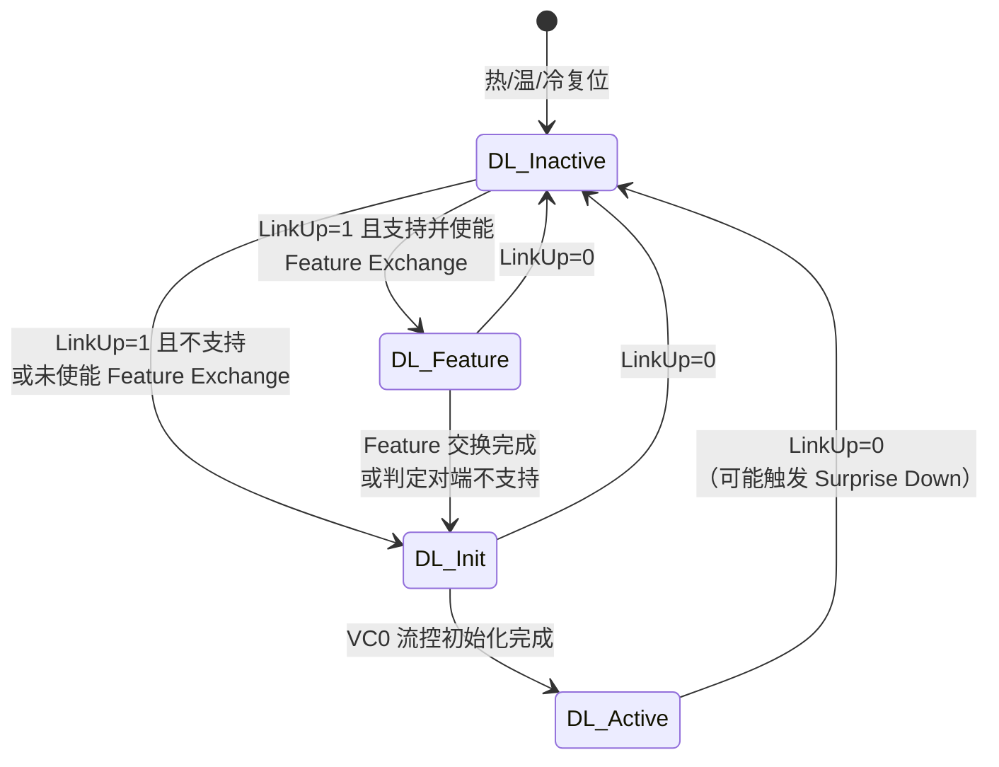

> [!abstract] 对应 Spec
> **Gen5 §3.2 + §3.2.1 Data Link Control and Management State Machine** — spec p.210–213 = [[gen5_chap3.pdf#page=2|gen5_chap3.pdf p.2–5]]
>
> 这是第 3 章的**总控**。它回答一个问题：
> **物理层说「链路通了」之后，到事务层被允许发第一个 TLP 之间，中间发生了什么？**
>
> 📋 配套看板（两张，视角不同）：
> - 本库 [[01_33_S3_一次开机.canvas]] —— **时间线视角**：一次开机，每个时刻 DLCMSM 在哪、DL_Up 是什么、事务层能不能发 TLP、收到的 TLP/DLLP 怎么办。**学的时候看这张。**
> - 组库 `01_pcie/.../01_33_02_DLCMSM_flow.canvas` —— **状态机视角**：按组里流程图约定画的转移条件。**讲的时候用那张。**

![[01_33_S3_一次开机.canvas]]

# 1. 先纠正我自己的一个先入为主

我一开始以为 DLCMSM 是三个状态（Inactive / Init / Active）。**错了。**

> [!important] Gen5 的 DLCMSM 有 **4 个状态**
> `DL_Inactive` → `DL_Feature`（**可选**）→ `DL_Init` → `DL_Active`
>
> `DL_Feature` 是 PCIe 4.0 才加进来的，Gen3 及以前确实只有三个。
> 而且它是 **optional（可选）** 的——支持它的 Port 才有这个状态，不支持的直接从 `DL_Inactive` 跳到 `DL_Init`。

> [!figure] Figure 3-2 Data Link Control and Management State Machine
> 原文：[[gen5_chap3.pdf#page=3|PDF p.3 / Spec p.211]]
> ![[gen5_fig3-2_dlcmsm.png]]
>
> 提醒：spec 原图很简洁（四个状态加箭头，具体转移条件在正文）。
> 真正有用的是两张看板，原图截来对照一下就行。

---

# 2. 状态机全景



## 2.1 四个状态一句话

| 状态                 | spec 原文定义                                                                                             | 我的白话                 |
| ------------------ | ----------------------------------------------------------------------------------------------------- | -------------------- |
| **DL_Inactive**    | Physical Layer reporting Link is non-operational or nothing is connected to the Port                  | **线还没通，或者对面没插东西**    |
| **DL_Feature**（可选） | Physical Layer reporting Link is operational, perform the Data Link Feature Exchange                  | 线通了，**先互相通报支持哪些特性**  |
| **DL_Init**        | Physical Layer reporting Link is operational, initialize Flow Control for the default Virtual Channel | 线通了，**在给 VC0 初始化流控** |
| **DL_Active**      | Normal operation mode                                                                                 | **正常干活**             |

## 2.2 两个状态输出 ^dlup-timing

DLCMSM 只对外输出**两个**信号，给事务层和数据链路层其余部分看：

| 输出 | spec 定义 | 含义 |
|---|---|---|
| **DL_Down** | The Data Link Layer is **not communicating** with the component on the other side of the Link | 我跟对面的数据链路层**说不上话** |
| **DL_Up** | The Data Link Layer **is communicating** with the component on the other side of the Link | 我跟对面的数据链路层**能对话了** |

> [!important] 这是本节最容易漏掉的一个细节
> **`DL_Up` 不是在进入 `DL_Active` 时才置起来的。**
>
> spec 在 `DL_Init` 的规则里明确写着：
> > Report DL_Down status while in state **FC_INIT1**; **DL_Up** status in state **FC_INIT2**
>
> 也就是说，**在 `DL_Init` 状态的后半段（FC_INIT2 子状态），`DL_Up` 就已经拉高了**，
> 尽管此时 DLCMSM 还没进 `DL_Active`。

> [!question] 为什么 DL_Up 要提前到 FC_INIT2？
> 我的理解是：`DL_Up` 的语义是「**对话通了**」，不是「**可以发 TLP 了**」。回看 spec 的定义——"is communicating"。
>
> 能进入 FC\_INIT2，说明我已经成功收到了对方的 InitFC1（见 
> [[01_35_S5_流控初始化]]）。
> 这就已经证明双向的数据链路层通信是通的。所以这时候宣布 `DL_Up` 是名副其实的。
>
> 至于「能不能发 TLP」，那是由 `DL_Active` 和流控 credit 共同决定的，是另一件事。
>
> **区分开这两件事，是理解 §3.2 和 §3.4 关系的关键。**

| 状态 / 子状态 | 状态输出 | 事务层能发 TLP 吗 |
|---|---|---|
| DL_Inactive | DL_Down | ❌ |
| DL_Feature | DL_Down | ❌（spec 明确要求事务层**阻塞** TLP 发送） |
| DL_Init / **FC_INIT1** | **DL_Down** | ❌（该 VC 的 TLP 被阻塞） |
| DL_Init / **FC_INIT2** | **DL_Up** ⬅️ | ❌（该 VC 的 TLP 仍被阻塞） |
| DL_Active | DL_Up | ✅ |

---

# 3. 逐状态细读

## 3.1 DL_Inactive —— 复位后的起点 ^dlcm-inactive

### 什么时候进来

> Initial state following PCI Express **hot, warm, or cold reset**（见 §6.6）

| 复位类型 | 简述 |
|---|---|
| Cold Reset | 上电复位 |
| Warm Reset | 不断电的硬复位 |
| Hot Reset | 通过链路上的 TS1 传播的带内复位 |

> [!warning] FLR 不影响 DL 状态 ^flr-no-effect
> spec 特意加了一句：
> > Note that DL states are **unaffected by an FLR**
>
> **FLR（Function Level Reset）复位的是「功能」，不是「链路」。**
> 一个 Endpoint 里某个 Function 被 FLR 了，链路照常工作，DLCMSM 一动不动。
> 这个区分很重要，是驱动开发和调试时的常见困惑点。

### 进入时做什么（一次性动作）^retry-buffer-flush

| 动作 | 为什么 |
|---|---|
| Reset all Data Link Layer state information to default values | 所有计数器、序号、标志位归零（S8/S10 会看到每个变量的复位值都写着「in DL_Inactive state」） |
| 清除 `Remote Data Link Feature Supported` 和 `Remote Data Link Feature Supported Valid`（若支持 Feature Exchange） | 对端信息作废了，**必须重新协商** |
| **Discard the contents of the Data Link Layer Retry Buffer** | 链路都断了，重传缓冲里的 TLP 已经没意义了 |

> [!important] 清空 Retry Buffer 的含义很重
> Retry Buffer 里装的是「已经发出去、还没被 Ack」的 TLP。
> 清空它意味着**这些 TLP 被永久放弃了，不会再重传**。
>
> 这些事务从上层看就是「丢了」。所以下面才会有「通知事务层丢弃未决事务」的动作。
> **链路断开是会丢数据的**，数据链路层的可靠性保证只在链路活着的时候成立。
>
> 对比 S8 会讲的另一条：`REPLAY_NUM` 溢出触发重训练时，Retry Buffer **不清空**。
> 两条合起来：**重训练是修链路、不丢数据；只有 LinkUp 真的掉了才丢。**

### 停留期间做什么（持续动作）

| 动作 | 后果 |
|---|---|
| **Report DL_Down** 给事务层和数据链路层其余部分 | 见下面的展开 |
| Discard TLP information from the Transaction and Physical Layers | 两个方向的 TLP 全丢 |
| **Do not generate or accept DLLPs** | DLLP 也完全停摆 |

spec 对 `DL_Down` 的后果给了一个注解，信息量很大：

> Note: This will cause the Transaction Layer to **discard any outstanding transactions** and to terminate internally any attempts to transmit a TLP.
> For a **Downstream Port**, this is equivalent to a **"Hot-Remove"**.
> For an **Upstream Port**, having the Link go down is equivalent to a **hot reset**（see §2.9）。

| Port 类型 | DL_Down 等价于 | 直觉 |
|---|---|---|
| **Downstream Port**（往下游连设备的，比如 Root Port、Switch 的下游口） | **热拔出（Hot-Remove）** | 「我下面挂的那个设备不见了」 |
| **Upstream Port**（设备自己朝上的口） | **热复位（Hot Reset）** | 「我跟主机断了，等于我被复位了」 |

> [!tip] 为什么同一件事对两端语义不同 ^down-up-asymmetry
> 因为**视角不同**：
> - Downstream Port 是「主人」，它失去的是一个**外设** → 相当于设备被拔走
> - Upstream Port 是「客人」，它失去的是**上级** → 相当于自己被重启
>
> 这解释了为什么后面 `DL_Active → DL_Inactive` 的 Surprise Down 错误只针对 **Downstream Port**。

### 什么时候出去

这里 spec 写得比较绕，因为要处理「支持/不支持 Feature Exchange」两种情况。我整理成表：

四个条件（简称）：
- **A** = `Physical LinkUp == 1b`（物理层说通了）
- **B** = 事务层表示**软件没有 Disable 这条 Link**
- **C** = Port 支持可选的 Data Link Feature Exchange
- **D** = `Data Link Feature Exchange Enable` 位被 Set

| 条件 | 去哪 |
|---|---|
| A ∧ B ∧ **C ∧ D** | → **DL_Feature** |
| A ∧ B ∧ **¬C** | → **DL_Init**（不支持，跳过） |
| A ∧ B ∧ **C ∧ ¬D** | → **DL_Init**（支持但被软件关了，跳过） |
| 其他 | 留在 DL_Inactive |

> [!note] 化简一下
> **「LinkUp 且软件没禁用 Link」是共同前提；然后看「支不支持 + 使不使能 Feature 交换」决定走哪条。**
>
> 只有「**又支持又使能**」才走 DL_Feature，否则一律直奔 DL_Init。

> [!question] 为什么要有 `Data Link Feature Exchange Enable` 这个开关？ ^enable-switch
> §3.3 给了答案：
> > This can be used to **work around legacy hardware that does not correctly ignore the DLLP**.
>
> 也就是说：Data Link Feature DLLP 是 PCIe 4.0 新增的编码（`0000 0010`）。
> 按规矩，PCIe 3.0 的老设备收到不认识的 DLLP 编码应该**静默忽略**（[[01_32_S2_DLLP初识#^reserved-field-vs-encoding|S2 §3.1]]）。
> 但现实中**有些老硬件实现有 bug，收到会出错甚至挂掉**。
>
> 所以 spec 留了个软件开关：遇到这种老设备，BIOS/固件可以把 Feature Exchange 关掉，绕过去。
>
> **这是一条典型的「为现实妥协」的规则**，读 spec 时看到这种，往往背后都有真实的踩坑史。

---


## 3.2 DL_Feature —— 通报特性（可选状态）^dlcm-feature

### 停留期间

| 动作 |
|---|
| 执行 §3.3 描述的 Data Link Feature Exchange 协议 |
| **Report DL_Down** |
| 处于 DL_Down 的 Port，**允许丢弃收到的 TLP**——但前提是**不能给这些 TLP 发 Ack** |

> [!important] 「允许丢弃，但不许 Ack」这条规则的精妙之处 ^discard-no-ack
> spec 原文：
> > The Data Link Layer of a Port with DL_Down status is **permitted to discard any received TLPs** provided that it **does not acknowledge those TLPs** by sending one or more Ack DLLPs
>
> 这条规则在 `DL_Feature` 和 `DL_Init` 两个状态下都出现了。逻辑是：
>
> 1. 我现在还没准备好（没协商完 / 没初始化流控），**没能力正确处理 TLP**
> 2. 所以我可以直接扔掉
> 3. **但我绝不能骗对方说「我收到了」**
> 4. 于是对方的 REPLAY_TIMER 会超时，**自动重传**
> 5. 等我准备好了，重传的 TLP 就能被正确接收
>
> **「不 Ack」把这个 TLP 的责任留在了对方的 Retry Buffer 里，从而不丢数据。**
> 这是 §3.6 的重传机制在 §3.2 里的一次巧妙复用——**先设计好机制，再到处借用**。

> [!question] 为什么这时候会收到 TLP？对方不是也在初始化吗？
> 两端的进度**不一定同步**。对方可能已经完成初始化进了 DL_Active、开始发 TLP，而我这边还在 DL_Feature 或 FC_INIT1。
> S5 会讲一个配套设计：**「收到任意 TLP」本身就是 FI2 的一条置位路径**——对方都发 TLP 了，说明它早完成了。

### 什么时候出去

| 条件 | 去哪 |
|---|---|
| Feature 交换**成功完成** ∧ LinkUp 仍为 1b | → **DL_Init** |
| 判定**对端不支持**该协议 ∧ LinkUp 仍为 1b | → **DL_Init** |
| **LinkUp == 0b** | → **DL_Inactive**（中止交换） |

> [!note] 「判定对端不支持」是怎么判定出来的？
> 这是 §3.3 的内容。剧透一下（S4 详讲）：
> **如果收到了对方的 `InitFC1` DLLP，就说明对方已经跳过 Feature 阶段直接开始流控初始化了**，
> 即对方不支持（或没使能）Feature Exchange。这时我也不用等了，直接跟进 DL_Init。
>
> 这个设计很聪明：**不需要超时，用「对方的下一步动作」来推断对方的能力。**

---

## 3.3 DL_Init —— 初始化 VC0 的流控 ^dlcm-init

### 停留期间

| 动作 |
|---|
| 按 §3.4 的协议，为**默认虚拟通道 VC0** 初始化流控 |
| 在 **FC_INIT1** 子状态报 **DL_Down**；在 **FC_INIT2** 子状态报 **DL_Up** |
| （同上）允许丢弃收到的 TLP，但不许 Ack |

> [!important] DL_Init 内部还有两个子状态 ^nested-fsm
> `FC_INIT1` 和 `FC_INIT2` **不是 DLCMSM 的状态**，而是 **§3.4 流控初始化状态机**的状态。
>
> 两个状态机是**嵌套**关系：
> ```
> DLCMSM: DL_Inactive → DL_Feature → [ DL_Init ] → DL_Active
>                                       │
>                                       └── FC 初始化状态机: FC_INIT1 → FC_INIT2
> ```
> 这一点我第一遍读的时候完全没意识到，把 FC_INIT1/2 当成了 DLCMSM 的状态。

### 什么时候出去

| 条件 | 去哪 |
|---|---|
| **VC0 的流控初始化成功完成** ∧ LinkUp 仍为 1b | → **DL_Active** |
| **LinkUp == 0b** | → **DL_Inactive**（中止初始化） |

> [!note] 只初始化 VC0
> `DL_Init` 只负责 **VC0**。VC1–VC7 是软件后来使能的，
> 它们的流控初始化**不会**让 DLCMSM 回到 `DL_Init`——那时候 DLCMSM 一直待在 `DL_Active`，
> 只是那个 VC 自己跑一遍 FC_INIT1/FC_INIT2 而已。
>
> spec §3.4 原文印证：
> > when additional VCs are being initialized there will typically be **TLP traffic flowing on other, already enabled, VCs**

---

## 3.4 DL_Active —— 正常工作 ^dlcm-active

### 停留期间

| 动作 |
|---|
| 按本章规则，与事务层、物理层**收发 TLP** |
| 按本章规则，**收发 DLLP** |
| **Report DL_Up** 给事务层和数据链路层 |

一句话：**这一章其余所有内容（§3.5 的 DLLP 收发、§3.6 的 Ack/Nak/重传）都是在 `DL_Active` 里跑的。**

### 什么时候出去

只有一个条件：**`Physical LinkUp == 0b`** → `DL_Inactive`

但 spec 在这里塞了一大段关于 **Surprise Down** 的规则，是本节篇幅最长的部分。

---

# 4. Surprise Down：DL_Active → DL_Inactive 的错误判定 ^sd-blocking-rule

## 4.1 基本规则

> **Downstream Ports** that are **Surprise Down Error Reporting Capable**（see §7.5.3.6）must treat this transition from `DL_Active` to `DL_Inactive` as a **Surprise Down error**, except in the following cases where this error detection is blocked

> [!tip] 什么是 Surprise Down
> 「**意外掉线**」。字面意思：链路本来在正常工作，**突然**没了。
>
> 为什么这是个错误？因为它意味着可能有硬件故障、意外拔出、供电问题。
> 系统需要知道，才能记录日志、通知驱动、触发热插拔处理。
>
> **为什么只有 Downstream Port 管这事？** 回到 [[#^down-up-asymmetry|§3.1 那个视角问题]]：
> Downstream Port 是「主人」，它有责任知道自己下面挂的设备是不是掉了。
> Upstream Port 掉线相当于自己被复位了，报也没人听。

> [!note] 「Surprise Down Error Reporting Capable」是一个能力位
> 在 **Slot Capabilities** 寄存器里（§7.5.3.6）。**不是所有 Downstream Port 都必须支持**这个错误上报。
> 支持的才按下面的规则来。

## 4.2 六种「不算错误」的情况（错误屏蔽）

spec 列了 6 种情况，**掉线是预期内的，不能报错**。我整理成表：

| # | 屏蔽条件 | 为什么是预期的 |
|---|---|---|
| 1 | 软件 Set 了 Bridge Control 寄存器的 **Secondary Bus Reset** 位 | **是软件主动要求复位的** |
| 2 | 软件 Set 了 **Link Disable** 位 | **是软件主动要求关链路的** |
| 3 | Switch 下游口因为**该口之上**的事件而掉线（如 Switch 上游口传播 Hot Reset、Switch 上游链路 DL_Down、Switch 上游口被 Secondary Bus Reset） | **根因在上面，不是这个口的锅**——避免一个故障报出一堆重复错误 |
| 4 | 该口发送过 **PME_Turn_Off** 消息 | **是在走正常的电源关闭流程**（有两条附注，见下） |
| 5 | 该口关联热插拔槽位（Hot-Plug Capable = 1）且 **Hot-Plug Surprise** 位 Set | **这个槽位本来就允许随便拔**，拔了不算错 |
| 6 | 该口关联热插拔槽位且 Slot Control 的 **Power Controller Control** 位 Set（已关电） | **是软件主动断电的** |

> [!important] 这 6 条的共同逻辑
> **凡是「有人（软件 / 上级 / 用户）主动造成的掉线」，都不算错误。**
> 只有「没人要求、突然就掉了」才是 Surprise Down。
>
> 这就是 "Surprise"（意外）这个词的精确含义。

### 情况 4 的两条附注（容易漏）^pme-turnoff-notes

spec 在 PME_Turn_Off 这一条下面挂了两个 Note：

> Note that the DL_Inactive transition for this condition **will not occur until a power off, a reset, or a request to restore the Link** is sent to the Physical Layer.
>
> Note also that in the case where the **PME_Turn_Off/PME_TO_Ack handshake fails to complete successfully**, a Surprise Down error **may be detected**.

| 附注  | 含义                                                                                  |
| --- | ----------------------------------------------------------------------------------- |
| 第一条 | 发了 PME_Turn_Off 之后，链路**不会自己掉**——要等断电、复位、或软件要求恢复链路，DL_Inactive 才会发生。所以这段时间内的掉线是「预期的」 |
| 第二条 | 但如果对方**没有正确回 PME_TO_Ack**（握手失败），那链路掉了就**可能**被判为 Surprise Down——因为流程没走完，掉线不再是「预期的」   |

> [!note] 第二条用的是「may be detected」
> 是「**可能**」，不是「必须」。这给了实现自由：握手失败时报不报 Surprise Down 都合规。

## 4.3 屏蔽的持续时间

spec 又补了一条容易忽略的规则：

> Error blocking initiated by one or more of the above cases must **remain in effect until the Port exits DL_Active and subsequently returns to DL_Active** with **none of the blocking cases in effect** at the time of the return.

> [!question] 这条在说什么？
> 屏蔽**不是一次性的**。一旦某个屏蔽条件生效，它会**一直保持**，
> 直到「这个口离开 DL_Active，又重新回到 DL_Active，且回来时所有屏蔽条件都已解除」。
>
> **为什么要这样？** 举个例子：
> 1. 软件 Set 了 Link Disable → 链路掉了，屏蔽生效，不报错 ✅
> 2. 如果屏蔽只持续一瞬间，那链路在 DL_Inactive 里反复抖动可能又报出错误 ❌
> 3. 所以屏蔽要一直挂着，直到链路真正**干净地重新起来**为止
>
> 这是在防止**同一个根因反复报错**。

spec 还补了两句收尾：

> Note that the transition out of `DL_Active` is **simply the expected transition as anticipated per the error detection blocking condition**.
>
> **If implemented, this is a reported error associated with the detecting Port**（see §6.2）。

| 收尾句 | 含义 |
|---|---|
| 第一句 | 被屏蔽的那次掉线，就是「预期中的那次」，不是异常 |
| 第二句 | **没被屏蔽的** Surprise Down，是一个 **reported error**（§6.2 的错误上报机制），**前提是这个 Port 实现了**该能力 |

---

# 5. Implementation Note：物理层节流 ^phy-throttling

§3.2 末尾有一个很短的实现注记，但值得记：

> Note that there are conditions where the **Physical Layer may be temporarily unable to accept TLPs and DLLPs** from the Data Link Layer.
> The Data Link Layer must comprehend this by providing mechanisms for the Physical Layer to communicate this condition, and for TLPs and DLLPs to be **temporarily blocked**.

> [!tip] 这就是「背压」的另一段
> [[01_31_S1_数据链路层概述#^backpressure-vs-fc|S1]] 讲过数据链路层会背压**事务层**。
> 这里说的是：**物理层也会背压数据链路层**。
>
> ```
> 事务层  ←─背压─  数据链路层  ←─背压─  物理层
> ```
>
> 物理层什么时候会顶不住？典型情况：
> - 正在发 Ordered Set（如 SKP OS 做时钟补偿），必须优先，把数据流挤掉
> - 正在做链路训练 / Recovery
> - 内部 buffer 满
>
> **背压是一条贯穿三层的链**，任何一层卡住都会往上传导。
>
> 注意措辞：这是 Implementation Note，但用了「**must** comprehend」——它在说「机制必须有，怎么实现随你」。

---

# 6. 一句话串起整章 ^dependency-chain

```
Physical LinkUp=1b
      ↓
DL_Feature ──→ 我支持哪些特性？你支持哪些？        （§3.3）
      ↓
DL_Init ─────→ 你的接收缓冲有多大？我的有多大？    （§3.4）
      ↓
DL_Active ───→ 开始收发 TLP，用 Ack/Nak 保证可靠   （§3.5 / §3.6）
```

> [!important] 这三步的顺序不能颠倒，原因是层层依赖
> 1. **若启用了 Feature Exchange，先协商特性**，因为 Scaled Flow Control 是否激活，决定下一步 InitFC DLLP 里 `HdrScale/DataScale` 字段怎么填；未启用时直接进入流控初始化
> 2. **必须先初始化流控**，因为不知道对方缓冲多大就发 TLP，一定会溢出
> 3. **流控好了才能发 TLP**，然后 Ack/Nak 机制才有意义
>
> **可选的 §3.3 → 必做的 §3.4 → 正常传输 §3.6** 构成启动依赖链，这就是 DLCMSM 状态顺序的由来。

---

# 7. spec 规则逐条对照表

> [!note] 用法
> 白话讲的是「为什么」，这张表保证「**一条不漏**」。讲解前对着过一遍。

## 7.1 §3.2 总述

| # | spec 规则 | 本文位置 |
|---|---|---|
| 1 | DLL 跟踪链路状态，与事务层/物理层沟通状态，通过物理层做链路管理；由 DLCMSM 执行 | §1 |
| 2 | 四个状态的定义：DL_Inactive / DL_Feature（optional）/ DL_Init / DL_Active | §2.1 |
| 3 | 两个状态输出的定义：DL_Down / DL_Up | §2.2 |
| 4 | Figure 3-2 | §1 |

## 7.2 §3.2.1 DL_Inactive

| # | spec 规则 | 本文位置 |
|---|---|---|
| 5 | 热/温/冷复位后的初始状态；**FLR 不影响 DL 状态** | §3.1 |
| 6 | 进入时：复位全部 DLL 状态到默认值 | §3.1 |
| 7 | 进入时：若支持 Feature Exchange，清 Remote Feature Supported 和 Remote Valid | §3.1 |
| 8 | 进入时：**清空 Retry Buffer** | §3.1 |
| 9 | 停留时：报 DL_Down 给事务层及 DLL 其余部分 | §3.1 |
| 10 | Note：事务层丢弃未决事务、终止发送；Downstream = Hot-Remove，Upstream = hot reset | §3.1 |
| 11 | 停留时：丢弃来自事务层和物理层的 TLP 信息 | §3.1 |
| 12 | 停留时：**不产生也不接受 DLLP** | §3.1 |
| 13 | 退出到 DL_Feature：支持 ∧ Enable=1 ∧ 软件未禁用 ∧ LinkUp=1 | §3.1 |
| 14 | 退出到 DL_Init：(不支持 ∧ 未禁用 ∧ LinkUp=1) ∨ (支持 ∧ Enable=0 ∧ 未禁用 ∧ LinkUp=1) | §3.1 |

## 7.3 §3.2.1 DL_Feature

| # | spec 规则 | 本文位置 |
|---|---|---|
| 15 | 停留时：执行 §3.3 的 Feature Exchange | §3.2 |
| 16 | 停留时：报 DL_Down | §3.2 |
| 17 | DL_Down 的 Port **允许丢弃收到的 TLP，前提是不 Ack** | §3.2 |
| 18 | 退出到 DL_Init：交换成功完成 ∧ LinkUp 仍=1 | §3.2 |
| 19 | 退出到 DL_Init：判定对端不支持 ∧ LinkUp 仍=1 | §3.2 |
| 20 | 终止交换并退出到 DL_Inactive：LinkUp=0 | §3.2 |

## 7.4 §3.2.1 DL_Init

| # | spec 规则 | 本文位置 |
|---|---|---|
| 21 | 停留时：按 §3.4 为 VC0 初始化流控 | §3.3 |
| 22 | **FC_INIT1 报 DL_Down；FC_INIT2 报 DL_Up** | §2.2 / §3.3 |
| 23 | DL_Down 的 Port 允许丢弃收到的 TLP，前提是不 Ack | §3.3 |
| 24 | 退出到 DL_Active：流控初始化成功完成 ∧ LinkUp 仍=1 | §3.3 |
| 25 | 终止初始化并退出到 DL_Inactive：LinkUp=0 | §3.3 |

## 7.5 §3.2.1 DL_Active

| # | spec 规则 | 本文位置 |
|---|---|---|
| 26 | DL_Active 是正常工作状态 | §3.4 |
| 27 | 停留时：按本章规则与事务层/物理层收发 TLP | §3.4 |
| 28 | 停留时：按本章规则收发 DLLP | §3.4 |
| 29 | 停留时：报 DL_Up 给事务层和 DLL | §3.4 |
| 30 | 退出到 DL_Inactive：LinkUp=0 | §3.4 |
| 31 | 具备 Surprise Down Error Reporting 能力的 **Downstream Port** 须将此转移视为 Surprise Down 错误 | §4.1 |
| 32 | 屏蔽 1：Secondary Bus Reset 位被软件 Set | §4.2 |
| 33 | 屏蔽 2：Link Disable 位被软件 Set | §4.2 |
| 34 | 屏蔽 3：Switch 下游口因该口之上的事件而转入 DL_Inactive（三个例子） | §4.2 |
| 35 | 屏蔽 4：该口发送过 PME_Turn_Off | §4.2 |
| 36 | 屏蔽 4 附注 a：DL_Inactive 转移要等到断电/复位/恢复链路请求 | §4.2 |
| 37 | 屏蔽 4 附注 b：PME_Turn_Off/PME_TO_Ack 握手失败时**可能**检测到 Surprise Down | §4.2 |
| 38 | 屏蔽 5：热插拔槽位 ∧ Hot-Plug Surprise 位 Set | §4.2 |
| 39 | 屏蔽 6：热插拔槽位 ∧ Power Controller Control 位 Set（Power-Off） | §4.2 |
| 40 | 屏蔽须持续到退出 DL_Active 并**干净地**回到 DL_Active | §4.3 |
| 41 | Note：退出 DL_Active 只是屏蔽条件所预期的那次转移 | §4.3 |
| 42 | **若实现了**，Surprise Down 是与检测 Port 关联的 reported error（§6.2） | §4.3 |

## 7.6 Implementation Note

| # | spec 内容 | 本文位置 |
|---|---|---|
| 43 | 物理层可能暂时无法接受 TLP/DLLP；DLL **必须**提供机制让物理层通知此状况并暂时阻塞 | §5 |

---

# 8. 自检

- [ ] Gen5 的 DLCMSM 有几个状态？哪个是可选的？为什么是可选的？
- [ ] `DL_Up` 最早在什么时候被置起来？是进 `DL_Active` 的时候吗？spec 对 DL_Up 的定义原文是什么？
- [ ] FLR 会让 DLCMSM 回到 `DL_Inactive` 吗？为什么？
- [ ] 进入 `DL_Inactive` 时为什么要清空 Retry Buffer？这会导致丢数据吗？和「重训练不清空」怎么对比？
- [ ] `DL_Down` 对 Downstream Port 和 Upstream Port 分别等价于什么？为什么不同？
- [ ] 「允许丢弃 TLP 但不许 Ack」这条规则，靠什么机制保证数据最终不丢？为什么这时候会收到 TLP？
- [ ] `Data Link Feature Exchange Enable` 这个开关是为了解决什么现实问题？
- [ ] Surprise Down 的 6 个屏蔽条件，共同规律是什么？PME_Turn_Off 那条有哪两个附注？
- [ ] FC_INIT1 / FC_INIT2 是 DLCMSM 的状态吗？

---

## 相关笔记 Relation
- 上一站 → [[01_32_S2_DLLP初识]]
- 下一站 → [[01_34_S4_数据链路特性交换]]
- 嵌套的子状态机 → [[01_35_S5_流控初始化]]
- 本章导航 → [[01_3f_Gen5_DLL_MOC]]

## 来源 Reference
- Gen5 spec §3.2 / §3.2.1，p.210–213 → [[gen5_chap3.pdf#page=2|PDF p.2–5]]
