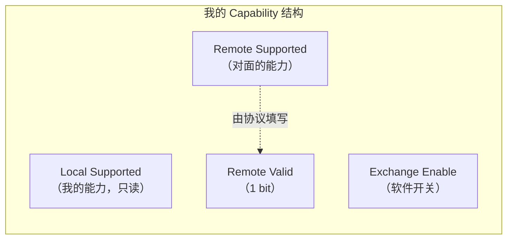
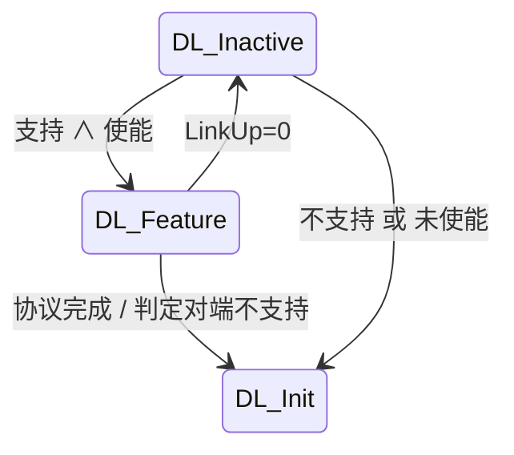
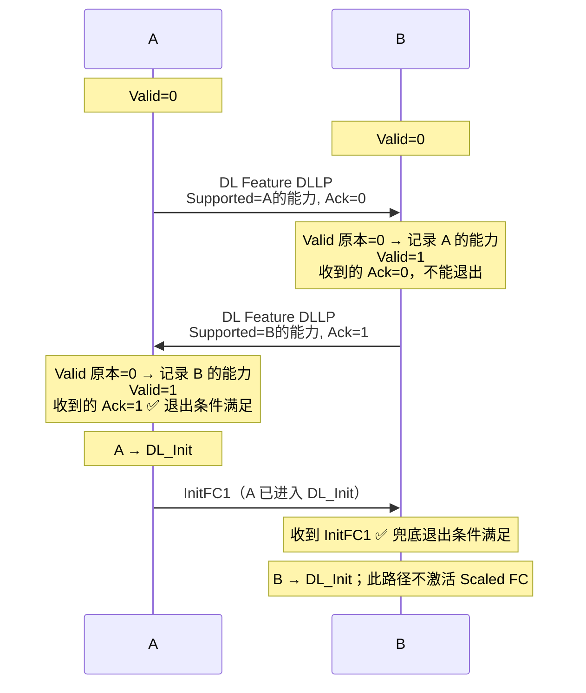

> [!abstract] 对应 Spec
> **Gen5 §3.3 Data Link Feature Exchange** — spec p.214–215 = [[gen5_chap3.pdf#page=6|gen5_chap3.pdf p.6–7]]
>
> 全章**最短的一节**，只有一页多。但它有一个很值得学的设计：
> **用一个 bit 完成双向握手**。
>
> 📋 配套看板：[[01_34_S4_一个bit握手.canvas]] —— A/B 两列时序，盯着 `Valid` 位和 `Feature Ack` 位的值怎么变；还有「对方不支持」和「Ack=1 丢了」两种分支。

![[01_34_S4_一个bit握手.canvas]]

# 1. 这一节到底在解决什么问题

先问一个直白的问题：

> [!question] 为什么需要「特性交换」？
> 因为 PCIe 一代一代往上加功能，但**链路两端可能是不同世代的设备**。
> 我是 Gen5，对面可能是 Gen3。我支持的新功能，对面未必支持。
>
> 如果我自作主张用了新功能，对面看不懂，链路就废了。
>
> 所以需要一个协议：**「先互相通报，取交集，只用双方都支持的功能。」**

> [!important] 但 Gen5 里这一节的实际内容小得惊人 ^only-one-bit
> 看 Table 3-1 就知道了：**整个 Feature Supported 字段里只定义了 1 个 bit**，
> 就是 **bit 0 = Scaled Flow Control**，bit 22:1 全是 Reserved。
>
> **也就是说，Gen5 的 §3.3 这一整节，存在的唯一目的就是协商「要不要用 Scaled Flow Control」。**
>
> 这也是为什么我把 §3.3 和 §3.4.2（Scaled FC）放在一起理解——**它俩是一件事的两半**。
>
> ⚠️ 这句话**只对 Gen5 成立**。Gen6 给这个字段加了 3 组新内容（见 [[01_3b_S11_全章整合#4.3 §3.3 Data Link Feature：Gen6 加了很多位|S11]]）。

spec 对协议目的的原话，一句话就说完了：

> The Data Link Feature Exchange protocol **transmits a Port's Local Feature Supported information to the Remote Port** and **captures that Remote Port's Feature Supported information**.

**发我的，收你的。** 就这两个动作。

---

# 2. 四个寄存器字段 ^four-fields

支持这个协议的 Port，会实现一个叫 **Data Link Feature Extended Capability** 的扩展能力结构（在配置空间里，详见 §7.7.4）。里面有 4 个字段：

| 字段 | 谁写 | 含义 |
|---|---|---|
| **Local** Data Link Feature Supported | 硬件固化 | **我**支持哪些特性 |
| **Remote** Data Link Feature Supported | 协议运行时填 | **对面**支持哪些特性 |
| **Remote** Data Link Feature Supported **Valid** | 协议运行时填 | 上面那个字段里的数据**有效了没有** |
| Data Link Feature Exchange **Enable** | **软件写** | 允不允许跑这个协议 |



> [!note] `Remote ... Valid` 这一位为什么必须存在
> 因为 `Remote Data Link Feature Supported` 字段的**全 0 是有歧义的**：
> - 可能是「对面确实一个特性都不支持」
> - 也可能是「我还没收到对面的信息，这字段还是初始值」
>
> 加一个 `Valid` 位就把这两种情况分开了。
>
> **这个 Valid 位后面还有第二个用途，是本节最巧妙的地方**（见第 4 节）。

> [!tip] `Exchange Enable` 这个软件开关的来历
> spec 原文直说了：
> > This can be used to **work around legacy hardware that does not correctly ignore the DLLP**.
>
> Data Link Feature DLLP 的编码是 `0000 0010`，PCIe 4.0 才有。
> 按规矩，PCIe 3.0 及以前的设备遇到不认识的 DLLP 编码应该**静默丢弃**（[[01_32_S2_DLLP初识#^reserved-field-vs-encoding|S2 §3.1]]）。
> 但**现实中有些老设备实现有 bug**，收到会出问题。
>
> 于是 spec 留了这个后门：BIOS/固件遇到这种老硬件，直接把整个协议关掉。
> **这是一条为踩坑史买单的规则。**

## 2.1 「支持」和「使能」是两个独立开关 ^support-enable-matrix

DLCMSM 进不进 `DL_Feature`，要看两个条件（[[01_33_S3_DLCMSM#3.1 DL_Inactive —— 复位后的起点|S3 §3.1]]）。把双方的组合列出来：

| 我 | 对方 | 结果 |
|---|---|---|
| 支持 ∧ 使能 | 支持 ∧ 使能 | **正常握手**，两边都进 DL_Feature，各自收到 Ack=1 后退出 |
| 支持 ∧ 使能 | 不支持（或未使能） | 我进 DL_Feature 发 DLLP；对方直接进 DL_Init 发 InitFC1；**我收到 InitFC1 → 判定对方不玩 → 退出**。Scaled FC 不激活 |
| 不支持（或未使能） | 支持 ∧ 使能 | 镜像：对方收到我的 InitFC1 后退出 |
| 不支持（或未使能） | 不支持（或未使能） | 两边都跳过 DL_Feature，谁也不发 Feature DLLP |

> [!important] 四种组合里，只有第一种会激活任何特性
> 因为激活条件是 **Local ∧ Remote**（§5.1）。任何一方不参与，Remote 就永远填不上，交集为空。
> **但四种组合都能正常起链路**——Scaled FC 只是性能选项，不是功能必需（[[01_36_S6_ScaledFC|S6]]）。

---

# 3. 协议在哪里跑

**只在 DLCMSM 的 `DL_Feature` 状态里跑。** 见 [[01_33_S3_DLCMSM#^dlcm-feature|S3 §3.2]]。



**进入 `DL_Feature` 时的第一件事**（这条同时写在 §3.2 和 §3.3 里）：

> The `Remote Data Link Feature Supported` and `Remote Data Link Feature Supported Valid` fields must be **Cleared**

> [!important] 每次重新协商前必须清零
> 因为链路可能换了对端（热插拔），上次记的信息不能用了。
> **Valid 清零 = 「我现在对对面一无所知」，协议从头开始。**
>
> 顺带一提：进入 `DL_Inactive` 时也会清这两个字段（S3）。所以它们在两个地方被清——**进 Inactive 清一次，进 Feature 再清一次**，双保险。

---

# 4. 协议本体：一个 bit 完成的双向握手

这是本节最值得学的地方。

## 4.1 停留在 DL_Feature 期间做什么

| 动作 | 细节 |
|---|---|
| **事务层必须阻塞 TLP 发送** | 流控都没初始化，当然不能发 |
| **周期性发送 Data Link Feature DLLP** | 至少每 **34 µs** 一次 |
| 发出去的 `Feature Supported` 字段 | **= 我的 Local Data Link Feature Supported** |
| 发出去的 `Feature Ack` 位 | **= 我的 Remote Data Link Feature Supported Valid 位** ⬅️ **关键** |
| 处理收到的 Data Link Feature DLLP | 见下 |

处理收到的 DLLP 的规则：

> If the `Remote Data Link Feature Supported Valid` bit is **Clear**,
> record the `Feature Supported` field from the received DLLP into the `Remote Data Link Feature Supported` field
> and **Set** the `Remote Data Link Feature Supported Valid` bit.

> [!note] 注意这个「只记一次」
> 只有 `Valid == 0` 时才记录。一旦记下来了，后续收到的 DLLP 里的 Feature 信息**直接忽略**。
> 因为对方的能力是固定的，不会变，记一次就够了。

## 4.2 `Feature Ack` 位的妙处 ^feature-ack-bit

**这条规则是整节的核心：**

> The transmitted **Feature Ack** bit must equal the **Remote Data Link Feature Supported Valid** bit.

翻译一下这个等式在说什么：

| 我发出去的 Feature Ack | 实际含义 |
|---|---|
| `0` | 「**我还没收到过你的信息**」 |
| `1` | 「**我已经收到并记下你的信息了**」 |

> [!important] 一个 bit 同时是「我的状态」和「给你的回执」
> `Feature Ack` 本质上是把**我的内部状态**（Valid 位）**广播出去**。
> 而对方读到这个 bit，就等于收到了「你的信息我收到了」的回执。
>
> **不需要单独的 Ack 报文，不需要序号，不需要超时重传。**
> 每个 DLLP 都同时携带「数据」和「回执」，而且**周期性重发天然自带重传**。
>
> 这是一个非常紧凑的设计，值得记住这个套路。

## 4.3 完整握手时序

假设 A 和 B 都支持并使能了 Feature Exchange。



> [!question] 为什么「收到 Ack=1」就足以判定协议完成？ ^ack1-implies-two
> 我收到一个 `Ack=1` 的 DLLP，可以推出**两件事同时成立**：
>
> 1. **对方已经拿到我的信息了**（因为它的 Ack=1 就是它的 Valid=1，而 Valid 只有在记录了我的信息后才置位）
> 2. **我已经拿到对方的信息了**（因为这条 DLLP 本身就携带了对方的 Feature Supported；即使我之前已经记过，那也说明早就拿到了）
>
> **双方信息都齐了 → 协议完成。**
>
> 这就是为什么一个 bit 够用：它把「我方已完成」的信息传给对方，对方结合「我手上有你的数据」这个事实，
> 就能独立判断出「双方都完成了」。

> [!question] 上面时序里，A 退出之后 B 还没退出——A 已经不会再发 Ack=1 的 Feature DLLP，B 怎么办？ ^lost-ack1
> A 进了 DL_Init 之后就不再发 Feature DLLP，B 确实等不到 Ack=1。
>
> **不会。** 因为 A 进 DL_Init 后会立刻开始发 **InitFC1**——而「收到 InitFC1」正是 DL_Feature 的退出条件之一（§4.4 条件 1）。
> B 收到 A 的 InitFC1，照样退出。
>
> **所以退出条件 1「收到 InitFC1」有双重作用：既用来判定对方不支持，也兜住了 Ack=1 丢失的情况。**
> 和 §3.4 里 FI2 的兜底路径（S5）是同一个思路。

## 4.4 三个退出条件 ^no-timeout

spec 列了三条，全都指向 `DL_Init`：

| # | 退出条件 | 含义 |
|---|---|---|
| 1 | 收到了 **InitFC1 DLLP** | **对方跳过 Feature 阶段，已经在做流控初始化了** → 对方不支持/没使能，**或对方已经完成退出了** |
| 2 | 收到了 **MRInit DLLP**（`0000 0001b`） | 对方在跑 MR-IOV 协议 → 同上 |
| 3 | 在 DL_Feature 期间，**收到至少一条 `Feature Ack = 1` 的 Data Link Feature DLLP** | **正常完成** ✅ |

> [!important] 条件 1 和 2 是「推断对方不支持」的机制
> 注意：**没有超时机制。**
>
> spec 不是说「等 X 毫秒对方没回就认为不支持」，而是说
> **「看到对方开始做下一步了，就知道它跳过了这一步」**。
>
> 这个设计比超时优雅得多：
> - 不需要定超时值（定长了慢、定短了误判）
> - 不受链路速度、重训练影响
> - **对方的行为本身就是最可靠的信号**
>
> 我觉得这是本节第二个值得学的设计。这个套路在第 3 章里会再出现三次（S11 汇总为「模式四」）。

> [!tip] 对应到 §3.2 的措辞
> §3.2 里写的退出条件是
> > Data Link Feature Exchange **determines that the remote Data Link Layer does not support** the optional Data Link Feature Exchange protocol
>
> 「determines（判定）」怎么判定的？就是上面的条件 1 和 2。§3.2 只说结论，§3.3 才给方法。
> **spec 经常这样：概览节说「什么」，细节节说「怎么」。**

## 4.5 34 µs 的重发要求 ^34us

> The Data Link Feature DLLP must be transmitted **at least once every 34 µs**.
> **Time spent in the Recovery or Configuration LTSSM states does not contribute to this limit.**

| 要点 | 说明 |
|---|---|
| 34 µs | 最长间隔。鼓励发得更勤，特别是链路空闲时 |
| **Recovery / Configuration 时间不算** | 这两个是 LTSSM 的状态（第 4 章） |

> [!question] 为什么 Recovery / Configuration 期间的时间不计入？
> 因为在 LTSSM 的 `Recovery` 和 `Configuration` 状态下，**链路正在重新训练，根本发不了 DLLP**。
>
> 如果把这段时间算进去，一次链路重训练就可能让计时超过 34 µs，
> 导致设备被误判为「违反规范」。所以要把它**扣掉**。
>
> **同样的豁免条款在 §3.4 的 InitFC1/InitFC2 规则里一字不差地又出现了两次**，§3.6 的 REPLAY_TIMER 也有对应版本（「不推进」）。
> 这是一个通用模式：**凡是「周期性发 DLLP」或「计时」的要求，都要扣掉链路发不了包的时间。**

---

# 5. Table 3-1：特性位定义

> [!figure] Table 3-1 Data Link Feature Supported Bit Definition
> 原文：[[gen5_chap3.pdf#page=7|PDF p.7 / Spec p.215]]
> ![[gen5_tab3-1_feature_bits.png]]

| Bit 位置 | 描述 |
|---|---|
| **0** | **Scaled Flow Control** —— 表示支持 Scaled Flow Control。<br/>**支持 16.0 GT/s 及以上速率的 Port 必须支持 Scaled Flow Control。** |
| 22:1 | Reserved |

## 5.1 「激活」的判定规则 ^activated-and

> A Data Link Feature is **activated** when that bit is **Set in both** the Local Data Link Feature Supported **and** Remote Data Link Feature Supported fields.

**逻辑与。** 双方都支持才算数。

```
特性激活 = Local Supported[n]  AND  Remote Supported[n]
```

> [!important] 「支持」≠「激活」 ^supported-vs-activated
> - **Supported（支持）**：我这个硬件有这个能力
> - **Activated（激活）**：这条链路上实际会用这个能力
>
> 这两个词在 §3.4 / §3.4.2 里被反复精确使用，读的时候要盯住：
> > If Scaled Flow Control is **activated** on the Link, set the HdrScale and DataScale fields ... to 01b, 10b, or 11b
> > If the Transmitter does not **support** Scaled Flow Control **or** if Scaled Flow Control is not **activated** on the Link, set ... to 00b
>
> 两个词并列出现，说明它们**不是一回事**。S6 还会再加第三个词「Enabled」。

---

# 6. 一个我自己想到的问题 ^must-support-vs-optional

> [!question] 矛盾？16GT/s 必须支持 Scaled FC，但 Feature Exchange 是可选的
> Table 3-1 说：**支持 16.0 GT/s 及以上的 Port 必须支持 Scaled Flow Control。**
> 但 §3.3 开头又说：**Data Link Feature Exchange 协议是可选的（optional）。**
>
> 那么问题来了：一个 Gen5（32 GT/s）的 Port，硬件上必须支持 Scaled FC。
> 但如果它**不实现 Feature Exchange 协议**，或者软件把 `Exchange Enable` 关了，
> 它怎么告诉对方「我支持 Scaled FC」？
>
> **答案：它没法告诉。于是 Scaled FC 就不会被激活，链路退回到普通流控。**
>
> §3.4.2 的措辞印证了这一点：
> > Scaled Flow Control **activation does not affect the ability to operate at 16.0 GT/s and higher data rates**.
>
> 也就是说：**Scaled FC 没激活，照样能跑 32 GT/s，只是性能可能受限**（credit 不够覆盖往返时延）。
>
> 所以这三条规则是自洽的：
> 
> | 层面 | 要求 |
> |---|---|
> | **硬件能力** | 16GT/s+ 必须**支持** |
> | **协商机制** | 可选，可以不实现 / 关掉 |
> | **不激活的后果** | 性能可能下降，但**功能完全正常** |
>
> 这就是一个典型的「**能力必备、使用可选**」的设计。
> **这个问题很适合在讲解会上抛出来。**

---

# 7. 本节小结

| 维度 | 结论 |
|---|---|
| 协议是否必须 | ❌ 可选 |
| 在哪跑 | DLCMSM 的 `DL_Feature` 状态 |
| 用什么包 | Data Link Feature DLLP（编码 `0000 0010`） |
| 发送频率 | ≥ 每 34 µs 一次（扣除 Recovery/Configuration 时间） |
| 握手机制 | **Feature Ack 位 = 我的 Remote Valid 位** |
| 正常退出 | 收到 `Feature Ack = 1` 的 DLLP |
| 异常退出 | 收到 InitFC1 / MRInit（判定对方不玩这套，**或对方已完成**） |
| Gen5 里实际协商的内容 | **只有 1 个 bit：Scaled Flow Control** |
| 激活条件 | Local ∧ Remote 都置位 |

---

# 8. spec 规则逐条对照表

| # | spec 规则 | 本文位置 |
|---|---|---|
| 1 | 协议是 **optional** | §1 / §7 |
| 2 | 实现该协议的 Port 含 Data Link Feature Extended Capability（§7.7.4） | §2 |
| 3 | 字段 1：Local Data Link Feature Supported | §2 |
| 4 | 字段 2：Remote Data Link Feature Supported | §2 |
| 5 | 字段 3：Remote Data Link Feature Supported Valid | §2 |
| 6 | 字段 4：Data Link Feature Exchange Enable —— 用于绕过不能正确忽略该 DLLP 的老硬件 | §2 |
| 7 | 协议目的：发送 Local 信息、捕获 Remote 信息 | §1 |
| 8 | 进入 DL_Feature：清 Remote Supported 和 Remote Valid | §3 |
| 9 | 停留时：事务层**必须**阻塞 TLP 发送 | §4.1 |
| 10 | 停留时：发送 Data Link Feature DLLP；Feature Supported 字段 = Local Supported | §4.1 |
| 11 | 停留时：**Feature Ack 位 = Remote Valid 位** | §4.2 |
| 12 | 至少每 34 µs 发一次；Recovery/Configuration 时间不计入 | §4.5 |
| 13 | 处理收到的 DLLP：若 Remote Valid 清零，记录 Feature Supported 到 Remote Supported，并置位 Valid | §4.1 |
| 14 | 退出条件 1：收到 InitFC1 | §4.4 |
| 15 | 退出条件 2：收到 MRInit（`0000 0001b`） | §4.4 |
| 16 | 退出条件 3：收到至少一条 Feature Ack=1 的 DLLP | §4.4 |
| 17 | 激活判定：Local ∧ Remote 都置位 | §5.1 |
| 18 | Table 3-1：bit 0 = Scaled Flow Control；16GT/s+ 必须支持；22:1 Reserved | §5 |

---

# 9. 自检

- [ ] Gen5 的 Feature Supported 字段里定义了几个 bit？分别是什么？
- [ ] `Remote ... Valid` 位为什么不能省掉？它在哪两个地方被清零？
- [ ] 发出去的 `Feature Ack` 位等于什么？为什么这一个 bit 就够完成双向握手？
- [ ] 收到 `Feature Ack = 1` 时，我能推断出哪两件事？
- [ ] 协议有超时机制吗？「判定对方不支持」是怎么做到的？
- [ ] A 退出后最后那条 Ack=1 的 DLLP 丢了，B 怎么办？
- [ ] 为什么 Recovery / Configuration 的时间不计入 34 µs？
- [ ] 「Supported」和「Activated」有什么区别？
- [ ] 一个 32GT/s 的 Port 如果关掉了 Feature Exchange，还能跑 32GT/s 吗？
- [ ] 双方「支持/使能」的四种组合里，哪种会激活 Scaled FC？

---

## 相关笔记 Relation
- 上一站 → [[01_33_S3_DLCMSM]]
- 下一站 → [[01_35_S5_流控初始化]]
- **本节的唯一目的地** → [[01_36_S6_ScaledFC]]
- 该 DLLP 的字段格式 → [[01_37_S7_DLLP详解]]
- 本章导航 → [[01_3f_Gen5_DLL_MOC]]

## 来源 Reference
- Gen5 spec §3.3，p.214–215 → [[gen5_chap3.pdf#page=6|PDF p.6–7]]
