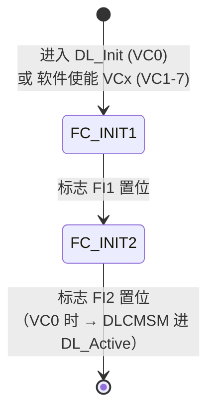
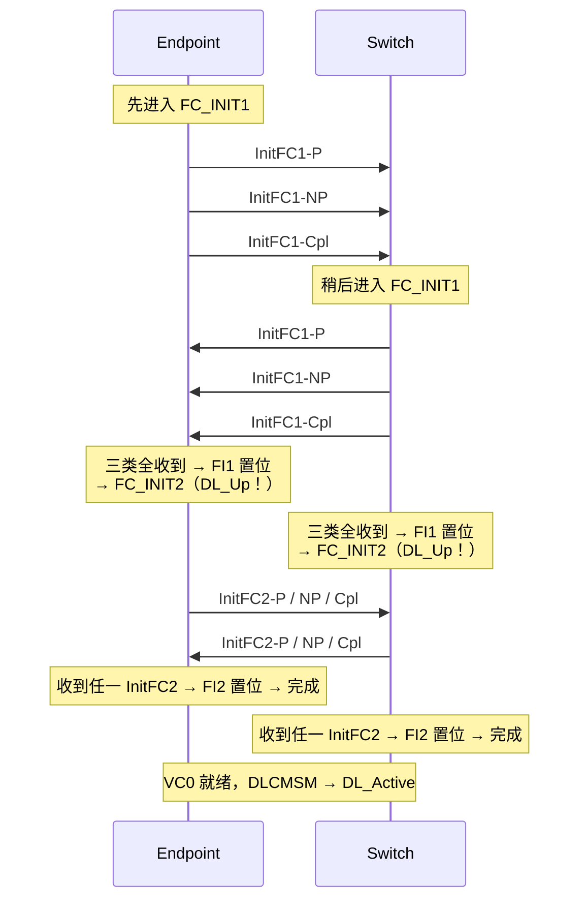

> [!abstract] 对应 Spec
> **Gen5 §3.4 + §3.4.1 Flow Control Initialization Protocol** — spec p.215–219 = [[gen5_chap3.pdf#page=7|gen5_chap3.pdf p.7–11]]
>
> 这一节是 `DL_Init` 状态**内部**发生的事。它是一个**两阶段握手**，
> 目的只有一个：**让双方都确认「我知道你的接收缓冲有多大，而且你也知道我知道了」**。
>
> 📋 配套看板（两张，视角不同）：
> - 本库 [[01_35_S5_两阶段握手.canvas]] —— **时序视角**：Endpoint / Switch 逐步交换，标出 FI1 / FI2 置位的确切时刻，外加两种失步场景和 040h 的算术。**学的时候看这张。**
> - 组库 `01_pcie/.../01_34_03_FC初始化_flow.canvas` —— **状态机视角**，讲的时候用。

![[01_35_S5_两阶段握手.canvas]]

# 1. 为什么必须先初始化流控

回顾 [[01_30_S0_前置对齐#^credit-minimum|S0 的 Credit 铺垫]]：

PCIe 用的是 **credit-based 流控**——发送方必须**先知道**接收方有多少空位，才敢发。

> [!important] 鸡生蛋问题 ^egg-chicken
> - 发 TLP 需要先有 credit
> - credit 是对方告诉我的
> - 对方怎么告诉我？**用 DLLP**（DLLP 不需要 credit！）
>
> **这就是为什么 credit 的通告必须用 DLLP 而不是 TLP。**
> DLLP 不受流控管辖，所以它可以在「什么都还没初始化」的时候先跑起来。
>
> 这条我觉得是理解整个 §3.4 的钥匙。

## 1.1 什么时候需要初始化

spec 开头给了两个场景：

| 场景 | VCx 是谁 | 此时链路上有别的流量吗 |
|---|---|---|
| **上电 / 互连复位后** | **VC0** | ❌ **完全没有**。VC0 在所有 VC 之前使能，所以此时任何 TLP 都还没法跑 |
| **软件使能了额外的 VC** | VC1–VC7 | ✅ **有**。其他已经初始化好的 VC 上的 TLP **照常跑** |

> [!note] spec 原文强调了第二种场景的独立性
> > when additional VCs are being initialized there will typically be TLP traffic flowing on other, already enabled, VCs.
> > **Such traffic has no direct effect on the initialization process for the additional VC(s).**
>
> **每个 VC 的流控是完全独立的。** VC1 在初始化，不影响 VC0 上正在跑的业务。
> 这一点在后面「不许阻塞其他传输」的规则里会再次体现。

## 1.2 一条容易忽略的终止规则

> If at any time during initialization for **VCs 1-7** the VC is **disabled**, the flow control initialization process for the VC is **terminated**

只针对 VC1–VC7。**VC0 不可能被 disable**，所以不适用。

---

# 2. 两个状态：FC_INIT1 和 FC_INIT2



> [!important] 再次强调嵌套关系
> `FC_INIT1` / `FC_INIT2` **不是 DLCMSM 的状态**，是流控初始化状态机自己的状态。
> 对 VC0 而言，它俩跑在 DLCMSM 的 `DL_Init` 里面。
>
> 而且 [[01_33_S3_DLCMSM#^dlup-timing|S3]] 提过：
> **FC_INIT1 → 报 DL_Down；FC_INIT2 → 报 DL_Up。**

## 2.1 一句话概括两个阶段

| 阶段 | 我发什么 | 我在等什么 | 完成标志 |
|---|---|---|---|
| **FC_INIT1** | **InitFC1**（携带我的 credit 值） | 收全**对方的** P/NP/Cpl 三组 credit | **FI1** |
| **FC_INIT2** | **InitFC2**（确认） | 收到对方**任意一条** InitFC2 | **FI2** |

> [!tip] 用人话说
> - **FC_INIT1 = 「我告诉你我的缓冲有多大」+「我等你告诉我你的」**
> - **FC_INIT2 = 「我确认我收到你的了」+「我等你也这么说」**
>
> 这就是最经典的**两阶段握手**：第一阶段交换数据，第二阶段互相确认收到。

## 2.2 为什么非要两个阶段？一个不行吗？ ^why-two-phase

> [!question] 我只发 InitFC1、收到对方的 InitFC1 就开始发 TLP，不行吗？
> **不行。** 因为那样我只知道「**我拿到了你的 credit**」，
> 但我**不知道「你有没有拿到我的 credit」**。
>
> 假如我的 InitFC1 全丢了，对方还不知道我的缓冲多大。
> 如果我这时候开始发 TLP，对方也开始发 TLP——**对方是在没有 credit 的情况下发的，会溢出我的缓冲。**
>
> 所以必须有第二阶段：**InitFC2 的存在就是为了说「你的第一阶段我收到了」。**
> 只有我收到了对方的 InitFC2，我才知道我的 credit 信息已经安全送达。
>
> **这跟 TCP 三次握手要解决的是同一类问题：单向确认不够，必须双向确认。**

> [!note] 和 §3.3 的握手对比
> §3.3 用**一个 bit**（Feature Ack）就完成了双向确认，为什么 §3.4 要用**两种包**？
> 因为 §3.3 每次只交换 1 个 24 位的值，可以把「数据」和「回执」塞进同一条 DLLP；
> 而 §3.4 每个 VC 要交换 **3 类 × 2 个** credit 值，一条 DLLP 只装得下一类——
> 「三类全收齐」这个事件需要一个单独的信号来通告，于是有了 InitFC2。
> **本质上是同一个「两阶段」思想，只是载体不同。**

---

# 3. FC_INIT1 详解 ^fc-init1

## 3.1 什么时候进来

| 触发 | VCx |
|---|---|
| DLCMSM 进入 `DL_Init` 状态 | VC0 |
| 软件使能了某个 VC（§7.9.1 / §7.9.2） | VC1–VC7 |

## 3.2 停留期间做什么

### ① 阻塞该 VC 的 TLP

> Transaction Layer must **block transmission of TLPs using VCx**

注意是 **using VCx**——只挡这个 VC，别的 VC 照跑。

### ② 发三条 InitFC1，顺序固定

> Transmit the following three InitFC1 DLLPs for VCx in the following **relative order**:
> 1. **InitFC1-P**（first）
> 2. **InitFC1-NP**（second）
> 3. **InitFC1-Cpl**（third）

| 要点 | 说明 |
|---|---|
| **三条，缺一不可** | 因为 credit 分 P / NP / Cpl 三类，各有独立计数器 |
| **relative order（相对顺序）** | P 必须在 NP 前面，NP 必须在 Cpl 前面 |
| 「相对」的含义 | **中间允许插别的东西**（Ack、其他 VC 的 TLP、Ordered Set），只要这三条彼此的先后不乱就行 |

> [!note] spec 没有解释为什么必须是 P → NP → Cpl
> 我的猜测（**未经 spec 证实，讲解时要标明是推测**）：
> 固定顺序让接收方的实现可以更简单——比如可以用一个简单的计数器判断「收到第几条了」，
> 而不需要为乱序到达做额外的状态跟踪。
>
> 另外 P / NP / Cpl 这个顺序和第 2 章里事务类型的常规排列顺序一致，是全 spec 的惯例。

### ③ 发送频率：至少每 34 µs 一次 ^34us-init

> The three InitFC1 DLLPs must be transmitted **at least once every 34 µs**.
> Time spent in the **Recovery or Configuration** LTSSM states does not contribute to this limit.

> It is **strongly encouraged** that the InitFC1 DLLP transmissions are **repeated frequently**,
> particularly when there are **no other TLPs or DLLPs available for transmission**.

| 要点 | 说明 |
|---|---|
| 34 µs 是**上限**，不是目标 | 鼓励发得更勤，能更快完成初始化 |
| 「链路空闲时尤其要多发」 | 反正线空着，多发几遍提高抗丢包能力 |
| Recovery/Configuration 时间扣除 | 同 [[01_34_S4_数据链路特性交换#^34us\|S4]]，链路在重训练时发不了包 |

> [!important] 这就是「self-repairing」的具体体现
> [[01_31_S1_数据链路层概述#^self-repairing\|S1]] 说过 DLLP 丢了不重传，靠周期性重发自愈。
> **这里的 34 µs 就是那个「周期性」的规范化。**
> InitFC1 丢了？没关系，最多 34 µs 后又来一条。

### ④ 不许阻塞其他传输 ^no-block-others

> **Except as needed to ensure at least the required frequency** of InitFC1 DLLP transmission,
> the Data Link Layer **must not block other transmissions**.

明确点名不能挡的东西：

| 不能挡 | 为什么 |
|---|---|
| 物理层发起的传输（如 **Ordered Set**） | 时钟补偿（SKP）、链路训练是更底层的需求，优先级最高 |
| **Ack 和 Nak DLLP** | 别的 VC 上的 TLP 还在跑，它们的重传机制不能停 |
| **已完成初始化的 VC 上的 TLP** | 已经能正常工作的业务不能被新 VC 的初始化拖累 |

> [!important] 这条规则的设计意图
> **初始化一个新 VC，不能影响链路上正在进行的任何其他工作。**
>
> 唯一的例外是「为了保证 34 µs 的发送频率」——万不得已时可以插队。
> 但这是**最低限度的插队权**，不是优先权。

### ⑤ 填 Scaled Flow Control 字段

| 条件 | HdrScale / DataScale 填什么 |
|---|---|
| Scaled FC **在本链路上已激活** | `01b` / `10b` / `11b`（表示我用的缩放因子） |
| 不支持 Scaled FC **或** 未激活 | **`00b`** |

细节留到 [[01_36_S6_ScaledFC]]。这里只要知道：**这两个字段的值取决于 §3.3 的协商结果**。

> [!tip] §3.3 → §3.4 的依赖关系在这里落地
> 这就是为什么 DLCMSM 里 `DL_Feature` 必须在 `DL_Init` **之前**——
> 不先协商完 Scaled FC，这一步根本不知道该填什么。

### ⑥ 处理收到的 DLLP ^accept-both

> Process received **InitFC1 and InitFC2** DLLPs:
> - Record the indicated **HdrFC** and **DataFC** values
> - If the Receiver supports Scaled Flow Control, record the indicated **HdrScale** and **DataScale** values
> - **Set flag FI1** once FC unit values have been recorded for **each of P, NP, and Cpl** for VCx

> [!important] 注意是「InitFC1 **and** InitFC2」
> 在 FC_INIT1 状态下，**收到对方的 InitFC2 也算数**！
>
> 为什么？因为对方能发 InitFC2，说明对方已经进了它自己的 FC_INIT2 阶段，
> 也就是说**对方早就收全了我的 InitFC1**。而 InitFC2 里同样携带了对方的 credit 值。
>
> 所以我可以直接从 InitFC2 里把对方的 credit 记下来。
> **这是一个「不错过任何信息」的容错设计**——防止双方进度不同步时死锁。

> [!note] FI1 的置位条件是「三类全齐」
> 必须 **P、NP、Cpl 三组值都记录到了**，FI1 才置位。
> 少任何一组都不行。三组可以分别来自 InitFC1 或 InitFC2，**混着凑齐也行**。

> [!note] 「If the Receiver supports Scaled Flow Control」这个前提
> Scale 字段只有**支持 Scaled FC 的接收方**才记录。不支持的接收方把那 4 位当 Reserved 忽略——
> 这正是 [[01_37_S7_DLLP详解#^scale-from-reserved|S7 会讲的「Scale 字段是从 Reserved 位里来的」]]在行为上的体现。

## 3.3 退出条件

**FI1 置位** → 进入 **FC_INIT2**。就这一个条件。

---

# 4. FC_INIT2 详解 ^fc-init2

## 4.1 停留期间做什么

前五条跟 FC_INIT1 **几乎一模一样**，只是把 InitFC1 换成 InitFC2：

| 动作 | 与 FC_INIT1 的差别 |
|---|---|
| 阻塞 VCx 的 TLP | 完全相同 |
| 发三条 **InitFC2**（P → NP → Cpl） | 只是包类型不同 |
| 至少每 34 µs 一次，扣除 Recovery/Configuration | 完全相同 |
| 鼓励频繁重发 | 完全相同 |
| 填 HdrScale / DataScale | 完全相同 |
| 不许阻塞其他传输 | 完全相同 |

**真正不同的是第 6 条：怎么处理收到的 DLLP。**

## 4.2 关键差异：收到的值要「忽略」^ignore-in-init2

> Process received InitFC1 and InitFC2 DLLPs:
> - **Ignore** the received HdrFC, HdrScale, DataFC, and DataScale values
> - **Set flag FI2** on receipt of **any InitFC2 DLLP** for VCx

> [!question] 为什么 FC_INIT2 阶段要忽略收到的 credit 值？
> 因为**已经在 FC_INIT1 阶段记录过了**。
>
> 对方的 credit 值是固定的（它的缓冲大小不会变），
> 在 FC_INIT1 记一次就够了。**在 FC_INIT2 再记一次没有意义，反而可能引入不一致。**
>
> 所以 FC_INIT2 阶段收到 InitFC1/InitFC2，只当作一个**信号**（对方到哪一步了），
> **不当作数据**。
>
> 对照 FC_INIT1 的规则：
> 
> | 阶段 | 收到的 credit 值 |
> |---|---|
> | FC_INIT1 | **记录** ✅ |
> | FC_INIT2 | **忽略** ❌ |
>
> 这是两个阶段最本质的区别：**FC_INIT1 是数据阶段，FC_INIT2 是确认阶段。**

> [!note] 那 FC_INIT2 期间收到对方的 **InitFC1** 呢？
> 也**忽略值**（规则说的是 InitFC1 **and** InitFC2 都忽略），而且它**不置位 FI2**（FI2 只认 InitFC2 / TLP / UpdateFC）。
> 收到 InitFC1 只说明「对方还在阶段一」——我继续发我的 InitFC2 等它跟上就好。

## 4.3 FI2 的三种置位方式 —— 本节最巧妙的地方 ^fi2-paths

spec 给了**三条**路径可以置位 FI2：

> - Set flag FI2 on receipt of **any InitFC2 DLLP** for VCx
> - Set flag FI2 on receipt of **any TLP on VCx**
> - Set flag FI2 on receipt of **any UpdateFC DLLP** for VCx

| 触发 | 说明 | 为什么这能证明对方完成了 |
|---|---|---|
| 收到 **InitFC2** | **正常路径** | 对方在 FC_INIT2 了，说明它收全了我的 InitFC1 |
| 收到 **该 VC 上的任意 TLP** | **兜底路径** | **对方已经在发 TLP 了 = 对方早就初始化完了** |
| 收到 **该 VC 的 UpdateFC** | **兜底路径** | UpdateFC 只在初始化完成后才发 = 对方完成了 |

> [!important] 为什么需要那两条兜底路径？
> 考虑这个场景：
>
> 1. A 和 B 都发完 InitFC1，都进了 FC_INIT2
> 2. A 收到了 B 的 InitFC2 → A 完成，进入正常工作，开始发 TLP 和 UpdateFC
> 3. **但 A 发给 B 的 InitFC2 全都丢了**
> 4. 如果只认 InitFC2 这一条路径，**B 会永远卡在 FC_INIT2**
>
> 有了兜底路径：B 收到 A 发来的 TLP 或 UpdateFC，立刻明白「A 早就跑起来了」，
> **于是 B 也置位 FI2 跟上。死锁解除。**
>
> 这是一个非常实用的**鲁棒性设计**：
> **不死等某个特定的包，而是承认「任何证明对方已经前进的证据」都有效。**
>
> 这个思路和 §3.3 里「收到 InitFC1 就判定对方不支持 Feature Exchange」是同一个套路：
> **用对方的行为推断对方的状态，而不是死等某个约定的信号。**

> [!warning] 但这里有个前提值得想清楚
> B 还在 FC_INIT2，说明 B 已经收全了 A 的 credit（FI1 早就置位了）。
> 所以 B 收到 A 的 TLP 时，**B 是有能力正确处理的**（它知道自己该报多少 credit，也知道 A 的 credit）。
>
> 唯一「不确定」的是 A 有没有收到 B 的 credit——而 A 都开始发 TLP 了，
> 说明 A 一定完成了初始化，也就一定收到了 B 的 credit。**逻辑闭环。**

> [!note] 和 §3.2 那条「允许丢弃 TLP 但不许 Ack」的配合
> [[01_33_S3_DLCMSM#^discard-no-ack|S3]] 说 DL_Down 期间收到 TLP 可以丢弃。
> 而 FC_INIT2 报的是 **DL_Up**，所以这时收到的 TLP **不再是「可以丢」的**——它既置位 FI2，又会被正常处理（DL_Up 了）。
> 两条规则的分界线正好是 FC_INIT1 → FC_INIT2。

## 4.4 退出：Signal completion ^fc-done

> **Signal completion and exit if:** Flag FI2 has been Set

退出时还带一条对后续的约束：

| 条件 | 之后所有该 VC 的 UpdateFC 里 HdrScale/DataScale 必须填 |
|---|---|
| Scaled FC **已激活** | `01b` / `10b` / `11b` |
| 不支持 **或** 未激活 | `00b` |

> [!note] 「Signal completion」信号给谁？
> 对 **VC0** 而言，这个信号给的是 **DLCMSM**——它收到后从 `DL_Init` 转到 `DL_Active`。
> 对 **VC1–VC7** 而言，给的是事务层——那个 VC 可以开始跑了，DLCMSM 无动于衷（它一直在 DL_Active）。

---

# 5. 完整时序：Figure 3-3

> [!figure] Figure 3-3 VC0 Flow Control Initialization Example with 8b/10b Encoding-based Framing
> 原图主体位于 [[gen5_chap3.pdf#page=11|PDF p.11 / Spec p.219]]，标题续到下一页；以下已转正便于阅读。
> ![[gen5_fig3-3_fc_init_example.png]]

## 5.1 图的设定

spec 的 Implementation Note 说明了这张图的前提：

| 设定 | 值 |
|---|---|
| 场景 | 一个 Switch 和一个下游 Endpoint 之间的 **VC0** 初始化 |
| credit 通告值 | **每种类型都通告「最小允许值」** |
| Max_Payload_Size | 双方支持的最大值都是 **1024 字节** |
| 对应的 data credit 通告 | **`040h`** |
| 谁先开始 | **Endpoint 先进入初始化，Switch 稍后跟上** |
| 传输结果 | 所有 DLLP 都**无错接收** |

## 5.2 算一下 `040h` 是怎么来的 —— 这个计算要会 ^credit-calc

> [!important] 1 个 data credit = 4 DW = **16 字节**

```
Max_Payload_Size = 1024 字节
1 个 data credit  = 16 字节
─────────────────────────────
需要的 data credit = 1024 ÷ 16 = 64 = 0x40 ✅
```

**这就是图里 `040h` 的由来。**

> [!important] `040h` 是 Figure 3-3 这个特定例子的算术，不是所有 FC 类型的通用最小值
> 对带 1024 B Data Payload 的 P/Cpl TLP，`1024 ÷ 16 = 64 = 040h`；但 P、NP、Cpl 的正式最小 credit 规则并不完全相同，
> 例如没有 Data Payload 的类型可能通告 0 个 Data credit。**最小值必须查 §2.6，而不能从“一个最大 TLP”推广到六类 credit。**
>
> 图中 header credit 为 `01h`，可直观看成至少容纳一个 header；这里仍以 §2.6.1 的规范表为准。

## 5.3 图上的 SDP / END 是什么

图里每条 DLLP 都被 `SDP ... END` 包着：

```
SDP │ P │ 0 │ 01 │ 040 │ CRC │ END
 ▲                                ▲
 └──── 这两个不属于第 3 章 ────────┘
```

| 符号 | 含义 | 属于哪一层 |
|---|---|---|
| **SDP** | Start DLLP —— DLLP 起始标记 | **物理层**（8b/10b 的 K 码） |
| **END** | End —— 包结束标记 | **物理层** |
| 中间 6 字节 | **DLLP 本体**（Type + 3 字节内容 + CRC） | **数据链路层** ⬅️ 第 3 章只管这里 |

> [!note] 图标题里的「8b/10b Encoding-based Framing」
> 说明这张图画的是 **2.5 GT/s / 5.0 GT/s** 时代的成帧方式。
> 8.0 GT/s 及以上用的是 **128b/130b**，成帧方式不同（用 Token 而不是 K 码）。
>
> **但 DLLP 本体的 6 个字节完全一样。** 图只是用老的成帧方式画着更直观。
> 成帧属于第 4 章，第 3 章不关心。

## 5.4 时序的抽象版



---

# 6. 本节小结

| 维度 | FC_INIT1 | FC_INIT2 |
|---|---|---|
| 发什么 | InitFC1-P / NP / Cpl | InitFC2-P / NP / Cpl |
| 顺序要求 | P → NP → Cpl（相对顺序） | 同左 |
| 频率 | ≥ 每 34 µs（扣 Recovery/Config） | 同左 |
| 该 VC 的 TLP | 阻塞 | 阻塞 |
| 其他传输 | **不许阻塞** | **不许阻塞** |
| 收到的 credit 值 | **记录**（InitFC1 和 InitFC2 都算） | **忽略** |
| 完成标志 | **FI1**：P/NP/Cpl 三类全部记录完 | **FI2**：收到 InitFC2 / 任意 TLP / 任意 UpdateFC |
| 状态输出 | **DL_Down** | **DL_Up** |
| 完成后 | → FC_INIT2 | → 该 VC 可用（VC0 时 DLCMSM → DL_Active）|

---

# 7. spec 规则逐条对照表

## 7.1 §3.4 总述

| # | spec 规则 | 本文位置 |
|---|---|---|
| 1 | 上电/互连复位后正常工作前必须初始化 VC0 的流控（§6.6） | §1.1 |
| 2 | 使能额外 VC 时，该 VC 使用前必须完成初始化（§2.6.1） | §1.1 |
| 3 | VC0 先于所有 VC 使能，故 VC0 初始化前无任何 TLP 流量 | §1.1 |
| 4 | 初始化额外 VC 时其他已使能 VC 上通常有 TLP 流量，**不直接影响**该初始化 | §1.1 |
| 5 | 两个状态：FC_INIT1、FC_INIT2 | §2 |

## 7.2 §3.4.1 通用

| # | spec 规则 | 本文位置 |
|---|---|---|
| 6 | VC1–7 初始化期间若该 VC 被 disable，初始化过程终止 | §1.2 |

## 7.3 §3.4.1 FC_INIT1

| # | spec 规则 | 本文位置 |
|---|---|---|
| 7 | 进入：进入 DL_Init 时（VC0）；软件使能 VC 时（VC1–7，§7.9.1/§7.9.2） | §3.1 |
| 8 | 事务层**必须**阻塞使用 VCx 的 TLP | §3.2 ① |
| 9 | 按相对顺序发三条 InitFC1：P → NP → Cpl | §3.2 ② |
| 10 | 至少每 34 µs 一次；Recovery/Configuration 时间不计入 | §3.2 ③ |
| 11 | **强烈建议**频繁重发，尤其无其他 TLP/DLLP 可发时 | §3.2 ③ |
| 12 | Scaled FC 已激活 → HdrScale/DataScale 填 01b/10b/11b | §3.2 ⑤ |
| 13 | 不支持或未激活 → 填 00b | §3.2 ⑤ |
| 14 | 除保证 34 µs 频率外，**不得阻塞其他传输**（含物理层 OS、Ack/Nak、已初始化 VC 的 TLP） | §3.2 ④ |
| 15 | 处理收到的 **InitFC1 和 InitFC2**：记录 HdrFC、DataFC | §3.2 ⑥ |
| 16 | 若接收方支持 Scaled FC，记录 HdrScale、DataScale | §3.2 ⑥ |
| 17 | P、NP、Cpl 三类全部记录后置位 **FI1** | §3.2 ⑥ |
| 18 | 退出到 FC_INIT2：FI1 置位 | §3.3 |

## 7.4 §3.4.1 FC_INIT2

| # | spec 规则 | 本文位置 |
|---|---|---|
| 19 | 事务层必须阻塞使用 VCx 的 TLP | §4.1 |
| 20 | 按相对顺序发三条 InitFC2：P → NP → Cpl | §4.1 |
| 21 | 至少每 34 µs 一次；Recovery/Configuration 不计入 | §4.1 |
| 22 | 强烈建议频繁重发 | §4.1 |
| 23 | Scale 字段填法同 FC_INIT1 | §4.1 |
| 24 | 不得阻塞其他传输 | §4.1 |
| 25 | 处理收到的 InitFC1/InitFC2：**忽略**其 HdrFC/HdrScale/DataFC/DataScale 值 | §4.2 |
| 26 | 收到任意 InitFC2 → 置位 **FI2** | §4.3 |
| 27 | 收到 VCx 上任意 **TLP** 或任意 **UpdateFC** → 置位 FI2 | §4.3 |
| 28 | Signal completion 并退出：FI2 置位 | §4.4 |
| 29 | 退出后约束：Scaled FC 已激活 → 该 VC 所有 UpdateFC 的 Scale 填 01b/10b/11b | §4.4 |
| 30 | 退出后约束：不支持或未激活 → 填 00b | §4.4 |

## 7.5 Implementation Note（Figure 3-3）

| # | spec 内容 | 本文位置 |
|---|---|---|
| 31 | 场景：Switch 与下游组件间 VC0；每类 credit 通告最小允许值 | §5.1 |
| 32 | 双方 MPS = 1024 B → data credit 通告 040h | §5.1 / §5.2 |
| 33 | 所有 DLLP 无错接收；Endpoint 先进入初始化，Switch 稍后 | §5.1 |

---

# 8. 自检

- [ ] 为什么 credit 必须用 DLLP 通告，不能用 TLP？
- [ ] 为什么要两个阶段？只发 InitFC1 会出什么问题？和 §3.3 的一个 bit 握手有什么不同？
- [ ] FI1 的置位条件是什么？为什么必须三类全齐？三类可以混着来自 InitFC1 和 InitFC2 吗？
- [ ] 在 FC_INIT1 收到对方的 **InitFC2**，要不要记录里面的 credit 值？为什么？
- [ ] 在 FC_INIT2 收到对方的 **InitFC1**，要不要记录？会置位 FI2 吗？
- [ ] FI2 有哪三种置位路径？后两种是为了解决什么问题？
- [ ] 初始化 VC3 的时候，VC0 上的 TLP 会被挡住吗？Ack DLLP 会被挡住吗？
- [ ] 1024 字节的 payload 对应多少个 data credit？怎么算的？
- [ ] Figure 3-3 里的 SDP 和 END 属于哪一层？

---

## 相关笔记 Relation
- 上一站 → [[01_34_S4_数据链路特性交换]]
- 下一站 → [[01_36_S6_ScaledFC]]
- 外层状态机 → [[01_33_S3_DLCMSM]]
- InitFC1/2、UpdateFC 的**字段格式** → [[01_37_S7_DLLP详解]]
- 本章导航 → [[01_3f_Gen5_DLL_MOC]]

## 来源 Reference
- Gen5 spec §3.4 / §3.4.1，p.215–219 → [[gen5_chap3.pdf#page=7|PDF p.7–11]]
- Figure 3-3 在 spec p.220 → [[gen5_chap3.pdf#page=12|PDF p.12]]
