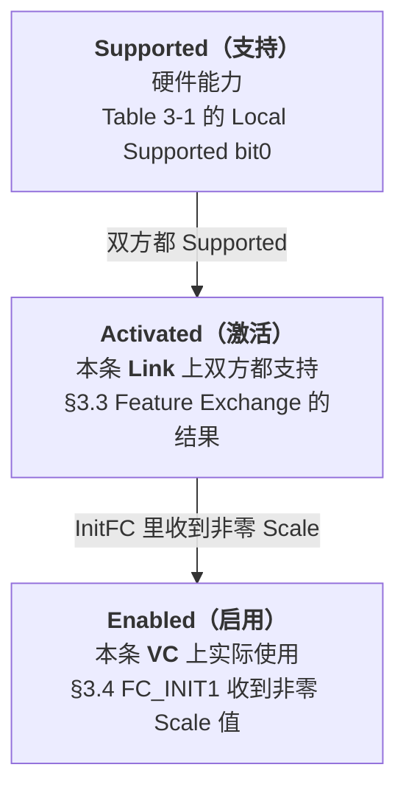

> [!abstract] 对应 Spec
> **Gen5 §3.4.2 Scaled Flow Control** — spec p.220 = [[gen5_chap3.pdf#page=12|gen5_chap3.pdf p.12]]
>
> 只有一页，但它是 [[01_34_S4_数据链路特性交换|§3.3 Feature Exchange]] 存在的**唯一理由**。
> 这一站把 §3.3 和 §3.4 闭环。
>
> 核心思想一句话：**DLLP 里的字段位数不够用了，那就让「1 个单位」代表更多 credit。**
>
> 📋 配套看板：[[01_36_S6_移位.canvas]] —— 三个缩放因子各一块，画出「内部计数器的哪几位上线」，并用 64 和 67 两个数算一遍，看清「用精度换量程」的代价。

![[01_36_S6_移位.canvas]]

# 1. 问题：为什么 credit 不够用了

spec 开门见山：

> Link performance can be affected when there are **insufficient flow control credits to account for the Link round trip time**.
> This effect becomes more noticeable at **higher Link speeds** and the limitation of **127 header credits** and **2047 data credits** can limit performance.

## 1.1 「round trip time」为什么会吃 credit ^rtt-eats-credit

这是理解本节的关键，我用一个具体流程来想：

```
时刻 T0：A 发出一个 TLP，消耗掉相应的 credit
   ↓ 电信号飞过去（飞行时延）
时刻 T1：B 收到，放进缓冲
   ↓ B 的上层把数据取走，腾出空间
时刻 T2：B 发出 UpdateFC，把 credit 还给 A
   ↓ 电信号飞回来
时刻 T3：A 收到 UpdateFC，credit 才真正回到 A 手上
```

> [!important] 关键点
> **从 T0 到 T3 这段时间里，那份 credit 一直是「在途」状态，A 用不了。**
>
> 所以 A 手上必须有**足够多的 credit**，才能在等待归还的这段时间里**持续不断地发**。
> 如果 credit 太少，A 就会发着发着卡住，干等 UpdateFC 回来——**链路带宽被浪费了。**
>
> 这在网络里叫 **带宽时延积（Bandwidth-Delay Product）**：
> **需要的在途容量 = 带宽 × 往返时延**

## 1.2 为什么「速率越高越明显」

因为**往返时延基本不变**（受限于走线长度、芯片流水线），但**带宽在翻倍**。

带宽 ↑，时延不变 → **带宽时延积 ↑** → 需要更多 credit。

## 1.3 估算一下 Gen5 到底差多少 ^bdp-estimate

> [!note] 以下是我自己的估算，不是 spec 原文，讲解时要说明是「量级估计」

假设：**Gen5 x16**，往返时延约 **1 µs**（含芯片内部处理，是个粗略的典型值）

```
链路带宽 ≈ 32 GT/s × 16 lane × (128/130 编码效率) ÷ 8
        ≈ 63 GB/s

带宽时延积 = 63 GB/s × 1 µs ≈ 63 KB   ← 需要这么多在途容量
```

而不用 Scaled FC 时的上限：

```
最大 data credit = 2047
1 个 data credit = 16 字节
最大在途容量 = 2047 × 16 B = 32,752 B ≈ 32 KB   ← 只有需求的一半
```

**差了一半。** 这就是 spec 说的「can limit performance」。

用上最大缩放（scale = 16）之后：

```
最大 data credit = 32,752
最大在途容量 = 32,752 × 16 B = 524,032 B ≈ 512 KB   ← 绰绰有余
```

---

# 2. 解法：不加位宽，改变「单位的含义」 ^scale-shift

## 2.1 最朴素的想法（以及为什么不行）

> [!question] 最直接的办法不是把 DLLP 里的 DataFC 字段从 12 位加宽到 16 位吗？
> **不行。** 因为 DLLP 是**固定 6 字节**的（见 [[01_32_S2_DLLP初识#^dllp-shape|S2]]），
> Type 1 字节 + 内容 3 字节 + CRC 2 字节，**没有空间了**。
>
> 而且就算有空间，改变包格式会**破坏和老设备的兼容性**。

## 2.2 实际的解法：换单位

> [!important] Scaled Flow Control 的全部思想
> **DLLP 里的字段位数一个都不改。改的是「1 个单位代表多少 credit」。**
>
> 就像秤的刻度：同样是 8 格的刻度盘，
> - 一格 = 1 克 → 最多称 8 克，精度 1 克
> - 一格 = 4 克 → 最多称 32 克，精度 4 克
> - 一格 = 16 克 → 最多称 128 克，精度 16 克
>
> **用精度换量程。**

具体到实现，就是**移位**：

| 方向 | 操作 | 含义 |
|---|---|---|
| **发送时** | `内部计数器 >> n` | 内部宽计数器，右移后取高位放进 DLLP |
| **接收时** | `DLLP 字段 << n` | 从 DLLP 取出，左移还原成内部宽计数器 |

## 2.3 代价：粒度 ^granularity-cost

> [!note] 用两个数算一遍就明白了（scale = 4）
> - 要通告 **64** 个 credit：`64 >> 2 = 16` 上线，对方 `16 << 2 = 64` ✅ 无损
> - 要通告 **67** 个 credit：`67 >> 2 = 16` 上线，对方 `16 << 2 = 64` —— **少了 3 个**
>
> 那 3 个 credit 没丢，只是**暂时通告不了**。接收方要等自己再腾出 1 个（凑到 68），才能上线报 17。
>
> **缩放因子 = 通告的最小粒度。** 因子 4 时 credit 只能 4 个 4 个地还，因子 16 时 16 个 16 个地还。
> 在高带宽场景下这个代价可以接受——反正 credit 总量很大，粒度粗一点无所谓。

---

# 3. Table 3-2：缩放因子对照表

> [!figure] Table 3-2 Scaled Flow Control Scaling Factors
> 原表 [[gen5_chap3.pdf#page=12|PDF p.12–13 / Spec p.220–221]]
> ![[gen5_tab3-2_scale_factors_part1.png]]
> ![[gen5_tab3-2_scale_factors_part2.png]]

## 3.1 整理的完整版 ^table-3-2

| Scale 值 | 支持 Scaled FC | Credit 类型 | 最小 credit | **最大 credit** | 内部计数器位宽 | **发送时** | **接收时** |
|---|---|---|---|---|---|---|---|
| `00b` | ❌ No | Hdr | 1 | **127** | 8 bit | `HdrFC` | `HdrFC` |
| `00b` | ❌ No | Data | 1 | **2,047** | 12 bit | `DataFC` | `DataFC` |
| `01b` | ✅ Yes | Hdr | 1 | **127** | 8 bit | `HdrFC` | `HdrFC` |
| `01b` | ✅ Yes | Data | 1 | **2,047** | 12 bit | `DataFC` | `DataFC` |
| `10b` | ✅ Yes | Hdr | **4** | **508** | 10 bit | `HdrFC >> 2` | `HdrFC << 2` |
| `10b` | ✅ Yes | Data | **4** | **8,188** | 14 bit | `DataFC >> 2` | `DataFC << 2` |
| `11b` | ✅ Yes | Hdr | **16** | **2,032** | 12 bit | `HdrFC >> 4` | `HdrFC << 4` |
| `11b` | ✅ Yes | Data | **16** | **32,752** | 16 bit | `DataFC >> 4` | `DataFC << 4` |

## 3.2 验算这张表 —— 数字全是自洽的

> [!important] 「最小 credit」= 缩放因子（也就是粒度）

| Scale | 因子 | 最小 credit | 说明 |
|---|---|---|---|
| `00b`/`01b` | ×1 | 1 | 一格 = 1 个 credit |
| `10b` | ×4 | **4** | 一格 = 4 个 credit，所以最小只能通告 4 |
| `11b` | ×16 | **16** | 一格 = 16 个 credit |

> [!important] 「最大 credit」= DLLP 字段能表示的最大值 × 缩放因子

**Header（DLLP 字段永远是 8 位，最大值 127）**

| Scale | 计算 | 结果 | 对上了吗 |
|---|---|---|---|
| `00b`/`01b` | 127 × 1 | 127 | ✅ |
| `10b` | 127 × 4 | **508** | ✅ |
| `11b` | 127 × 16 | **2,032** | ✅ |

**Data（DLLP 字段永远是 12 位，最大值 2047）**

| Scale | 计算 | 结果 | 对上了吗 |
|---|---|---|---|
| `00b`/`01b` | 2047 × 1 | 2,047 | ✅ |
| `10b` | 2047 × 4 | **8,188** | ✅ |
| `11b` | 2047 × 16 | **32,752** | ✅ |

> [!important] 这个验算揭示了最重要的一点 ^wire-width-unchanged
> **DLLP 里的 HdrFC 字段永远是 8 位，DataFC 字段永远是 12 位，从来没变过。**
>
> 表里那个「Field Width」列（8/10/12 和 12/14/16）说的是**芯片内部计数器**的位宽，
> **不是线上的字段位宽**。
>
> 我第一遍看这张表的时候就是被这一列误导了，以为 DLLP 变长了。**没有。**

## 3.3 为什么最大 header credit 是 127 而不是 255？ ^why-127

DLLP 里 HdrFC 是 8 位，理论最大 255，但表里写 127。

> [!question] 为什么少了一半？
> 因为 credit 计数器的**最高位另有用途**。在 §2.6（第 2 章）的 credit 计算规则里，
> credit 值是用**模运算**比较大小的，需要留出一半的空间来区分「领先」和「落后」。
>
> 简单说：8 位计数器只用 [0, 127] 这个范围表示有效 credit 数，
> **剩下的一半用来做回绕（wrap-around）判断。**
>
> Data 同理：12 位理论最大 4095，实际上限 2047，也是一半。
>
> **这个细节属于第 2 章，第 3 章只是引用结论。讲解时提一句就好，不展开。**
>
> 这个“半环消歧”思想也出现在 TLP 序号窗口、Figure 3-18 的 Ack/Nak 判断和重复/乱序判定中；但各公式的 `<`/`≤` 边界不同，Equation 3-1 左式还是“未确认数+1”，不能只背“2048 在途”。

---

# 4. Table 3-4：从 DLLP 字段视角看同一件事 ^table-3-4

§3.5 里还有一张 **Table 3-4**，讲的是同一件事，但视角更清楚：

> [!figure] Table 3-4 HdrScale and DataScale Encodings
> 原文：[[gen5_chap3.pdf#page=15|PDF p.15 / Spec p.223]]
> ![[gen5_tab3-4_scale_encodings.png]]

| HdrScale / DataScale | 支持 Scaled FC | 缩放因子 | **HdrFC DLLP 字段装的是** | **DataFC DLLP 字段装的是** |
|---|---|---|---|---|
| `00b` | No | **1** | `HdrFC[7:0]` | `DataFC[11:0]` |
| `01b` | Yes | **1** | `HdrFC[7:0]` | `DataFC[11:0]` |
| `10b` | Yes | **4** | `HdrFC[9:2]` | `DataFC[13:2]` |
| `11b` | Yes | **16** | `HdrFC[11:4]` | `DataFC[15:4]` |

> [!tip] 这张表比 Table 3-2 好懂
> 它直接说了：**DLLP 里装的是内部计数器的哪几位。**
>
> - `10b`：内部 10 位计数器 `HdrFC[9:0]`，DLLP 里放 **`[9:2]`**（丢掉最低 2 位）→ 正好 8 位
> - `11b`：内部 12 位计数器 `HdrFC[11:0]`，DLLP 里放 **`[11:4]`**（丢掉最低 4 位）→ 正好 8 位
>
> **「丢掉最低 n 位」= 「除以 2ⁿ」= 「一格代表 2ⁿ 个 credit」。三种说法是一回事。**

## 4.1 `00b` 和 `01b` 的区别 —— 一个很容易漏的坑 ^00-vs-01

> [!warning] `00b` 和 `01b` 的缩放因子**都是 1**，行为完全一样！
> 那为什么要两个编码？

看两张表的「支持 Scaled FC」列：

| 编码 | 缩放因子 | 「支持 Scaled FC」 | 真正的含义 |
|---|---|---|---|
| `00b` | 1 | **No** | 「**我不玩 Scaled FC**」 |
| `01b` | 1 | **Yes** | 「**我玩 Scaled FC，但这一类 credit 我用的因子是 1**」 |

> [!important] 这个区别很重要，因为它决定了后续 UpdateFC 怎么填
> spec §3.4.2 的规则：
> > If the received HdrScale and DataScale values recorded in state FC_INIT1 were **non-zero**,
> > then Scaled Flow Control is **enabled on this VC** and UpdateFC DLLPs must contain `01b`/`10b`/`11b`.
> >
> > If the received values were **zero**, then Scaled Flow Control is **not enabled on this VC**
> > and UpdateFC DLLPs must contain `00b`.
>
> 也就是说，**判断依据是「收到的值是不是 0」，而不是「因子是不是 1」**。
>
> 一个 Port 完全可能：**支持 Scaled FC，但某类 credit 数量不多，用因子 1 就够了**。
> 这时它填 `01b` 而不是 `00b`，告诉对方「Scaled FC 在这条 VC 上是启用的」。
>
> **`01b` 的存在，就是为了把「不支持」和「支持但用因子 1」区分开。**

> [!note] Hdr 和 Data 的因子可以不同
> spec 的规则是分开写的：HdrScale 由「最多会有多少个 header credit 在途」决定，DataScale 由「最多会有多少个 data credit 在途」决定。
> 所以一个 InitFC 里 `HdrScale = 01b`、`DataScale = 11b` 是完全合法的——header 少、data 多，各用各的因子。

---

# 5. 三个层次：Supported / Activated / Enabled ^three-levels

这一节最容易混的是三个词，spec 用得很精确：



| 词 | 作用域 | 判定依据 | 出现在 |
|---|---|---|---|
| **Supported** | **单个 Port** | 硬件固化的能力位 | §3.3 Table 3-1 |
| **Activated** | **整条 Link** | Local ∧ Remote 都置位 | §3.3 |
| **Enabled** | **单个 VC** | FC_INIT1 收到的 Scale 值非零 | §3.4.2 |

> [!question] 为什么要三层？两层不够吗？
> 因为**粒度不同**：
> - 「Supported」是硬件属性，不随链路变化
> - 「Activated」是链路属性，一条 Link 协商一次
> - 「Enabled」是 **VC 属性**，理论上不同 VC 可以有不同结果
>
> 虽然实际实现里三者通常是一致的，但 spec 把它们分开定义，
> **是为了让规则在所有边界情况下都不含糊。**

---

# 6. 完整规则汇总

## 6.1 Scaled FC **未激活**时

| 规则 |
|---|
| InitFC1 / InitFC2 / UpdateFC 的 HdrScale 和 DataScale **必须是 `00b`** |
| HdrFC 计数器 **8 位**，DLLP 字段包含它的**全部位** |
| DataFC 计数器 **12 位**，DLLP 字段包含它的**全部位** |

## 6.2 Scaled FC **已激活**时

| 规则 |
|---|
| InitFC1 / InitFC2 的 HdrScale **必须是 `01b`/`10b`/`11b`**，值由「该类型最多会有多少个 header credit 在途」决定 |
| InitFC1 / InitFC2 的 DataScale 同理 |
| 若 FC_INIT1 收到的 Scale 值**非零** → 该 VC 启用 Scaled FC，**UpdateFC 必须填 `01b`/`10b`/`11b`** |
| 若 FC_INIT1 收到的 Scale 值**为零** → 该 VC 不启用，**UpdateFC 必须填 `00b`** |

> [!note] 还有一条在 §3.5.1 里
> > In UpdateFCs, a Transmitter is **only permitted to send non-zero values** in the HdrScale and DataScale fields
> > **if it supports Scaled Flow Control and it received non-zero values** for HdrScale and DataScale in the InitFC1s and InitFC2s it received for this VC.
>
> 意思一样，但措辞是从「许可」角度写的：**没收到对方的非零 Scale，就不许自己发非零。**

## 6.3 关于速率的两条 ^rate-rules

| 规则 | 出处 |
|---|---|
| **所有 Port 都允许**支持 Scaled FC | §3.4.2 |
| 支持 **16.0 GT/s 及以上**的 Port **必须支持** Scaled FC | Table 3-1 / §3.4.2 |
| **Scaled FC 激不激活，不影响能否跑 16 GT/s 及以上** | §3.4.2 |

> [!important] 这三条合起来的含义
> **「必须支持」是对硬件的要求，「激活」是对链路的运行时状态。**
> 一个 Gen5 设备如果因为对端是老设备而没能激活 Scaled FC，
> **它照样跑 32 GT/s，只是性能可能达不到理论峰值。**
>
> 这就是 [[01_34_S4_数据链路特性交换#^must-support-vs-optional|S4 那个「矛盾」]] 的答案。

---

# 7. spec 规则逐条对照表

| # | spec 规则 | 本文位置 |
|---|---|---|
| 1 | 动机：credit 不足以覆盖往返时延；高速下更明显；127 / 2047 上限限制性能 | §1 |
| 2 | 所有 Port 都**允许**支持 Scaled FC | §6.3 |
| 3 | 支持 16.0 GT/s+ 的 Port **必须**支持 | §6.3 |
| 4 | 激活与否**不影响**在 16.0 GT/s+ 工作的能力 | §6.3 |
| 5 | 未激活：InitFC1/InitFC2/UpdateFC 的 Scale 字段必须为 00b | §6.1 |
| 6 | 未激活：HdrFC 计数器 8 位，字段含全部位 | §6.1 |
| 7 | 未激活：DataFC 计数器 12 位，字段含全部位 | §6.1 |
| 8 | 已激活：InitFC1/InitFC2 的 HdrScale 必须为 01b/10b/11b，由最大在途 header credit 数决定（Table 3-2） | §6.2 |
| 9 | 已激活：DataScale 同理，由最大在途 data credit 数决定 | §6.2 |
| 10 | FC_INIT1 记录的 Scale 非零 → 该 VC 启用；UpdateFC 填 01b/10b/11b | §6.2 / §4.1 |
| 11 | FC_INIT1 记录的 Scale 为零 → 该 VC 不启用；UpdateFC 填 00b | §6.2 / §4.1 |
| 12 | Table 3-2 全部 8 行（因子 / 最小 / 最大 / 内部位宽 / 发送移位 / 接收移位） | §3.1 |

（Table 3-4 属于 §3.5.1，其对照在 [[01_37_S7_DLLP详解]]。）

---

# 8. 自检

- [ ] Scaled FC 要解决什么问题？跟「往返时延」有什么关系？
- [ ] 为什么不能直接把 DLLP 里的 DataFC 字段加宽？
- [ ] Scaled FC 的基本手法是什么？代价是什么？用 67 个 credit、因子 4 算一遍。
- [ ] Scale = `10b` 时，DLLP 里的 HdrFC 字段是几位？内部计数器是几位？
- [ ] Scale = `11b` 时最大 data credit 是多少？自己算一遍。
- [ ] `00b` 和 `01b` 的缩放因子都是 1，为什么要两个编码？
- [ ] HdrScale 和 DataScale 可以不一样吗？
- [ ] Supported / Activated / Enabled 三个词的作用域分别是什么？
- [ ] Scaled FC 没激活，Gen5 设备还能跑 32 GT/s 吗？

---

## 相关笔记 Relation
- 上一站 → [[01_35_S5_流控初始化]]
- 下一站 → [[01_37_S7_DLLP详解]]
- **本节的前置协商** → [[01_34_S4_数据链路特性交换]]
- 本章导航 → [[01_3f_Gen5_DLL_MOC]]

## 来源 Reference
- Gen5 spec §3.4.2，p.220 → [[gen5_chap3.pdf#page=12|PDF p.12]]
- Table 3-4 在 §3.5.1，spec p.223 → [[gen5_chap3.pdf#page=15|PDF p.15]]
