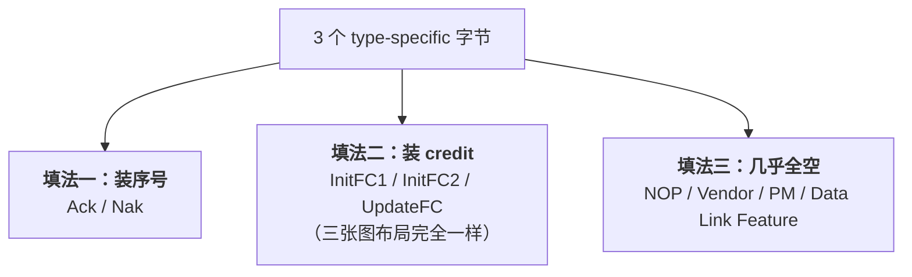

> [!abstract] 对应 Spec
> **Gen5 §3.5.1 后半（逐类型格式 + CRC）** — spec p.222–227 = [[gen5_chap3.pdf#page=14|gen5_chap3.pdf p.14–19]]
>
> 这是 **§3.5 的第二遍**。[[01_32_S2_DLLP初识|S2]] 只学了「壳」，这一站补「瓤」：
> 每种 DLLP 的 3 个 type-specific 字节里到底装了什么，以及 16-bit CRC 怎么算。
>
> 学完这一站，§3.6 的所有前置就齐了。
>
> 📋 配套看板：[[01_37_S7_格式画廊.canvas]] —— 8 种 DLLP 的字节布局并排摆在一起，一眼看出「只有三种填法」；末尾画了 CRC 位翻转的对应关系。

![[01_37_S7_格式画廊.canvas]]

# 1. 八张格式图的总览

spec 用 Figure 3-5 到 Figure 3-12 共 8 张图，画完了所有 DLLP 的格式。
**所有图都省略了 Byte 4–5 的 CRC 之外的细节**——因为 CRC 是通用的，单独在最后讲。

| 图 | 类型 | spec 页 | PDF 页 |
|---|---|---|---|
| Figure 3-5 | Ack / Nak | p.224 | [[gen5_chap3.pdf#page=16\|p.16]] |
| Figure 3-6 | NOP | p.224 | [[gen5_chap3.pdf#page=16\|p.16]] |
| Figure 3-7 | InitFC1 | p.224 | [[gen5_chap3.pdf#page=16\|p.16]] |
| Figure 3-8 | InitFC2 | p.224 | [[gen5_chap3.pdf#page=16\|p.16]] |
| Figure 3-9 | UpdateFC | p.225 | [[gen5_chap3.pdf#page=17\|p.17]] |
| Figure 3-10 | PM | p.225 | [[gen5_chap3.pdf#page=17\|p.17]] |
| Figure 3-11 | Vendor-specific | p.225 | [[gen5_chap3.pdf#page=17\|p.17]] |
| Figure 3-12 | Data Link Feature | p.225 | [[gen5_chap3.pdf#page=17\|p.17]] |

> [!figure] Figure 3-5 至 3-12 原始格式图
> [[gen5_chap3.pdf#page=16|PDF p.16–17 / Spec p.224–225]]
> ![[gen5_fig3-5to8_dllp_fmt.png]]
> ![[gen5_fig3-9to12_dllp_fmt.png]]

---

# 2. 三种「填法」把八张图分完 ^three-fill-styles

看完八张图我发现，3 个 type-specific 字节其实只有三种填法：



**记住这三类，八张图就不用一张张背了。**

---

# 3. 填法一：Ack / Nak（Figure 3-5）

```
        +0              +1              +2              +3
   7......0        7......0        7......0        7......0
  ┌──────────────┬───────────────────────┬───────────────────────┐
0 │ 0000 0000 Ack│      Reserved         │   AckNak_Seq_Num      │
  │ 0001 0000 Nak│      （12 bit）        │      （12 bit）        │
  ├──────────────┴───────────┬───────────┴───────────────────────┘
4 │       16-bit CRC         │
  └──────────────────────────┘
```

| 字段 | 位宽 | 含义 |
|---|---|---|
| DLLP Type | 8 | `0000 0000` = Ack，`0001 0000` = Nak |
| Reserved | 12 | 全填 0 |
| **AckNak_Seq_Num** | **12** | **本次确认 / 否定确认所涉及的 TLP 序号** |

## 3.1 spec 在这里说了什么 ^ack-cumulative

§3.5.1 对 Ack/Nak 只有两句话：

> - The **AckNak_Seq_Num** field is used to indicate **what TLPs are affected**
> - Transmission and reception is handled by the Data Link Layer according to the rules provided in **Section 3.6**

> [!important] 注意这里的用词是「what TLPs（复数）are affected」
> 不是「哪一个 TLP」，是「**哪些** TLP」。
>
> 这暗示了 Ack 是**累积确认（cumulative）**：一条 Ack 携带序号 N，
> 意思是「**序号 ≤ N 的 TLP 我全都收好了**」，而不是「只有 N 这一个收好了」。
>
> 这就是为什么 [[01_31_S1_数据链路层概述#^self-repairing|S1]] 里说
> **「Ack 丢了没关系，下一条 Ack 会覆盖它」**——因为后一条 Ack 的序号更大，天然包含前一条的信息。
>
> **具体语义在 §3.6，这里只需要建立这个直觉。** S10 会给出精确定义：`AckNak_Seq_Num = NEXT_RCV_SEQ - 1`，即「我已正确收到的最后一个序号」。

## 3.2 为什么序号是 12 位 ^why-12-bits

> [!question] 12 位 = 0 到 4095，为什么是这个数？
> 序号的作用是**区分「哪些 TLP 还在飞」**。所以序号空间必须**大于**任何时刻在途的 TLP 数量，
> 否则会绕回来产生歧义（发送方分不清这是新的 #5 还是上一轮的 \#5）。
>
> §3.6 会给出一条硬性约束：**在途 TLP 的序号范围不得超过 2048**（也就是序号空间的一半）。
> 留一半空间做回绕判断——**和 [[01_36_S6_ScaledFC#^why-127|S6 里 credit 计数器只用一半]] 是同一个套路。**
>
> 这个 12 位的选择留到 S8/S9 详细验证。

---

# 4. 填法二：InitFC1 / InitFC2 / UpdateFC（Figure 3-7 / 3-8 / 3-9）^fc-dllp-layout

**三张图的布局完全相同，只有 Byte 0 的类型编码不同。**

```
        +0                     +1              +2              +3
   7......0               7......0        7......0        7......0
  ┌──────-──┬─┬────-─┬──────────────────────────────────────────────-┐
0 │ 家族+类型│0│v[2:0]│  HdrScale + HdrFC + DataScale + DataFC        │
  │  4 bit  │ │ VCID │              （共 24 bit）                     │
  ├───────-─┴─┴──┬─-─┴───────────────────────────────────────────────┘
4 │ 16-bit CRC   │
  └─────────────-┘
```

## 4.1 Byte 0 的编码（回顾 [[01_32_S2_DLLP初识#^fc-encoding-structure|S2]]）

| 家族 | InitFC1 | InitFC2 | UpdateFC |
|---|---|---|---|
| **-P** | `0100 0vvv` | `1100 0vvv` | `1000 0vvv` |
| **-NP** | `0101 0vvv` | `1101 0vvv` | `1001 0vvv` |
| **-Cpl** | `0110 0vvv` | `1110 0vvv` | `1010 0vvv` |

`vvv` = **VC ID**（图里写作 `v[2:0] - VC ID`），bit[3] 固定为 `0`。

## 4.2 四个字段

§3.5.1 的规则：

| 字段 | 位宽 | 规则原文要点 |
|---|---|---|
| **HdrFC** | 8 | contains the **credit value for headers** of the indicated type (P, NP, or Cpl) |
| **DataFC** | 12 | contains the **credit value for payload Data** of the indicated type |
| **HdrScale** | 2 | contains the **scaling factor for headers**，编码见 Table 3-4 |
| **DataScale** | 2 | contains the **scaling factor for payload data**，编码见 Table 3-4 |

**位宽合计：8 + 12 + 2 + 2 = 24 bit = 正好 3 个字节。** ✅

> [!important] 这个「正好填满」不是巧合，是 Scaled FC 能被塞进来的原因 ^scale-from-reserved
> PCIe 3.0 时代只有 HdrFC(8) + DataFC(12) = 20 bit，**剩下 4 bit 是 Reserved**。
>
> PCIe 4.0 加 Scaled Flow Control 时，就把这 4 个 Reserved bit 拿去做了 HdrScale(2) + DataScale(2)。
> **包格式一个字节都没改，完美向后兼容**——老设备把这 4 位当 Reserved 忽略掉，新设备赋予它含义。
>
> 这正是 [[01_32_S2_DLLP初识#^reserved-rule|S2 讲的 Reserved 规则]]的实战效果。
> **「发送方填 0、接收方忽略」这条规矩，让 20 年后的扩展成为可能。**
>
> 而 [[01_35_S5_流控初始化#^accept-both|S5]] 里那句「If the Receiver **supports** Scaled Flow Control, record the HdrScale/DataScale」就是这个兼容性在行为上的体现：**不支持的接收方，读到的就是 4 个 Reserved 位。**

## 4.3 Gen5 图中 Scale 字段的确切位置 ^figures-stale

> [!success] 已按 Gen5 Figure 3-7 / 3-8 / 3-9 逐位复核
> 三张图都明确画出了 `HdrScale` 与 `DataScale`，不是旧图遗漏。下面的位布局是**图中直接给出的格式**，不是推断。

**规范图给出的位布局：**

| 字节 | bit 7 | bit 6 | bit 5 | bit 4 | bit 3 | bit 2 | bit 1 | bit 0 |
|---|---|---|---|---|---|---|---|---|
| **Byte 1** | HdrScale[1] | HdrScale[0] | HdrFC[7] | HdrFC[6] | HdrFC[5] | HdrFC[4] | HdrFC[3] | HdrFC[2] |
| **Byte 2** | HdrFC[1] | HdrFC[0] | DataScale[1] | DataScale[0] | DataFC[11] | DataFC[10] | DataFC[9] | DataFC[8] |
| **Byte 3** | DataFC[7] | DataFC[6] | DataFC[5] | DataFC[4] | DataFC[3] | DataFC[2] | DataFC[1] | DataFC[0] |

> [!note] 三重交叉检查
> 1. Figure 3-7/3-8/3-9 直接标出字段边界；
> 2. 总位宽 `2 + 8 + 2 + 12 = 24 bit`；
> 3. Table 3-4 给出 Scale 编码。三者一致。

## 4.4 三条使用规则

| 规则 | 出处 |
|---|---|
| Scaled FC 激活时，**所有** InitFC1 / InitFC2 / UpdateFC 的 Scale 字段必须是 `01b`/`10b`/`11b` | §3.5.1 |
| UpdateFC 里发非零 Scale 的**前提**：自己支持 Scaled FC **且** 该 VC 的 InitFC1/InitFC2 收到过非零 Scale | §3.5.1 |
| 详见 → | [[01_36_S6_ScaledFC]] |

## 4.5 谁触发发送、内容交给谁 ^who-triggers

> Transmission is triggered by the **Data Link Layer** when initializing Flow Control for a Virtual Channel (see §3.4),
> and **following Flow Control initialization by the Transaction Layer** according to the rules in §2.6.

> [!important] 同一种 DLLP，两个不同的「主人」
> | 时期 | 谁触发发送 | 依据的章节 |
> |---|---|---|
> | **初始化期间**（InitFC1/InitFC2） | **数据链路层** | §3.4（本章） |
> | **初始化完成后**（UpdateFC） | **事务层** | §2.6（第 2 章） |
>
> 这解释了一件我之前没想通的事：**为什么 UpdateFC 的发送时机规则不在第 3 章？**
> 因为「什么时候该还 credit」是事务层的缓冲管理逻辑决定的，
> **数据链路层只负责「把它打成包发出去」这个动作。**

接收侧的规则：

> Checked for integrity on reception by the Data Link Layer and if correct,
> the information content of the DLLP is **passed to the Transaction Layer**. If the check fails, the information is **discarded**.

以及一条提醒：

> Note: **InitFC1 and InitFC2 DLLPs are used only for VC initialization**

---

# 5. 填法三：几乎全空的四种

## 5.1 NOP DLLP（Figure 3-6）^nop-footnote

```
Byte 0 : 0011 0001
Byte 1-3 : { Arbitrary Value }   ← 任意值
Byte 4-5 : 16-bit CRC
```

规则只有一句：

> Receivers shall **discard this DLLP without action** after checking it for data integrity.

> [!question] 一个「收到就扔」的包，存在的意义是什么？
> 本章只规范了它的编码和接收行为，并**没有规定 keepalive、时序对齐等用途**。
> 可以把它当作“无语义 DLLP”；具体发送场景若由某个实现或测试规范定义，应以那份文档为准。
>
> spec 给了一条**很重要的脚注（53）**：
> > This is a special case of the more general rule for **unsupported DLLP Type encodings** (see §3.6.2.2).
>
> 也就是说：**接收方处理 NOP 的方式，跟处理「不认识的 DLLP 类型」的方式是一样的——校验通过就丢掉。**
>
> **这条脚注很关键**：它说明 PCIe 对未知 DLLP 的态度是「静默忽略」而不是「报错」。
> 这正是 [[01_34_S4_数据链路特性交换#^four-fields|S4 里 `Exchange Enable` 开关]]所依赖的前提——
> 而那个开关的存在，恰恰说明**有些老硬件没做到这一点**。

> [!note] 「任意值」是真的任意
> Byte 1–3 不是 Reserved（Reserved 要求填 0），是 **Arbitrary Value**——发送方想填什么填什么。
> 反正接收方校验完 CRC 就扔，内容无所谓。这是 8 种 DLLP 里唯一一个 type-specific 字节「不受任何约束」的。

## 5.2 Vendor-specific DLLP（Figure 3-11）

```
Byte 0 : 0011 0000
Byte 1-3 : { defined by vendor }   ← 厂商自定义
Byte 4-5 : 16-bit CRC
```

规则是两条**建议（recommended）**，不是**要求（must）**：

> - It is **recommended** that receivers **silently ignore** Vendor Specific DLLPs unless enabled by implementation specific mechanisms.
> - It is **recommended** that transmitters **not send** Vendor Specific DLLPs unless enabled by implementation specific mechanisms.

> [!note] 注意措辞是 recommended 而不是 must
> spec 在这里故意留了余地——因为厂商自定义的东西，规范管不了也不想管。
> **默认双方都装作看不见，除非有私有机制显式打开。**
>
> 编码 `0011 0000`（Vendor）和 `0011 0001`（NOP）只差 bit[0]，挨在一起，这个分组是刻意的。

## 5.3 PM DLLP（Figure 3-10）

```
Byte 0 : 0010 0xxx      ← xxx 区分 4 种 PM DLLP
Byte 1-3 : Reserved     ← 全 0
Byte 4-5 : 16-bit CRC
```

| bit[2:0] | 完整编码 | 类型 |
|---|---|---|
| `000` | `0010 0000` | PM_Enter_L1 |
| `001` | `0010 0001` | PM_Enter_L23 |
| `011` | `0010 0011` | PM_Active_State_Request_L1 |
| `100` | `0010 0100` | PM_Request_Ack |

> [!important] PM DLLP 的信息**全在 Type 字节里**
> 3 个 type-specific 字节**全是 Reserved**。
> 也就是说，**「是哪种 PM 消息」就是全部的信息**，不需要携带任何参数。
>
> （`010`、`101`、`110`、`111` 这四个编码没有定义，属于 Reserved **编码**——按 [[01_32_S2_DLLP初识#^reserved-field-vs-encoding|S2 §3.1]]，收到就静默丢弃。）

规则：

> - Transmission is triggered by the component's **power management logic** according to the rules in **Chapter 5**
> - Checked for integrity on reception by the Data Link Layer, then **passed to the component's power management logic**

> [!tip] 数据链路层在这里只是个搬运工
> **它不理解 PM DLLP 的含义，只负责打包、校验、转交。**
> 电源管理的完整语义在**第 5 章**，不属于第 3 章。
>
> 讲解时点到为止：「有这么 4 种 PM DLLP，第 3 章只管收发，语义看第 5 章。」

## 5.4 Data Link Feature DLLP（Figure 3-12）

```
Byte 0 : 0000 0010
Byte 1-3 : Feature Ack (1 bit) + Feature Supported (23 bit)
Byte 4-5 : 16-bit CRC
```

规则：

> - The **Feature Ack** bit is set to indicate that the transmitting Port **has received a Data Link Feature DLLP**.
> - The **Feature Supported** bits indicate the features supported by the transmitting Port.
>   These bits **equal the value of the Local Data Link Feature Supported field**（§7.7.4.2）。

> [!note] 位宽验算
> Table 3-1 定义 Feature Supported 是 **bit 22:0**（共 **23** 位，其中 bit0 = Scaled FC，bit 22:1 Reserved）。
> 加上 **Feature Ack** 1 位 = **24 位 = 正好 3 个字节** ✅
>
> Gen5 Figure 3-12 已明确画出位置：**Feature Ack = Byte 1 bit[7]**，其余 23 bit 为 Feature Support。

协议怎么用这两个字段，见 [[01_34_S4_数据链路特性交换#^feature-ack-bit|S4]]。

---

# 6. 16-bit CRC ^crc-params

这是 §3.5.1 的最后一块，也是唯一**所有 DLLP 共用**的部分。

## 6.1 四条计算规则

> - The polynomial used for CRC calculation has a coefficient expressed as **100Bh**
> - The **seed value**（initial value for CRC storage registers）is **FFFFh**
> - CRC calculation **starts with bit 0 of byte 0** and proceeds **from bit 0 to bit 7 of each byte**
> - CRC calculation uses **all bits of the DLLP, regardless of field type, including Reserved fields**.
>   The result of the calculation is **complemented**, then placed into the 16-bit CRC field as shown in Table 3-5.

| 参数 | 值 | 说明 |
|---|---|---|
| **多项式** | `100Bh` | 展开 = **x¹⁶ + x³ + x + 1** |
| **初始值（seed）** | `FFFFh` | 全 1，不是全 0 |
| **计算范围** | **Byte 0–3**（4 字节，32 位） | 就是 Type + type-specific |
| **位序** | 每字节 **bit 0 → bit 7** | **LSB first** |
| **Reserved 位** | **参与计算** | 语义上忽略，物理上要算 |
| **最后一步** | **取反（complemented）** | 结果按位取反 |

> [!note] 多项式 `100Bh` 怎么展开
> ```
> 0x100B = 1 0000 0000 0000 1011
>          ▲                ▲ ▲▲
>        bit16            bit3 bit1
>                              bit0
> ```
> → **x¹⁶ + x³ + x¹ + x⁰ = x¹⁶ + x³ + x + 1**

> [!note] 不要从参数反推未经规范陈述的设计目的
> `FFFFh` seed 与末尾取反是 PCIe 规定的 CRC 参数，实现必须照做。它们确实会改变全零输入等模式的余数，
> 但 Gen5 §3.5.1 没有把设计理由写成“为检测链路断开或前导零丢失”，因此这里只记录**规则**，不把工程直觉冒充规范结论。

## 6.2 Table 3-5：结果怎么放进 CRC 字段 ^crc-bitmap

> [!note] 原表可直接在 PDF 查看
> **Table 3-5 Mapping of Bits into CRC Field**
> 位置：[[gen5_chap3.pdf#page=18|gen5_chap3.pdf p.18]]（spec p.226）
> 这张表在 PDF 里是很长的两列 16 行，**截图不如看我下面的归纳**，可以不截。

spec 的原表是这样的（CRC 结果 bit → 16-bit CRC 字段里的位置）：

| 结果 bit | 0 | 1 | 2 | 3 | 4 | 5 | 6 | 7 |
|---|---|---|---|---|---|---|---|---|
| **字段位置** | 7 | 6 | 5 | 4 | 3 | 2 | 1 | 0 |

| 结果 bit | 8 | 9 | 10 | 11 | 12 | 13 | 14 | 15 |
|---|---|---|---|---|---|---|---|---|
| **字段位置** | 15 | 14 | 13 | 12 | 11 | 10 | 9 | 8 |

> [!important] 这张 16 行的表，一句话就能概括
> **把 CRC 结果的两个字节，各自在字节内部做位序翻转（bit reversal）。**
>
> - 结果的低字节 `result[7:0]` → 翻转后放进 **DLLP Byte 4**
> - 结果的高字节 `result[15:8]` → 翻转后放进 **DLLP Byte 5**
>
> 验证：结果 bit0 → 字段 bit7（Byte4 的 MSB），结果 bit7 → 字段 bit0（Byte4 的 LSB）✅ 翻转
> 结果 bit8 → 字段 bit15（Byte5 的 MSB），结果 bit15 → 字段 bit8（Byte5 的 LSB）✅ 翻转
>
> **不用背 16 行，记住「每个字节内部位序翻转」就够了。** S8 会看到 TLP 的 LCRC（Table 3-6，32 行）是**同一条规律**。

> [!question] 为什么要翻转？
> 因为 **CRC 计算是 LSB-first 进行的**（规则第 3 条：每字节从 bit 0 到 bit 7），
> 而 CRC 移位寄存器**吐出结果的顺序**和「按字节存放」的顺序是反的。
>
> 做一次位翻转，就能让 CRC 在**线上传输时**恰好以约定的顺序出现，
> 接收方按同样的方式算、同样的方式比对，就能对上。
>
> **这是 CRC 硬件实现里非常常见的一个「位序适配」步骤**，不是 PCIe 独创。

## 6.3 Figure 3-13：CRC 计算电路图

> [!figure] Figure 3-13 Diagram of CRC Calculation for DLLPs
> 原文：[[gen5_chap3.pdf#page=19|PDF p.19 / Spec p.227]]
> ![[gen5_fig3-13_dllp_crc.png]]

> [!tip] 这张图怎么看
> 它画的是一个 **16 级 LFSR（线性反馈移位寄存器）**：
> - 16 个方框 = 16 个触发器（图例写着 `> = Flip flop`），对应 CRC 寄存器的 16 位
> - 输入端按 **Byte 0 → Byte 1 → Byte 2 → Byte 3** 的字节顺序、每字节 **bit 0 → bit 7** 的位顺序喂进去；图中的省略号包含 Byte 3
> - 中间的异或点位置，就对应多项式 x¹⁶ + x³ + x + 1 里的那几项
>
> **讲解时不需要逐个门讲**，说明三件事就够了：
> 1. 这是硬件里的标准 LFSR 结构，**每个时钟周期吃 1 bit**（实际实现会并行化）
> 2. 图上的抽头位置由多项式 `100Bh` 决定
> 3. 图右下角标注的位序（`7654` / `3210`）印证了「**LSB first**」这条规则
>
> **数学原理（伽罗华域、生成多项式）不属于第 3 章**，组里 `01_f0_编码原理_1_伽罗华域` 有笔记，可以引用过去。

## 6.4 一条容易忽略的边界规则

§3.5.1 开头还有一句，讲的是 DLLP 和 TLP 的区分：

> DLLPs are **differentiated from TLPs when they are presented to, or received from, the Physical Layer**.

> [!note] 这句话在划边界
> **「怎么区分这是 DLLP 还是 TLP」不是第 3 章的事，是层间接口的事。**
>
> 实际实现里靠的是物理层的成帧符号：
> - 8b/10b 时代：`SDP`（Start DLLP）vs `STP`（Start TLP）
> - 128b/130b 时代：不同的 Token
>
> **但这些属于第 4 章。** 第 3 章只说「它们是被区分开的」，不说怎么区分。

---

# 7. 全部八种 DLLP 一览

| DLLP | Type 编码 | Byte 1–3 装什么 | 谁最终消费 | 详讲章节 |
|---|---|---|---|---|
| **Ack** | `0000 0000` | Reserved(12) + AckNak_Seq_Num(12) | **数据链路层自己** | §3.6 |
| **Nak** | `0001 0000` | 同上 | **数据链路层自己** | §3.6 |
| **InitFC1** -P/NP/Cpl | `0100/0101/0110 0vvv` | HdrScale(2)+HdrFC(8)+DataScale(2)+DataFC(12) | 事务层 | §3.4 |
| **InitFC2** -P/NP/Cpl | `1100/1101/1110 0vvv` | 同上 | 事务层 | §3.4 |
| **UpdateFC** -P/NP/Cpl | `1000/1001/1010 0vvv` | 同上 | 事务层 | §2.6 |
| **PM_\*** | `0010 0xxx` | **全 Reserved** | 电源管理逻辑 | 第 5 章 |
| **Vendor-specific** | `0011 0000` | 厂商自定义 | 厂商私有 | — |
| **NOP** | `0011 0001` | 任意值 | **丢弃** | — |
| **Data Link Feature** | `0000 0010` | Feature Ack(1) + Feature Supported(23) | 数据链路层 | §3.3 |

---

# 8. 到这里，§3.5 学完了

现在我手上有：
- ✅ DLLP 的通用形状和类型表（S2）
- ✅ 每种 DLLP 的字段布局（本站）
- ✅ CRC 的算法（本站）

**§3.6 需要的所有前置都齐了。** 下一站开始啃全章最大的一块：数据完整性与重传。

---

# 9. spec 规则逐条对照表（§3.5.1 后半）

| # | spec 规则 | 本文位置 |
|---|---|---|
| 1 | Ack/Nak：AckNak_Seq_Num 指示**哪些** TLP 受影响 | §3.1 |
| 2 | Ack/Nak：收发由 DLL 按 §3.6 处理 | §3.1 |
| 3 | FC DLLP：HdrFC = 该类型 header 的 credit 值 | §4.2 |
| 4 | FC DLLP：DataFC = 该类型 payload data 的 credit 值 | §4.2 |
| 5 | FC DLLP：HdrScale = header 的缩放因子（Table 3-4） | §4.2 |
| 6 | FC DLLP：DataScale = payload data 的缩放因子（Table 3-4） | §4.2 |
| 7 | Scaled FC 激活 → 所有 InitFC1/InitFC2/UpdateFC 的 Scale 必须为 01b/10b/11b | §4.4 |
| 8 | UpdateFC 只有在**支持** Scaled FC **且**收到过非零 Scale 时才允许发非零 | §4.4 |
| 9 | 格式见 Figure 3-7 / 3-8 / 3-9 | §4 |
| 10 | 发送触发：初始化时由 DLL（§3.4）；初始化后由事务层（§2.6） | §4.5 |
| 11 | 接收：DLL 校验，正确则内容交事务层，失败则丢弃 | §4.5 |
| 12 | Note：InitFC1 / InitFC2 仅用于 VC 初始化 | §4.5 |
| 13 | Table 3-4 全部 4 行 | §4.2 / [[01_36_S6_ScaledFC#^table-3-4\|S6]] |
| 14 | PM DLLP：由组件电源管理逻辑按第 5 章触发发送 | §5.3 |
| 15 | PM DLLP：DLL 校验后交给电源管理逻辑 | §5.3 |
| 16 | Vendor-specific：**建议**接收方静默忽略（除非实现特定机制使能） | §5.2 |
| 17 | Vendor-specific：**建议**发送方不发（除非实现特定机制使能） | §5.2 |
| 18 | NOP：接收方校验后**丢弃不处理** | §5.1 |
| 19 | 脚注 53：NOP 是「不支持的 Type 编码」通用规则的特例（§3.6.2.2） | §5.1 |
| 20 | Data Link Feature：Feature Ack 位表示发送 Port 已收到过 Data Link Feature DLLP | §5.4 |
| 21 | Data Link Feature：Feature Supported = Local Data Link Feature Supported（§7.7.4.2） | §5.4 |
| 22 | Figure 3-5 ~ 3-12 八张格式图 | §1 / §3–§5 |
| 23 | DLLP 与 TLP 在交给/来自物理层时被区分 | §6.4 |
| 24 | DLLP 用 16-bit CRC 保护 | §6 |
| 25 | CRC 多项式 100Bh | §6.1 |
| 26 | seed = FFFFh | §6.1 |
| 27 | 从 byte 0 的 bit 0 开始，每字节 bit 0 → bit 7 | §6.1 |
| 28 | 使用 DLLP 全部位，含 Reserved | §6.1 |
| 29 | 结果取反后按 Table 3-5 映射到 CRC 字段 | §6.2 |
| 30 | Table 3-5 全部 16 行 | §6.2 |
| 31 | Figure 3-13 | §6.3 |

---

# 10. 自检

- [ ] Ack/Nak 的 AckNak_Seq_Num 是多少位？spec 说它指示「什么」？
- [ ] InitFC 类 DLLP 的四个字段各多少位？加起来正好是多少？说明了什么？
- [ ] PCIe 4.0 加 Scaled FC 时，HdrScale/DataScale 这 4 位是从哪来的？
- [ ] Gen5 的 Figure 3-7/3-8/3-9 里，HdrScale/DataScale 分别位于哪几位？
- [ ] UpdateFC 在初始化完成后，是谁触发发送的？为什么规则不在第 3 章？
- [ ] NOP DLLP 收到后怎么处理？这条规则是哪条更一般规则的特例？NOP 的 Byte 1–3 和 PM 的 Byte 1–3 有什么不同？
- [ ] PM DLLP 的 3 个 type-specific 字节装了什么？
- [ ] CRC 的多项式、seed、计算范围、位序分别是什么？Reserved 位参与计算吗？
- [ ] Table 3-5 那 16 行，用一句话怎么概括？

---

## 相关笔记 Relation
- 上一站 → [[01_36_S6_ScaledFC]]
- 第一遍读 §3.5 → [[01_32_S2_DLLP初识]]
- 下一站 → [[01_38_S8_数据完整性_发送端]]
- 本章导航 → [[01_3f_Gen5_DLL_MOC]]

## 来源 Reference
- Gen5 spec §3.5.1 后半，p.222–227 → [[gen5_chap3.pdf#page=14|PDF p.14–19]]
