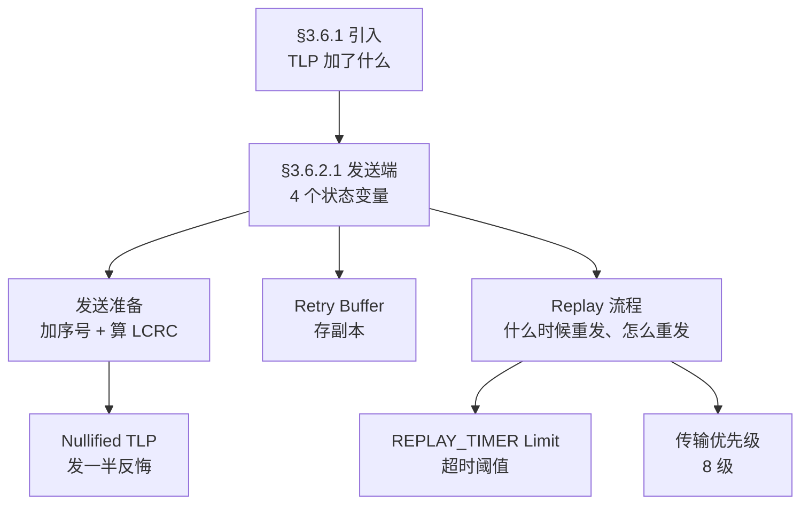

> [!abstract] 对应 Spec
> **Gen5 §3.6 / §3.6.1 / §3.6.2 / §3.6.2.1** — spec p.227–234 = [[gen5_chap3.pdf#page=19|gen5_chap3.pdf p.19–26]]
>
> 从这一站开始进入**全章的心脏**。§3.6 共 18 页，占全章一半，讲的就是
> [[01_31_S1_数据链路层概述#3.2 Error Detection and Retry（检错与重传）—— 展开在 §3.6|S1 里那张 6 条清单]]。
>
> ⚠️ **本站起，笔记体例有变化。** §3.1–§3.5 规则少、以定性描述为主，白话讲得完；
> **§3.6 是密集的编号规则 + 精确数值**，白话之外我额外加了「**spec 规则逐条对照**」表，
> 保证一条不漏。读的时候：**先看白话理解机制，再对着规则表逐条核对。**
>
> 配套看板（4 张）：`01_pcie/note/01_30_数据链路层/01_35_数据完整性/`

# 0. 引入



---

# 1. §3.6.1 数据链路层给 TLP 加了什么

## 1.1 分工声明

> The **Transaction Layer provides TLP boundary information** to the Data Link Layer.
> This allows the Data Link Layer to apply a TLP Sequence Number and a Link CRC (LCRC).

> [!important] 「boundary information（边界信息）」这个词很关键
> 事务层交给数据链路层的**不只是一串字节，还有「这个 TLP 从哪开始、到哪结束」**。
>
> 为什么必须有边界？因为数据链路层要在**头部插序号、尾部加 LCRC**，
> 不知道边界就不知道插在哪。
>
> 后面 §3.6.2.1 ：
> > The Data Link Layer treats the TLP as a **"black box"** and **does not process or modify the contents** of the TLP
>
> **数据链路层完全不看 TLP 的内容**，它只在外面套一层壳。
> 这个「黑盒」原则在收发两侧都出现了，是分层设计的教科书式体现。 ^black-box

## 1.2 接收侧要检查三样东西

> The Receive Data Link Layer validates received TLPs by checking
> the **TLP Sequence Number**, **LCRC code** and **any error indications from the Receive Physical Layer**.

| 检查项 | 能发现什么 |
|---|---|
| **TLP Sequence Number** | 有没有**丢包**、有没有**重复** |
| **LCRC** | 内容有没有**传错** |
| **物理层的错误指示** | 编码错、帧错等**更底层的问题** |

> [!note] 第三项容易被忽略
> **物理层会主动告诉数据链路层「这个包我收的时候就有问题」**（Receiver Error）。
> 数据链路层不用自己发现，直接信物理层的判断。
> 这在 §3.6.2.2 和 §3.6.3.1 的规则里都是**第一条**（优先级最高）。

## 1.3 Figure 3-14：加工后的 TLP

> [!figure] Figure 3-14 TLP with LCRC and TLP Sequence Number Applied
> 原文：[[gen5_chap3.pdf#page=20|PDF p.20 / Spec p.228]]
> ![[gen5_fig3-14_tlp_with_lcrc.png]]

```
   +0         +1              +2 ... 
  ┌────┬──────────────────┬─────────────────────────────┐
  │0000│ TLP Sequence Num │       {TLP Header}          │  ...
  │4bit│    12 bit        │                             │
  └────┴──────────────────┴─────────────────────────────┘
        ┌─────────────────────────────────────────┐
  ... → │            32-bit LCRC                  │
        └─────────────────────────────────────────┘
         +(N-3)  +(N-2)  +(N-1)  +N
```

| 位置                             | 内容                      | 大小         |
| ------------------------------ | ----------------------- | ---------- |
| Symbol +0，bit[7:4]             | `0000b`                 | **4 bit**  |
| Symbol +0 bit[3:0] + Symbol +1 | **TLP Sequence Number** | **12 bit** |
| 中间                             | 事务层给的 TLP 原文（黑盒）        | 可变         |
| 最后 4 字节                        | **32-bit LCRC**         | **32 bit** |

**数据链路层给 TLP 增加的开销 = 头部 2 字节 + 尾部 4 字节 = 6 字节。** ^tlp-overhead

## 1.4 那 4 个 bit 不完全是 Reserved

spec:

> On Ports that **support Protocol Multiplexing**, packets containing a **non-zero value** in Symbol +0, bits 7:4 are **PMUX Packets**.
> For TLPs, these bits **must be 0000b**. See Appendix G for details.
>
> On Ports that **do not support** Protocol Multiplexing, Symbol +0, bits 7:4 are **Reserved**.

> [!question] 所以这 4 位到底是什么？
> **取决于这个 Port 支不支持 Protocol Multiplexing（PMUX，协议复用）：**
>
> | Port 是否支持 PMUX | bit[7:4] 的含义 |
> |---|---|
> | **不支持** | **Reserved**（填 0，忽略） |
> | **支持** | **非 0 = 这是一个 PMUX Packet，不是 TLP**；TLP 必须填 `0000b` |
>
> **Protocol Multiplexing:** 多路复用，让其他协议和 pcie协议共用同一条物理链路，复用物理层和链路训练，但绝大多数的pcie器件实际不支持PMUX
> Q:找一些例子叙述pmux功能

---

# 2. §3.6.2 发送端总览

spec §3.6.2 的开头一段，把整个发送端压缩成了一句话链条。我把它拆开：

> The TLP transmission path ... prepares each TLP for transmission by
> ① **applying a sequence number**, then 
> ② **calculating and appending a Link CRC (LCRC)** ...
> TLPs are ③ **stored in a retry buffer**, and are 
> ④ **re-sent unless a positive acknowledgement of receipt is received** ...
> If ⑤ **repeated attempts to transmit a TLP are unsuccessful**, the Transmitter will determine that the Link is not operating correctly,
> and will ⑥ **instruct the Physical Layer to retrain the Link** (via the LTSSM **Recovery** state).
> If ⑦ **Link retraining fails**, the Physical Layer will indicate that the Link is no longer up,
> causing the DLCMSM to move to the **DL_Inactive** state.

| #   | 动作                                  | link                |
| --- | ----------------------------------- | ------------------- |
| ①   | 加 12-bit 序号                         | §4                  |
| ②   | 算 32-bit LCRC 附在尾部                  | §5                  |
| ③   | 存进 Retry Buffer                     | §7                  |
| ④   | 没收到 Ack 就重发                         | §8                  |
| ⑤   | **反复重发都失败**                         | `REPLAY_NUM` 溢出     |
| ⑥   | **让物理层重训练链路**（LTSSM Recovery）       | §8.2                |
| ⑦   | **重训练也失败 → DLCMSM 回 `DL_Inactive`** | [[01_33_S3_DLCMSM]] |

> [!important]
> ```
> 单个 TLP 出错   → Nak / 超时 → 重发（replay）
>       ↓ 还是不行（重发 4 次）
> 怀疑链路本身有问题 → 让物理层重训练（LTSSM Recovery）
>       ↓ 重训练也救不回来
> 宣告链路死亡     → Physical LinkUp = 0b → DLCMSM 回 DL_Inactive
> ```
> **PCIe 的错误处理是「逐级升级」的：先怀疑包，再怀疑链路，最后才放弃。** ^escalation-ladder

---
# 3. 四个状态变量 —— 发送端的全部记忆

> The mechanisms ... are described in terms of **conceptual "counters" and "flags"**.
> This description **does not imply nor require a particular implementation** and is used only to **clarify the requirements**.

> [!note] 理解
> spec 中提及的 `NEXT_TRANSMIT_SEQ`、`REPLAY_TIMER` 这些，
> **是用来「描述行为」的概念模型，不是要求你的芯片里必须有这几个寄存器。**
>
> 只要你的实现**对外表现出相同的行为**，内部怎么做都行。

---


| 变量                      | 类型  | 位宽         | `DL_Inactive` 时的复位值 | 作用                      |
| ----------------------- | --- | ---------- | ------------------- | ----------------------- |
| **`NEXT_TRANSMIT_SEQ`** | 计数器 | **12 bit** | **`000h`**          | 下一个要发的 TLP 该用什么序号       |
| **`ACKD_SEQ`**          | 计数器 | **12 bit** | **`FFFh`** ⬅️ 注意    | 最近一次收到的 Ack/Nak 确认到哪个序号 |
| **`REPLAY_NUM`**        | 计数器 | **2 bit**  | **`00b`**           | Retry Buffer 已经被整体重发了几次 |
| **`REPLAY_TIMER`**      | 定时器 | —          | （见 §6）              | 多久没收到 Ack 了             |

^tx-state-vars

## 3.1 为什么 `ACKD_SEQ` 复位成 `FFFh` 而不是 `000h`？

> [!question] 
> `NEXT_TRANSMIT_SEQ` 复位成 `000h`（下一个要发的是 0 号），
> `ACKD_SEQ` 复位成 `FFFh` = **4095**。为什么不是 0？
>
> **因为 `ACKD_SEQ` 的语义是「已经被确认的最后一个序号」。**
>
> 复位后一个 TLP 都还没发，所以「已确认的最后一个」应该是 **「0 号的前一个」**。
> 在 mod 4096 的循环里，0 的前一个就是 **4095 = `FFFh`**。
>
> 验证一下 Equation 3-1（发送阻塞条件）：
> ```
> (NEXT_TRANSMIT_SEQ - ACKD_SEQ) mod 4096 = (000h - FFFh) mod 4096 = 1
> ```
> **= 1，表示「有 1 个序号的空档」，也就是「0 号可以发」。逻辑正确。**
>
> 如果 `ACKD_SEQ` 复位成 `000h`，那算出来是 0，含义变成「0 号已经被确认了」——**错误**。
>
> **所以 `FFFh` 不是随便选的，它是「空」这个状态在模运算里的正确编码。** ^ackd-seq-fff

## 3.2 `(X - Y) mod 4096` 怎么理解？

§3.6 里到处是这个式子。它在算的是**「在 12 位循环序号空间里，X 领先 Y 多少」**。

```
序号空间是一个 4096 格的圆环：0 → 1 → ... → 4095 → 0 → ...
```

- `(X - Y) mod 4096` = 从 Y **顺时针**走到 X 需要几步
- 因为是环，**「X 领先 Y 2000 步」和「X 落后 Y 2096 步」在数值上无法区分**
- 所以 spec 用 **2048（空间的一半）** 作为分界，但每条规则在边界上用 `<` 还是 `≤` 必须照抄该规则，不能套一个万能口诀

> [!important] 这就是「序号空间必须留一半」的真正原因
> 12 位 = 4096 个序号；协议把合法判断限制在半环内，以避免同一个差值同时能解释成“向前”或“向后”。
> 对 Equation 3-1 而言，触发阈值是 2048，但左式不是纯粹的在途数量，见下一节。
>
> 和 [[01_36_S6_ScaledFC#3.3 为什么最大 header credit 是 127 而不是 255？|credit 计数器只用一半]]
> 是**完全相同的设计模式**。第 3 章里这个套路出现了两次。 ^mod-4096-pattern

---

# 4. 发送准备：加序号

## 4.1 三步

| 步骤 | 动作 |
|---|---|
| **1. 检查是否要阻塞** | 满足 Equation 3-1 就**停止从事务层接收 TLP** |
| **2. 打序号** | 把 `NEXT_TRANSMIT_SEQ` 的 12 位 + 4 个 Reserved 位加在 TLP 前面 |
| **3. 递增** | `NEXT_TRANSMIT_SEQ := (NEXT_TRANSMIT_SEQ + 1) mod 4096` |

## 4.2 Equation 3-1：发送阻塞条件

```
(NEXT_TRANSMIT_SEQ - ACKD_SEQ) mod 4096  >=  2048
```

> the Transmitter must **cease accepting TLPs from the Transaction Layer** until the equation is no longer true

> [!important] 这条式子在说什么
> `ACKD_SEQ` 是“最后已确认序号”，`NEXT_TRANSMIT_SEQ` 是“下一个待分配序号”，所以左边等于：
>
> `未确认 TLP 数量 + 1`
>
> 复位时 `NEXT=000h`、`ACKD=FFFh`，即使 0 个包在途，左式也是 1。达到 2048 时必须停止接收新 TLP，
> 因而这个保护条件允许的实际未确认数量上限是 **2047**，不能把公式左边直接标成“在途数量”。
>
> 为什么是 2048？就是 §3.2 说的那个道理：**超过一半，模运算就无法区分领先和落后了。**
>
> 注意措辞是「cease accepting TLPs **from the Transaction Layer**」——
> 这就是 [[01_31_S1_数据链路层概述#6.3 两个方向的接口信号|S1 讲的 backpressure（背压）]] 的一种具体形式。 ^eq-3-1

> [!note] spec 的一句安慰
> §3.6.2.1 末尾的 Implementation Note 说：
> > the Ack Latency Limit values specified ensure that the **range of permitted outstanding TLP Sequence Numbers will never be the limiting factor** causing transmission stalls.
>
> **翻译：按规范的 Ack Latency Limit，合法序号范围不会成为传输停顿的限制因素。**
> 这句话没有承诺“必然先卡在 Retry Buffer”；实际节流点还取决于 Retry Buffer 容量、credit 与实现仲裁。

## 4.3 一个例外：nullified TLP 不递增

> Following the application of `NEXT_TRANSMIT_SEQ` to a TLP ..., `NEXT_TRANSMIT_SEQ` is incremented
> (**except in the case where the TLP is nullified**)

留到 §6 讲。

## 4.4 Figure 3-15

> [!figure] Figure 3-15 TLP Following Application of TLP Sequence Number and Reserved Bits
> 原文：[[gen5_chap3.pdf#page=22|PDF p.22 / Spec p.230]]
> ![[gen5_fig3-15_tlp_seqnum.png]]
>
> 内容和 Figure 3-14 的前半部分一样，**区别是它画的是「还没加 LCRC 时」的样子** ——
> 因为 LCRC 正是基于这个中间状态算出来的。

---

# 5. LCRC：32 位链路校验

## 5.1 计算规则

| 参数 | 值 | 与 DLLP 的 16-bit CRC 对比 |
|---|---|---|
| **多项式** | **`04C1 1DB7h`** | DLLP 是 `100Bh` |
| **seed** | **`FFFF FFFFh`** | DLLP 是 `FFFFh`（同样是全 1） |
| **计算范围** | **加了序号之后的整个 TLP**（Figure 3-15） | DLLP 是 Byte 0–3 |
| **起始位** | **byte 0 的 bit 0**（= TLP 序号的 bit 8） | 同样 LSB first |
| **位序** | 每字节 bit 0 → bit 7 | 相同 |
| **Reserved 位** | **参与计算** | 相同 |
| **最后一步** | **取反（complemented）** | 相同 |
| **位映射** | Table 3-6 | DLLP 是 Table 3-5 |

^lcrc-params

> [!important] **LCRC 覆盖序号，这一点非常重要**
> > The LCRC is calculated using the TLP **following sequence number application**（见 Figure 3-15）
>
> 也就是说 **序号本身也被 LCRC 保护**。
>
> 为什么必须这样？因为如果序号不被保护，一个位翻转就可能把 TLP #5 变成 TLP \#7，
> 而 LCRC 检查还通过 —— **接收方会以为丢了两个包，触发不必要的重传，甚至乱序**。
>
> **保护序号，比保护内容还重要**：内容错了只影响一个包，序号错了会打乱整条流水线。 ^lcrc-covers-seqnum

> [!note] 起始位「bit 8 of the TLP sequence number」怎么理解
> 序号是 12 位，占 Symbol +0 的 bit[3:0] 和 Symbol +1 的全部 8 位。
> 按 spec 的位编号，Symbol +0 的 bit[3:0] 装的是序号的 **bit[11:8]**。
>
> 而 LCRC 从「byte 0 的 bit 0」开始算 —— byte 0 的 bit 0 就是序号的 **bit 8**。
> **这句话只是在精确指出「从哪一位开始」，不含额外含义。**

## 5.2 Table 3-6：位映射（和 Table 3-5 是同一个规律）

spec 列了 32 行（LCRC 结果 bit → 32 位字段的位置）：

| 结果 bit | 0–7 | 8–15 | 16–23 | 24–31 |
|---|---|---|---|---|
| **字段位置** | 7…0 | 15…8 | 23…16 | 31…24 |

> [!important] 一句话概括这 32 行
> **把 LCRC 结果的四个字节，各自在字节内部做位序翻转。**
>
> 和 [[01_37_S7_DLLP详解#6.2 Table 3-5：结果怎么放进 CRC 字段|Table 3-5（DLLP 的 16-bit CRC）]] **完全相同的规律**，
> 只是从 2 个字节变成 4 个字节。
>
> 验证：结果 bit0 → 字段 bit7；bit7 → 字段 bit0；bit8 → 字段 bit15；bit16 → 字段 bit23 ✅
>
> **两张表（3-5 和 3-6）记一条规律就够。** ^table36-same-rule

## 5.3 Figure 3-16

> [!figure] Figure 3-16 Calculation of LCRC
> 原文：[[gen5_chap3.pdf#page=24|PDF p.24 / Spec p.232]]。
> ![[gen5_fig3-16_lcrc.png]]
>
> 和 Figure 3-13（DLLP CRC）是同一类图：**LFSR 移位寄存器**，只是从 16 级变成 32 级。
> 图里能看到 `04C11DB7` 这几个十六进制数字被拆开标在旁边，对应多项式的抽头位置。
> **讲解时和 Figure 3-13 一起讲，说「同一个套路，位宽不同」即可。**

## 5.4 附加位置

> The 32-bit LCRC field is **appended to the TLP following the bytes received from the Transaction Layer**

**加在事务层给的字节之后**，也就是整个 TLP 的最末尾。

---

# 6. Nullified TLP：发到一半反悔

## 6.1 为什么需要这个机制

> To support **cut-through routing** of TLPs, a Transmitter is permitted to modify a transmitted TLP
> to indicate that the Receiver must **ignore** that TLP（"**nullify**" the TLP）。

> [!question] 什么是 cut-through routing，为什么会「发到一半反悔」？
> **Cut-through（直通转发）**：Switch 不等整个 TLP 收完，**收到包头就开始往下一跳转发**。
> 好处是**大幅降低延迟**（不用等整包缓冲完）。
>
> 但风险是：**转发都转到一半了，才发现这个包的尾部 LCRC 是错的。**
>
> 这时候怎么办？包已经发出去一部分，收不回来了。
> **解法：把这个包「作废」——故意让它的 LCRC 错得有规律，让接收方一眼认出「这个包我该忽略」。**
>
> 对比一下如果没有 nullify：Switch 就必须用 **store-and-forward（存储转发）**，
> 收完整包、校验通过才转发 —— **延迟大幅增加**。
>
> **所以 nullify 是为「低延迟转发」买的保险。** ^why-nullify

## 6.2 怎么作废：三个动作

> [!important] spec 的措辞是「to do this in a way that will **robustly prevent misinterpretation or corruption**」
> 三个动作缺一不可：

| # | 动作 | 为什么 |
|---|---|---|
| 1 | **把 TLP 的所有 DW 都发完**（128b/130b 编码时） | **不能发一半就断**，否则物理层的帧结构会乱 |
| 2 | **使用计算出的 LCRC 的「不取反」值**（即正常值的逻辑反） | 这是**给接收方的暗号** |
| 3 | **告诉发送侧物理层「这个 TLP 是 nullified」** | 物理层会用不同的帧结束符标记它 |

> [!important] 第 2 点是整个机制的核心，要想清楚
> 正常流程：LCRC 算完之后要**取反**，再填进字段（见 §5.1 最后一步）。
>
> **Nullify 就是「故意不取反」。**
>
> 于是接收方算出来的 LCRC，会恰好是收到的 LCRC 字段的**逻辑非**。
> 接收方看到这个特征，就知道：**这不是随机错误，这是发送方故意作废的。**
>
> ```
> 正常 TLP：  接收方算出的值  ==  收到的 LCRC 字段
> Nullified： 接收方算出的值  ==  NOT(收到的 LCRC 字段)
> 随机错误：  两者既不相等，也不互为反码   ← 这才是真的传输错误
> ```
>
> **用「反码」作为暗号，妙在它和随机错误几乎不可能混淆。** ^nullify-lcrc-trick

## 6.3 序号不递增

> When this is done, the Transmitter **does not increment NEXT_TRANSMIT_SEQ**

> [!important] 这条规则的必然性
> Nullified TLP **不是一个有效的 TLP**，接收方会直接丢弃，不会推进它的 `NEXT_RCV_SEQ`。
>
> 所以发送方也**不能**推进 `NEXT_TRANSMIT_SEQ` —— 否则两端的序号就错开了，
> 接收方会以为丢了一个包，触发不必要的 Nak。
>
> 相应地，§7 的规则里也有对应的一条：**nullified TLP 不存进 Retry Buffer**（它本来就不需要重传）。
>
> **「不递增序号」+「不存 Retry Buffer」，两条配合，让 nullified TLP 在协议层面完全「不存在」。** ^nullify-no-increment

## 6.4 接收侧怎么处理

留到 [[01_3a_S10_数据完整性_接收端|S10]]，那里有两条对应规则：
- 物理层说 nullified **且** LCRC 是计算值的逻辑非 → **丢弃，不算错误** ✅
- 物理层说 nullified **但** LCRC 对不上逻辑非 → **这是真的坏包**，算 Bad TLP 错误 ❌

---

# 7. Retry Buffer

规则只有一句：

> Copies of Transmitted TLPs **must be stored in the Data Link Layer Retry Buffer**, **except for nullified TLPs**.

| 要点 |
|---|
| 每个发出去的 TLP 都要**存一份副本** |
| **nullified TLP 不存**（见 §6.3） |
| 副本什么时候删？**收到 Ack 时**（见 [[01_39_S9_数据完整性_收DLLP\|S9]]） |
| 进入 `DL_Inactive` 时**全部清空**（见 [[01_33_S3_DLCMSM#3.2 进入时（一次性动作）\|S3]]） |

> [!note] Retry Buffer 有多大？spec 不规定
> §3.6.3.1 末尾的 Implementation Note「Retry Buffer Sizing」只给了**设计建议**，不是要求：
>
> > The Retry Buffer should be **large enough to ensure that under normal operating conditions, transmission is never throttled** because the retry buffer is full.
>
> 需要考虑的因素：
> - **Ack Latency 值**（对方最晚多久回 Ack）
> - 对方**正在发别的 TLP** 导致的 Ack 延迟
> - **物理链路的飞行时延**
> - 处理收到的 Ack DLLP 需要的时间
>
> 还有一条很有意思的建议（S10 会详讲）：
> > **the L0s exit latency required by A's Receiver should be accounted for when sizing A's transmit retry buffer**
>
> **自己接收端退出 L0s 有多慢，会影响自己发送端 Retry Buffer 该做多大。**
> 这个耦合关系不直观，spec 专门举了个例子说明。 ^retry-buffer-sizing

---

# 8. Replay：重发流程

## 8.1 两个触发源

| 触发 | 性质 |
|---|---|
| **收到 Nak** | **主要机制**（接收方主动要求） |
| **`REPLAY_TIMER` 超时** | **次要机制 / 兜底**（连 Nak 都丢了的情况） |

> [!note] spec 明说了主次
> Implementation Note 里写着：
> > Replays are initiated **primarily with a Nak DLLP**, and the **REPLAY_TIMER serves as a secondary mechanism**.
> > Since it is a secondary mechanism, the REPLAY_TIMER Limit has a **relatively small effect** on the average time required to convey a TLP.
>
> 这解释了为什么 `REPLAY_TIMER` 的阈值范围可以给得那么宽（24,000–31,000）——
> **它平时根本不会触发。**

## 8.2 Replay 的完整步骤（spec 顺序，一条不漏）

> [!important] 这 6 步的**顺序**是规范的一部分，不能打乱

| # | 步骤 | 细节 |
|---|---|---|
| **1** | **如果所有 TLP 都已被确认（Retry Buffer 空）→ 终止 replay** | 没东西要重发 |
| **2** | **递增 `REPLAY_NUM`** | **有一个重要例外，见下** |
| **2a** | 若 `REPLAY_NUM` 从 `11b` 溢出到 `00b` → **通知物理层重训练链路**，**等重训练完成**后再继续 replay | **这是一个 reported error**（§6.2） |
| **2b** | 若没有溢出 → 继续 replay | |
| **3** | **阻塞**从发送侧事务层接收新 TLP | |
| **4** | **完成**当前正在发送的那个 TLP | 不能发一半掐掉 |
| **5** | **重发所有未确认的 TLP**，**从最老的开始，按原始发送顺序** | 见下面的子规则 |
| **6** | **重新允许**从事务层接收新 TLP | |

^replay-steps

### 步骤 2 的例外

> **When the replay is initiated by the reception of a Nak that acknowledged some TLPs in the retry buffer, `REPLAY_NUM` is reset.**
> It is then **permitted (but not required)** to be incremented.

> [!question] 这条在说什么？为什么？
> 场景：我发了 TLP #5 #6 #7 \#8。对方收到 #5 #6 没问题，#7 坏了。
> 对方回一个 **Nak，序号 = 6**（意思是「6 号及之前我都收好了，从 7 号开始重发」）。
>
> 这个 Nak **同时做了两件事**：
> 1. **确认了 #5 #6**（有进展！）
> 2. 要求重发 #7 #8
>
> 因为**有进展**，说明链路不是完全坏掉的，所以 **`REPLAY_NUM` 被重置**，
> 不算进「连续失败」的计数里。
>
> **`REPLAY_NUM` 数的是「连续毫无进展的重发」，不是「重发总次数」。**
> 只有连续 4 次重发都**没推进任何一个 TLP**，才认为链路真的病了。
>
> 「permitted but not required to be incremented」是给实现留的余地 ——
> 重置后加不加 1 都合规。 ^replay-num-reset

### 步骤 2a：`REPLAY_NUM` 溢出的后果

```
REPLAY_NUM:  00b → 01b → 10b → 11b → 溢出到 00b
              第1次  第2次  第3次  第4次   ↓
                                    通知物理层重训练链路
```

> [!important] 「4 次」这个数字是这么来的
> `REPLAY_NUM` 是 **2 位**计数器，从 `00b` 开始，**第 4 次 replay 时从 `11b` 回绕到 `00b`**。
> 这就是常说的「**重试 4 次后进 Recovery**」。

> [!warning] 溢出后 Retry Buffer **不会**被清空
> spec 特意加了一条 Note：
> > Data Link Layer state, **including the contents of the Retry Buffer, are not reset by this action**
> > **unless** the Physical Layer reports Physical LinkUp = 0b（causing the DLCMSM to transition to DL_Inactive）。
>
> **重训练是「修链路」，不是「放弃数据」。** 重训练成功后，那些 TLP 还在 buffer 里，继续重发。
> 只有重训练**失败**导致 `LinkUp = 0b`，才会走到 `DL_Inactive` 把 buffer 清空、真正丢数据。
>
> 这印证了 §2 那条[[#^escalation-ladder|放弃阶梯]]：**重训练是阶梯的中间一级，还没到放弃。** ^replay-overflow-no-flush

### 步骤 5 的四条子规则

| 子规则 | 内容 |
|---|---|
| a | **重发第一个 TLP 的最后一个 Symbol 时，重置并重启 `REPLAY_TIMER`** |
| b | 所有未确认 TLP 重发完 → **回到正常操作** |
| c | **replay 期间收到 Ack/Nak**：必须处理；但本轮重发序列可继续照常发完，也可跳过尚未开始且刚被确认的 TLP |
| d | **一旦开始重发某个 TLP，无论如何都必须把它发完** |

> [!important] 子规则 c 和 d 的关系
> c 给了实现**自由度**（简单实现就无脑发完，聪明实现可以跳过已确认的省带宽），
> d 给了**底线**（不能发一半就掐，否则物理层的帧会坏）。
>
> **「粒度是整个 TLP」——可以跳过一个还没开始发的 TLP，但不能腰斩一个正在发的。**

### Ack/Nak 的「折叠（collapse）」

> Ack and Nak DLLPs received during a replay **must be processed**, and **may be collapsed**

spec 给了两个例子：

| 例子 | 处理 |
|---|---|
| 收到多个 **Ack** | **只需考虑序号最大的那个**，更早的被「折叠」进去 |
| 先收到 **Nak**，随后收到序号更晚的 **Ack** | **Ack 覆盖 Nak，Nak 被忽略** |

> [!important] 折叠为什么是安全的
> 因为 **Ack 是累积确认**（见 [[01_37_S7_DLLP详解#^ack-cumulative|S7]]）：
> 序号大的 Ack 天然包含序号小的 Ack 的全部信息。
>
> 这又一次呼应了 [[01_31_S1_数据链路层概述#5.2 为什么 DLLP 不需要序号也不需要重传|「self-repairing / supersede」]]。
> **同一个设计思想（后一条覆盖前一条）在第 3 章里贯穿始终。**

spec 还补了一条 Note：

> Since all entries in the Retry Buffer have **already been allocated space in the Receiver** by the Transmitter's Flow Control gating logic,
> **no further flow control synchronization is necessary**.

> [!question] 这条 Note 在回答什么疑问？
> 有人会担心：**重发 TLP 需要重新申请 credit 吗？**
>
> **不需要。** 因为第一次发送前已经通过 Flow Control gating，为同一逻辑 TLP 分配过接收端空间；
> replay 不是一条新的事务，也不能再次扣 credit。这里**不能**用“还没 Ack，所以空间一定没被消费”来解释——DLL Ack 与接收缓冲释放/credit 回报是两套独立账本。
>
> **重发不消耗额外的 credit —— 流控和重传是两套正交的机制。**
> 这是一个很容易想歪的地方，spec 专门写了一句澄清。 ^replay-no-extra-credit

---

# 9. `REPLAY_TIMER`：7 条启停规则

> [!warning] 这是本站最容易漏的地方
> `REPLAY_TIMER` 的行为由 **7 条独立规则**共同决定，spec 用了 7 个 bullet。
> **只记住「超时就重发」是远远不够的。**

| # | 规则 | 触发时机 |
|---|---|---|
| **1** | **启动** | 任何 TLP **发送或重发**的最后一个 Symbol 处，**如果它还没在跑** |
| **2** | **重置并重启** | 每次 replay 时，**重发的第一个 TLP** 的最后一个 Symbol 处 |
| **3** | **重置并重启** | 收到 Ack 时，**且**还有更多未确认 TLP 在途，**且当且仅当**这个 Ack **确认了 Retry Buffer 里的某些 TLP** |
| **4** | **重置并保持**（停住，等满足启动条件再走） | 收到 Nak 时（**replay 期间除外**），或 `REPLAY_TIMER` **自己超时**时 |
| **5** | **不推进**（保持当前值） | **链路重训练期间**（LTSSM 处于 `Recovery` 或 `Configuration`） |
| **6** | **可选不推进** | 支持 PMUX 时，接收 PMUX Packet 期间（可选） |
| **7** | **重置并保持** | **没有任何未确认 TLP 时** |

^replay-timer-rules

## 9.1 规则 3 的 「if and only if」 —— 最精妙的一条

spec 对这条加了自己的注解：

> **Note: This ensures that `REPLAY_TIMER` is reset only when forward progress is being made**

> [!important] 拆开理解
> 收到 Ack 时重置计时器，条件有**三个**，缺一不可：
> 1. 收到的是 **Ack**
> 2. **还有更多未确认的 TLP**（不然该走规则 7 了）
> 3. **这个 Ack 确认了 Retry Buffer 里的某些 TLP** ← **关键**
>
> 第 3 个条件排除的是什么？**重复的 Ack。**
>
> 假设对方因为某种原因反复发同一个序号的 Ack。如果每收到一个就重置计时器，
> **那计时器永远不会超时，卡住的 TLP 永远不会被重发 —— 活锁。**
>
> 加上「必须确认了新东西」这个条件，**只有真的有进展才给续命**。
>
> **这和 [[#^replay-num-reset|`REPLAY_NUM` 只在有进展时重置]] 是同一个思想：
> 「进展」是唯一有资格重置错误计数的事件。** ^forward-progress

## 9.2 规则 5：重训练期间冻结

> **Not advanced** during Link retraining（holds its value when the LTSSM is in the **Recovery** or **Configuration** state）

> [!note] 又是这个豁免模式
> 和 [[01_34_S4_数据链路特性交换#4.5 34 µs 的重发要求|§3.3 / §3.4 的「34 µs 不计入 Recovery/Configuration」]] 是**同一个道理**：
> **链路在重训练时根本发不了包，把这段时间算进去就会误判。**
>
> 但注意措辞差别：
> - §3.3/§3.4 说的是「**does not contribute to this limit**」（不计入）
> - §3.6 说的是「**not advanced ... holds its value**」（冻结，保持当前值）
>
> **效果一样，但 §3.6 说得更具体：不是清零，是暂停。** ^retrain-freeze

## 9.3 规则 4 和 7 里的「reset and hold」

「**重置并保持**」= 归零之后**停在那里不走**，直到规则 1 或 2 的启动条件出现。

| 什么时候会 hold | 为什么 |
|---|---|
| 收到 Nak（非 replay 期间）| 马上就要开始 replay 了，等 replay 的第一个 TLP 发完再启动（规则 2）|
| 自己超时了 | 同上，马上进 replay |
| **没有未确认 TLP**（规则 7）| **没有在等的东西，计时毫无意义** |

> [!important] 规则 7 是最基础的一条
> **Retry Buffer 空 = 没什么好等的 = 计时器归零停住。**
> 直到下一个 TLP 发出去（规则 1）才重新开始跑。

---

# 10. `REPLAY_TIMER` Limit：超时阈值

## 10.1 触发条件

> If the Transmit Retry Buffer contains TLPs for which **no Ack or Nak DLLP has been received**,
> and no Ack or Nak has been received for a period **exceeding the REPLAY_TIMER Limit**,
> the Transmitter **initiates a replay**.

**这是一个 Replay Timer Timeout 错误，是 reported error（§6.2）。**

## 10.2 Simplified REPLAY_TIMER Limits

| Extended Synch 位 | 阈值范围（Symbol Times） |
|---|---|
| **Clear（清零）** | **24,000 ~ 31,000** |
| **Set（置位）** | **80,000 ~ 100,000** |

^replay-timer-limits

> [!note] 为什么是一个「范围」而不是一个确定值
> spec 给的是**允许的区间**：你的实现可以选 24,000，也可以选 31,000，都合规。
> 因为这是**兜底机制**，精度不重要（见 §8.1 的引文）。

> [!note] Extended Synch 的机制不在第 3 章
> 本章只给出该位 Clear / Set 时必须采用的两组 `REPLAY_TIMER` 范围。更长同步过程、FTS 等物理层解释应回到第 4 章核对，
> 因此这里不把“为什么约三倍”写成规范结论。

## 10.3 Extended Synch 中途改变怎么办

> If the Extended Synch bit **changes state while unacknowledged TLPs are outstanding**,
> implementations are **permitted to adjust** their REPLAY_TIMER Limit
> **when the Extended Synch bit changes state** or **the next time the REPLAY_TIMER is reset**.

**两个时机任选其一**，都合规。这又是一条给实现留余地的规则。

## 10.4 哪些实现必须用 Simplified 值

| 实现 | 要求 |
|---|---|
| 支持 **16.0 GT/s 及以上** | **必须（must）** 在**所有速率**下都用 Simplified Limits |
| 只支持 **低于 16.0 GT/s** | **强烈建议**用 Simplified；**允许**用 [PCIe-3.1] 里那套旧的计算公式 |

> [!important] 「Simplified」这个词说明了什么
> 它暗示**以前有一套复杂的算法**。
>
> Implementation Note 说得很清楚：
> > The Simplified REPLAY_TIMER Limits have been defined so that **no adjustments are required for ASPM L0s, Retimers, or other items as in previous revisions** of this specification.
>
> **PCIe 3.1 时代的 REPLAY_TIMER Limit 要根据 ASPM L0s、Retimer 数量等因素逐项修正**，非常繁琐。
> PCIe 4.0 之后干脆给了一个足够宽松的固定范围，**把所有修正项都包进去了**。
>
> **这是一个「用宽松换简单」的规范演进案例，很值得在讲解会上提一句。** ^simplified-limits

## 10.5 怎么测量

> Timing **starts** with either **the last Symbol of a transmitted TLP**, or else **the last Symbol of a received Ack DLLP**,
> **whichever determines the oldest unacknowledged TLP**.
> Timing **ends** with the **First Symbol of TLP retransmission**.

| 边界 | 位置 |
|---|---|
| **起点** | 「发出的 TLP 的最后一个 Symbol」或「收到的 Ack 的最后一个 Symbol」——**取决于哪个确定了「最老的未确认 TLP」** |
| **终点** | **重传的第一个 Symbol** |
| 测量位置 | **发送方的 Port 处**（不是芯片内部） |

> [!note] 合规测试的一条宽容规则
> > compliance tests must **allow for any other TLP or DLLP transmission already in progress** in that direction
>
> 如果超时那一刻线上正好在发别的包，**必须等它发完才能开始重传** —— 这段等待不算违规。
> 呼应了 [[#^replay-steps|Replay 步骤 4「完成当前正在发送的 TLP」]]。

---

# 11. 传输优先级：8 个等级

链路上同一时刻可能有很多东西想发（TLP、各种 DLLP），必须排优先级。

> [!important] 这是 **Implementation Note，是「建议」不是「要求」**
> spec 原话：
> > the following list shows the **preferred priority order** ... Note that this priority order is a **guideline**

| 优先级 | 内容 |
|---|---|
| **1（最高）** | **完成当前正在进行的传输**（TLP 或 DLLP） |
| **2** | **Nak DLLP** |
| **3** | 因**收到重复 TLP** 或 **Ack 延迟计时器超时**而需要尽快发送的 **Ack DLLP** |
| **4** | 为满足 §2.6 要求的 **FC DLLP** |
| **5** | **Retry Buffer 的重传** |
| **6** | 来自**事务层的 TLP** |
| **7** | 其他 **FC DLLP**（非 §2.6 强制要求的） |
| **8（最低）** | 所有其他 DLLP |

^tx-priority

> [!note] NOP 和 Vendor-specific 不在列表里
> > the priority of the NOP DLLP and the Vendor-Specific DLLP is **not listed**,
> > as usage of these DLLPs is **completely implementation specific**
>
> 符合它们在 [[01_37_S7_DLLP详解#4. 填法三：几乎全空的四种|S7]] 里的定位：spec 不管。

## 11.1 这个排序透露的设计意图

> [!important] 为什么 Nak（2）比 Ack（3）优先？为什么重传（5）比新 TLP（6）优先？
>
> | 观察 | 解读 |
> |---|---|
> | **Nak > Ack** | **Nak 是「快点重发」的紧急请求**，越早发出对方越早恢复；Ack 晚一点只是让 buffer 晚点释放 |
> | **Ack/Nak > FC** | **错误恢复比流量控制更急** —— 流控晚一点只是吞吐降低，错误不恢复会一直卡着 |
> | **重传（5）> 新 TLP（6）** | **先把旧账还清**，否则接收方会一直卡在缺口上，后面发再多也没用（接收方会全部丢弃！） |
> | **「完成当前传输」是最高优先级** | 因为**任何包都不能腰斩**（物理层的帧会坏） |
>
> **整个排序的逻辑是：先保证不破坏（1），再保证恢复（2/3），再保证流动（4/5/6）。** ^priority-logic

## 11.2 两条附加约束

| 约束 | 内容 |
|---|---|
| **折叠（collapse）** | 同类型的多个 DLLP **待发但还没发出**时，通常可以合并成一条。例：Ack 被堵住时又来一个新 Ack，**只发新的那个就够了** |
| **公平性（fairness）** | > in all cases a **fairness mechanism is highly recommended** to ensure that **no type of traffic is blocked for an extended or indefinite period** |

> [!warning] 优先级 ≠ 绝对优先
> spec 特意警告：**光按优先级排会饿死低优先级流量。**
> 而且最后一句很重要：
> > the Ack Latency Limit value and REPLAY_TIMER Limit specify requirements **measured at the Port** of the component,
> > and the **internal arbitration policy of the component must ensure that these externally measured requirements are met**.
>
> **对外的时间指标是硬要求，内部怎么仲裁是你的事 —— 但不能因为内部仲裁不当而违反对外指标。**

---

# 12. spec 规则逐条对照表

> [!important] 用法
> 这张表是**查漏工具**。上面的白话讲的是「为什么」，这张表保证「**一条不漏**」。
> 讲解前对着过一遍，确认每条都能讲。

## 12.1 §3.6.1

| # | spec 规则 | 本文位置 |
|---|---|---|
| 1 | 事务层向数据链路层提供 TLP 边界信息 | §1.1 |
| 2 | 接收侧检查 序号 / LCRC / 物理层错误指示 | §1.2 |
| 3 | Figure 3-14 的格式 | §1.3 |
| 4 | 支持 PMUX 的 Port：Symbol+0 bit[7:4] 非 0 表示 PMUX Packet；TLP 必须为 `0000b` | §1.4 |
| 5 | 不支持 PMUX 的 Port：Symbol+0 bit[7:4] 为 Reserved | §1.4 |

## 12.2 §3.6.2.1 — 变量定义

| # | spec 规则 | 本文位置 |
|---|---|---|
| 6 | `NEXT_TRANSMIT_SEQ` 12 位，`DL_Inactive` 时置 `000h` | §3 |
| 7 | `ACKD_SEQ` 12 位，`DL_Inactive` 时置 **`FFFh`** | §3 / §3.1 |
| 8 | `REPLAY_NUM` 2 位，`DL_Inactive` 时置 `00b` | §3 |
| 9–15 | `REPLAY_TIMER` 的 **7 条**启停规则 | §9（表） |

## 12.3 §3.6.2.1 — 发送准备

| # | spec 规则 | 本文位置 |
|---|---|---|
| 16 | 事务层指示 TLP 起止；DLL 视 TLP 为 **black box**，不处理不修改内容 | §1.1 |
| 17 | 每个 TLP 从事务层接收时分配 12 位序号 | §4.1 |
| 18 | 前置 `NEXT_TRANSMIT_SEQ` 的 12 位 + 4 个 Reserved 位 | §4.1 |
| 19 | **Equation 3-1** 成立时停止接收新 TLP | §4.2 |
| 20 | **Equation 3-2** 递增序号（nullified 除外） | §4.1 / §4.3 |
| 21 | TLP 用 32 位 LCRC 保护 | §5 |
| 22 | LCRC 多项式 `04C1 1DB7h` | §5.1 |
| 23 | seed = `FFFF FFFFh` | §5.1 |
| 24 | LCRC 基于**加了序号之后**的 TLP 计算 | §5.1 |
| 25 | 从 byte 0 的 bit 0（序号的 bit 8）开始，每字节 bit0→bit7 | §5.1 |
| 26 | 使用 TLP 的**所有位**，含 Reserved | §5.1 |
| 27 | 结果取反后按 **Table 3-6** 映射 | §5.2 |
| 28 | LCRC 附加在事务层字节之后 | §5.4 |

## 12.4 §3.6.2.1 — Nullify

| # | spec 规则 | 本文位置 |
|---|---|---|
| 29 | 允许 nullify（为支持 cut-through routing） | §6.1 |
| 30 | 128b/130b 时必须**发完所有 DW** | §6.2 |
| 31 | 使用**未取反**的 LCRC 余数 | §6.2 |
| 32 | 向发送侧物理层**指示该 TLP 已 nullified** | §6.2 |
| 33 | **不递增** `NEXT_TRANSMIT_SEQ` | §6.3 |

## 12.5 §3.6.2.1 — Retry Buffer 与 Replay

| # | spec 规则 | 本文位置 |
|---|---|---|
| 34 | 发出的 TLP 副本必须存入 Retry Buffer，**nullified 除外** | §7 |
| 35 | Replay 步骤 1：Buffer 空则终止 | §8.2 |
| 36 | Replay 步骤 2：递增 `REPLAY_NUM` | §8.2 |
| 37 | 例外：Nak 确认了某些 TLP 时 `REPLAY_NUM` **重置**（之后可增可不增） | §8.2 |
| 38 | `11b`→`00b` 溢出：通知物理层重训练，等完成；**reported error** | §8.2 |
| 39 | 溢出**不重置** DLL 状态和 Retry Buffer（除非 `LinkUp=0b`） | §8.2 |
| 40 | Replay 步骤 3：阻塞接收新 TLP | §8.2 |
| 41 | Replay 步骤 4：完成当前正在发的 TLP | §8.2 |
| 42 | Replay 步骤 5：**从最老的开始，按原始顺序**重发 | §8.2 |
| 43 | 重发第一个 TLP 的最后 Symbol 处重置重启 `REPLAY_TIMER` | §8.2 |
| 44 | 全部重发完 → 回到正常操作 | §8.2 |
| 45 | Replay 期间收到 Ack/Nak：**必须处理**；重放序列可继续，也可跳过已确认的待重放 TLP | §8.2 |
| 46 | **一旦开始重发某 TLP 必须发完** | §8.2 |
| 47 | Replay 期间的 Ack/Nak **必须处理**，**可折叠** | §8.2 |
| 48 | 重发**不需要额外流控同步** | §8.2 |
| 49 | Replay 步骤 6：重新允许接收新 TLP | §8.2 |

## 12.6 §3.6.2.1 — REPLAY_TIMER Limit

| # | spec 规则 | 本文位置 |
|---|---|---|
| 50 | 超时触发 replay；**Replay Timer Timeout 是 reported error** | §10.1 |
| 51 | Extended Synch **Clear**：24,000–31,000 Symbol Times | §10.2 |
| 52 | Extended Synch **Set**：80,000–100,000 Symbol Times | §10.2 |
| 53 | Extended Synch 中途变化时的调整时机（两选一） | §10.3 |
| 54 | 支持 16GT/s+ 的实现**必须**在所有速率下用 Simplified Limits | §10.4 |
| 55 | 只支持 <16GT/s 的**强烈建议**用 Simplified，**允许**用 PCIe-3.1 的 | §10.4 |
| 56 | 测量起点 / 终点 / 位置 | §10.5 |

---

# 13. 自检

- [ ] 数据链路层给 TLP 增加了多少字节开销？分别在哪？
- [ ] Symbol +0 的 bit[7:4] 一定是 Reserved 吗？
- [ ] 「black box」原则是什么意思？
- [ ] 发送端有哪 4 个状态变量？各自的位宽和复位值？
- [ ] **`ACKD_SEQ` 为什么复位成 `FFFh` 而不是 `000h`？**（用 Equation 3-1 验证）
- [ ] Equation 3-1 在算什么？为什么门限是 2048？
- [ ] LCRC 覆盖 TLP 序号吗？为什么这一点很重要？
- [ ] Table 3-5 和 Table 3-6 的位映射规律相同吗？用一句话概括。
- [ ] 什么是 nullified TLP？为什么需要它？（关键词：cut-through）
- [ ] Nullify 怎么让接收方认出来？为什么这个「暗号」不会和随机错误混淆？
- [ ] Nullified TLP 要不要递增序号？要不要存 Retry Buffer？为什么两条必须同时成立？
- [ ] **`REPLAY_TIMER` 的 7 条规则，能背出几条？**
- [ ] 规则 3 里的「if and only if」排除了什么情况？会造成什么后果？
- [ ] `REPLAY_NUM` 数的是「重发总次数」还是别的？什么情况下会被重置？
- [ ] `REPLAY_NUM` 溢出后 Retry Buffer 会被清空吗？
- [ ] Replay 期间收到 Ack/Nak 怎么处理？什么是「折叠」？
- [ ] 重发 TLP 需要重新申请 credit 吗？为什么？
- [ ] Extended Synch Clear / Set 分别对应哪组 REPLAY_TIMER 范围？其物理层原因应去哪里查？
- [ ] 「Simplified」这个词暗示了什么？
- [ ] 传输优先级里 Nak 为什么比 Ack 高？重传为什么比新 TLP 高？

---

## 相关笔记 Relation
- 上一站 → [[01_37_S7_DLLP详解]]
- 下一站 → [[01_39_S9_数据完整性_收DLLP]]
- 接收端（对称的另一半）→ [[01_3a_S10_数据完整性_接收端]]
- 状态机上下文 → [[01_33_S3_DLCMSM]]
- 本章导航 → [[01_3f_Gen5_DLL_MOC]]

## 来源 Reference
- Gen5 spec §3.6 / §3.6.1 / §3.6.2 / §3.6.2.1，p.227–234 → [[gen5_chap3.pdf#page=19|PDF p.19–26]]
