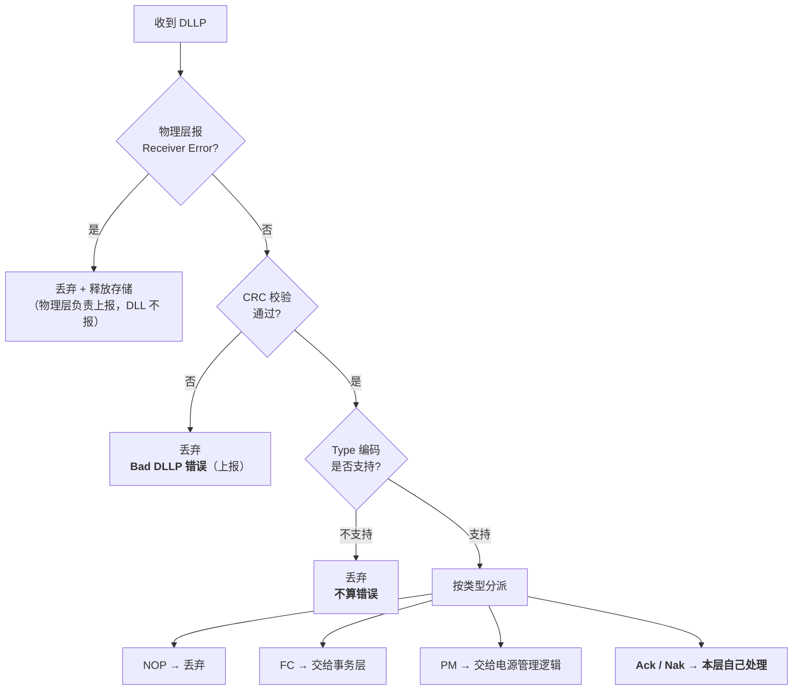
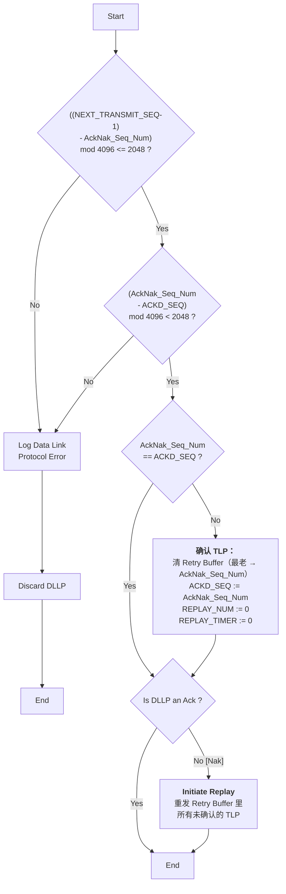

> [!abstract] 对应 Spec
> **Gen5 §3.6.2.2 Handling of Received DLLPs** — spec p.235–237 = [[gen5_chap3.pdf#page=27|gen5_chap3.pdf p.27–29]]
>
> 本站只有 3 页，但它是**整章唯一一处「Ack/Nak 到底做了什么」的正面回答**，
> 而且有 **2 张官方流程图**（Figure 3-17 / 3-18），是全章最适合做看板的部分。
>
> 配套看板：`01_35_04_收DLLP分派.canvas` + `01_35_05_AckNak处理_flow.canvas`

# 0. 一个必须先想通的问题：为什么这节在「发送端」章节里

§3.6.2 的标题是 **LCRC, Sequence Number, and Retry Management (TLP Transmitter)**，
而 §3.6.2.2 是它的子节 —— 讲的却是**接收** DLLP。

> [!important] spec 开头就解释了
> > Since Ack/Nak and Flow Control DLLPs **affect TLPs flowing in the opposite direction** across the Link,
> > the **TLP transmission mechanisms** in the Data Link Layer are **also responsible for** Ack/Nak and Flow Control DLLPs received from the other component.
>
> 拆开理解：
>
> ```
> A 发 TLP  ──────────────────→  B
> A  ←──────────────  B 发 Ack（针对 A 发的那些 TLP）
> ```
>
> **B 发过来的 Ack，管的是 A 的发送状态**（清 A 的 Retry Buffer、动 A 的 `ACKD_SEQ`）。
>
> 所以虽然「收 Ack」这个动作发生在**接收侧**，但它**影响的是发送侧的状态机**。
> spec 因此把它归到 Transmitter 一节。 ^why-in-tx-section

> [!tip] 记忆抓手
> 回到 [[01_31_S1_数据链路层概述#2. 图 3-1 应该怎么读|图 3-1 的 1/2/3/4]]：
> - **路径 1**（A 发 TLP）产生的**后果**，由 **路径 4**（A 收 DLLP）来处理
> - 两条路径**方向相反，但服务的是同一套发送状态**
>
> **§3.6.2.2 讲的就是「路径 4 里那部分服务于路径 1 的逻辑」。**

---

# 1. 全景：收到一个 DLLP 之后



> [!important] 三级过滤 + 一次分派
> 前三个判断是**过滤**（物理层错误 → CRC → 类型是否认识），
> 通过之后才**按类型分派**给不同的消费者。
>
> 这张分派表和 [[01_32_S2_DLLP初识#5. 五大家族：按「谁消费」分类|S2 那张「谁消费」表]] 完全对上了。 ^three-filters

---

# 2. 过滤第一级：物理层的错误指示

> If the Physical Layer indicates a **Receiver Error**, **discard** any DLLP currently being received and **free any storage** allocated for the DLLP.
> Note that reporting such errors to software is done by the **Physical Layer**
> (and, therefore, are **not reported by the Data Link Layer**).

| 要点 | 说明 |
|---|---|
| 动作 | **丢弃 + 释放已分配的存储** |
| **谁上报** | **物理层上报，数据链路层不报** |

> [!important] 「谁上报」这条边界要记清楚
> 同一个物理现象，**上报责任只属于发现它的那一层**。
>
> 物理层已经报过 Receiver Error 了，数据链路层**再报一次就是重复**。
> 这和 [[01_33_S3_DLCMSM#7.1 六种「不算错误」的屏蔽情况|Surprise Down 的屏蔽条件 3]]
> （「根因在上面就不报」）是同一个思想：**避免一个根因产生一堆重复错误**。
>
> spec 里管这个叫 **error pollution（错误污染）**，§3.6.3.1 会直接用这个词。 ^no-error-pollution

> [!note] 「free any storage」为什么要专门写
> 因为 DLLP 是流式接收的 —— 收到一半才被告知出错，**已经占用的缓冲必须释放**，
> 否则反复出错会耗尽资源。**这是一条防资源泄漏的规则。**

---

# 3. 过滤第二级：CRC 校验

## 3.1 怎么校验

> For all received DLLPs, the CRC value is checked by:
> - Applying **the same algorithm** used for calculation of transmitted DLLPs to the received DLLP,
>   **not including the 16-bit CRC field** of the received DLLP
> - **Comparing** the calculated result with the value in the CRC field
> - **If not equal, the DLLP is corrupt**

| 要点 | 说明 |
|---|---|
| 算法 | 和发送时**完全相同**（[[01_37_S7_DLLP详解#5. 16-bit CRC\|S7 §5]]：多项式 `100Bh`、seed `FFFFh`、LSB first、取反、Table 3-5 映射） |
| **计算范围** | **不包括收到的那 2 字节 CRC 字段本身**（只算 Byte 0–3） |
| 判定 | 算出来的值 ≠ 字段里的值 → **corrupt** |

> [!note] 这是「重算比对」而不是「余数为零」
> CRC 有两种常见校验方式：
> 1. **重算比对**：把数据部分重算一遍 CRC，和收到的 CRC 字段比 ← **PCIe 用这种**
> 2. **整体余数**：把「数据 + CRC」一起过一遍，看余数是不是某个固定值
>
> spec 明确写了 **not including the CRC field**，所以是第 1 种。
> **实现上更直观：发送怎么算，接收就怎么算，一模一样的电路可以复用。**

## 3.2 corrupt 的后果

> A corrupt received DLLP is **discarded**.
> This is a **Bad DLLP error** and is a **reported error** associated with the Port（§6.2）。

| | |
|---|---|
| 动作 | **丢弃**（**不重传** —— 见下） |
| 错误名 | **Bad DLLP** |
| 是否上报 | ✅ **是 reported error** |

> [!important] 「丢弃」和「上报」是两回事
> 丢弃了不代表当没发生。**Bad DLLP 会被记录**，因为它是**链路质量的指标**。
>
> 但**不会触发任何重传** —— 这就是
> [[01_31_S1_数据链路层概述#5.2 为什么 DLLP 不需要序号也不需要重传|S1 讲的 self-repairing]]：
> DLLP 不进入 Retry Buffer。具体恢复方式因类型而异：Feature/InitFC 周期重发，UpdateFC 与 Ack 由后续累计状态覆盖，Nak 丢失则由 `REPLAY_TIMER` 兜底。
>
> **DLLP：丢弃 + 上报，不重传。**
> **TLP：丢弃 + 上报 + 触发 Nak/重传。** ^dllp-discard-vs-tlp

---

# 4. 过滤第三级：不认识的 Type

> A received DLLP that is **not corrupt**, but that uses **unsupported DLLP Type encodings** is
> **discarded without further action**. **This is not considered an error.**

> [!important] 这条是整章向后兼容的基石
> **收到不认识的 DLLP 类型 → 静默丢弃，不报错。**
>
> 这正是 [[01_37_S7_DLLP详解#4.1 NOP（Figure 3-6）|S7 里 NOP 那条脚注]]所指的「更一般的规则」：
> > (NOP 的处理) is a **special case of the more general rule for unsupported DLLP Type encodings**（见 §3.6.2.2）
>
> 也就是说：**NOP 之所以「收到就扔」，是因为它被当作「不认识的类型」一样对待。**
>
> 而这条规则的现实意义，在 [[01_34_S4_数据链路特性交换#2. 四个寄存器字段|§3.3 的 `Exchange Enable` 开关]]里体现得最清楚：
> **正因为规范要求「静默忽略」，PCIe 4.0 才敢往里加新的 DLLP 类型；
> 而那个软件开关的存在，恰恰说明有老硬件没遵守这条。** ^unsupported-type-silent

## 4.1 三条并列的「宽容」规则

spec 在这里连着给了三条，都是关于「怎么对待不理解的东西」：

| # | 规则 | 层面 |
|---|---|---|
| 1 | **不支持的 Type 编码** → 静默丢弃，**不算错误** | 整个包 |
| 2 | **Reserved 字段里的非零值** → **忽略** | 字段内部 |
| 3 | Receivers **必须以接收速率处理所有 DLLP** | 性能要求 |

> [!note] 第 2 条呼应了 [[01_32_S2_DLLP初识#3. Reserved 字段的通用规则|S2 的 Reserved 规则]]
> S2 讲的是**发送方填 0**，这里讲的是**接收方忽略非零值**。
> **两条合起来才构成完整的向前兼容契约**，缺一不可。

> [!important] 第 3 条容易被当成废话，其实是硬要求
> > Receivers must **process all DLLPs received at the rate they are received**
>
> **接收方不许对 DLLP 背压。** 线上来多快，就必须处理多快。
>
> 为什么？因为 **DLLP 不受流控管辖**（没有 credit 机制保护它），
> 如果接收方处理不过来就只能丢 —— 而丢 Ack 会拖慢重传，丢 UpdateFC 会拖慢流控。
>
> 对比 [[01_31_S1_数据链路层概述#6.3 两个方向的接口信号|TLP 可以被背压]]：
> **TLP 有 credit 保护，可以慢慢来；DLLP 没有，所以必须线速处理。** ^dllp-line-rate

---

# 5. Figure 3-17：DLLP 错误检查流程图

> [!figure] Figure 3-17 Received DLLP Error Check Flowchart
> 原文：[[gen5_chap3.pdf#page=28|PDF p.28 / Spec p.236]]
> ![[gen5_fig3-17_dllp_check.png]]

图的结构（我从原文重建）：

```
              Start
                │
    ┌───────────▼────────────┐
    │ 物理层报告了接收错误吗？ │──── Yes ──→ 丢弃 DLLP ──→ End
    └───────────┬────────────┘
                │ No
    ┌───────────▼──────────────────────┐
    │ 用收到的 DLLP 计算 CRC（不含CRC字段）│
    └───────────┬──────────────────────┘
                │
    ┌───────────▼────────────┐
    │ 计算值 == 收到的值？     │──── No ──→ Bad DLLP 错误 ──→ 丢弃 ──→ End
    └───────────┬────────────┘
                │ Yes
          处理该 DLLP
```

> [!note] 注意两条「丢弃」路径的区别
> - 上面那条（物理层错误）→ **只丢弃，不报错**（物理层已经报了）
> - 下面那条（CRC 失败）→ **丢弃 + 报 Bad DLLP 错误**
>
> **图上这个差别画得很清楚，是这张图最值得看的地方。**

---

# 6. 分派：四类 DLLP 的去向

| DLLP 类型 | 处理 | spec 原文 |
|---|---|---|
| **NOP** | **丢弃** | Received NOP DLLPs are **discarded** |
| **FC**（InitFC1/2、UpdateFC） | **交给事务层** | passed to the **Transaction Layer** |
| **PM** | **交给组件的电源管理控制逻辑** | passed to the component's **power management control logic** |
| **Ack / Nak** | **本层自己处理**（见 §7） | 见 Figure 3-18 |

^dllp-dispatch

> [!note] Data Link Feature DLLP 去哪了？
> §3.6.2.2 的分派列表里**没有它**。因为它只在 `DL_Feature` 状态下才有意义，
> 处理规则写在 [[01_34_S4_数据链路特性交换|§3.3]] 里。
>
> **§3.6.2.2 讲的是 `DL_Active` 状态下的常规处理**，那时候 Feature 交换早就结束了。
> 这是 spec 分节的边界，不是遗漏。

---

# 7. Ack / Nak 的处理 —— 本站核心

## 7.1 spec 的三条规则

> [!important] 这三条是**按顺序**执行的

### 规则一：合法性检查

> If the Sequence Number specified by the `AckNak_Seq_Num`
> **does not correspond to an unacknowledged TLP**, **or to the value in `ACKD_SEQ`**,
> the DLLP is **discarded**.
> This is a **Data Link Protocol Error**（reported error，§6.2）。

**合法的序号只有两种：**

| 合法情况 | 含义 |
|---|---|
| 对应某个**未确认的 TLP** | 正常的确认 |
| **等于当前的 `ACKD_SEQ`** | **重复的 Ack**（对方又说了一遍同样的话） |

其他一律 → **Data Link Protocol Error + 丢弃**。

> [!important] spec 特意加的一条 Note，很重要
> > Note that it is **not an error to receive an Ack DLLP when there are no outstanding unacknowledged TLPs**,
> > **including the time between reset and the first TLP transmission**,
> > as long as the specified Sequence Number **matches the value in `ACKD_SEQ`**.
>
> **翻译：** 一个 TLP 都没发的时候收到 Ack，**只要它的序号 == 我的 `ACKD_SEQ`，就不算错。**
>
> 复位后 `ACKD_SEQ = FFFh`（见 [[01_38_S8_数据完整性_发送端#3.1 为什么 `ACKD_SEQ` 复位成 `FFFh` 而不是 `000h`？\|S8 §3.1]]），
> 而对方的 `NEXT_RCV_SEQ = 000h`，它发的 Ack 序号是 `(NEXT_RCV_SEQ - 1) = FFFh`。
>
> **两边正好对上！**
>
> ```
> 我的 ACKD_SEQ           = FFFh
> 对方发的 AckNak_Seq_Num = (000h - 1) mod 4096 = FFFh   ✅ 相等，合法
> ```
>
> **`ACKD_SEQ` 复位成 `FFFh` 的第二个理由在这里 —— 它让「链路刚起来时的空 Ack」天然合法。**
> 如果复位成 `000h`，这个空 Ack 就会被误判成 Data Link Protocol Error。 ^empty-ack-legal

### 规则二：确认并清理

> If the `AckNak_Seq_Num` **does not specify the Sequence Number of the most recently acknowledged TLP**,
> then the DLLP **acknowledges some TLPs** in the retry buffer:
> - **Purge** from the retry buffer all TLPs **from the oldest to the one corresponding to** `AckNak_Seq_Num`
> - **Load `ACKD_SEQ`** with the value in the `AckNak_Seq_Num` field
> - **Reset `REPLAY_NUM` and `REPLAY_TIMER`**

| 三个动作 | 含义 |
|---|---|
| **清 Retry Buffer** | 从**最老的**一直清到 `AckNak_Seq_Num` 对应的那个（**含**） |
| **更新 `ACKD_SEQ`** | 记住确认到哪了 |
| **重置 `REPLAY_NUM` 和 `REPLAY_TIMER`** | **有进展了，错误计数清零** |

> [!important] 「累积确认」在这里落地
> **一条 Ack 清掉的是「从最老的到指定序号」的一整批**，不是一个。
>
> 这就是 [[01_37_S7_DLLP详解#^ack-cumulative|S7 里从「what TLPs（复数）are affected」推出的结论]]的正式规则依据。
>
> 而这也解释了为什么 Ack 丢了不要紧：**下一条 Ack 序号更大，会把这一批连同更多一起清掉。**

> [!important] 「有进展才重置错误计数」第三次出现
> | 出现位置 | 规则 |
> |---|---|
> | [[01_38_S8_数据完整性_发送端#^replay-num-reset\|S8 §8.2]] | Nak 确认了某些 TLP → `REPLAY_NUM` 重置 |
> | [[01_38_S8_数据完整性_发送端#^forward-progress\|S8 §9.1]] | Ack 确认了某些 TLP → `REPLAY_TIMER` 重置 |
> | **本条** | Ack/Nak 确认了某些 TLP → **两个都重置** |
>
> **同一个原则的三种表述。核心：只有 forward progress 才有资格重置错误计数。** ^forward-progress-again

### 规则三：Nak 触发重发

> If the DLLP is a **Nak**, **initiate a replay**（见 §3.6.2.1）
>
> Note: **Receipt of a Nak is not a reported error.**

> [!question] 收到 Nak 为什么不算错误？
> 因为 **Nak 是协议的正常组成部分**，不是异常。
>
> 真正的错误是在**接收方**那边被记录的（对方发 Nak 之前，已经记了一个 **Bad TLP** 错误）。
> 如果发送方这边**再记一次**，同一个物理事件就被记了两遍。
>
> **又是「避免错误污染」。** 和 [[#^no-error-pollution|§2 里物理层错误不由 DLL 上报]] 完全同构。 ^nak-not-error

## 7.2 顺序很关键：先确认，再重发

> [!important] 规则二在规则三**之前**，这个顺序不能颠倒
> Nak 是**「确认 + 要求重发」的组合体**：
>
> ```
> 我发了 #5 #6 #7 #8
> 对方收到 #5 #6 正常，#7 坏了
> 对方回：Nak，AckNak_Seq_Num = 6
>          ↑ 意思是「6 号及之前都收好了，从 7 开始重发」
> ```
>
> 我的处理顺序必须是：
> 1. **先执行规则二**：清掉 #5 #6，`ACKD_SEQ = 6`，重置 `REPLAY_NUM`/`REPLAY_TIMER`
> 2. **再执行规则三**：从 #7 开始 replay
>
> 如果顺序反了，就会**把 #5 #6 也一起重发**，浪费带宽。
>
> **这也解释了 [[01_38_S8_数据完整性_发送端#^replay-num-reset|S8 里那条 `REPLAY_NUM` 重置的例外]]
> 为什么写在 replay 步骤里 —— 因为清理动作在 replay 开始之前就做完了。** ^ack-then-replay

---

# 8. Figure 3-18：Ack/Nak 处理流程图

> [!figure] Figure 3-18 Ack/Nak DLLP Processing Flowchart
> 原文：[[gen5_chap3.pdf#page=30|PDF p.30 / Spec p.238]]
> ![[gen5_fig3-18_acknak_flow.png]]
>
> **这张图是本节最重要的资料**，因为它给出了两条正文里没有的**精确判断式**。

## 8.1 图里的两个判断式 —— 正文没写，只有图里有

> [!important] 这是本站最大的收获
> §7.1 的规则一说「序号必须对应某个未确认 TLP 或等于 `ACKD_SEQ`」，
> 但**怎么用模运算判断，正文没给。Figure 3-18 给了：**

### 判断式一：序号不能超前

```
((NEXT_TRANSMIT_SEQ - 1) - AckNak_Seq_Num) mod 4096  <=  2048
```

| 结果 | 处理 |
|---|---|
| **Yes** | 继续下一个判断 |
| **No** | **Log Data Link Protocol Error → 丢弃 DLLP** |

> [!note] 在检查什么
> `NEXT_TRANSMIT_SEQ - 1` = **我发出去的最后一个 TLP 的序号**。
>
> 这个式子在问：「**你确认的序号，有没有超过我实际发出去的最后一个？**」
>
> 如果对方确认了一个**我根本还没发**的序号 —— 那对方一定出问题了，
> 或者这个 DLLP 被篡改了。**丢弃 + 报协议错误。**

### 判断式二：序号不能落后太多

```
(AckNak_Seq_Num - ACKD_SEQ) mod 4096  <  2048
```

| 结果 | 处理 |
|---|---|
| **Yes** | 继续 |
| **No** | **Log Data Link Protocol Error → 丢弃 DLLP** |

> [!note] 在检查什么
> 这个式子在问：「**你确认的序号，是不是至少不比我已经确认过的更旧？**」
>
> 用 [[01_38_S8_数据完整性_发送端#^mod-4096-pattern|S8 讲的模 4096 领先/落后判定]]：
> 结果 `< 2048` 表示 `AckNak_Seq_Num` **在 `ACKD_SEQ` 前面或相等**（合理）；
> `>= 2048` 表示它**在 `ACKD_SEQ` 后面**（倒退了）——**不合理，丢弃。**

> [!important] 两个判断式合起来，划出了一个「合法窗口」
> ```
>          ACKD_SEQ                      NEXT_TRANSMIT_SEQ - 1
>  ────────────┼──────────────────────────────────┼─────────────
>              │  ✅ AckNak_Seq_Num 必须落在这个区间内 │
>              │  （已确认的位置  ~  已发出的最后一个）  │
>  ✗ 太旧 ─────┘                                  └───── ✗ 太新 ✗
> ```
> **判断式二挡住「太旧」，判断式一挡住「太新」。**
> 落在窗口内才是一个有意义的确认。 ^acknak-valid-window

### 判断式三：有没有新确认

```
AckNak_Seq_Num == ACKD_SEQ ?
```

| 结果 | 处理 |
|---|---|
| **Yes**（相等） | **没有新的 TLP 被确认** → 跳过清理动作 |
| **No**（不等） | **有 TLP 被确认** → 执行清理三件套（purge / load / reset） |

> [!note] 这一步对应正文的规则二
> 正文说「If the `AckNak_Seq_Num` **does not specify the Sequence Number of the most recently acknowledged TLP**」，
> 图里就是 `AckNak_Seq_Num != ACKD_SEQ`。**两者是一回事，图说得更直白。**
>
> 相等的情况就是 [[#^empty-ack-legal|§7.1 那条 Note 说的「重复的 Ack」]]：合法，但什么也不用做。

### 最后一步：Ack 还是 Nak

```
Is DLLP an Ack?
   Yes → End（结束）
   No [Nak] → Initiate Replay of all unacknowledged TLPs from the retry buffer
```

## 8.2 完整流程（我按图重建）



看板版本见 `01_35_05_AckNak处理_flow.canvas`。

---

# 9. 一条重复出现的规则

§3.6.2.2 的**最后一句**是：

> The following rules describe the operation of the Data Link Layer Retry Buffer ...:
> - Copies of Transmitted TLPs **must be stored in the Data Link Layer Retry Buffer**

> [!note] 这条在 §3.6.2.1 里已经出现过一次
> [[01_38_S8_数据完整性_发送端#7. Retry Buffer|S8 §7]] 引的那条多了「**except for nullified TLPs**」。
>
> **这里是重复陈述，而且还漏了 nullified 那个例外。**
> 应以 §3.6.2.1 的版本为准。可能是规范编辑上的冗余，讲解时按 §3.6.2.1 讲即可。

---

# 10. spec 规则逐条对照表

| # | spec 规则 | 本文位置 |
|---|---|---|
| 1 | 本节归属发送端的理由：Ack/Nak/FC DLLP 影响**反方向**的 TLP | §0 |
| 2 | 物理层报 Receiver Error → 丢弃 + 释放存储 | §2 |
| 3 | 此类错误**由物理层上报**，DLL 不报 | §2 |
| 4 | CRC 校验：同发送算法，**不含 CRC 字段**，比对 | §3.1 |
| 5 | 不相等 → corrupt | §3.1 |
| 6 | corrupt → 丢弃；**Bad DLLP 错误**，reported error | §3.2 |
| 7 | 不 corrupt 但 **Type 不支持** → 丢弃，**不算错误** | §4 |
| 8 | **Reserved 字段的非零值 → 忽略** | §4.1 |
| 9 | Receivers **必须以接收速率处理所有 DLLP** | §4.1 |
| 10 | Figure 3-17 流程 | §5 |
| 11 | 收到 **NOP** → 丢弃 | §6 |
| 12 | 收到 **FC DLLP** → 交给事务层 | §6 |
| 13 | 收到 **PM DLLP** → 交给电源管理控制逻辑 | §6 |
| 14 | Ack/Nak 规则一：序号不对应未确认 TLP **且** 不等于 `ACKD_SEQ` → 丢弃；**Data Link Protocol Error** | §7.1 |
| 15 | Note：无未确认 TLP 时收到 Ack **不算错误**（只要序号 == `ACKD_SEQ`），**含复位后到首个 TLP 之间** | §7.1 |
| 16 | Ack/Nak 规则二：清 Retry Buffer（最老 → `AckNak_Seq_Num`） | §7.1 |
| 17 | 规则二：`ACKD_SEQ` := `AckNak_Seq_Num` | §7.1 |
| 18 | 规则二：**重置 `REPLAY_NUM` 和 `REPLAY_TIMER`** | §7.1 |
| 19 | Ack/Nak 规则三：是 Nak → **发起 replay** | §7.1 |
| 20 | Note：**收到 Nak 不是 reported error** | §7.1 |
| 21 | Figure 3-18 判断式一（不能超前） | §8.1 |
| 22 | Figure 3-18 判断式二（不能落后） | §8.1 |
| 23 | Figure 3-18 判断式三（是否有新确认） | §8.1 |
| 24 | Figure 3-18 最后：Ack → 结束；Nak → replay | §8.1 |
| 25 | 末尾重复的 Retry Buffer 规则 | §9 |

---

# 11. 自检

- [ ] §3.6.2.2 讲的是「接收」，为什么归在 **(TLP Transmitter)** 这一节下面？
- [ ] 收到 DLLP 的三级过滤分别是什么？
- [ ] 物理层报 Receiver Error 时，数据链路层要不要上报？为什么？
- [ ] CRC 校验的计算范围包不包括 CRC 字段本身？
- [ ] **Bad DLLP 是 reported error 吗？会触发重传吗？**（注意这两个问题的答案不同）
- [ ] 收到不认识的 DLLP 类型怎么办？算错误吗？NOP 和这条规则什么关系？
- [ ] 「Receivers 必须以接收速率处理所有 DLLP」为什么是硬要求？和 TLP 有什么不同？
- [ ] Ack/Nak 的合法序号有哪两种情况？
- [ ] **一个 TLP 都没发的时候收到 Ack，算错误吗？**为什么 `ACKD_SEQ = FFFh` 让这件事成立？
- [ ] 收到 Ack 后的三个动作是什么？
- [ ] **收到 Nak 是 reported error 吗？为什么？**
- [ ] Nak 处理时，为什么必须先做「确认清理」再做「重发」？顺序反了会怎样？
- [ ] Figure 3-18 的两个判断式各自在挡什么？合起来划出了什么？
- [ ] 「只有 forward progress 才重置错误计数」这个原则，在第 3 章出现了几次？

---

## 相关笔记 Relation
- 上一站 → [[01_38_S8_数据完整性_发送端]]
- 下一站 → [[01_3a_S10_数据完整性_接收端]]
- Ack/Nak 的**字段格式** → [[01_37_S7_DLLP详解]]
- 本章导航 → [[01_3f_Gen5_DLL_MOC]]

## 来源 Reference
- Gen5 spec §3.6.2.2，p.235–237 → [[gen5_chap3.pdf#page=27|PDF p.27–29]]
