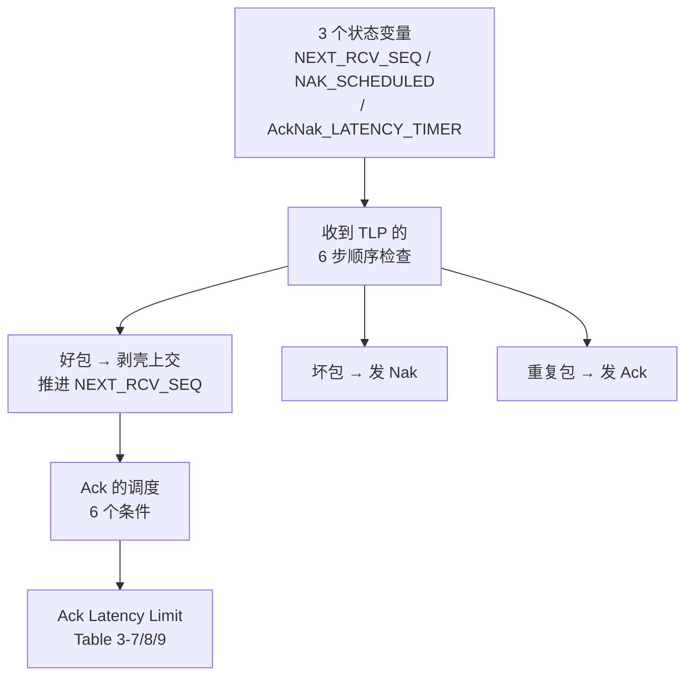
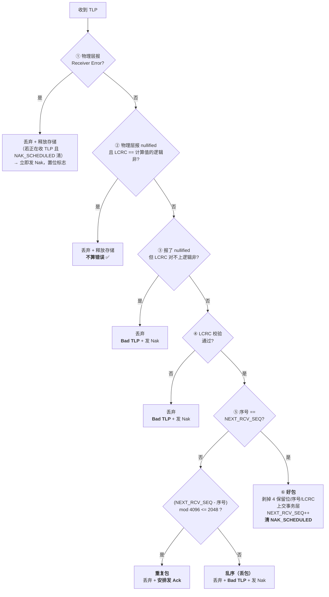

> [!abstract] 对应 Spec
> **Gen5 §3.6.3 / §3.6.3.1 LCRC and Sequence Number (TLP Receiver)** — spec p.238–244 = [[gen5_chap3.pdf#page=30|gen5_chap3.pdf p.30–36]]
>
> 第 3 章的**最后一节**，也是**对称的另一半**：
> [[01_38_S8_数据完整性_发送端|S8]] 讲发送端怎么打包和重发，本站讲接收端怎么检查和回应。
>
> 配套看板：[[01_3c_全链路推演.canvas]]（含正常、丢 TLP、丢 Ack、丢 Nak 与 `NAK_SCHEDULED` 例外）

# 0. 本站地图



---

# 1. 三个状态变量

| 变量 | 类型 | 位宽 | `DL_Inactive` 复位值 | 作用 |
|---|---|---|---|---|
| **`NEXT_RCV_SEQ`** | 计数器 | **12 bit** | **`000h`** | 下一个**期待**收到的 TLP 序号 |
| **`NAK_SCHEDULED`** | 标志 | 1 bit | **Cleared（清零）** | **已经安排了一个 Nak，还没被满足** |
| **`AckNak_LATENCY_TIMER`** | 概念定时器 | — | **0** | 跟踪待确认 TLP 的 Ack/Nak 调度时限；在安排 Ack/Nak 时重启 |

^rx-state-vars

## 1.1 和发送端的对称关系

| 发送端（S8） | 接收端（本站） | 关系 |
|---|---|---|
| `NEXT_TRANSMIT_SEQ` = 下一个要**发**的序号 | **`NEXT_RCV_SEQ`** = 下一个期待**收**的序号 | **完全对称** |
| `ACKD_SEQ` = 已被确认到哪 | —— | 接收端不需要 |
| `REPLAY_NUM` = 连续重发次数 | —— | 接收端不需要 |
| `REPLAY_TIMER` = 发送侧等待确认的超时保护 | **`AckNak_LATENCY_TIMER`** = 接收侧待确认 TLP 的 Ack/Nak 调度时限 | 都约束可靠传输，但启停规则不同 |
| —— | **`NAK_SCHEDULED`** | 接收端独有 |

> [!important] 一个关键的不对称
> 发送端有 **4** 个变量，接收端只有 **3** 个，而且只有 `NEXT_RCV_SEQ` 是完全对应的。
>
> **原因：接收端的工作简单得多。**
> 接收端不需要 Data Link Retry Buffer，也不负责重发计数；但它当然仍可能有接收存储、事务层 buffer 和内部流水状态，不能概括成“没有 buffer / 不记历史”。
> **重放历史相关的大部分复杂度被放在发送端。**
>
> 这是一个有意的设计选择：**接收端做得越简单，越容易做到线速处理**
> （呼应 [[01_39_S9_数据完整性_收DLLP#^dllp-line-rate|S9 里「必须以接收速率处理」]]）。 ^asymmetry

## 1.2 `NEXT_RCV_SEQ` 和 `NEXT_TRANSMIT_SEQ` 都复位成 `000h`

> [!note] 为什么这两个不像 `ACKD_SEQ` 那样特殊
> 因为它们的语义是「**下一个**」，不是「**上一个**」。
>
> 复位后一个包都没传，「下一个」自然是 0 号。**语义直接对应，不需要偏移。**
>
> 只有 `ACKD_SEQ`（语义是「上一个已确认的」）才需要 `FFFh`
> 这个「0 的前一个」的编码，见 [[01_38_S8_数据完整性_发送端#^ackd-seq-fff|S8 §3.1]]。

## 1.3 `AckNak_LATENCY_TIMER` 的三条规则

| # | 规则 |
|---|---|
| 1 | `DL_Inactive` 时**置 0** |
| 2 | **每次有 Ack 或 Nak 被安排发送时，从 0 重新开始计**；**当所有收到的 TLP 都已用 Ack 确认过时，复位到 0** |
| 3 | 如果**原本没有未确认的 TLP**，然后收到了一个 TLP，那么计时器**只有在这个 TLP 被转发给接收侧事务层之后**才开始计数 |

> [!important] 规则 3 非常精细，容易漏
> 计时的起点**不是「收到 TLP 的那一刻」，而是「TLP 被交给事务层的那一刻」**。
>
> 为什么？因为 Ack 的含义是「**我已经安全接收并处理了**」。
> 如果 TLP 还卡在数据链路层没交上去，就开始催着发 Ack，那是不诚实的。
>
> spec 在后面还有一句配套的话：
> > Note that the **Receiver Flow Control mechanisms do not account for any received TLPs until the TLP(s) are forwarded to the Receive Transaction Layer**
>
> **「转发给事务层」是一个统一的分界点**：在此之前，这个 TLP 对流控和 Ack 计时都「不存在」。 ^forward-boundary

> [!note] 规则 2 里两个动作的区别
> - 「**从 0 重新开始计**（restart from 0）」= 归零后**继续跑**
> - 「**复位到 0**（Reset to 0）」= 归零后**停住**（因为没有待确认的东西了）
>
> 和 [[01_38_S8_数据完整性_发送端#9. `REPLAY_TIMER`：7 条启停规则|S8 里 `REPLAY_TIMER` 的 reset and hold]] 是同一套措辞。

---

# 2. 收到 TLP：6 步顺序检查

> [!important] spec 强调「**applied in sequence**」
> > The following rules are **applied in sequence** to describe how received TLPs are processed
>
> **顺序是规范的一部分。** 前一步命中就不会走到后一步。



## 2.1 步骤① 物理层报错

> If the Physical Layer indicates a Receiver Error, **discard** any TLP currently being received and **free any storage**.
> Note that reporting such errors to software is done by the **Physical Layer**（and so are **not reported by the Data Link Layer**）。
>
> If a TLP **was being received** at the time the Receiver Error was indicated **and the NAK_SCHEDULED flag is clear**:
> - **Schedule a Nak DLLP for transmission immediately**
> - **Set the NAK_SCHEDULED flag**

| 要点 | 说明 |
|---|---|
| 丢弃 + 释放存储 | 同 [[01_39_S9_数据完整性_收DLLP#2. 过滤第一级：物理层的错误指示\|S9 收 DLLP]] |
| **上报责任在物理层** | DLL 不重复上报 |
| **但要发 Nak** | 因为**丢的是 TLP，必须让对方重发** ⬅️ 和 DLLP 的关键差别 |
| 前提 | **`NAK_SCHEDULED` 清零时才发** |

> [!important] 这里出现了 TLP 和 DLLP 处理的第一个分岔
> | | DLLP（S9） | TLP（本站） |
> |---|---|---|
> | 物理层报错 | 丢弃，**什么也不做** | 丢弃，**发 Nak 要求重传** |
>
> 原因还是那个：[[01_31_S1_数据链路层概述#5.2 为什么 DLLP 不需要序号也不需要重传|DLLP 自愈，TLP 不自愈]]。

## 2.2 步骤②③ Nullified TLP 的两种结局

对应 [[01_38_S8_数据完整性_发送端#6. Nullified TLP：发到一半反悔|S8 §6]] 的发送侧机制。

| 情况 | 条件 | 结果 |
|---|---|---|
| **②** | 物理层报 nullified **且** LCRC **== 计算值的逻辑非** | **丢弃，不算错误** ✅ |
| **③** | 物理层报 nullified **但** LCRC **≠ 计算值的逻辑非** | **corrupt**，丢弃，**Bad TLP 错误** + 发 Nak ❌ |

> [!important] 为什么要有情况③
> Nullify 的暗号是「LCRC 不取反」。如果物理层说这是个 nullified 包，
> **但 LCRC 连那个暗号都对不上** —— 说明这个包在传输中**又被破坏了**。
>
> 这时候不能当成正常的 nullify 放过，因为**无法确定发送方真的想作废它**。
> 保守起见按坏包处理，发 Nak 让对方重发。
>
> **两个条件必须同时满足才算合法的 nullify —— 这就是 spec 说的
> [[01_38_S8_数据完整性_发送端#^nullify-lcrc-trick|「robustly prevent misinterpretation」]]。** ^nullify-two-conditions

> [!note] 注意步骤②不递增 `NEXT_RCV_SEQ`
> 规则里只说「discard the TLP and free any storage」，**没有说递增序号**。
>
> 这和发送端 [[01_38_S8_数据完整性_发送端#^nullify-no-increment|「nullified 不递增 `NEXT_TRANSMIT_SEQ`」]] **正好配对**。
> 两端都不动，序号就不会错开。 ^nullify-symmetry

## 2.3 步骤④ LCRC 校验

> The LCRC value is checked by:
> - Applying **the same algorithm** used for calculation to the received TLP, **not including the 32-bit LCRC field**
> - **Comparing** the calculated result with the value in the LCRC field
> - if **not equal**, the TLP is corrupt — discard, free storage
>   - **If the NAK_SCHEDULED flag is clear**: schedule a Nak **immediately**, set the flag
>
> This is a **Bad TLP error**（reported error，§6.2）。

和 [[01_39_S9_数据完整性_收DLLP#3. 过滤第二级：CRC 校验|S9 的 DLLP CRC 校验]] 结构完全一样，
差别只有两处：**32 位 vs 16 位**，以及**要不要发 Nak**。

## 2.4 步骤⑤ 序号不匹配 —— 两种完全不同的情况

> If the TLP Sequence Number is **not equal** to the expected value stored in `NEXT_RCV_SEQ`:
> - **Discard** the TLP and free any storage
> - If `(NEXT_RCV_SEQ - TLP Sequence Number) mod 4096 <= 2048`
>   → the TLP is a **duplicate**, and an **Ack DLLP is scheduled** for transmission（按传输优先级规则）
> - **Otherwise**, the TLP is **out of sequence**（indicating one or more lost TLPs）:
>   - if the `NAK_SCHEDULED` flag is clear: schedule a Nak **immediately**, set the flag

> [!important] 这是本站最需要想清楚的一处
> 序号不对，可能是**两种截然相反**的情况，用一个模运算区分：
>
> ```
> (NEXT_RCV_SEQ - 收到的序号) mod 4096  <=  2048
> ```
>
> | 结果 | 判定 | 直觉 | 回应 |
> |---|---|---|---|
> | **<= 2048** | **重复包（duplicate）** | 收到的序号**比我期待的旧** → 这个包我早就收过了 | **发 Ack** ✅ |
> | **> 2048** | **乱序（out of sequence）** | 收到的序号**比我期待的新** → **中间丢了包** | **发 Nak** ❌ |
>
> **用的还是 [[01_38_S8_数据完整性_发送端#^mod-4096-pattern|模 4096 的领先/落后判定]]，第三次出现了。** ^duplicate-vs-oos

### 为什么重复包要回 Ack？

> [!question] 收到一个我早就处理过的包，为什么还要专门回一个 Ack？
> 因为**重复包出现，说明我之前发的 Ack 对方没收到**（或者还在路上）。
>
> 典型场景：
> ```
> 1. 我收到 TLP #5，处理好，发 Ack(5)
> 2. Ack(5) 在路上丢了
> 3. 对方的 REPLAY_TIMER 超时，重发 TLP #5
> 4. 我又收到 #5 —— 但我的 NEXT_RCV_SEQ 已经是 6 了
> 5. 判定为重复包 → 丢弃，但要 ★重新发一个 Ack★
> ```
>
> **如果不回 Ack，对方会一直重发下去，直到 `REPLAY_NUM` 溢出、链路被拖去重训练。**
>
> **重复包本身就是「Ack 丢了」的证据，回 Ack 是对症下药。** ^duplicate-needs-ack

> [!note] 一个措辞差别值得注意
> - 重复包 → **「an Ack DLLP is scheduled for transmission」**（按优先级排队）
> - 乱序 / 坏包 → **「schedule a Nak DLLP for transmission immediately」**（**立即**）
>
> Nak 用了 **immediately**，Ack 没有。这和
> [[01_38_S8_数据完整性_发送端#11. 传输优先级：8 个等级|S8 的传输优先级表]] 完全一致：
> **Nak 是优先级 2，Ack 是优先级 3。**
>
> 不过因重复包触发的 Ack 在优先级表里也被列为「**尽快发送**」（优先级 3 的两个触发条件之一），
> 比普通 Ack 更急。 ^nak-immediate

### 关于错误上报的一条特殊规则

> This is a **Bad TLP error**（reported error）。
> **Regardless of the state of the `NAK_SCHEDULED` flag, it is permitted for this to be a reported error** ...
> **However, in order to prevent error pollution it is recommended that the Port only report such an error when the `NAK_SCHEDULED` flag is clear.**

> [!important] 「permitted」vs「recommended」
> | 措辞 | 含义 |
> |---|---|
> | **permitted**（允许） | 不管 `NAK_SCHEDULED` 什么状态，**每次都报也合规** |
> | **recommended**（建议） | **只在 `NAK_SCHEDULED` 清零时报**，防止错误污染 |
>
> **为什么会污染？** 一次丢包会导致后面**一连串**的 TLP 全部乱序（因为接收方卡在缺口上）。
> 如果每个都报一次错，一次丢包就产生几十条错误日志，**淹没真正的根因**。
>
> `NAK_SCHEDULED` 恰好可以当「**我已经在处理这一波错误了**」的标志，
> 用它去重，一波错误只报一条。
>
> **spec 里 "error pollution" 这个词第一次也是唯一一次正式出现在这里**，
> 但这个思想在 [[01_33_S3_DLCMSM#^sd-blocking-rule|Surprise Down 的屏蔽条件]]、
> [[01_39_S9_数据完整性_收DLLP#^no-error-pollution|物理层错误不重复上报]]、
> [[01_39_S9_数据完整性_收DLLP#^nak-not-error|收到 Nak 不算错误]] 里都出现过。
>
> **「一个根因只报一次」是贯穿全章的原则。** ^error-pollution

## 2.5 步骤⑥ 好包的处理

> If the TLP Sequence Number **is equal** to the expected value stored in `NEXT_RCV_SEQ`:
> - The **four Reserved bits, TLP Sequence Number, and LCRC are removed** and the remainder is **forwarded to the Receive Transaction Layer**
>   - The Data Link Layer **indicates the start and end** of the TLP to the Transaction Layer
>     - The Data Link Layer treats the TLP as a **"black box"** and does not process or modify the contents
>   - Note that the **Receiver Flow Control mechanisms do not account for any received TLPs until the TLP(s) are forwarded** to the Receive Transaction Layer
> - **`NEXT_RCV_SEQ` is incremented**
> - **If Set, the `NAK_SCHEDULED` flag is cleared**

| # | 动作 | 备注 |
|---|---|---|
| 1 | **剥壳**：去掉 4 个保留位 + 12 位序号 + 32 位 LCRC | 正好是发送端加的那 6 字节 |
| 2 | **上交事务层**，并指示起止边界 | **black box 原则，和发送端对称** |
| 3 | **递增 `NEXT_RCV_SEQ`** | |
| 4 | **清除 `NAK_SCHEDULED`**（如果之前置位了） | ⬅️ **关键，见 §3** |

> [!important] 「剥壳」和「加壳」精确对称
> ```
> 发送端（S8 §1.3）：  [4 保留位][12 位序号][ TLP 原文 ][32 位 LCRC]
> 接收端（本步骤）：    ↑ 剥掉      ↑ 剥掉      ↑ 上交      ↑ 剥掉
> ```
> 事务层拿到的，和它当初交出去的，**一个字节都不差**。
> 这就是 **black box 原则**的完整闭环。 ^strip-symmetry

> [!important] 那条 Note 是流控和重传的接缝
> > Receiver Flow Control mechanisms **do not account for any received TLPs until the TLP(s) are forwarded** to the Receive Transaction Layer
>
> **credit 不是在「收到包」时归还的，是在「包交给事务层」时才开始计算的。**
>
> 这和 [[#^forward-boundary|§1.3 规则 3 里 Ack 计时的起点]] 是**同一个分界点**。
>
> ```
> 收到 TLP ──→ 检查 ──→ ★交给事务层★ ──→ 事务层处理完 ──→ 发 UpdateFC 还 credit
>                          ↑
>              这一刻起：① Ack 计时开始  ② 流控开始计入这个 TLP
> ```
>
> **一个分界点同时管两件事，非常值得记。** ^forward-boundary-2

---

# 3. `NAK_SCHEDULED` —— 这个标志的作用要单独想清楚

## 3.1 它出现在哪些地方

| 位置 | 动作 |
|---|---|
| `DL_Inactive` | **清零** |
| 步骤① 物理层报错 | 清零时才发 Nak，然后**置位** |
| 步骤③ nullify 校验失败 | 清零时才发 Nak，然后**置位** |
| 步骤④ LCRC 失败 | 清零时才发 Nak，然后**置位** |
| 步骤⑤ 乱序 | 清零时才发 Nak，然后**置位** |
| **步骤⑥ 好包** | **清零** ⬅️ 唯一的清除点 |
| 常规 Ack Latency 调度的 6 个条件之一 | 必须为**清零** |
| **收到重复 TLP** | **无论标志是否置位，都安排 Ack**（独立规则） |

^nak-scheduled-usage

## 3.2 它到底在防什么

> [!important] 一句话：**防止 Nak 风暴**
>
> 设想没有这个标志会怎样：
> ```
> 我期待 TLP #5，但 #5 丢了，对方接着发了 #6 #7 #8 #9 #10...
>
> 收到 #6  → 序号不对 → 发 Nak
> 收到 #7  → 序号不对 → 发 Nak
> 收到 #8  → 序号不对 → 发 Nak
> ...
> ```
> **一次丢包会产生一连串的 Nak**，而它们全都在说同一件事：「从 #5 开始重发」。
>
> 更糟的是，对方收到多个 Nak 会触发**多次 replay**，
> `REPLAY_NUM` 快速累加，可能直接把链路拖进重训练。
>
> **有了 `NAK_SCHEDULED`：**
> ```
> 收到 #6  → 序号不对 → NAK_SCHEDULED 清 → 发 Nak，置位
> 收到 #7  → 序号不对 → NAK_SCHEDULED 已置位 → ★只丢弃，不再发 Nak★
> 收到 #8  → 同上
> ...
> 对方重发 #5 → 序号对了 → 上交、递增 → ★清除 NAK_SCHEDULED★
> 收到 #6（重发的）→ 序号对了 → 正常处理
> ```
>
> **`NAK_SCHEDULED` = 「我已经喊过一次了，正在等重发，别再喊了」。** ^nak-scheduled-purpose

## 3.3 为什么只有「好包」能清除它

> [!question] 为什么不是「发完 Nak 就清」或者「过一段时间就清」？
> 因为这个标志的语义是「**我提的那个重发请求还没被满足**」。
>
> **只有真正收到了期待的那个序号的好包，才证明请求被满足了。**
>
> 如果发完 Nak 就清零，那紧接着到来的 #7 #8 又会各发一个 Nak —— **等于没加这个标志。**
> 如果用超时清零，就要多引入一个定时器，而且很难定值。
>
> **用「问题解决」作为清除条件，是最精确也最简单的。**

## 3.4 它挡住常规 Ack，但有重复包例外

> [!important] Ack Latency 的 6 条常规调度条件要求 `NAK_SCHEDULED` **必须清零**
> 所以等待缺口补齐期间，不会因为 Ack 时延到期而发送常规累计 Ack。
>
> **但 §3.6.3.1 对重复 TLP 有一条更直接的规则：丢弃重复包并安排 Ack；该规则没有 `NAK_SCHEDULED` 前置条件。**
> 这正是为了让“之前的 Ack 丢失而导致 replay”的发送端重新收到确认。
>
> 因而准确说法是：它抑制重复 Nak，并阻止**常规时延驱动的 Ack**；它不抑制重复 TLP 触发的补偿 Ack。 ^nak-blocks-ack

---

# 4. Figure 3-19：接收端处理流程图

> [!figure] Figure 3-19 Receive Data Link Layer Handling of TLPs
> 原文：[[gen5_chap3.pdf#page=33|PDF p.33 / Spec p.241]]
> ![[gen5_fig3-19_rx_tlp_flow.png]]
>
> **本章 5 张流程图里最复杂的一张**，是接收端全部逻辑的浓缩。
> 我在 §2 做的 mermaid 图和 [[01_3c_全链路推演.canvas]] 是它的学习化重画。

---

# 5. Ack 的调度：6 个条件

> A TLP Receiver must schedule an Ack DLLP such that it will be transmitted **no later than when ALL of the following conditions are true**:

| # | 条件 | 说明 |
|---|---|---|
| **1** | DLCMSM 处于 **`DL_Active`** 状态 | 其他状态下不发 Ack |
| **2** | **有 TLP 已转发给接收侧事务层，但还没被 Ack 确认过** | 有东西要确认 |
| **3** | **`AckNak_LATENCY_TIMER` ≥ Table 3-7/3-8/3-9 里的值** | **时间到了** |
| **4** | 用于发送 Ack 的链路**已经在 L0，或已转入 L0** | 电源状态就绪 |
| **5** | 该方向上**当前没有其他 TLP 或 DLLP 正在发送** | 不能打断别人 |
| **6** | **`NAK_SCHEDULED` 标志为清零** | 见 [[#^nak-blocks-ack\|§3.4]] |

^ack-schedule-conditions

> [!important] 「no later than when ALL ... are true」这个措辞
> 这是一个**上界**，不是「等这 6 个条件都满足才发」。
>
> spec 紧接着补了一条：
> > Data Link Layer Ack DLLPs **may be scheduled for transmission more frequently than required**
>
> **翻译：想早发随便发，但最晚不能晚于这 6 个条件都成立的时刻。**
>
> 这是典型的「**规范定上界，实现可以更激进**」。
> 实际实现可以更早安排 Ack，但 Ack 仍是独立 DLLP；PCIe 本节没有定义把 Ack “搭便车”塞进 TLP。 ^ack-upper-bound

> [!note] 条件 4 提到的 L0
> > Note: if not already in L0, the **Link must transition to L0** in order to transmit the Ack DLLP
>
> **L0 是链路的正常工作状态**（第 4 章 LTSSM / 第 5 章电源管理）。
> 如果链路在 **L0s**（低功耗待机）里，**必须先唤醒到 L0 才能发 Ack**。
>
> 这个唤醒需要时间（L0s exit latency），是 §7 里 Retry Buffer 尺寸讨论的关键因素。

## 5.1 Ack/Nak 里填什么序号

> Data Link Layer Ack and Nak DLLPs specify the value **`(NEXT_RCV_SEQ - 1)`** in the `AckNak_Seq_Num` field

> [!important] 一条式子，整个 Ack 机制的落点
> **`AckNak_Seq_Num` = `NEXT_RCV_SEQ - 1` = 「我已经正确收到的最后一个序号」。**
>
> 验证几个场景：
>
> | 场景 | `NEXT_RCV_SEQ` | 发出的 `AckNak_Seq_Num` | 含义 |
> |---|---|---|---|
> | 刚复位，一个包没收 | `000h` | **`FFFh`** | 「我什么都没收到」← 正好等于对方的 `ACKD_SEQ` 复位值！ |
> | 收好了 #0 #1 #2 | `003h` | `002h` | 「0~2 我都收好了」 |
> | 卡在缺口上（期待 \#5） | `005h` | `004h` | 「4 及之前收好了，从 5 开始重发」 |
>
> **第一行就是 [[01_39_S9_数据完整性_收DLLP#^empty-ack-legal|S9 里那条「空 Ack 不算错误」]] 能成立的原因。
> 两端的复位值是配套设计的。** ^acknak-seq-value

> [!note] Ack 和 Nak 用的是同一个式子
> 这解释了为什么 Nak 也是「累积确认 + 重发请求」的组合体
> （见 [[01_39_S9_数据完整性_收DLLP#^ack-then-replay|S9 §7.2]]）：
> **Nak 里的序号同样表示「这之前的我都收好了」。**

---

# 6. Ack Latency Limit：Table 3-7 / 3-8 / 3-9

> [!figure] Table 3-7 / 3-8 / 3-9（已按原图逐格核验）
> - **Table 3-7**（2.5 GT/s）：[[gen5_chap3.pdf#page=34|PDF p.34]]（spec p.242）
> - **Table 3-8**（5.0 GT/s）：[[gen5_chap3.pdf#page=35|PDF p.35]]（spec p.243）
> - **Table 3-9**（8.0 GT/s 及以上）：[[gen5_chap3.pdf#page=35|PDF p.35]]（spec p.243）
> ![[gen5_tab3-7_ack_latency.png]]
> ![[gen5_tab3-8to9_ack_latency.png]]

## 6.1 数字核验结论

> [!success] 已直接对照 Gen5 PDF 的 Table 3-7 / 3-8 / 3-9 图像
> 下表行列与数值均已确认。PDF 文字抽取层虽有错位，但不影响对规范表图像的人工核验。
>
> **三张表之间是常数偏移，42 个格子无一例外**
> ```
> Table 3-8 = Table 3-7 + 51    （全部 42 个格子）
> Table 3-9 = Table 3-8 + 45    （全部 42 个格子）
> ```
> 如果抽取有错乱，这个规律**不可能**在所有格子上都成立。**数值本身可信度很高。**
>
> MPS ≥ 512 时 **x8 与 x16 相同、x12 更大**，确实就是规范表中的值。它是规范性查表结果，
> 不应靠“带宽越宽数值必定越小”的直觉改写，也不要在没有规范依据时替它编造原因。

## 6.2 Table 3-7：2.5 GT/s（单位：Symbol Times）

| Max_Payload_Size | x1 | x2 | x4 | x8 | x12 | x16 | x32 |
|---|---|---|---|---|---|---|---|
| **128** | 237 | 128 | 73 | 67 | 58 | 48 | 33 |
| **256** | 416 | 217 | 118 | 107 | 90 | 72 | 45 |
| **512** | 559 | 289 | 154 | 86 | 109 | 86 | 52 |
| **1024** | 1071 | 545 | 282 | 150 | 194 | 150 | 84 |
| **2048** | 2095 | 1057 | 538 | 278 | 365 | 278 | 148 |
| **4096** | 4143 | 2081 | 1050 | 534 | 706 | 534 | 276 |

## 6.3 Table 3-8：5.0 GT/s = **Table 3-7 + 51**

| Max_Payload_Size | x1 | x2 | x4 | x8 | x12 | x16 | x32 |
|---|---|---|---|---|---|---|---|
| **128** | 288 | 179 | 124 | 118 | 109 | 99 | 84 |
| **256** | 467 | 268 | 169 | 158 | 141 | 123 | 96 |
| **512** | 610 | 340 | 205 | 137 | 160 | 137 | 103 |
| **1024** | 1122 | 596 | 333 | 201 | 245 | 201 | 135 |
| **2048** | 2146 | 1108 | 589 | 329 | 416 | 329 | 199 |
| **4096** | 4194 | 2132 | 1101 | 585 | 757 | 585 | 327 |

## 6.4 Table 3-9：8.0 GT/s 及以上 = **Table 3-8 + 45**

| Max_Payload_Size | x1 | x2 | x4 | x8 | x12 | x16 | x32 |
|---|---|---|---|---|---|---|---|
| **128** | 333 | 224 | 169 | 163 | 154 | 144 | 129 |
| **256** | 512 | 313 | 214 | 203 | 186 | 168 | 141 |
| **512** | 655 | 385 | 250 | 182 | 205 | 182 | 148 |
| **1024** | 1167 | 641 | 378 | 246 | 290 | 246 | 180 |
| **2048** | 2191 | 1153 | 634 | 374 | 461 | 374 | 244 |
| **4096** | 4239 | 2177 | 1146 | 630 | 802 | 630 | 372 |

## 6.5 从这三张表能读出什么

> [!important] 三张表 = 一张表 + 两个常数
> ```
> 2.5 GT/s   →  5.0 GT/s ：  每个值 + 51
> 5.0 GT/s   →  8.0 GT/s+： 每个值 + 45
> 2.5 GT/s   →  8.0 GT/s+： 每个值 + 96
> ```
> **只需要记住 Table 3-7 和这两个常数，另外两张表可以推出来。**
> 讲解的时候这是一个很好的抓手。 ^three-tables-offset

> [!question] 为什么速率越高，允许的 Ack 时延（Symbol Times）反而**更大**？
> 这里要小心 **单位是 Symbol Times，不是纳秒**。
>
> **Symbol Time 是随速率变化的**：速率翻倍，一个 Symbol Time 就减半。
>
> 所以「8 GT/s 时允许 333 个 Symbol Times」换算成绝对时间，
> 可能反而**比 2.5 GT/s 的 237 个 Symbol Times 更短**。
>
> 为什么表中 Symbol Times 数随速率档变化，规范没有在本节给出推导。可以确认的是：Symbol Time 的绝对时长随速率变化，
> 所以不能直接拿 333 和 237 比“纳秒长短”；`+51 / +45` 只是表值关系，**不是规范声明的某种固定额外开销量化**。 ^symbol-time-caveat

> [!note] 表内的另外两个趋势（这两个符合直觉）
> | 趋势 | 原因 |
> |---|---|
> | **Max_Payload_Size 越大，限值越大** | 一个大包本身就要传更久，Ack 自然可以晚一点 |
> | **链路越宽，限值越小** | 同样的包在更宽的链路上传得更快，所以要求 Ack 也更快 |

## 6.6 怎么测量

> TLP Receivers and compliance tests must base Ack Latency timing **as measured at the Port of the TLP Receiver**,
> starting with **the time the last Symbol of a TLP is received**
> to **the first Symbol of the Ack DLLP being transmitted**.

| 边界 | 位置 |
|---|---|
| **起点** | 收到 TLP 的**最后一个 Symbol** |
| **终点** | 发出 Ack 的**第一个 Symbol** |
| **测量点** | **接收方的 Port 处**（不是芯片内部） |

### 合规测试的三条宽容规则

> - must **allow for any TLP or other DLLP transmission already in progress** in that direction
> - **If L0s is enabled**, must allow for the **L0s exit latency** of the Link in the direction the Ack is being transmitted
> - **If the Extended Synch bit** of the Link Control register is Set, must also allow for **its effect on L0s exit latency**

| 宽容项 | 理由 |
|---|---|
| 该方向正在发别的包 | 必须等它发完（呼应 [[01_38_S8_数据完整性_发送端#^tx-priority\|优先级第 1 条：完成当前传输]]） |
| **L0s 退出延迟** | 链路在待机，唤醒要时间（条件 4） |
| **Extended Synch 的影响** | 它会让 L0s 退出更慢（同 [[01_38_S8_数据完整性_发送端#10.2 Simplified REPLAY_TIMER Limits\|S8 §10.2]]） |

### 但接收方自己不用管这些

> TLP Receivers are **not required to adjust their Ack DLLP scheduling** based upon L0s exit latency or the value of the Extended Synch bit.

> [!important] 这是一条很人性化的规则
> **测试要宽容，但实现不用为此做补偿。**
>
> 接收方只管按表里的值调度 Ack，**不需要预判「我这条链路 L0s 退出要多久，我得提前一点发」**。
> 那些延迟由**合规测试在测量时扣除**。
>
> 这和 [[01_38_S8_数据完整性_发送端#10.4 哪些实现必须用 Simplified 值|S8 里 Simplified REPLAY_TIMER Limits]]
> 的思路一致：**把复杂的修正项从实现里挪走，简化设计。** ^no-impl-adjust

---

# 7. Implementation Note：Retry Buffer 尺寸

这是**第 3 章的最后一段内容**（spec p.243–244）。虽然讲的是发送端的 buffer，
但因为涉及 Ack Latency，spec 把它放在这里。

## 7.1 基本原则

> The Retry Buffer should be **large enough to ensure that under normal operating conditions,
> transmission is never throttled because the retry buffer is full**.

需要考虑的四个因素：

| # | 因素 |
|---|---|
| 1 | **Ack Latency 值**（Table 3-7/8/9） |
| 2 | 接收方**正在发别的 TLP** 导致的 Ack 延迟 |
| 3 | **物理链路互连**造成的延迟 |
| 4 | **处理收到的 Ack DLLP** 所需的时间 |

## 7.2 一个反直觉的耦合：自己的接收端影响自己的发送端

> Given two components A and B, **the L0s exit latency required by A's Receiver should be accounted for when sizing A's transmit retry buffer**

spec 举的例子（我逐句翻译）：

| 步骤 | 事件 |
|---|---|
| 1 | **A** 的发送路径退出 L0s，开始向 B 发送一长串写请求 |
| 2 | **B** 想让它到 A 的发送路径退出 L0s，**但 A 的接收器要求的 L0s 退出时间很长** |
| 3 | 在此期间，**B 发不出 Ack**，于是 **A 因为 Retry Buffer 没空间而卡住** |
| 4 | B→A 方向终于回到 L0，B 发出 Ack，卡顿解除 |

> [!important] 这个耦合关系为什么反直觉
> 直觉上，「我的接收器慢」应该只影响「我收东西的速度」。
>
> 但实际上：**我的接收器唤醒得慢 → 对方发不出 Ack 给我 → 我的发送端 Retry Buffer 撑满 → 我发不出东西。**
>
> **自己接收侧的一个电源管理参数，会拖垮自己发送侧的吞吐。**
>
> spec 给了两个解法：
> | 解法 | 做法 |
> |---|---|
> | A | **把 Retry Buffer 做大**，大到能覆盖自己接收器的 L0s 退出延迟 |
> | B | 反过来，**把接收器的 L0s 退出延迟做小**，匹配你想要的 Retry Buffer 大小 |
>
> **这是全章唯一一处「发送端和接收端相互耦合」的讨论，很适合作为讲解的收尾。** ^l0s-coupling

## 7.3 关于 Ack Latency Limit 取值的说明

> Ack Latency Limit values were chosen to allow implementations to achieve good performance
> **without requiring an uneconomically large retry buffer**.

> To enable consistent performance across a general purpose interconnect with differing implementations and applications,
> it is necessary to **set the same requirements for all components without regard to the application space** of any specific component.

> **If a component does not require the full transmission bandwidth of the Link,
> it may reduce the size of its retry buffer below the minimum size** required to maintain available retry buffer space with the Ack Latency Limit values specified.

> [!note] 三句话的逻辑
> 1. 表里的值是在「**性能**」和「**buffer 成本**」之间取的平衡点
> 2. 规范对所有组件**一视同仁**，不因应用场景放宽或收紧
> 3. **但如果你的组件本来就不需要跑满带宽，可以把 buffer 做得更小** —— 代价是会偶尔卡顿，这是允许的

## 7.4 两条收尾的提醒

> Note that the Ack Latency Limit values specified ensure that **the range of permitted outstanding TLP Sequence Numbers will never be the limiting factor** causing transmission stalls.

> [!important] 这句回答了 [[01_38_S8_数据完整性_发送端#4.2 Equation 3-1：发送阻塞条件|S8 §4.2 的疑问]]
> **按 Ack Latency Limit，许可的序号范围不会成为传输停顿的限制因素。**
> 规范没有因此断言“Retry Buffer 必然先满”；具体实现仍可能受 Retry Buffer、credit 或仲裁限制。

> **Retimers add latency**（见 §4.3.8）and operating in **SRIS** can add latency.
> Implementations are **strongly encouraged to consider these effects** when determining the optimal buffer size.

| 名词 | 含义 | 归属 |
|---|---|---|
| **Retimer** | 链路中间的信号中继器，会引入额外延迟 | 第 4 章 §4.3.8 |
| **SRIS** | Separate Reference clock with Independent Spread，两端用独立时钟且各自扩频，需要更多 SKP OS 补偿，也会增加延迟 | 第 4 章 |

**第 3 章到此结束。**

---

# 8. spec 规则逐条对照表

## 8.1 变量定义

| # | spec 规则 | 本文位置 |
|---|---|---|
| 1 | `NEXT_RCV_SEQ` 12 位，`DL_Inactive` 时置 `000h` | §1 |
| 2 | `NAK_SCHEDULED` 标志，`DL_Inactive` 时清零 | §1 |
| 3 | `AckNak_LATENCY_TIMER`：`DL_Inactive` 时置 0 | §1.3 |
| 4 | 每次安排发 Ack 或 Nak 时**从 0 重启**；所有收到的 TLP 都已 Ack 时**复位为 0** | §1.3 |
| 5 | 原本无未确认 TLP 时收到 TLP → **转发给事务层之后**才开始计数 | §1.3 |

## 8.2 收 TLP 的 6 步

| # | spec 规则 | 本文位置 |
|---|---|---|
| 6 | 规则**按顺序**应用 | §2 |
| 7 | ① 物理层报 Receiver Error → 丢弃 + 释放存储 | §2.1 |
| 8 | ① 上报责任在物理层，DLL 不报 | §2.1 |
| 9 | ① 若正在收 TLP 且 `NAK_SCHEDULED` 清 → **立即**发 Nak + 置位 | §2.1 |
| 10 | ② nullified **且** LCRC == 计算值的逻辑非 → 丢弃 + 释放，**不算错误** | §2.2 |
| 11 | ③ nullified **但** LCRC ≠ 逻辑非 → corrupt，丢弃 + 释放 | §2.2 |
| 12 | ③ 若 `NAK_SCHEDULED` 清 → 立即发 Nak + 置位；**Bad TLP 错误** | §2.2 |
| 13 | ④ LCRC 校验：同发送算法，**不含 32 位 LCRC 字段**，比对 | §2.3 |
| 14 | ④ 不等 → corrupt，丢弃 + 释放；`NAK_SCHEDULED` 清则发 Nak + 置位；**Bad TLP** | §2.3 |
| 15 | ⑤ 序号 ≠ `NEXT_RCV_SEQ` → 丢弃 + 释放 | §2.4 |
| 16 | ⑤ `(NEXT_RCV_SEQ - 序号) mod 4096 <= 2048` → **重复包**，**安排发 Ack** | §2.4 |
| 17 | ⑤ 否则 → **乱序**（丢包）；`NAK_SCHEDULED` 清则**立即**发 Nak + 置位 | §2.4 |
| 18 | ⑤ 这是 **Bad TLP 错误** | §2.4 |
| 19 | ⑤ 不论标志状态**都允许上报**；但**建议**只在标志清零时报，以防 **error pollution** | §2.4 |
| 20 | ⑥ 序号 == `NEXT_RCV_SEQ` → 剥掉 4 保留位 / 序号 / LCRC，其余**上交事务层** | §2.5 |
| 21 | ⑥ DLL 向事务层**指示起止**；**black box** 原则 | §2.5 |
| 22 | ⑥ Note：**转发给事务层之前，流控不计入该 TLP** | §2.5 |
| 23 | ⑥ **递增** `NEXT_RCV_SEQ` | §2.5 |
| 24 | ⑥ 若已置位则**清除** `NAK_SCHEDULED` | §2.5 |
| 25 | Figure 3-19 流程 | §4 |

## 8.3 Ack 调度

| # | spec 规则 | 本文位置 |
|---|---|---|
| 26 | Ack 必须**不晚于** 6 个条件全部成立时发出（条件 1：`DL_Active`） | §5 |
| 27 | 条件 2：有 TLP 已转发但未 Ack | §5 |
| 28 | 条件 3：`AckNak_LATENCY_TIMER` ≥ Table 3-7/8/9 的值 | §5 |
| 29 | 条件 4：链路已在 L0 或已转入 L0（Note：必须先转入 L0） | §5 |
| 30 | 条件 5：该方向当前没有其他 TLP/DLLP 正在发送 | §5 |
| 31 | 条件 6：`NAK_SCHEDULED` 清零 | §5 |
| 32 | Note：每次安排 Ack/Nak 时计时器从 0 重启 | §1.3 / §5 |
| 33 | **允许比要求更频繁地发 Ack** | §5 |
| 34 | Ack/Nak 的 `AckNak_Seq_Num` = **`(NEXT_RCV_SEQ - 1)`** | §5.1 |
| 35 | Table 3-7/3-8/3-9 定义 Ack Latency Limit | §6 |
| 36 | 测量：接收方 Port 处，从 TLP 最后 Symbol 到 Ack 第一个 Symbol | §6.6 |
| 37 | 合规测试须宽容：正在进行的传输 / L0s 退出延迟 / Extended Synch 的影响 | §6.6 |
| 38 | **接收方不需要**根据 L0s 退出延迟或 Extended Synch 调整调度 | §6.6 |

## 8.4 Implementation Note

| # | spec 内容 | 本文位置 |
|---|---|---|
| 39 | Retry Buffer 应足够大，正常条件下不因满而节流 | §7.1 |
| 40 | 四个考虑因素 | §7.1 |
| 41 | **A 的接收器 L0s 退出延迟影响 A 的发送 Retry Buffer 尺寸**（含四步例子） | §7.2 |
| 42 | Ack Latency Limit 的取值权衡（性能 vs buffer 成本） | §7.3 |
| 43 | 对所有组件一视同仁，不看应用场景 | §7.3 |
| 44 | 不需要满带宽的组件**允许**把 buffer 做小 | §7.3 |
| 45 | **序号范围永远不会成为限制因素** | §7.4 |
| 46 | Retimer 和 SRIS 会增加延迟，**强烈建议**在定 buffer 尺寸时考虑 | §7.4 |

---

# 9. 自检

- [ ] 接收端有哪 3 个状态变量？和发送端的 4 个是什么对应关系？为什么接收端更少？
- [ ] `NEXT_RCV_SEQ` 复位成 `000h`，`ACKD_SEQ` 复位成 `FFFh`，为什么不一样？
- [ ] `AckNak_LATENCY_TIMER` 的计时起点是「收到 TLP」还是别的？
- [ ] 「转发给事务层」这个分界点同时管哪两件事？
- [ ] 收到 TLP 的 6 步检查，能按顺序说出来吗？
- [ ] Nullified TLP 的两种结局分别是什么？为什么必须同时满足两个条件？
- [ ] **序号不匹配时，怎么区分「重复包」和「乱序」？**
- [ ] **重复包为什么要回 Ack 而不是 Nak？**如果不回会发生什么？
- [ ] Nak 用了 "immediately"，Ack 没有 —— 这和传输优先级表怎么对应？
- [ ] 什么是 error pollution？spec 对乱序错误的上报给了什么建议？为什么是「建议」而不是「要求」？
- [ ] **`NAK_SCHEDULED` 在防什么？** 为什么只有「好包」能清除它？
- [ ] `NAK_SCHEDULED` 置位时，哪一类 Ack 被挡住？为什么重复 TLP 仍会触发 Ack？
- [ ] Ack 调度的 6 个条件是什么？「no later than」意味着什么？
- [ ] `AckNak_Seq_Num` 填什么值？为什么复位后发出的是 `FFFh`？
- [ ] Table 3-8 和 Table 3-7 是什么关系？Table 3-9 呢？
- [ ] **速率越高，Ack Latency Limit 的数值反而越大，这是为什么？**（注意单位）
- [ ] 「A 的接收器 L0s 退出慢」为什么会拖垮「A 的发送吞吐」？有哪两个解法？
- [ ] 发送会先卡在「序号用完」还是「Retry Buffer 满」？

---

## 相关笔记 Relation
- 上一站 → [[01_39_S9_数据完整性_收DLLP]]
- 对称的另一半 → [[01_38_S8_数据完整性_发送端]]
- 下一站（整合 + Gen5→Gen6 对照）→ [[01_3b_S11_全章整合]]
- 本章导航 → [[01_3f_Gen5_DLL_MOC]]

## 来源 Reference
- Gen5 spec §3.6.3 / §3.6.3.1，p.238–244 → [[gen5_chap3.pdf#page=30|PDF p.30–36]]
