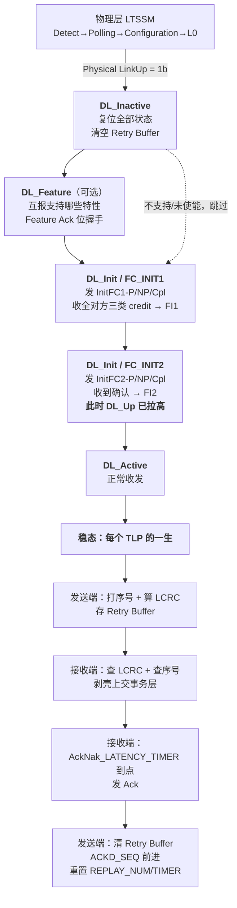
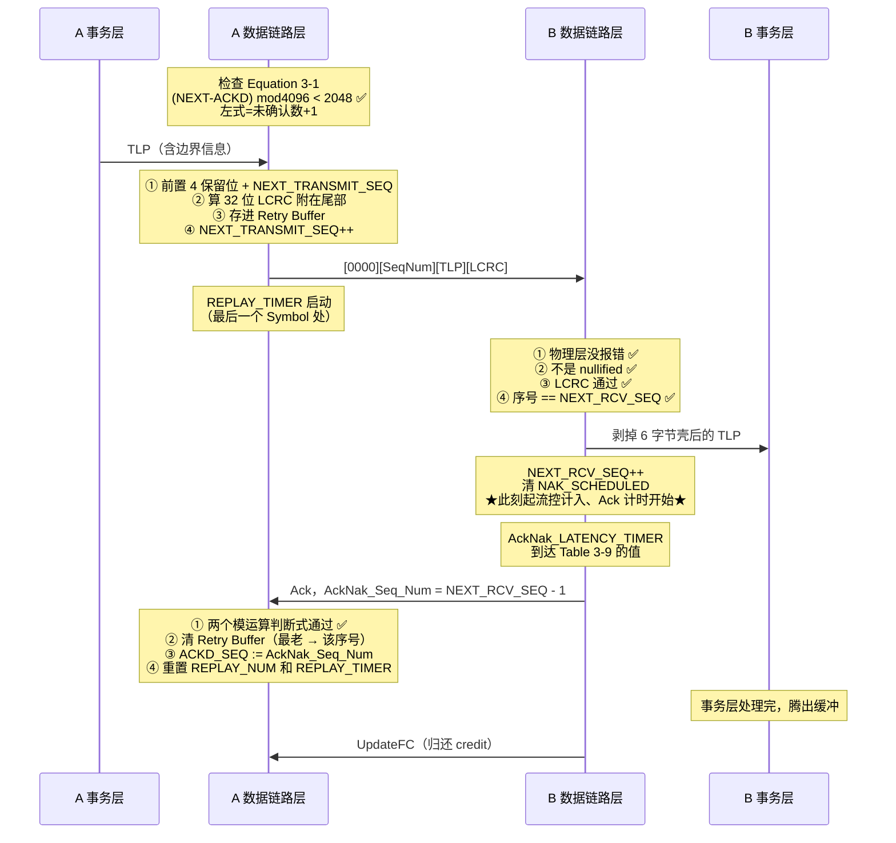

> [!abstract] 这一站做三件事
> 1. **把整章串成一条时间线** —— 从上电到稳态收发，每一步用到哪一节
> 2. **收网：贯穿全章的 6 个设计模式** —— 前面每一站埋的伏笔在这里汇总
> 3. **Gen5 → Gen6 差异对照** —— 接回组里读 6.2 的主线
>
> 配套看板：`01_35_08_全章总览.canvas` + `01_35_09_TLP往返时序.canvas` + `01_35_10_Gen5_Gen6对照.canvas`

# 1. 一条时间线走完全章



## 1.1 每一步用哪一节

| 阶段 | 发生什么 | Spec 节 | 我的笔记 |
|---|---|---|---|
| 上电 / 复位 | DLCMSM 进 `DL_Inactive`，清空一切 | §3.2.1 | [[01_33_S3_DLCMSM]] |
| 物理层就绪 | `Physical LinkUp = 1b` | 第 4 章 | — |
| 特性协商 | `DL_Feature`，交换 Data Link Feature DLLP | §3.3 | [[01_34_S4_数据链路特性交换]] |
| 决定 Scaled FC | 双方都置位 bit0 → **activated** | §3.3 + §3.4.2 | [[01_36_S6_ScaledFC]] |
| 流控第一阶段 | `FC_INIT1`，交换 credit 值 | §3.4.1 | [[01_35_S5_流控初始化]] |
| 流控第二阶段 | `FC_INIT2`，互相确认；**`DL_Up` 在此拉高** | §3.4.1 | [[01_35_S5_流控初始化]] |
| 进入工作 | `DL_Active` | §3.2.1 | [[01_33_S3_DLCMSM]] |
| 发 TLP | 打序号 → 算 LCRC → 存 Retry Buffer → 上线 | §3.6.2.1 | [[01_38_S8_数据完整性_发送端]] |
| 收 TLP | 查物理层错 → 查 nullify → 查 LCRC → 查序号 → 剥壳上交 | §3.6.3.1 | [[01_3a_S10_数据完整性_接收端]] |
| 回 Ack | `AckNak_LATENCY_TIMER` 到 Table 3-7/8/9 的值 | §3.6.3.1 | [[01_3a_S10_数据完整性_接收端]] |
| 处理 Ack | 清 Retry Buffer + 更新 `ACKD_SEQ` + 重置错误计数 | §3.6.2.2 | [[01_39_S9_数据完整性_收DLLP]] |
| 出错重发 | Nak 或 `REPLAY_TIMER` 超时 → replay | §3.6.2.1/2 | [[01_38_S8_数据完整性_发送端]] |
| 反复失败 | `REPLAY_NUM` 溢出 → 通知物理层重训练 | §3.6.2.1 | [[01_38_S8_数据完整性_发送端]] |
| 链路死亡 | `LinkUp = 0b` → 回 `DL_Inactive` | §3.2.1 | [[01_33_S3_DLCMSM]] |

---

# 2. 一个 TLP 的完整往返（正常情况）



## 2.1 出错时的三条分支

| 出错点 | 接收端做什么 | 发送端做什么 |
|---|---|---|
| **LCRC 错 / 物理层报错** | 丢弃 + **立即发 Nak** + 置 `NAK_SCHEDULED` | 收 Nak → **先清理已确认的，再 replay** |
| **序号超前（丢包）** | 丢弃 + **立即发 Nak**（若标志清） | 同上 |
| **序号落后（重复包）** | 丢弃 + **安排发 Ack** | 收 Ack → 正常清理 |
| **Ack / Nak 全丢了** | —— | **`REPLAY_TIMER` 超时** → replay（兜底） |
| **连续 4 次 replay 无进展** | —— | `REPLAY_NUM` 溢出 → **通知物理层重训练** |

---

# 3. 收网：贯穿全章的 6 个设计模式

> [!important] 这一节是我做这一章最大的收获
> 第 3 章看起来是一堆零散规则，但**同一批设计思想反复出现**。
> 抓住这 6 个模式，规则就不用死记了。**讲解会上这一节最值得展开。**

## 模式一：只有 forward progress 才能重置错误计数

| 出现位置 | 规则 |
|---|---|
| [[01_38_S8_数据完整性_发送端#^forward-progress\|§3.6.2.1]] | `REPLAY_TIMER` 只在 Ack **确认了 Retry Buffer 里某些 TLP** 时才重置（**if and only if**） |
| [[01_38_S8_数据完整性_发送端#^replay-num-reset\|§3.6.2.1]] | `REPLAY_NUM` 只在 Nak **确认了某些 TLP** 时才重置 |
| [[01_39_S9_数据完整性_收DLLP#^forward-progress-again\|§3.6.2.2]] | 收到有新确认的 Ack/Nak → **两个都重置** |

> [!note] 为什么必须这样
> 如果「收到任何 Ack 就重置」，对方反复发同一个 Ack 就能让计时器**永远不超时** → **活锁**。
> spec 自己的注解说得最清楚：
> > This ensures that REPLAY_TIMER is reset **only when forward progress is being made**

## 模式二：一个根因只报一次（防 error pollution）

| 出现位置 | 规则 |
|---|---|
| [[01_33_S3_DLCMSM#^sd-blocking-rule\|§3.2.1]] | Surprise Down 的 6 个屏蔽条件，包括「根因在上游就不报」 |
| [[01_39_S9_数据完整性_收DLLP#^no-error-pollution\|§3.6.2.2]] | 物理层报过的 Receiver Error，数据链路层不重复报 |
| [[01_39_S9_数据完整性_收DLLP#^nak-not-error\|§3.6.2.2]] | **收到 Nak 不是 reported error**（错误已由对方记录） |
| [[01_3a_S10_数据完整性_接收端#^error-pollution\|§3.6.3.1]] | 建议只在 `NAK_SCHEDULED` 清零时报乱序错误，**spec 在这里正式用了 "error pollution" 这个词** |

## 模式三：后一条覆盖前一条（self-repairing / supersede / collapse）

| 出现位置 | 规则 |
|---|---|
| [[01_31_S1_数据链路层概述#^self-repairing\|§3.1]] | 坏 DLLP 直接丢弃，**successive DLLP will supersede** |
| [[01_37_S7_DLLP详解#^ack-cumulative\|§3.5.1]] | Ack 是**累积确认**，序号大的包含序号小的 |
| [[01_38_S8_数据完整性_发送端#8.2 Replay 的完整步骤（spec 顺序，一条不漏）\|§3.6.2.1]] | replay 期间的多个 Ack 可以 **collapse** 成序号最大的那个 |
| §3.6.2.1 优先级注记 | 待发的同类 DLLP 可以合并，「只发第二个就够了」 |

> [!important] 不要把 supersede 过度推广到每一种 DLLP
> Ack 与 UpdateFC 具有累计/状态覆盖性质；Feature 与 InitFC 依靠周期重发；Nak 丢失由 `REPLAY_TIMER` 兜底。
> 这些**按类型设计的恢复路径**共同解释了为什么 DLLP 不进入 Retry Buffer，而不是“每条 DLLP 都是完整绝对状态”。

## 模式四：用「对方的行为」推断状态，而不是死等约定信号

| 出现位置 | 规则 |
|---|---|
| [[01_34_S4_数据链路特性交换#^no-timeout\|§3.3]] | 收到 **InitFC1** → 判定对方不支持 Feature Exchange（**没有超时机制**） |
| [[01_35_S5_流控初始化#^fi2-paths\|§3.4.1]] | 收到**任意 TLP** 或 **UpdateFC** → 置位 `FI2`（兜底路径，防死锁） |
| [[01_35_S5_流控初始化#^accept-both\|§3.4.1]] | `FC_INIT1` 里收到对方的 **InitFC2** 也算数 |
| [[01_3a_S10_数据完整性_接收端#^duplicate-needs-ack\|§3.6.3.1]] | 收到**重复包** → 推断「我的 Ack 丢了」→ 补发 Ack |

> [!note] 这个模式的好处
> 不需要定超时值（定长了慢、定短了误判）、不受链路速度和重训练影响，
> **对方的行为本身就是最可靠的信号。**

## 模式五：留一半空间做回绕判定

| 出现位置 | 规则 |
|---|---|
| [[01_36_S6_ScaledFC#3.3 为什么最大 header credit 是 127 而不是 255？\|§3.4.2]] | Hdr credit 8 位但上限 **127**；Data credit 12 位但上限 **2047** |
| [[01_38_S8_数据完整性_发送端#^eq-3-1\|§3.6.2.1]] | 序号 12 位（4096）；Equation 3-1 的距离阈值为 2048，实际未确认数为左式减 1 |
| [[01_39_S9_数据完整性_收DLLP#^acknak-valid-window\|Figure 3-18]] | 两个 `mod 4096` 判断式，门限都是 **2048** |
| [[01_3a_S10_数据完整性_接收端#^duplicate-vs-oos\|§3.6.3.1]] | 区分重复包 / 乱序，门限还是 **2048** |

> [!important] 半环是共同思想，不等号边界必须逐条照抄
> ```
> (X - Y) mod 2ⁿ  <  2ⁿ⁻¹   →  X 在 Y 前面（领先）
> (X - Y) mod 2ⁿ  >= 2ⁿ⁻¹   →  X 在 Y 后面（落后）
> ```
> **在循环计数空间里，用半环范围换取「方向」的可判定性；具体规则可能使用 `<` 或 `≤`，恰好 2048 时不能套通用口诀。**

## 模式六：Reserved 位 = 未来的扩展入口

| 出现位置 | 规则 |
|---|---|
| [[01_32_S2_DLLP初识#^reserved-rule\|§3.5.1]] | 发送方填 0、**接收方必须忽略** |
| [[01_39_S9_数据完整性_收DLLP#^unsupported-type-silent\|§3.6.2.2]] | 不认识的 DLLP Type → **静默丢弃，不算错误** |
| [[01_37_S7_DLLP详解#^scale-from-reserved\|实证]] | PCIe 4.0 的 `HdrScale`/`DataScale` **就是从 4 个 Reserved 位里拿的**，包格式一字节没改 |
| [[01_38_S8_数据完整性_发送端#^pmux-bits\|§3.6.1]] | TLP Symbol+0 的 bit[7:4]，在支持 PMUX 的 Port 上有了新用途 |

> [!warning] 但现实会打脸
> [[01_34_S4_数据链路特性交换#2. 四个寄存器字段|`Data Link Feature Exchange Enable` 这个软件开关]]的存在，
> 恰恰说明**有老硬件没做到「静默忽略」**。
> **规范再优雅，也得给现实的 bug 留后门。**

---

# 4. Gen5 → Gen6 差异对照

> [!important] 我是怎么做这个对照的
> 使用本库已经抽出的 Gen6.2 第 3 章 `spec_chap3.pdf`（原规范 p.309–350，共 42 页），
> 和 Gen5 的 36 页逐节比对。**不是凭记忆写的。**

## 4.1 章节结构：几乎没变，只多了一节

| Gen5 §3 | Gen6.2 §3 | 变化 |
|---|---|---|
| 3.1 Data Link Layer Overview | 同名 | — |
| 3.2 / 3.2.1 DLCMSM | 同名 | — |
| 3.3 Data Link Feature Exchange | 同名 | 内容大改（见 4.3） |
| 3.4 / 3.4.1 FC Initialization | 同名 | — |
| 3.4.2 Scaled Flow Control | 同名 | — |
| 3.5 / 3.5.1 DLLPs | 同名 | 类型表大改（见 4.4） |
| 3.6 / 3.6.1 / 3.6.2 / 3.6.2.1 | 同名 | — |
| 3.6.2.2 Handling of Received DLLPs | 3.6.2.2 Handling of Received DLLPs **(Non-Flit Mode)** | **加了后缀** |
| —— | **3.6.2.3 Handling of Received DLLPs (Flit Mode)** | **🆕 全新一节** |
| 3.6.3 LCRC and Sequence Number (TLP Receiver) | 3.6.3 ... (TLP Receiver) **(Non-Flit Mode)** | **加了后缀** |
| 3.6.3.1 | 同名 | — |

> [!important] 这张表本身就是最重要的结论
> **Gen6 的第 3 章 = Gen5 的第 3 章 + 一节 Flit Mode 的 DLLP 处理 + 若干「(Non-Flit Mode)」后缀。**
>
> **也就是说：我学的 Gen5 内容，在 Gen6 里一条都没作废，只是被限定在 "Non-Flit Mode" 下。**
> mentor 让我从 Gen5 学是对的 —— **Gen5 学的就是 Gen6 的 Non-Flit 那一半，而且是完整的一半。** ^gen5-is-subset

## 4.2 DLCMSM：完全没变

Gen6.2 §3.2 的状态列表和状态输出**与 Gen5 逐字相同**：

| | Gen5 | Gen6.2 |
|---|---|---|
| 状态 | DL_Inactive / DL_Feature（可选）/ DL_Init / DL_Active | **完全相同** |
| 状态输出 | DL_Down / DL_Up | **完全相同** |
| Figure 3-2 | OM13779A | **同一张图（水印都一样）** |

> [!note] 结论
> **[[01_33_S3_DLCMSM|S3 学的 DLCMSM 可以直接用于 Gen6，不需要任何修正。**

## 4.3 §3.3 Data Link Feature：Gen6 加了很多位

这是变化最大的一节之一。

### Gen5 的 Table 3-1

| Bit | 描述 |
|---|---|
| 0 | Scaled Flow Control |
| 22:1 | Reserved |

### Gen6.2 的 Table 3-1

| Bit | 描述 | **Type** |
|---|---|---|
| **0** | **Scaled Flow Control** —— 16GT/s+ 必须置位；**Flit Mode 使能时必须置位** | **Data Link Feature** |
| **1** | 🆕 **Immediate Readiness** —— 发送 Port 的所有非 VF 都已 Immediate Readiness | **Data Link Parameter** |
| **4:2** | 🆕 **Extended VC Count** —— 发送 Port 支持的 VC 资源数量（**Flit Mode 下有意义，Non-Flit 下必须为 0**） | **Data Link Parameter** |
| **7:5** | 🆕 **L0p Exit Latency** —— 用 L0p 加宽链路所需时间（8 档编码；不支持 L0p 填 `000b`；**Flit Mode 下有意义，Non-Flit 下必须为 0**） | **Data Link Parameter** |
| 22:8 | Reserved | — |

> [!important] Gen6 新增了「Feature」和「Parameter」的区分
> Gen5 里所有位都是 **Data Link Feature**（语义是「双方都支持才激活」，逻辑与）。
>
> Gen6 加了一类 **Data Link Parameter** —— 它**不是「能力协商」，而是「参数通告」**：
> 我告诉你我的 Extended VC Count 是多少、我的 L0p 退出延迟是多少，
> **这不需要「取交集」，是单向告知。**
>
> **同一个 DLLP、同一个字段，承载了两种不同语义的信息。** ^feature-vs-parameter

> [!note] 对我 S4 笔记的影响
> [[01_34_S4_数据链路特性交换#1. 这一节到底在解决什么问题|S4 里我说「Gen5 的 §3.3 存在的唯一目的就是协商 Scaled Flow Control」]] ——
> **这句话对 Gen5 完全正确，但到了 Gen6 就不成立了。**
> Gen6 的 §3.3 承担了 4 组信息的交换，重要性大幅上升。
>
> 讲解时要明确说清楚这是**版本差异**，不是我讲错了。

## 4.4 §3.5 DLLP 类型表：Flit Mode 让编码「一码两义」

Gen5 的 Table 3-3 → Gen6.2 的 **Table 3-5**（表号也变了）。

### 🔴 最重要的变化：同一个编码在两种模式下含义不同

| 编码 | **Non-Flit Mode** | **Flit Mode** |
|---|---|---|
| `0000 0000` | **Ack** | 🆕 **NOP2** |
| `0000 0001` | MRInit（MR-IOV） | **Reserved** |
| `0001 0000` | **Nak** | **Reserved** |
| `0010 1000` | **Reserved** | 🆕 **Link Management**（用于 L0p） |
| `0111 0vvv` | MRInitFC1 | **Reserved** |
| `1011 0vvv` | MRUpdateFC | **Reserved** |
| `1111 0vvv` | MRInitFC2 | **Reserved** |

> [!important] `0000 0000` 这一行是整张表最值得讲的
> **Flit Mode 下没有 Ack/Nak 了**（见 4.6），所以 `0000 0000` 这个编码空了出来，
> **被复用给了 NOP2。**
>
> spec 的表注写得很直白：
> > These DLLPs are not used in Flit Mode. **In Flit Mode, the Ack encoding is used for the NOP2.**
>
> 这就是为什么我之前在 Gen6 学 DLLP 时觉得「NOP 和 NOP2 莫名其妙」——
> **NOP2 不是凭空多出来的，它是占了 Ack 腾出来的坑。** ^acknak-encoding-reuse

### 🆕 Gen6 新增的编码

| 编码 | 类型 | 说明 |
|---|---|---|
| `0000 0011` | **Alternate Protocol Use 1** | 不被 PCIe 使用；只有协商了 Alternate Protocol 之后才允许（§4.2.5.2），含义由该协议定义 |
| `0000 0100` | **Alternate Protocol Use 2** | 同上 |
| `0010 1000` | **Link Management**（Flit Mode） | 用于 **L0p**（动态链路宽度调整） |

### FC DLLP 的 bit[3]：Shared / Dedicated Flow Control

> [!success] 已对照 Gen6.2 Table 3-5 与 Figure 3-9 / 3-10 / 3-11
> **Gen5 的 Table 3-3**：每个 FC 类型只有**一行**编码，例如 `0100 0v₂v₁v₀`（bit[3] 固定为 `0`）。
>
> **Gen6.2 的 Table 3-5**：每个 FC 类型列了**两行**，例如
> ```
> 0100 0v2v1v0   InitFC1-P (v[2:0] specifies
> 0100 1v2v1v0   Virtual Channel)
> ```
> **bit[3] 出现 `0` 和 `1` 两种取值，不是 VC 的第 4 位：**
> - `0` = **Shared Flow Control**
> - `1` = **Dedicated Flow Control**
>
> VC 编号仍由 `v[2:0]` 指定。Gen6.2 图旁还说明 Base 6.0.1 曾更新 byte 0 bit[3]，使图与 Table 3-5 一致。
>
> 这会直接影响 [[01_32_S2_DLLP初识#^fc-encoding-structure|S2 里我总结的那条编码规律]]：
> 因而 S2 的编码口诀只适用于 Gen5；在 Gen6.2 中必须先解释 Shared / Dedicated FC。 ^gen6-bit3-question

## 4.5 §3.6.1 / §3.6.2 / §3.6.2.1：一个字都没改

> [!important] 这是个好消息
> 我对比了 Gen6.2 的 §3.6.1、§3.6.2、§3.6.2.1 开头段落，**与 Gen5 逐字相同**：
> - TLP boundary information / black box 原则 —— 相同
> - Figure 3-14（Gen6 编号为 **Figure 3-17**，标题加了「**- Non-Flit Mode**」）—— **同一张图，水印都是 OM13786A**
> - PMUX 的两句话 —— 相同
> - 发送端总览段落（含「放弃阶梯」）—— 相同，只有引用的 LTSSM 章节号从 §4.2.6 变成 §4.2.7
>
> **也就是说 [[01_38_S8_数据完整性_发送端|S8 学的发送端内容，在 Gen6 的 Non-Flit Mode 下 100% 适用。**

## 4.6 §3.6.2.3：Flit Mode 下重传机制被整体搬走了

这是 Gen6 **唯一全新的一节**，也是理解 Flit Mode 的钥匙。

> [!important] 三句原文，回答了我在 Gen6 学时的所有困惑

### 第一句：DLLP 不再自带 CRC

> In Flit Mode, **detection of corrupt DLLPs occurs at the Flit level** and there is **no corruption check for DLLPs in the Data Link Layer**.

**Flit Mode 下 DLLP 没有 16-bit CRC 了。** 因为整个 Flit 已经被 Flit 级的 CRC + FEC 保护了，
再给每个 DLLP 单独算 CRC 是重复开销。

➡️ **影响我的笔记：** [[01_37_S7_DLLP详解#5. 16-bit CRC|S7 §5 的整个 CRC 部分]] 在 Flit Mode 下不适用。

### 第二句：Ack/Nak 整体消失

> In Flit Mode, **replay occurs at the Flit level** and the **Ack and Nak DLLPs are not used**.

**重传的粒度从「TLP」变成了「Flit」。**

➡️ **影响我的笔记：** [[01_39_S9_数据完整性_收DLLP|S9]] 的 Ack/Nak 处理、
[[01_3a_S10_数据完整性_接收端|S10]] 的 Nak 调度和 Ack Latency 表，**在 Flit Mode 下全都不适用**。

> [!question] 为什么 Flit Mode 要把重传粒度改成 Flit？
> 我的理解（**推测，需要读 Gen6 第 4 章确认**）：
> - Flit 是**定长**的（256B），重传单元定长，缓冲管理和流水线设计都简单得多
> - Flit 自带 **CRC + FEC**，FEC 能直接纠正部分错误，**根本不用重传**
> - 高速率下 BER 上升，逐 TLP 重传的开销和延迟都不可接受
>
> **这个问题很适合留给读第 4 章的同事回答。**

### 第三句：什么进 Replay Buffer，什么不进

> **DLLPs and Optimized_Update_FCs are not stored in the Replay Buffer.**
> When a Flit is replayed, the **DLP information is likely to be different from the original value**.
> **Flit_Markers are associated with the TLP payload and are stored in the Replay Buffer.**

| 内容 | 进 Replay Buffer？ | 为什么 |
|---|---|---|
| **DLLP** | ❌ | 重发时**状态已经变了**，应该发新值而不是旧值 |
| **Optimized_Update_FC** | ❌ | 同上（credit 值是实时的） |
| **Flit_Marker** | ✅ | 它**绑定在 TLP payload 上**，必须和 TLP 一起重发 |

> [!important] 这条其实是「模式三（后一条覆盖前一条）」的延续
> **DLLP 承载的是实时状态，重发旧状态没有意义，甚至有害。**
> 所以 Flit 重传时，**payload 照搬，控制信息重新生成**。
>
> 这解释了原文那句 "the DLP information is **likely to be different** from the original value" ——
> **不是 bug，是设计。** ^flit-replay-dlp

### §3.6.2.3 保留的规则

Flit Mode 下仍然适用的（和 Non-Flit 一样）：

| 规则 | 与 §3.6.2.2 对比 |
|---|---|
| 不支持的 Type 编码 → 静默丢弃，不算错误 | **相同** |
| Reserved 字段的非零值 → 忽略 | **相同** |
| 必须以接收速率处理所有 DLLP | **相同** |
| 收到 NOP **和 NOP2** → 丢弃 | 多了 NOP2 |
| 收到 FC DLLP → 交给事务层 | **相同** |
| 🆕 收到 **Optimized_Update_FC** → 交给事务层 | 新增 |
| 收到 PM DLLP → 交给电源管理逻辑 | **相同** |
| 🆕 收到 **Link Management DLLP** → 交给 **L0p 控制逻辑** | 新增 |

## 4.7 总结表：我学的每一站在 Gen6 里还成立吗

| 我的站点 | Gen6 Non-Flit Mode | Gen6 Flit Mode |
|---|---|---|
| [[01_31_S1_数据链路层概述\|S1]] §3.1 概述 | ✅ 完全适用 | ✅ 大部分适用 |
| [[01_32_S2_DLLP初识\|S2]] §3.5 DLLP 形状 | ✅ 适用 | ⚠️ **无 CRC**，6 字节变 4 字节；编码含义不同 |
| [[01_33_S3_DLCMSM\|S3]] §3.2 DLCMSM | ✅ **完全相同** | ✅ **完全相同** |
| [[01_34_S4_数据链路特性交换\|S4]] §3.3 特性交换 | ⚠️ **Table 3-1 大幅扩展** | ⚠️ 同左，且多个字段仅 Flit Mode 有意义 |
| [[01_35_S5_流控初始化\|S5]] §3.4 FC 初始化 | ✅ 适用 | ✅ 适用（多了 Optimized_Update_FC） |
| [[01_36_S6_ScaledFC\|S6]] §3.4.2 Scaled FC | ✅ 适用 | ✅ 适用（**Flit Mode 下必须置位**） |
| [[01_37_S7_DLLP详解\|S7]] §3.5.1 格式 + CRC | ✅ 适用 | ❌ **CRC 部分不适用**；FC DLLP bit[3] 改为 Shared/Dedicated FC |
| [[01_38_S8_数据完整性_发送端\|S8]] §3.6.2.1 发送端 | ✅ **逐字相同** | ❌ **重传改为 Flit 级** |
| [[01_39_S9_数据完整性_收DLLP\|S9]] §3.6.2.2 收 DLLP | ✅ 适用（改名加了后缀） | ❌ **被 §3.6.2.3 取代** |
| [[01_3a_S10_数据完整性_接收端\|S10]] §3.6.3 接收端 | ✅ 适用（改名加了后缀） | ❌ **不适用** |

> [!important] 一句话结论
> **Non-Flit Mode 那一列几乎全是 ✅ —— 我学的东西在 Gen6 里完整保留。**
> **Flit Mode 的差异集中在 §3.6（重传）和 §3.5（DLLP 格式），
> 而这两块的差异都源于同一件事：重传粒度从 TLP 变成了 Flit。**
>
> **抓住「重传粒度改变」这一个根因，Flit Mode 的所有差异都能推出来。** ^flit-one-root-cause

---

# 5. 讲解会上可能被问的问题

> [!note] 我按「一定会问 / 可能会问 / 深水区」分了三档

## 5.1 一定会问

| # | 问题 | 我的答案在哪 |
|---|---|---|
| 1 | DLLP 为什么不需要重传？ | [[01_31_S1_数据链路层概述#^self-repairing\|S1 §5.2]] |
| 2 | 有了 LCRC 为什么还要序号？ | [[01_31_S1_数据链路层概述#^why-seqnum\|S1 §5.1]] |
| 3 | `DL_Up` 什么时候拉高？ | [[01_33_S3_DLCMSM#^dlup-timing\|S3 §2.2]]（**不是 `DL_Active`，是 `FC_INIT2`**） |
| 4 | 为什么流控初始化要两个阶段？ | [[01_35_S5_流控初始化#^why-two-phase\|S5 §2.2]] |
| 5 | Ack 是确认一个还是一批？ | [[01_37_S7_DLLP详解#^ack-cumulative\|S7 §3.1]]（**累积确认**） |
| 6 | 重试几次进 Recovery？ | [[01_38_S8_数据完整性_发送端#^replay-steps\|S8 §8.2]]（`REPLAY_NUM` 2 位，**第 4 次溢出**） |
| 7 | 什么是 nullified TLP？ | [[01_38_S8_数据完整性_发送端#^why-nullify\|S8 §6.1]] |

## 5.2 可能会问

| # | 问题 | 我的答案在哪 |
|---|---|---|
| 8 | `ACKD_SEQ` 为什么复位成 `FFFh`？ | [[01_38_S8_数据完整性_发送端#^ackd-seq-fff\|S8 §3.1]] + [[01_39_S9_数据完整性_收DLLP#^empty-ack-legal\|S9 §7.1]]（**两个理由**） |
| 9 | 收到重复包为什么回 Ack 不回 Nak？ | [[01_3a_S10_数据完整性_接收端#^duplicate-needs-ack\|S10 §2.4]] |
| 10 | `NAK_SCHEDULED` 在防什么？ | [[01_3a_S10_数据完整性_接收端#^nak-scheduled-purpose\|S10 §3.2]] |
| 11 | 重发 TLP 要不要重新申请 credit？ | [[01_38_S8_数据完整性_发送端#^replay-no-extra-credit\|S8 §8.2]]（**不要**） |
| 12 | 为什么 Nak 优先级比 Ack 高？ | [[01_38_S8_数据完整性_发送端#^priority-logic\|S8 §11.1]] |
| 13 | 速率越高，Ack Latency 数值反而越大？ | [[01_3a_S10_数据完整性_接收端#^symbol-time-caveat\|S10 §6.5]]（**单位是 Symbol Time**） |
| 14 | Backpressure 和 Flow Control 有什么区别？ | [[01_31_S1_数据链路层概述#^backpressure-vs-fc\|S1 §6.3]] |

## 5.3 深水区（答不上来也正常，但最好知道去哪查）

| # | 问题 | 状态 |
|---|---|---|
| 15 | 为什么 InitFC 必须 P → NP → Cpl 顺序？ | ⚠️ **spec 没解释**，我只有推测 |
| 16 | Gen5 的 Figure 3-7/3-8/3-9 是否画了 Scale 字段？ | ✅ **画了，且位位置明确**（见 S7 §4.3） |
| 17 | Gen6 的 FC DLLP bit[3] 是什么？ | ✅ **0=Shared FC，1=Dedicated FC**（见 [[#^gen6-bit3-question\|§4.4]]） |
| 18 | Ack Latency 表里 x8 和 x16 为什么相同？ | ✅ 已确认原表如此；原因本章未解释，按规范表查值（见 [[01_3a_S10_数据完整性_接收端#6.1 数字核验结论\|S10 §6.1]]） |
| 19 | Flit Mode 为什么把重传粒度改成 Flit？ | ⚠️ 需要读 **Gen6 第 4 章**，可以问读第 4 章的同事 |
| 20 | Credit 的完整语义（消耗、归还、死锁避免）？ | 属于**第 2 章 §2.6**，不在我的分工内 |

---

# 6. 全章一页速查

## 6.1 七个状态变量

| 侧 | 变量 | 位宽 | 复位值 |
|---|---|---|---|
| 发送 | `NEXT_TRANSMIT_SEQ` | 12 | `000h` |
| 发送 | `ACKD_SEQ` | 12 | **`FFFh`** |
| 发送 | `REPLAY_NUM` | 2 | `00b` |
| 发送 | `REPLAY_TIMER` | — | （7 条规则） |
| 接收 | `NEXT_RCV_SEQ` | 12 | `000h` |
| 接收 | `NAK_SCHEDULED` | 1 | Clear |
| 接收 | `AckNak_LATENCY_TIMER` | — | `0` |
| 流控 | `FI1` / `FI2` | 标志 | — |

## 6.2 关键数值

| 数值 | 含义 |
|---|---|
| **6 Byte** | DLLP 长度（Non-Flit） |
| **6 Byte** | 数据链路层给 TLP 加的开销（头 2 + 尾 4） |
| **12 bit** | TLP 序号 / `AckNak_Seq_Num` |
| **2048** | 半环门限；Equation 3-1 左式是“未确认数 + 1”，实际未确认数量上限为 2047 |
| **4 次** | `REPLAY_NUM` 溢出 → 重训练 |
| **34 µs** | Data Link Feature / InitFC1 / InitFC2 的最大重发间隔 |
| **24,000–31,000** | `REPLAY_TIMER` Limit（Extended Synch Clear） |
| **80,000–100,000** | `REPLAY_TIMER` Limit（Extended Synch Set） |
| **`100Bh`** | DLLP 的 16-bit CRC 多项式 |
| **`04C1 1DB7h`** | TLP 的 32-bit LCRC 多项式 |
| **`FFFFh` / `FFFF FFFFh`** | 两者的 seed |
| **127 / 2047** | 无 Scaled FC 时的 Hdr / Data credit 上限 |
| **2032 / 32752** | Scale = `11b` 时的上限 |
| **16 Byte** | 1 个 data credit |

## 6.3 五张官方流程图

| 图 | 内容 | PDF 页 |
|---|---|---|
| Figure 3-2 | DLCMSM | 3 |
| Figure 3-3 | FC 初始化时序例 | 12 |
| Figure 3-17 | 收到 DLLP 的错误检查 | 28 |
| Figure 3-18 | Ack/Nak 处理 | 30 |
| Figure 3-19 | 接收端 TLP 处理 | 33 |

---

# 7. 自检：整章通关

- [ ] 从上电到能发第一个 TLP，按顺序说出所有阶段和对应的 spec 节
- [ ] 一个 TLP 从事务层出发到被 Ack 确认，两端各做了哪些动作？
- [ ] 说出贯穿全章的 6 个设计模式，每个举两个出处
- [ ] Gen6 的第 3 章比 Gen5 多了哪一节？说明了什么？
- [ ] Gen6 的 `0000 0000` 编码在两种模式下分别是什么？为什么能复用？
- [ ] Flit Mode 下 DLLP 还有 CRC 吗？还有 Ack/Nak 吗？为什么？
- [ ] Flit 重传时，DLLP 和 Flit_Marker 的待遇为什么不同？
- [ ] 「重传粒度从 TLP 变成 Flit」能推出哪些下游差异？
- [ ] 我学的 10 站里，哪几站在 Flit Mode 下不适用？

---

## 相关笔记 Relation
- 上一站 → [[01_3a_S10_数据完整性_接收端]]
- 本章导航 → [[01_3f_Gen5_DLL_MOC]]
- 全部站点：[[01_30_S0_前置对齐]] · [[01_31_S1_数据链路层概述]] · [[01_32_S2_DLLP初识]] · [[01_33_S3_DLCMSM]] · [[01_34_S4_数据链路特性交换]] · [[01_35_S5_流控初始化]] · [[01_36_S6_ScaledFC]] · [[01_37_S7_DLLP详解]] · [[01_38_S8_数据完整性_发送端]] · [[01_39_S9_数据完整性_收DLLP]] · [[01_3a_S10_数据完整性_接收端]]
- 我之前的 Gen6 笔记（现在可以回头看了）→ [[01_21_数据链路层_3.5_DLLP_讲义]] · [[DLL_DLLP]] · [[01_64_Flit模式_预习]]

## 来源 Reference
- Gen5 spec 第 3 章全文，p.209–244 → [[gen5_chap3.pdf#page=1|PDF p.1–36]]
- Gen6.2 spec 第 3 章，原规范 p.309–350 → [[spec_chap3.pdf#page=1|Gen6.2 Chapter 3 p.1–42]]
