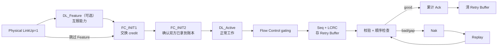

# 先回答：为什么已有笔记还“不够会”

Spec 型笔记擅长回答“规则是什么”，却不天然回答三件事：

1. 规则在一次真实包交换里何时触发；
2. 多个状态变量为何必须一起变化；
3. 出错时，系统靠哪条后备路径回到正确状态。

所以学习材料必须有两层：

- **规则层**：准确、可定位、不漏 must/shall/permit/recommend；
- **模型层**：用状态、账本、时序和反例把规则串成可以运行的协议。

这套讲义只做第二层，细节回链到 S0–S11。

# 一张图看完整章



# 四个必须分开的概念

| 概念 | 管什么 | 不管什么 |
|---|---|---|
| **DLCMSM** | 链路层能否工作、何时复位 | 不决定具体 credit 数 |
| **Flow Control** | 接收端是否还有容量接收“新 TLP” | 不确认 TLP 是否无错到达 |
| **Ack/Nak + Replay** | 已发 TLP 是否需要保留或重发 | 不重新分配 credit |
| **Physical Link state** | 电气/训练状态 | `Physical LinkUp=1` 不等于 `DL_Active` |

# 三轮学习法

## 第一轮：会讲故事

按讲义 01→04 连续读完，只要求能口述：

- LinkUp 后为何不能马上发 TLP；
- 为什么 FC 初始化要两阶段；
- 一条 TLP 如何被确认；
- 丢 TLP、丢 Ack、丢 Nak 分别怎样恢复。

## 第二轮：会跑状态

每读一条规则，都在纸上更新这些变量：

```text
发送端：NEXT_TRANSMIT_SEQ / ACKD_SEQ / REPLAY_NUM / REPLAY_TIMER
接收端：NEXT_RCV_SEQ / NAK_SCHEDULED / AckNak_LATENCY_TIMER
流控：FI1 / FI2 + P/NP/Cpl 的 Hdr/Data credit
```

不要只看文字。给变量赋具体值，例如从 `FFE, FFF, 000, 001` 跨回绕点推一遍。

## 第三轮：会定位问题

看到 trace 时先分类：

1. 启动没完成：查 DLCMSM、Feature、FI1/FI2；
2. 新 TLP 发不出：查 credit、Retry Buffer、Equation 3-1；
3. 同一批 TLP 反复出现：查 Ack/Nak 合法窗口、Replay Timer；
4. 接收端报 Bad TLP：按六步顺序查 PHY error、nullify、LCRC、Seq；
5. 吞吐周期性凹陷：查 Ack Latency、L0s 退出和 Retry Buffer 尺寸。

# 毕业题

请在不翻笔记时回答：

1. `DL_Up` 在哪个子状态拉高？为什么它不等价于 `DL_Active`？
2. Feature DLLP 的 Ack 位表示什么？为什么只需一个 bit？
3. FC_INIT1 收 InitFC2 时为何也要记 credit？FC_INIT2 为何忽略收到的 credit？
4. Equation 3-1 左式为什么是未确认数加一？
5. 收到重复 TLP 为何发 Ack，而收到更“新”的乱序 TLP 发 Nak？
6. `NAK_SCHEDULED=1` 时是否绝对不能发 Ack？
7. replay 为什么不再消耗 credit？
8. 坏 DLLP 为什么丢弃即可，但坏 TLP 需要 replay？请按 DLLP 类型分别解释恢复路径。

答案散落在后续四份讲义中；若只能背句子、不能用具体序号推演，还不算掌握。

## 继续

- [[讲义01_从LinkUp到DL_Active]]
- [[01_3f_Gen5_DLL_MOC]]
