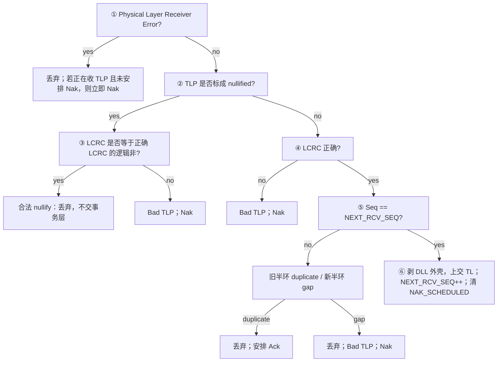

# 学习目标

把接收端六步检查跑成固定算法；准确解释 `NAK_SCHEDULED` 的例外；区分概念 timer 与外部合规测量。

# 1. 接收端只有三个“规范解释变量”

```text
NEXT_RCV_SEQ          下一个期待序号，复位 000h
NAK_SCHEDULED         已经为当前缺口安排 Nak，复位 Clear
AckNak_LATENCY_TIMER  跟踪 Ack/Nak 调度时限，复位 0
```

这些是规范用来描述行为的概念模型，并不禁止实现拥有接收 buffer、pipeline 或更多内部状态。

# 2. 六步检查必须按顺序



顺序很重要：nullified TLP 的 LCRC 是“正确 LCRC 的逻辑非”，若先按普通 LCRC 判断，会把合法 nullify 当随机错误。

# 3. 序号不匹配的两种含义

```text
(NEXT_RCV_SEQ - received_seq) mod4096 <= 2048  → duplicate
otherwise                                      → out of sequence / gap
```

duplicate 表示这个序号已经正确处理过，常见原因是上次 Ack 丢失：丢弃重复事务内容，但安排 Ack。
gap 表示期待的旧包没来、后面的包先到了：丢弃，并在尚未安排 Nak 时立即安排 Nak。

# 4. `NAK_SCHEDULED` 的精确语义

它不是“接收端错误模式”，而是“**当前缺口已喊过一次 replay 请求**”。作用：

- 对连续到来的后续乱序包，不重复发 Nak，避免 Nak 风暴和重复 replay；
- 等到真正期待的好包到达，才清零；
- 为常规 Ack Latency 调度增加一个 Clear 条件，避免在缺口未补时周期性发送无进展 Ack。

但有一个关键例外：**收到 duplicate TLP 时，规范直接要求安排 Ack，没有 `NAK_SCHEDULED` 前置条件。**
这是为了修复“Ack 丢失 → 发送端 replay → 接收端看到 duplicate”的闭环。说成“标志置位时 Ack/Nak/错误全部抑制”是错误的；错误报告本身甚至在标志置位时仍 permitted，只是为避免 error pollution，建议只在 Clear 时报告。

# 5. Ack 什么时候最晚必须安排

常规累计 Ack 不晚于以下条件全部成立的时刻发送：

1. DLCMSM 为 `DL_Active`；
2. 有已交事务层但尚未 Ack 的 TLP；
3. AckNak Latency Timer 达到查表值；
4. 发送 Ack 的方向已在 L0 或转入 L0；
5. 该方向没有正在发送的 TLP/DLLP；
6. `NAK_SCHEDULED` 为 Clear。

实现可以更早安排 Ack。Ack 是独立 DLLP，不存在把 Ack 字段“搭便车”塞进 TLP 的规则。

# 6. 三种“时间”不要混

| 时间概念 | 起点/动作 | 用途 |
|---|---|---|
| 概念 `AckNak_LATENCY_TIMER` | 首个待确认 TLP 上交后开始；安排 Ack/Nak 时重启 | 描述接收端调度 |
| Ack Latency Limit 表值 | 依速率、宽度、MPS 查 Table 3-7/8/9 | 规范上界 |
| Port 处合规区间 | 收到 TLP 最后 Symbol → 发出 Ack 第一 Symbol | 外部测试 |

合规测试要允许已在发送的包、L0s exit latency 与 Extended Synch 对退出的影响；接收端实现不要求根据这些量提前修正自己的调度。

表中的单位是 Symbol Times。Table 3-8 每格比 3-7 大 51，Table 3-9 每格比 3-8 大 45；这是核验后的表值关系，不等于规范给出的“固定开销推导”。MPS≥512 时 x8=x16 且 x12 更大也是原表值，按表使用即可。

# 7. 调试时先看症状，再找账本

| 症状 | 优先检查 |
|---|---|
| InitFC1 循环不前进 | 三类 P/NP/Cpl 是否都收到；VC 是否一致；CRC 是否丢弃 |
| 一侧卡 FC_INIT2 | 对向 InitFC2 是否单向丢失；TLP/UpdateFC 兜底是否实现 |
| Retry 周期性出现 | Nak 是否有效；Ack 是否越窗；Replay Timer 是否因无前进 Ack 被错误重置 |
| 重复 TLP 上交两次 | duplicate 判定或“丢弃但 Ack”路径错误 |
| 一次丢包产生大量 Nak | `NAK_SCHEDULED` 未置位/未生效 |
| 标志置位后发送端一直重发 | duplicate 触发 Ack 的例外被错误屏蔽 |
| 高吞吐时发送突然节流 | Retry Buffer 尺寸、Ack Latency、L0s exit 与 credit 共同检查 |

# 8. 最终推演题

A 已确认到 100，B 期待 101。A 发 101、102、103，其中 101 丢失：

1. B 收 102，判 gap，丢弃，发 Nak(100)，置 `NAK_SCHEDULED`；
2. B 收 103，仍 gap，只丢弃，不再 Nak；
3. A 收 Nak(100)，从 101 replay；
4. B 收 101，好包，上交、期待值变 102、清标志；
5. B 再收 102/103，依次上交；
6. B 发累计 Ack(103)，A 清到 103。

若 Ack(103) 丢失，A 超时再播 101..103。B 会把它们判 duplicate、丢弃，并安排累计 Ack；不会二次上交事务层，也不会再次扣 credit。

## 细节索引

- [[01_39_S9_数据完整性_收DLLP]]
- [[01_3a_S10_数据完整性_接收端]]
- [[01_3c_全链路推演.canvas]]
- [[01_3f_Gen5_DLL_MOC]]
