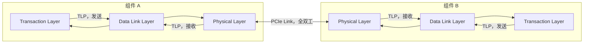
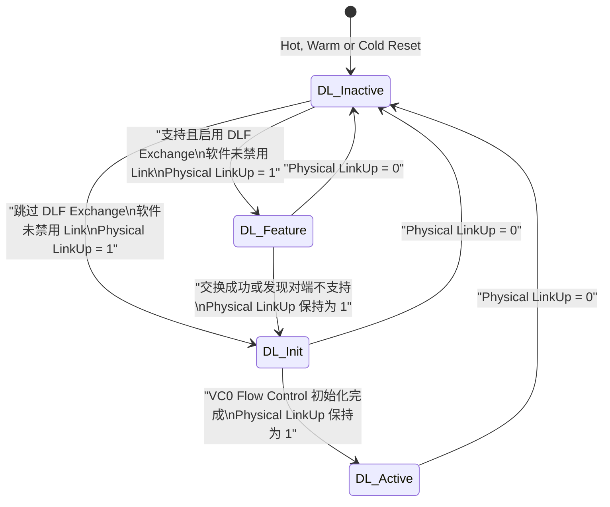
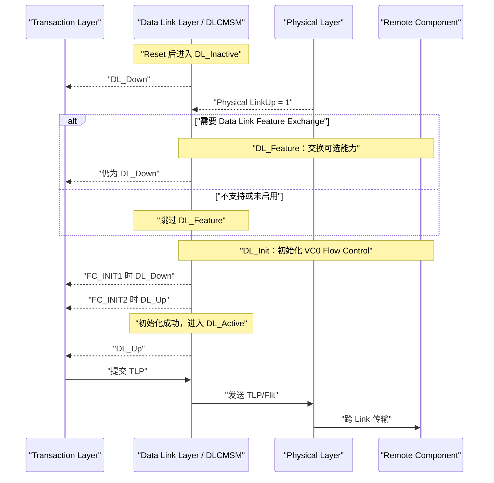

---
aliases:
  - PCIe 数据链路层 3.1-3.2 讲义
  - DLCMSM 入门
tags:
  - PCIe
  - Data-Link-Layer
  - DLCMSM
source: PCI Express Base Specification Revision 6.2
spec_pages: 309-313
pdf_pages: 1-5
---

# PCIe 6.2 第 3 章讲义：3.1-3.2 数据链路层概述与 DLCMSM

> [!abstract] 本讲范围
> 本讲严格围绕 PCI Express Base Specification Revision 6.2 的 **3.1、3.2 和 3.2.1**，对应规范页 309-313、截章 PDF 第 1-5 页。
>
> 原文入口：[[01_pcie/attachment/PCIeGen6_chap3.pdf#page=1|PCIeGen6_chap3.pdf，第 1 页]]

## 学完以后，你应该能回答什么

1. PCIe 为什么要在事务层和物理层之间放一个数据链路层？
2. TLP 和 DLLP 的服务范围有什么根本区别？
3. Non-Flit Mode 中，坏 DLLP 和坏 TLP 为什么采用不同的恢复方法？
4. Flit Mode 与 Non-Flit Mode 的重放单位有什么区别？
5. `Physical LinkUp`、`DL_Up` 和 `DL_Active` 为什么不能画等号？
6. DLCMSM 的四个状态各自在做什么，什么时候前进，什么时候退回？
7. 什么情况下链路掉线属于 Surprise Down，什么情况下不算？

---

# 0. 阅读规范前的最小前置知识

## 0.1 一条 PCIe Link 只连接两个相邻组件

PCIe 的基本连接单位叫 **Link（链路）**。一条 Link 的两端各有一个 Port，例如：

- Root Complex 的 Root Port ↔ Endpoint；
- Root Port ↔ Switch Upstream Port；
- Switch Downstream Port ↔ Endpoint。

一条 Link 可以由 1、2、4、8、16 条 Lane 组成，但不管有多少 Lane，从协议角度看，它仍然是连接两个相邻 Port 的一条 Link。

> [!tip] 先把网络类比缩小到“一段网线”
> 数据链路层只负责当前这一段 Link 上的可靠交付，不负责整个 PCIe 拓扑中的最终路由。

## 0.2 每个 Port 都同时具有发送和接收方向

PCIe 是全双工的：

- TX（Transmit）：本端发给对端；
- RX（Receive）：本端接收对端发送的内容。

因此一条 Link 上同时存在两个独立的数据方向：

```text
组件 A 的 TX  ==================>  组件 B 的 RX
组件 A 的 RX  <==================  组件 B 的 TX
```

规范图 3-1 中的编号可以读成：

- `1 -> 2`：左侧组件发送，右侧组件接收；
- `3 -> 4`：右侧组件发送，左侧组件接收。

## 0.3 三层先只记一句话

| 层 | 初学阶段先记住的职责 |
|---|---|
| Transaction Layer，事务层 | 产生、接收和解释事务请求/完成，处理地址、路由和事务语义 |
| Data Link Layer，数据链路层 | 在一条 Link 的两个直接相连组件之间可靠搬运 TLP，并管理本 Link |
| Physical Layer，物理层 | 把信息编码并真正发送到 Lane 上，同时完成链路训练和电气传输 |

发送路径是：

```text
本端事务层 -> 本端数据链路层 -> 本端物理层
            -> Link ->
对端物理层 -> 对端数据链路层 -> 对端事务层
```

## 0.4 先认识两种“包”

### TLP：Transaction Layer Packet

TLP 承载真正的事务内容，例如 Memory Read、Memory Write、Completion。它由事务层产生，也最终交给对端事务层。

一个 TLP 可能经过 Switch，跨越多条 Link 到达目标。因此：

> **TLP 可以被路由，具有跨多跳传播的可能。**

### DLLP：Data Link Layer Packet

DLLP 是数据链路层用于管理当前 Link 的控制信息，例如：

- Ack/Nak；
- Flow Control 信息；
- 电源管理相关信息。

DLLP 只在当前 Link 的两端之间传递，Switch 不会把收到的 DLLP 当成需要继续路由的包。

> **DLLP 是 point-to-point、hop-by-hop 的，只服务当前一跳。**

详细格式、类型和 Flit Mode 中的承载方式见：[[01_21_数据链路层_3.5_DLLP_讲义|3.5 DLLP 讲义]]。

---

# 1. 第 1 页：规范 p.309 - 数据链路层放在哪里

> 原文页面：[[01_pcie/attachment/PCIeGen6_chap3.pdf#page=1|PDF 第 1 页 / Spec p.309]]

## 1.1 图 3-1 应该怎样读

图 3-1 的核心不是方框长什么样，而是下面三个关系：

1. 数据链路层夹在事务层与物理层之间；
2. 每个组件都有自己的 TX 数据链路和 RX 数据链路；
3. 可靠性由 Link 两端的数据链路层合作实现，而不是某一端单独实现。



> [!warning] 不要把“层”理解为只能单向工作
> 图中每个层都包含发送侧和接收侧逻辑。所谓“本端数据链路层”，实际包含 TX Data Link 和 RX Data Link 两条处理路径。

## 1.2 数据链路层的第一项工作：搬运 TLP

规范把数据交换职责分为两个方向：

- 发送方向：从本端事务层接收待发送 TLP，交给本端物理层；
- 接收方向：从本端物理层接收 TLP，交给本端事务层。

这里的“搬运”不是无脑转发。数据链路层必须让事务层看到一个足够可靠的 Link。尤其在 Non-Flit Mode 下，它还要给 TLP 加上链路级保护信息，并在需要时重放。

## 1.3 Non-Flit Mode 下的可靠传输工具箱

规范在本页开始列出以下机制：

| 机制                  | 解决的问题                    |
| ------------------- | ------------------------ |
| TLP Sequence Number | 识别 TLP 序列是否连续，帮助发现整包丢失   |
| LCRC                | 检测 TLP 在当前 Link 上传输时是否损坏 |
| Retry Buffer        | 暂存已经发出、但还没有被对端确认的 TLP    |
| Ack/Nak DLLP        | 对端告知“已正确收到”或“需要重放”       |
| Ack Timeout         | 确认长时间没有到达时，发送端主动开始重放     |

除此之外，数据链路层还要把检测到的错误送往错误报告和日志机制。也就是说，它不仅尝试恢复链路级错误，还要为后续的软件诊断留下可观察的错误指示。

可以把发送过程先理解成：

```text
事务层交来 TLP
      |
      v
分配序号 + 计算 LCRC + 保存副本
      |
      v
交给物理层发送
      |
      +---- 收到 Ack ----> 删除已获确认的副本
      |
      +---- 收到 Nak ----> 从相应位置开始重放
      |
      +---- Ack 超时 -----> 主动开始重放
```

> [!important] Retry Buffer 不是普通发送队列
> 一个 TLP 即使已经从 Lane 上发出，只要还没有得到正向确认，它的副本就不能被清除。否则一旦对端要求重放，发送端已经没有原始数据可发。

---

# 2. 第 2 页：规范 p.310 - DLLP、CRC、重放、时延与背压

> 原文页面：[[01_pcie/attachment/PCIeGen6_chap3.pdf#page=2|PDF 第 2 页 / Spec p.310]]

## 2.1 TLP 与 DLLP 的边界是本页第一重点

| 对比项 | TLP | DLLP |
|---|---|---|
| 产生/消费层 | 事务层 | 数据链路层 |
| 主要用途 | 承载事务 | 管理当前 Link |
| 是否可能穿过 Switch | 是 | 否 |
| 服务范围 | 可能跨多条 Link | 只在一条 Link 的两端 |
| Non-Flit Mode 完整性保护 | 32-bit LCRC + Sequence Number | 16-bit CRC |

假设路径为：

```text
Root Port ---- Link 1 ---- Switch ---- Link 2 ---- Endpoint
```

- 一个 Memory Write TLP 可以从 Root Port 经过 Switch 到 Endpoint；
- Link 1 上的 Ack DLLP 只在 Root Port 与 Switch 之间存在；
- Link 2 会生成它自己独立的 Ack DLLP；
- Switch 不会把 Link 1 的 Ack DLLP 转发到 Link 2。

这就是 **TLP 可路由，DLLP 逐跳终止**。

## 2.2 为什么坏 DLLP 可以直接丢，坏 TLP 却要重放

### DLLP CRC 错误

Non-Flit Mode 中，DLLP 带 16-bit CRC。接收端检查失败后，直接丢弃这个 DLLP。

规范说明，使用 DLLP 的机制具有自修复能力：后续 DLLP 会替代或补上丢失的信息。丢一个 DLLP 可能降低性能，但通常不需要像 TLP 那样把这个 DLLP 原样可靠交付。

初学时可以这样理解：

- Flow Control Update 会继续发送更新后的信息；
- Ack 丢失后，后续 Ack 或发送端的 Ack Timeout/Replay 机制仍可推动系统恢复；
- 因此错误 DLLP 不应被继续使用，但协议不会因此立即失去一致性。

### TLP 完整性检查失败或整包丢失

TLP 是真正的事务，不能简单丢掉。发送端需要：

1. 保存所有尚未获确认的 TLP 副本；
2. 对端正确收到后，用 Ack 给出正向确认；
3. 对端发现问题时，可用 Nak 请求尽快重放；
4. 即使 Nak 也丢了，发送端还会因 Ack Timeout 主动重放；
5. 只有收到正向确认后，才能清除对应副本。

> [!tip] Ack、Nak、Timeout 是三层保险
> Ack 负责正常推进；Nak 负责快速通知错误；Timeout 负责在控制信息本身丢失时兜底。

## 2.3 Non-Flit Mode 与 Flit Mode 不要混着记

### Non-Flit Mode

- DLLP 和 TLP 是不同类型的包；
- DLLP 用 16-bit CRC；
- TLP 使用 32-bit LCRC 和 Sequence Number；
- 数据链路层重放以 TLP 为核心。

### Flit Mode

- TLP 和 DLLP 都装入 Flit 中传输；
- Flit 包含数据完整性保护信息，包括 LCRC、FEC 和 Sequence Number；
- 重放发生在 **Flit level**。

> [!warning] “Gen6 支持 Flit Mode”不等于“第 3 章所有规则只讨论 Flit”
> 第 3 章同时描述 Non-Flit Mode 与 Flit Mode。阅读每条规则时，必须先看它适用于哪一种模式。

本讲只建立边界，不展开 Flit 的字节布局、FEC 算法和具体重放格式。这些内容由后续章节定义。

## 2.4 数据链路层对事务层表现为“有序但时延可变的管道”

规范给出的可见效果是：

- 在同一条 Link、同一发送方向上，送入 TX Data Link 的 TLP，会以相同顺序从对端 RX Data Link 输出；
- 到达时间会更晚；
- 具体延迟并不固定。

时延来源包括：

- 各层流水线；
- Link 宽度；
- 工作速率；
- 电气信号传播；
- Data Link Layer Retry。

这里有两个容易误读的地方：

1. **同序到达不等于固定时延。**
2. **这里只是在描述一条 Link 上数据链路层的顺序行为，不是在承诺整个系统中所有事务的完成顺序。**

## 2.5 Backpressure 是什么

如果数据链路层暂时无法继续接收事务层的新 TLP，它可以向事务层施加 **backpressure（背压）**，让上游先停一下。

常见直觉是：

- 下游处理不过来；
- 发送路径暂时拥塞；
- 用于保存未确认 TLP 的资源受到压力；
- Link 重放导致正常发送被延后。

“背压”不是丢包，而是告诉上游“现在先不要继续给我”。

接收方向也有相应的接口语义：RX Data Link 要告诉 RX Transaction Layer 当前有没有有效信息，避免上层把无效周期误当成收到一个 TLP。

## 2.6 数据链路层还要跟踪 Link 状态

除数据交换和错误恢复外，数据链路层还要把 Link 的 active、reset、disconnected 等状态传达给事务层。这正是下一节 DLCMSM 存在的原因：事务层必须知道“当前这条 Link 是否已经具备可靠通信条件”，才能决定是否继续发起或保留事务。

---

# 3. 第 2-3 页：规范 p.310-311 - DLCMSM 全景

> 原文页面：
> [[01_pcie/attachment/PCIeGen6_chap3.pdf#page=2|PDF 第 2 页 / Spec p.310]]；
> [[01_pcie/attachment/PCIeGen6_chap3.pdf#page=3|PDF 第 3 页 / Spec p.311]]

## 3.1 DLCMSM 是什么

DLCMSM 的全称是：

**Data Link Control and Management State Machine**

中文可理解为“数据链路控制与管理状态机”。它负责：

- 跟踪 Link 状态；
- 与事务层、物理层交换 Link 状态；
- 通过物理层完成 Link 管理；
- 决定当前数据链路层是否可以进入正常工作。

> [!warning] DLCMSM 不是物理层 LTSSM
> - LTSSM 属于物理层，负责检测、轮询、配置、恢复等物理链路训练过程。
> - DLCMSM 属于数据链路层，在物理层报告 Link 可用以后，继续进行可选特性交换和流控初始化。

## 3.2 四个状态

| 状态 | 初学者翻译 | 主要工作 |
|---|---|---|
| `DL_Inactive` | 数据链路不可用 | 清状态、丢弃无效信息、等待物理 Link 可用 |
| `DL_Feature` | 可选能力对表 | 执行 Data Link Feature Exchange |
| `DL_Init` | 初始化基本运行条件 | 为默认虚拟通道 VC0 初始化 Flow Control |
| `DL_Active` | 正常营业 | 正常收发 TLP 和 DLLP |

整体主路径是：



## 3.3 两种状态输出：DL_Down 与 DL_Up

这两个输出表示数据链路层是否正在与 Link 另一端的数据链路层通信：

- `DL_Down`：当前没有进行可用的数据链路通信；
- `DL_Up`：当前数据链路层正在与对端通信。

| DLCMSM 状态 | 状态输出 |
|---|---|
| `DL_Inactive` | `DL_Down` |
| `DL_Feature` | `DL_Down` |
| `DL_Init / FC_INIT1` | `DL_Down` |
| `DL_Init / FC_INIT2` | `DL_Up` |
| `DL_Active` | `DL_Up` |

> [!important] 三个概念不能画等号
> - `Physical LinkUp = 1`：物理层报告物理 Link 已可操作。
> - `DL_Up`：数据链路层报告已经在与对端通信。
> - `DL_Active`：DLCMSM 已进入正常工作状态。
>
> 物理层先 Up，DLCMSM 才有条件离开 `DL_Inactive`。而在 `DL_Init` 的 `FC_INIT2` 阶段，状态机还没进入 `DL_Active`，却已经可以报告 `DL_Up`。

---

# 4. 第 3-4 页：规范 p.311-312 - DL_Inactive 与 DL_Feature

> 原文页面：
> [[01_pcie/attachment/PCIeGen6_chap3.pdf#page=3|PDF 第 3 页 / Spec p.311]]；
> [[01_pcie/attachment/PCIeGen6_chap3.pdf#page=4|PDF 第 4 页 / Spec p.312]]

## 4.1 DL_Inactive：不是简单地“什么都不做”

`DL_Inactive` 是 Hot Reset、Warm Reset 或 Cold Reset 之后的初始状态。

规范特别指出：**FLR 不影响这些 DL 状态。**

原因可以从作用范围理解：

- Hot/Warm/Cold Reset 会影响更广的设备或 Link 上下文；
- FLR 是 Function Level Reset，只复位一个 Function；
- DLCMSM 是 Port/Link 级状态机，不应因为某个 Function 的 FLR 就重新训练整个数据链路。

### 进入 DL_Inactive 时必须做什么

1. 把所有数据链路层状态信息恢复为默认值；
2. 如果支持可选 Data Link Feature Exchange，清除远端能力及其有效标志；
3. 丢弃 Data Link Layer Retry Buffer 中的内容。

第三点尤其重要：Link 已经不再处于原来的可靠通信上下文，旧 TLP 副本不能继续拿来重放。

### 停留在 DL_Inactive 时做什么

- 向事务层和数据链路层其他部分报告 `DL_Down`；
- 丢弃来自事务层和物理层的 TLP 信息；
- 不生成 DLLP，也不接收 DLLP。

`DL_Down` 对事务层的影响很重：

- 事务层丢弃尚未完成的事务；
- 终止内部正在尝试的 TLP 发送；
- 对 Downstream Port，效果类似 Hot-Remove；
- 对 Upstream Port，Link down 的效果类似 Hot Reset。

> [!warning] Physical Link 没准备好时，不能“先收着以后再说”
> 此状态要求丢弃 TLP 信息，也禁止 DLLP。因为可靠传输所依赖的序号、确认、重放和流控上下文都还没有建立好。

## 4.2 从 DL_Inactive 往哪里走

先判断三个大前提：

1. 软件没有禁用 Link；
2. 物理层报告 `Physical LinkUp = 1b`；
3. 是否需要执行可选的 Data Link Feature Exchange。

### 进入 DL_Feature

必须同时满足：

- Port 支持 Data Link Feature Exchange；
- 该交换已启用，或者 Port 没有实现相应的 Data Link Feature Extended Capability；
- 软件没有禁用 Link；
- `Physical LinkUp = 1b`。

### 直接进入 DL_Init

有两类情况：

- Port 根本不支持这个可选交换；
- Port 支持，但 Data Link Feature Exchange Enabled 位为 0。

这两类情况仍然要求：

- 软件没有禁用 Link；
- `Physical LinkUp = 1b`。

可以把分支简化成：

```text
Physical LinkUp = 1，并且软件未禁用 Link
                 |
                 v
       这次需要进行 DLF Exchange 吗？
             /                 \
           是                   否
           |                    |
           v                    v
      DL_Feature             DL_Init
```

## 4.3 DL_Feature：可选能力协商阶段

在 `DL_Feature` 中：

- 按 3.3 执行 Data Link Feature Exchange；
- 仍然报告 `DL_Down`；
- 当处于 `DL_Down` 时，Port 可以丢弃收到的 TLP，但前提是不能再发送 Ack DLLP 去确认这些被丢弃的 TLP。

最后一条是可靠性底线：

> 可以不接收，但绝不能“丢了还告诉发送端我收到了”。

### 何时进入 DL_Init

以下任一种结果都可以继续：

- 特性交换成功；
- 交换过程确认对端不支持这项可选协议。

同时必须满足物理层仍然报告 `Physical LinkUp = 1b`。

这说明可选协议的设计目标是兼容：对端不支持时，不应把基本 PCIe Link 永久卡死。

### 何时退回 DL_Inactive

只要物理层报告 `Physical LinkUp = 0b`，就终止特性交换并退回 `DL_Inactive`。

---

# 5. 第 5 页：规范 p.313 - DL_Init 与 DL_Active

> 原文页面：[[01_pcie/attachment/PCIeGen6_chap3.pdf#page=5|PDF 第 5 页 / Spec p.313]]

## 5.1 DL_Init：先把 VC0 的 Flow Control 建起来

`DL_Init` 的核心任务是：

> 按 3.4 的协议，为默认虚拟通道 VC0 初始化 Flow Control。

### Flow Control 先这样理解

PCIe 不能让发送端无限发送，因为接收端缓冲区容量有限。接收端通过 Flow Control 告诉发送端自己有多少可用接收资源，发送端只能在允许范围内发送。

可以先把它想成“信用额度”：

- 对端公布我还能接收多少；
- 本端每发送一些数据，就消耗相应额度；
- 对端释放缓冲区后，再更新额度。

`VC0` 是必须首先可用的默认 Virtual Channel。具体信用类型和更新规则留到 3.4。

### FC_INIT1 与 FC_INIT2

`DL_Init` 内部还包含 Flow Control 初始化阶段：

- `FC_INIT1`：报告 `DL_Down`；
- `FC_INIT2`：报告 `DL_Up`。

这再次证明：`DL_Up` 不只出现在 `DL_Active`。

与 `DL_Feature` 相同，处于 `DL_Down` 的 Port 可以丢弃收到的 TLP，但不能用 Ack DLLP 确认被丢弃的 TLP。

### 状态转移

- Flow Control 初始化成功，并且 `Physical LinkUp` 仍为 1：进入 `DL_Active`；
- 初始化期间 `Physical LinkUp` 变为 0：终止初始化，退回 `DL_Inactive`。

## 5.2 DL_Active：正常工作状态

进入 `DL_Active` 后：

- 正常接收和传递事务层、物理层之间的 TLP 信息；
- 按第 3 章规则生成和接收 DLLP；
- 报告 `DL_Up`。

这才是我们平时说的“数据链路层正常营业”。

## 5.3 从 DL_Active 掉回 DL_Inactive

直接触发条件是：

```text
Physical LinkUp: 1 -> 0
```

对于具备 Surprise Down Error Reporting 能力的 Downstream Port，这种 `DL_Active -> DL_Inactive` 通常要被视为 Surprise Down Error。

但是规范列出了一组不应报告 Surprise Down 的情况。理解这些例外的统一原则：

> **如果 Link down 是软件命令、复位、电源管理、上游事件传播或明确支持的热插拔行为所预期的，就不是“意外掉线”。**

| 例外情况 | 为什么不算 Surprise Down |
|---|---|
| 软件置位 Secondary Bus Reset | 这是软件主动要求的复位结果 |
| 软件置位 Link Disable | 这是软件主动禁用 Link |
| DPC 已触发 | Link 被错误隔离机制有意控制 |
| Switch Downstream Port 因其上方事件而掉线 | 是上游事件的传播结果，例如 Upstream Link down 或 Hot Reset |
| 已经通过该 Port 发送 PME_Turn_Off | Link 随电源关闭流程下线是预期行为 |
| Port 对应支持 surprise removal 的热插拔槽 | 平台明确声明允许设备被突然移除 |

关于 `PME_Turn_Off` 还要注意：

- 相关 `DL_Inactive` 转移可能要等到关电、复位或恢复 Link 的请求到来；
- 如果 `PME_Turn_Off / PME_TO_Ack` 握手没有成功完成，仍可能检测到 Surprise Down。

---

# 6. 把五页内容串成一次完整上电过程

假设两个组件刚刚复位，一条 Link 最终成功进入正常工作：



正常工作后如果物理 Link 丢失：

```text
DL_Active
   |
   | Physical LinkUp = 0
   v
DL_Inactive
   |
   +-- 清数据链路状态
   +-- 清 Retry Buffer
   +-- 报告 DL_Down
   +-- 停止 DLLP
   +-- 丢弃 TLP 信息
```

---

# 7. 本讲最容易混淆的八件事

1. **数据链路层可靠的是“一条 Link”，不是端到端路径。**
2. **TLP 可以跨 Switch 路由，DLLP 只在当前 Link 两端存在。**
3. **DLLP CRC 错误后直接丢弃；TLP 出错或丢失需要重放。**
4. **Non-Flit Mode 主要按 TLP 重放，Flit Mode 按 Flit 重放。**
5. **同序交付不代表固定时延，也不代表所有系统事务全局有序。**
6. **Physical LinkUp 只说明物理层准备好了，不说明数据链路层已经进入正常工作。**
7. **DL_Up 不等于 DL_Active：DL_Init 的 FC_INIT2 已经可以报告 DL_Up。**
8. **FLR 不会让 DLCMSM 回到 DL_Inactive；Hot/Warm/Cold Reset 会。**

---

# 8. 术语速查

| 术语 | 本讲中的含义 |
|---|---|
| Component | PCIe 组件，例如 Root Complex、Switch、Endpoint |
| Port | 组件连接一条 Link 的接口 |
| Link | 直接连接两个 Port 的双向通信通道 |
| Lane | Link 中的一组差分发送/接收通道 |
| TX / RX | 发送 / 接收 |
| TLP | 事务层包，承载读、写、完成等事务 |
| DLLP | 数据链路层包，管理当前 Link |
| LCRC | Link CRC，保护当前 Link 上的 TLP/Flit 数据完整性 |
| Sequence Number | 序号，用于发现传输序列问题 |
| Ack / Nak | 正向确认 / 负向确认 |
| Retry / Replay | 重试/重放尚未可靠交付的数据 |
| Retry Buffer | 保存尚未获确认 TLP 副本的缓冲区 |
| Backpressure | 下层暂时拒绝继续接收新数据，从而让上层暂停 |
| Flow Control | 用接收资源信息约束发送量 |
| VC0 | 默认 Virtual Channel |
| DLCMSM | 数据链路控制与管理状态机 |
| Physical LinkUp | 物理层给数据链路层的 Link 可操作指示 |
| DL_Up / DL_Down | 数据链路层对外报告的通信状态 |
| FLR | Function Level Reset，只针对 Function |
| DPC | Downstream Port Containment，错误隔离机制 |

---

# 9. 自测题

## 9.1 不看答案先回答

1. Root Port 通过 Switch 向 Endpoint 发送一个 Memory Write。这个 TLP 跨过几条 Link？每条 Link 上的 Ack DLLP 会不会被 Switch 转发？
2. 为什么发送端已经把 TLP 放到 Lane 上以后，还不能立即删除它的副本？
3. Non-Flit Mode 中，一个 DLLP CRC 错误和一个 TLP LCRC 错误，接收端的处理有何不同？
4. `Physical LinkUp = 1` 后，DLCMSM 是否一定已经是 `DL_Active`？
5. 哪个 DLCMSM 状态负责初始化 VC0 Flow Control？
6. `DL_Up` 最早可能在哪个阶段出现？
7. FLR 是否使 DLCMSM 回到 `DL_Inactive`？
8. `DL_Feature` 中发现对端不支持可选 Data Link Feature Exchange，是卡死、回到 Inactive，还是继续到 Init？
9. `DL_Active` 时 Physical LinkUp 变为 0，下一状态是什么？
10. 为什么处于 `DL_Down` 时可以丢 TLP，却绝不能 Ack 被丢弃的 TLP？

<details>
<summary>展开参考答案</summary>

1. 示例路径中 TLP 跨 Link 1 和 Link 2。每条 Link 各自使用自己的 Ack DLLP；Switch 终止 Link 1 的 DLLP，不把它转发到 Link 2。
2. 在收到正向确认前，TLP 仍可能需要重放；删除副本后将无法完成可靠恢复。
3. 错误 DLLP 被直接丢弃，相关协议依靠后续 DLLP或超时等机制恢复；错误 TLP 不能交给事务层，需要通过 Nak、Ack Timeout 等触发重放。
4. 不一定。DLCMSM 还可能处于 `DL_Feature` 或 `DL_Init`。
5. `DL_Init`。
6. `DL_Init` 的 `FC_INIT2` 阶段。
7. 不会。规范明确说明 DL 状态不受 FLR 影响。
8. 只要 Physical LinkUp 仍为 1，就继续进入 `DL_Init`。
9. `DL_Inactive`。
10. Ack 会让发送端相信 TLP 已被可靠接收并清除 Retry Buffer 中的副本，之后数据将永久丢失。

</details>

---

# 10. 读完后你脑中应该留下的一张图

```text
事务层：我要把事务送到目标
            |
            | TLP
            v
数据链路层：我保证当前这一跳可靠，并管理当前 Link
            |  - Non-Flit：Seq + LCRC + Ack/Nak + Retry
            |  - Flit：完整性保护与 Flit-level Replay
            |  - DLCMSM：Inactive -> Feature -> Init -> Active
            v
物理层：我把编码后的信息真正送上 Lane
```

一句话总结：

> **事务层关心“这是什么事务、应该去哪里”，数据链路层关心“当前这一跳是否可靠、是否已经具备通信条件”，物理层关心“比特怎样真正通过 Lane 到达对端”。**

下一讲进入 3.3 时，重点将是 `DL_Feature` 状态里到底交换什么、如何判断对端是否支持，以及超时和兼容路径如何工作。
