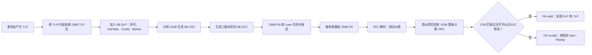

> [!abstract] 核心结论
> 本篇笔记主要作为[[PCIe_Introduction]]的补充，填补一些关于PCIe的基础前备内容，主要针对常见的缩写极其相应的概念是什么

## Packet
### TLP - Transaction Layer Packet
**TLP** 是事务层的数据包，表达真正的业务事务，例如：
- Memory Read / Memory Write；
- Configuration Read / Write；
- Completion；
- Message。

但需要注意的是，在Flit mode下，TLP的编码和Non-Flit mode 是不完全相同的，在分析TLP type的时候要区分是否为Flit mode

TLP由事务层产生，最终也是交给对端的事务层

一个TLP可能经过Switch，跨越多条Link到达某个目标，所以**TLP 可以被路由，具有跨多跳传播的可能**

### DLLP - Data Link Layer Packet
DLLP 是数据链路层用于管理当前 Link 的控制信息，或者说是两个直接相连的Port的数据链路层之间交换的控制信息，例如：
- 对TLP的确认和否认(Ack/Nak)；
- Flow Control 初始化和 Credit 更新；
- 电源管理相关信息；
- 数据链路特性交换；
- L0p Link Management

DLLP 只会在当前Link 两端之间做传递，只在当前link有效，Switch不会把收到的DLLP 当成需要继续路由的包

在**Flit mode**中，每个256B的Flit 会固定流出 6B 的DLP Bytes，在已有DLLP机制下新增了Flit mode的信息，例如
- Flit Usage；
- Prior Flit was Payload；
- Replay Command；
- 10-bit Flit Sequence Number；
- DLLP Payload / Optimized Update FC / Flit Marker。

详情见[[DLL_DLLP]]

## Flit Mode
在上一节内容中，介绍了PCIe中的Packet，可以看到在是否为Flit mode的情况下，Packet的组成会不一样，那到底什么是Flit Mode？

由Gen6引入，全称 **Flow Control Init**, 类比成是一个固定大小的运输箱，在 PCIe 6.x Flit Mode 中，每个 Flit 固定为 256 Byte。TLP、DLLP相关控制信息以及链路保护信息被组织到 Flit 中传输。

256B Flit的布局

```text
+ ----------------------+--------+----------+--------+
| TLP Bytes             |  DLP   |    CRC   |   ECC  |
| Byte 0..235           |236..241|242..249  |250..255|
| 236B                  | 6B     | 8B       | 6B     |
+ ----------------------+--------+----------+--------+
             总计 256 Bytes
```

| 区域        |   大小 | 作用                                 |
| --------- | ---: | ---------------------------------- |
| TLP Bytes | 236B | 装一个或多个 TLP，也可能装某个跨 Flit TLP 的一部分   |
| DLP Bytes |   6B | 链路控制信息，序号、Ack/Nak、Credit、状态标记等链路控制 |
| CRC Bytes |   8B | 对前 242B，也就是 TLP + DLP，做强完整性检查      |
| ECC Bytes |   6B | 用于三路交织 FEC 所使用的纠错码字节               |

### TLP bytes
这 236B 用来装 TLP，但 TLP 和 Flit 不是一一对应的：
- 一个 Flit 可以装多个小 TLP；但实际上spec中 TLP bytes分为两个解析区域，0~127B & 128~235B，单段内最多出现8个non-NOP TLP，这是为了限制接收端在一个处理窗口中需要同时识别的 TLP 边界数量。
- 一个大 TLP 可以跨越多个 Flit，因为Flit mode取消了传统的Packet边界
- Byte 0 可能是上一个 Flit 中未完成 TLP 的延续，不一定是新 TLP Header；
- 没有正常 TLP 可发送时，用 1DW、即 4B 的 NOP TLP 填充。[[#Q 什么是 NOP TLP？|What is NOP TLP?]]


由于 Flit Mode 没有使用传统的 STP Token 标记每一个 TLP 的开始，因此接收端依靠解析 TLP 边界的依据是：
- TLP Header 类型；
- Header 中预定义位置的 Length；
- DW/4DW 填充规则；
- NOP TLP；
- 已经跟踪到的跨 Flit TLP 长度；


### DLP bytes
这 6B 是 Flit 的链路控制区域：

```
Byte 236       Byte 237       Byte 238..241
DLP0           DLP1           DLP2..5
+-------------+-------------+----------------------+
| Flit控制、Replay命令、序号   | 32-bit DLP Payload   |
+-------------+-------------+----------------------+
```

其中 DLP0 和 DLP1 的字段为：

```
DLP0
  [7:6] Flit Usage
  [5]   Prior Flit was Payload
  [4]   Type of DLLP Payload
  [3:2] Replay Command
  [1:0] Sequence Number[9:8]

DLP1
  [7:0] Sequence Number[7:0]
```


| 字段                     | 作用                                                 |
| ---------------------- | -------------------------------------------------- |
| Flit Usage             | 区分 Payload Flit 与 IDLE/NOP Flit                    |
| Prior Flit was Payload | 告诉接收端上一个 Flit 是否需要参与重传                             |
| Type of DLLP Payload   | 说明后面 4B 是普通 DLLP、Flow control or others            |
| Replay Command         | Explicit Sequence、Ack、Standard Nak 或 Selective Nak |
| Sequence Number        | Payload Flit 的序号，或 Ack/Nak 指示的序号，共友10bit           |

DLP bit 2~5 是 32-bit Payload，可以承载：
- 普通 DLLP Payload；
- Optimized Update FC；
- Flit Marker，例如 Poisoned/Nullified 状态。

因此，DLP 并不是“把一个传统 DLLP 原封不动放进 6B”。更准确地说：
> 前 2B 是 Flit Mode 专用链路控制头，后 4B 才是可复用的 DLLP/流控/Marker Payload。


### CRC bytes

```
Byte 0..235   TLP Bytes  236B
Byte 236..241 DLP Bytes    6B
                           ────
总计                       242B
```

发送端根据前 242B 计算出 8B CRC，放在 Byte 242..249。

所以：

```
CRC 保护：Byte 0..241
CRC 不保护：Byte 250..255 的 ECC
```

它负责严格检验：
- TLP 是否正确；
- DLP 是否正确；
- Flit Sequence、Ack/Nak、Credit 等链路控制是否正确。

### ECC bytes
ECC 用于 Flit 的三路交织 FEC。

参与 FEC 编码的信息包括：

```
TLP 236B + DLP 6B + CRC 8B = 250B
```

这 250B 按规范交织到三个 ECC Group：

```
Group 0：84B 信息
Group 1：83B 信息
Group 2：83B 信息
```

每个 Group 再生成 2B ECC：

```
3 个 Group × 2B ECC = 6B ECC
```

可以直观理解为：

```
Byte 0   -> ECC Group 0
Byte 1   -> ECC Group 1
Byte 2   -> ECC Group 2
Byte 3   -> ECC Group 0
...
```

交织的目的是把链路上的连续突发错误分散到不同 ECC Group，使每个 Group 尽量只出现一个错误 Byte，从而可以被纠正。


### Flit链路发送和接收



## Non-Flit Mode
了解了Flit Mode之后，再回过头了解更传统的，相比起Flit Mode把TLP放到Flit当中，Non-Flit Mode在发送TLP时，数据链路层会围绕TLP建立保护

```
事务层产生 TLP
       |
       v
添加 Sequence Number
添加 32-bit LCRC
保存到 Retry Buffer
       |
       v
作为一个受保护的 TLP 发送
```

在这个模式下，不存在DLP，而DLLP 则作为独立的数据链路层包发送，并带自己的 16-bit CRC。

因此 Non-Flit Mode 的基本单位是：
- TLP 仍然是一个独立传输、检查和重传的对象；
- DLLP 也是独立发送的控制包；
- TLP 和 DLLP 使用不同的保护格式。

例如发送两个 TLP：`TLP A + Seq + LCRC` 和 `TLP B + Seq + LCRC`，如果对端发现 TLP B 损坏，就通过 Nak 或 Ack Timeout 触发 TLP 重传。


## 两种模式的核心比较

| 对比项          | Non-Flit Mode                               | Flit Mode                            |
| ------------ | ------------------------------------------- | ------------------------------------ |
| 链路组织单位       | 独立的 TLP、DLLP                                | 固定 256-Byte Flit                     |
| TLP/DLLP 的关系 | 分别发送                                        | 都通过 Flit 搬运                          |
| 完整性保护        | TLP 具有 Sequence Number 和 LCRC；DLLP 有自己的 CRC | Flit 包含 Sequence Number、LCRC、FEC 等保护 |
| 重传单位         | TLP-level                                   | Flit-level                           |
| FEC          | 没有 Gen6 Flit FEC 机制                         | 有 FEC，可先纠正部分错误                       |
| 典型使用         | 传统 PCIe 链路方式                                | 64 GT/s 等高速链路需要                      |
| 事务层看到的内容     | TLP                                         | same as TLP                          |


## 问题与思考
### Q:什么是 NOP TLP？
NOP TLP = No Operation TLP

当一个Flit剩下的空间，没有实际的有用的TLP时，但是Flit的要求是236B的TLP区域需要填满（严格来说是256B必须填满），仍然需要一个有效的 TLP Stream，NOP TLP则是一种“占位符”。

NOP TLP相当于填入了一个 “不产生任何事务效果的TLP，执行了也不应改变任何状态”。在接收端，TLP不会把NOP TLP交给事务层

#### Q1.1 - NOP TLP 长什么样？

普通 TLP，例如 Memory Read：

```
+------------+
| Header     |
+------------+
| Address    |
+------------+
```

NOP TLP：

```
+------------+
| NOP Header |
+------------+
```

没有：
- Memory address
- Payload
- Completion 信息

它只是一个填充元素。

#### Q1.2 - 为什么不能填0？
因为，接收端不知道0到底是什么数据，没准是有效数据：
- 数据？
- padding？
- 损坏？

所以还是用一个特殊的占位符填入无用的TLP空间，直至填满

```
+----------------+
| NOP TLP        |
| 4 Bytes        |
+----------------+
```


### Q:为什么CRC放在ECC之前？CRC不需要保护ECC内容吗？
首先厘清发送端逻辑：

```
填充 236B TLP
       ↓
加入 6B DLP
       ↓
对前 242B 计算 8B CRC
       ↓
对前 250B 生成 6B ECC
       ↓
形成完整 256B Flit
```

接收端顺序则是：

```
收到 256B Flit
       ↓
FEC/ECC 先尝试纠正 TLP、DLP 或 CRC 中的错误
       ↓
对纠正后的 Byte 0..241 重新计算 CRC
       ↓
CRC 匹配：Flit valid
CRC 不匹配：触发 Nak/Replay
```

所以两者分工是：
- ECC/FEC：尽量把错误修好；
- CRC：检查修完以后究竟是否可信；
- Replay：修不好时重新发送。

#### Q.1 - FEC/ECC 后还需要做crc的原因？
核心原因就是FEC/ECC纠错不一定准确，可能遇到的情况？
- 同一 codeword 多字节错误；
- 无法纠正的错误；
- 误纠；
- CRC Byte 自身受损。


### Q:在gen6引入Flit Mode的原因
PCIe 6.0 把速率提高到 64 GT/s，并开始使用 PAM4 信号

PAM4 每个符号携带更多信息，但不同电平之间的距离更小，原始误码率也比此前的 NRZ 信号更高。只依靠“发现错误后重传”会带来较大的性能损失。

因此 Gen6 引入：
- 固定大小的 Flit，便于进行统一保护；
- FEC，先纠正一定范围内的错误；
- LCRC，检查 FEC 之后是否仍存在不可接受的错误；
- Flit-level Replay，在确实无法恢复时重传 Flit。

处理思路从：

```
发现 TLP 错误 -> 重传 TLP
```

变成：

```
发现 Flit 中的错误
       |
       v
FEC 先尝试纠正
       |
       +-- 成功：不需要重传
       |
       +-- 失败：Replay Flit
```


## 相关笔记 Relation

- [[ ]]

## 来源 Reference