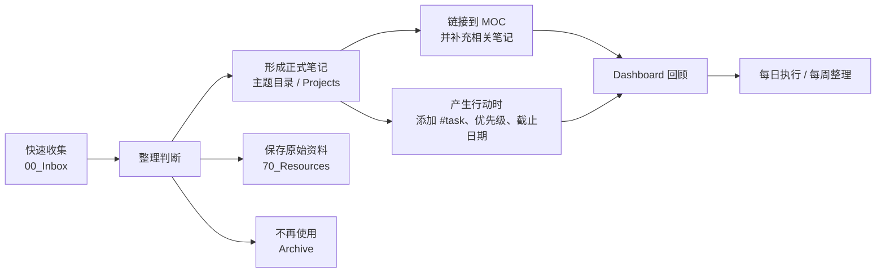

## 工作流总览



## 1. 收集

暂时不知道放在哪里、还没有整理过的内容进入 `00_Inbox`。它可以只是一句话、一个链接、一段代码或一个待处理想法。

Inbox 的目的不是永久存储，而是降低记录时的判断成本。

## 2. 整理

处理一条 Inbox 笔记时，只做以下四种判断：

1. 能独立解释一个概念：整理成知识笔记，放入对应的数字主题目录。
2. 只服务于一个正在推进的项目：放入 `10_Projects`。
3. 是转载、手册、原始资料：放入 `70_Resources`。
4. 已被其他笔记覆盖或暂时无用：放入 `99_Archive`。

整理不是把每条记录都扩写成长文。只需改成能再次看懂的标题，补充必要上下文，并链接到一个 MOC 或相关笔记。

## 3. 建立链接

在正文中输入 `[[`，Obsidian 会搜索现有笔记。选择笔记后会生成：

```markdown
[[链接脚本 - 核心概念]]
[[链接脚本 - 核心概念#VMA 与 LMA]]
[[链接脚本 - 核心概念|链接脚本]]
```

- 第一个链接到整篇笔记。
- 第二个链接到具体标题。
- 第三个使用自定义显示文字。

只建立能说明关系的链接，并在链接附近写清关系，例如：

```markdown
`fixdep` 解决配置头文件导致的大面积重编译问题，完整构建规则参见
[[Makefile - 核心语法与实践]]；最终产物的内存布局由
[[链接脚本 - 核心概念]]控制。
```

不要为了“图谱好看”堆砌链接。一个有上下文的链接比十个孤立的“相关笔记”更有价值。

## 4. 理解反向链接

当 A 笔记写了 `[[B]]`：

- B 是 A 的出链。
- A 会自动出现在 B 的反向链接中。
- 不需要在 B 中再手动写一次 `[[A]]` 才能建立反向链接。

因此，MOC 链接到各主题笔记后，主题笔记的反向链接面板会自然显示“它属于哪张 MOC”。如果两篇正文存在直接的解释、依赖、对比或应用关系，再在正文中互相链接。

建议在 Obsidian 右侧边栏固定“反向链接”面板。阅读一篇笔记时，可以从“链接提及”和“未链接提及”发现相关上下文。

## 5. 形成任务

知识和任务分开：

- “了解 VMA 与 LMA”是学习主题，可以写在计划清单中。
- “周五前完成链接脚本案例验证”是可执行任务。

真正任务使用：

```markdown
- [ ] 完成链接脚本案例验证 #task ⏫ 📅 2026-08-01
```

Tasks 插件仅收集带 `#task` 的复选框，所以普通学习清单不会污染 Dashboard。

## 6. 回顾

- 每天：打开 [[Dashboard]]，先看逾期、今日和高优先级任务。
- 每周：清理 Inbox，给新正式笔记补一个 MOC 链接，检查无截止日期任务。
- 按需：长笔记出现多个可独立复用的主题时再拆分；仅仅因为篇幅长，不是拆分理由。
